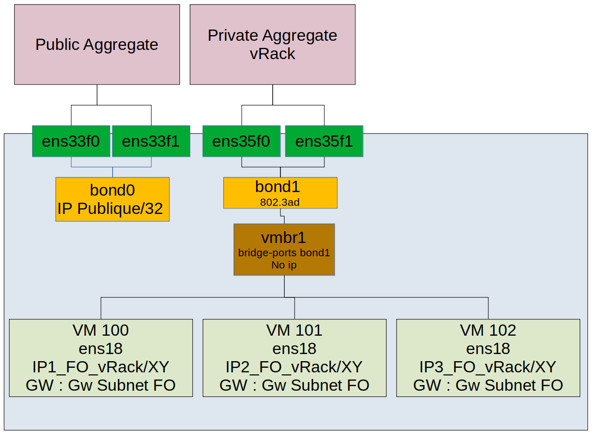

> [!primary]
> Tłumaczenie zostało wygenerowane automatycznie przez system naszego partnera SYSTRAN. W niektórych przypadkach mogą wystąpić nieprecyzyjne sformułowania, na przykład w tłumaczeniu nazw przycisków lub szczegółów technicznych. W przypadku jakichkolwiek wątpliwości zalecamy zapoznanie się z angielską/francuską wersją przewodnika. Jeśli chcesz przyczynić się do ulepszenia tłumaczenia, kliknij przycisk "Zgłóś propozycję modyfikacji" na tej stronie.
> 

**Ostatnia aktualizacja z dnia 28-10-2022**

> [!primary]
>
> Od 6 października 2022 nasze rozwiązanie "Failover IP" nazywa się teraz [Additional IP](https://www.ovhcloud.com/pl/network/additional-ip/). To nie ma wpływu na jego funkcje.
>

## Wprowadzenie

W ofercie High Grade & SCALE nie jest możliwe działanie adresów Additional IP w trybie bridged (poprzez wirtualne maszyny MAC). Konieczne jest zatem skonfigurowanie Additional IP w trybie routera lub vRack.

**Dowiedz się, jak skonfigurować sieć w programie Proxmox VE.**

## Wymagania początkowe

- Posiadanie [serwera dedykowanego OVHcloud](https://www.ovhcloud.com/pl/bare-metal/)
- Posiadanie adresu [Additional IP](https://www.ovhcloud.com/pl/bare-metal/ip/)
- Dostęp do [Panelu client OVHcloud](https://www.ovh.com/auth/?action=gotomanager&from=https://www.ovh.pl/&ovhSubsidiary=pl)

> [!warning]
>
> W Panelu klienta OVHcloud nie ma konieczności stosowania wirtualnego adresu MAC dla Additional IP.
>

## W praktyce

> [!primary]
>
> W tej gamie serwerów znajdują się 4 karty sieciowe. Pierwsze dwa dla publiczności, dwa dla prywatnego. Aby korzystać z całej przepustowości, należy utworzyć agregaty.
>

### Additional IP w trybie routowane do publicznych interfejsów sieciowych

Ta konfiguracja zapewnia wyższą wydajność w zakresie przepustowości, ale jest mniej elastyczna. W przypadku tej konfiguracji adresy dodatkowe IP muszą być przypisane do serwera dedykowanego. Jeśli dysponujesz kilkoma serwerami do wirtualizacji Proxmox i chcesz migrować jedną VM z jednego serwera na drugi, musisz również przenieść adres Additional IP na serwer docelowy, w Panelu klienta OVHcloud lub poprzez API OVHcloud. Możesz zautomatyzować ten etap, zapisując skrypt, który wykorzystuje API OVHcloud.  

#### Schemat konfiguracji docelowej

{.thumbnail}

#### Wyjaśnienia

Proxmox opiera się na dystrybucji Debian. W tym przewodniku konfiguracja sieci będzie modyfikowana przez SSH, a nie przez interfejs www.

Należy:

- połączyć się przez SSH z Proxmox;
- tworzenie agregatu (linux bond);
- stworzyć brydża;
- zezwalać na forwarding;
- zezwalać na proxy_arp;
- dodaj trasy.

#### Konfiguracja hypervisora

Zaloguj się do serwera Proxmox przez SSH:

```bash
ssh root@PUB_IP_DEDICATED_SERVER
# możesz również użyć prywatnego adresu IP skonfigurowanego w sieci vRack
```

Wszystko odbywa się w pliku `/etc/network/interfaces`:

```bash
vi /etc/network/interfaces
```

```bash
auto lo
iface lo inet loopback
  # Enable IP forwarding
  up echo "1" > /proc/sys/net/ipv4/ip_forward
  # Enable proxy-arp only for public bond
  up echo "1" > /proc/sys/net/ipv4/conf/bond0/proxy_arp

# public interface 1
auto ens33f0
iface ens33f0 inet manual
	bond-master bond0

# public interface 2
auto ens33f1
iface ens33f1 inet manual
	bond-master bond0

# private interface 1
auto ens35f0
iface ens35f0 inet manual

# private interface 2
auto ens35f1
iface ens35f1 inet manual

# LACP aggregate on public interfaces
# configured in static mode on this example
# Has the server's public IP
auto bond0
iface bond0 inet static
    address PUB_IP_DEDICATED_SERVER/24
	gateway PUB_GW
	bond-slaves ens33f0 ens33f1
	bond-mode 4
	bond-miimon 100
	bond-downdelay 200
	bond-updelay 200
	bond-lacp-rate 1
	bond-xmit-hash-policy layer3+4
	# Use the mac address of the first public interface
	hwaddress AB:CD:EF:12:34:56

#Private
auto bond1
iface bond1 inet static
	bond-slaves ens35f0 ens35f1
	bond-mode 4
	bond-miimon 100
	bond-downdelay 200
	bond-updelay 200
	bond-lacp-rate 1
	bond-xmit-hash-policy layer3+4
	# Use the mac address of the first private interface
	hwaddress GH:IJ:KL:12:34:56

# Configure the bridge with a private address and add route(s) to send the Additional IPs to it
# A.B.C.D/X => Subnet of Additional IPs assigned to the server, this can be a host with /32
# By default Proxmox creates vmbr0.
# You can use it or create another one 
auto vmbr0
iface vmbr0 inet dhcp
	# Define a private IP, it should not overlap your existing private networks on the vrack for example 
	address 192.168.0.1/24
	bridge-ports none
	bridge-stp off
	bridge-fd 0
	# Add single additional
	up ip route add A.B.C.D/32 dev vmbr0
	# Add block IP
	up ip route add A.B.C.D/28 dev vmbr0

# Bridge used for private networks on vRack
# The VLAN feature is enabled
auto vmbr1
iface vmbr1 inet manual
        bridge-ports bond1
        bridge-stp off
        bridge-fd 0
        bridge-vlan-aware yes
        bridge-vids 2-4094
```

W tym momencie uruchom ponownie usługi sieciowe lub zrestartuj serwer:

```bash
systemctl restart networking.service
```

Po ponownym uruchomieniu usług sieciowych bridges (np. vmbr0) mogą być w stanie nieaktywnym. Wynika to z faktu, że Proxmox odłącza każdą wirtualną maszynę i nie łączy jej ponownie. Aby wymusić ponowne połączenie wirtualnych maszyn z kołnierzami, możesz zrestartować VM.

#### Przykład konfiguracji VM klient Debian

Zawartość pliku `/etc/network/interfaces`:

```bash
auto lo ens18
iface lo inet loopback
iface ens18 inet static
    address ADDITIONAL_IP       # this should match with the IP A.B.C.D/32
    netmask 255.255.255.255
    gateway 192.168.0.1			# this sould match with the private IP set on bridge
```

#### Test i zatwierdzenie

Wirtualne maszyny powinny mieć możliwość łączenia się z usługą publiczną w Internecie. Wirtualne maszyny mogą być również łączone bezpośrednio w Internecie poprzez adres IP Additional. Dostępna przepustowość to przepustowość dostępna w publicznych interfejsach Twojego serwera. Nie ma ona wpływu na prywatne interfejsy wykorzystywane w ramach usługi vRack. Przepustowość ta jest współdzielona z innymi wirtualnymi maszynami na tym samym hoście, które korzystają z adresu IP Additional i hosta Proxmox do publicznego dostępu.

Aby sprawdzić publiczny adres IP z VM:

```bash
curl ifconfig.io
ADDITIONAL_IP    				# should return your additional ip
```

### Dodatkowe IP przez vRack

Konfiguracja ta jest bardziej elastyczna. Nie musisz przypisywać żadnego Additional IP do serwera ale do usługi vRack. Oznacza to, że jeśli wirtualna maszyna chce korzystać z adresu Additional IP, może ona żądać tego adresu bezpośrednio bez dodatkowej konfiguracji i bez względu na hosta, na którym jest on zainstalowany.

> [!warning]
>
> Ta konfiguracja jest ograniczona do 600 Mb/s dla ruchu wychodzącego.
>

#### Wymagania początkowe

* Rezerwacja bloku publicznych adresów IP na Twoim koncie z minimalną liczbą czterech adresów. Blok musi być skierowany do sieci vRack.
* Przygotowanie Twojego zakresu wybranych prywatnych adresów IP
* Posiadanie [serwera kompatybilnego z vRack](https://www.ovhcloud.com/pl/bare-metal/){.external}
* Aktywacja usługi [vRack](https://www.ovh.pl/rozwiazania/vrack/){.external}
* Dostęp do [Panelu client OVHcloud](https://www.ovh.com/auth/?action=gotomanager&from=https://www.ovh.pl/&ovhSubsidiary=pl)

#### Schemat konfiguracji docelowej

{.thumbnail}

#### Wyjaśnienia

Musisz:

* tworzenie agregatu;
* stworzyć brydż podłączony do agregatu;

Po pierwsze, dodaj blok publicznych adresów IP do sieci vRack. W tym celu przejdź do sekcji `Bare Metal Cloud`{.action} w Panelu klienta OVHcloud i otwórz menu `vRack`{.action}.

Wybierz z listy usługę vRack, aby wyświetlić listę usług, które się do niej kwalifikują. Kliknij publiczny blok adresów IP, który chcesz dodać do sieci vRack, następnie kliknij przycisk `Dodaj`{.action}.

#### Konfiguracja adresu IP

W przypadku sieci vRack pierwszy, przedostatni i ostatni adres danego bloku IP są zawsze zarezerwowane odpowiednio dla adresu sieci, bramy sieciowej i *broadcastu* sieci. Oznacza to, że pierwszy możliwy do użycia adres jest drugim adresem z bloku, jak pokazano poniżej:

```sh
46.105.135.96 # Reserved: network address
46.105.135.97 # First usable IP
46.105.135.98
46.105.135.99
46.105.135.100
46.105.135.101
46.105.135.102
46.105.135.103
46.105.135.104
46.105.135.105
46.105.135.106
46.105.135.107
46.105.135.108
46.105.135.109 # Last usable IP
46.105.135.110 # Reserved: network gateway
46.105.135.111 # Reserved: network broadcast
```

Aby skonfigurować pierwszy możliwy do użycia adres IP, edytuj plik konfiguracyjny sieci, jak wskazano poniżej. Użyj maski podsieci **255.255.255.240**.

> [!primary]
>
> Maska podsieci użyta w tym przykładzie jest odpowiednia dla wybranego bloku IP. Twoja maska podsieci może różnić się w zależności od wielkości Twojego bloku. Po zakupieniu bloku IP otrzymasz e-mail wskazujący maskę podsieci, której należy użyć.
>

#### Konfiguracja hypervisora

Wszystko odbywa się w pliku `/etc/network/interfaces`:

```bash
vi /etc/network/interfaces
```

Ważna jest konfiguracja `bond` i `vmbr`:

```bash
auto lo
iface lo inet loopback

# public interface 1
auto ens33f0
iface ens33f0 inet manual

# public interface 2
auto ens33f1
iface ens33f1 inet manual

# private interface 1
auto ens35f0
iface ens35f0 inet manual
	bond-master bond1

# private interface 2
auto ens35f1
iface ens35f1 inet manual
	bond-master bond1

auto bond0
iface bond0 inet dhcp
	bond-slaves ens33f0 ens33f1
    bond-miimon 100
	bond-mode 802.3ad

auto bond1
# LACP Aggregate on private interfaces
# No IPs on it
iface bond1 inet manual
	bond-slaves ens35f0 ens35f1
    bond-miimon 100
	bond-mode 802.3ad


#Private

auto vmbr1
# Bridge connected to bond1 aggregate
# No need for IP
iface vmbr1 inet manual
	bridge-ports bond1
	bridge-stp off
	bridge-fd 0

post-up echo 1 > /proc/sys/net/ipv4/ip_forward

```

W tym momencie uruchom ponownie usługi sieciowe lub zrestartuj serwer.

#### Przykład konfiguracji VM klient Debian

Zawartość pliku `/etc/network/interfaces`:

```bash
auto lo ens18
iface lo inet loopback
iface ens18 inet static
    address 46.105.135.97
    netmask 255.255.255.240
    gateway 46.105.135.110
```

## Sprawdź również

Przyłącz się do społeczności naszych użytkowników na stronie <https://community.ovh.com/en/>.
