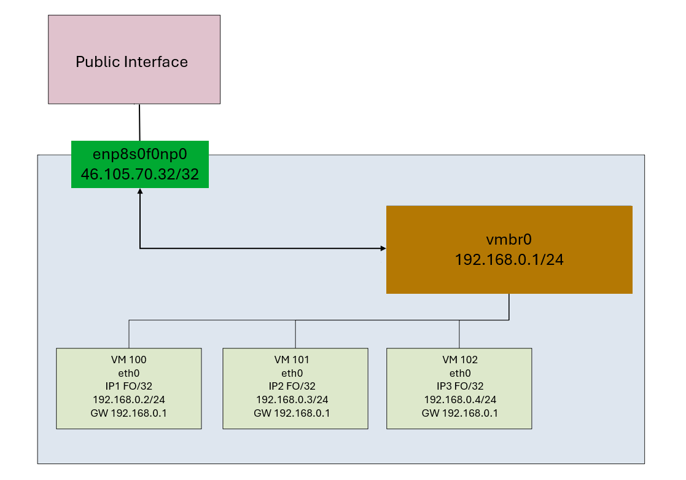

> [!primary]
>
> Since October 6th, 2022 our service "Failover IP" has been named [Additional IP](/links/network/additional-ip). This renaming has no impact on its technical features.
>

## Objective

**Find out two ways to configure an _additional IP_ on Proxmox VE: via the public interfaces and via the private interfaces (vRack).**

## Requirements

- An [OVHcloud dedicated server](/links/bare-metal/bare-metal)
- You must have [Additional IP addresses](/links/network/additional-ip)
- Access to the [OVHcloud Control Panel](/links/manager)

> [!warning]
>
> No virtual MAC address must be applied to Additional IPs in the OVHcloud Control Panel.
>

## Instructions

### Additional IP in routed mode on public network interfaces <a name="additionalipmoderoute"></a>

With this configuration, Additional IP addresses must be attached to a dedicated server. If you have multiple Proxmox virtualization servers and you want to migrate a VM from one server to another, you will also need to migrate the Additional IP address to the destination server, via the OVHcloud Control Panel or via the OVHcloud API. You can automate this step by writing a script that uses the OVHcloud APIs.

#### Target configuration schema

> [!tabs]
> High Grade & SCALE ranges
>>
>> {.thumbnail}
>>
> ADVANCE range
>>
>> {.thumbnail}
>>

#### Explanations

Proxmox is based on a Debian distribution. In this guide, the network configuration will be modified via SSH and not via the web interface.

You need to:

- connect via SSH on Proxmox
- create an aggregate (linux bond), only for the High Grade & SCALE ranges
- create a bridge
- authorize forwarding
- authorize proxy_arp
- add routes

#### Configure the hypervisor

Log in to the Proxmox server via SSH:

```bash
SSH PUB_IP_DEDICATED_SERVER
# you can also use the private IP configured on the vRack
```

> [!tabs]
> High Grade & SCALE ranges
>>
>> - **Enable ip_forward and proxy_arp**:
>>
>> Enable the `sysctl` `ip_forward` and `proxy_arp` parameters. To do this, we recommend modifying the `sysctl.conf` configuration file.
>>
>> Add the following lines to `/etc/sysctl.conf`:
>>
>> ```text
>> # Enable ip_forward
>> net.ipv4.ip_forward = 1
>>
>> # Enabling proxy_arp for public bond
>> net.ipv4.conf.bond0.proxy_arp = 1
>> ```
>>
>> Next, reload the sysctl configuration:
>>
>> ```bash
>> sysctl -p
>> ```
>>
>> - **Edit the `/etc/network/interfaces` file**:
>>
>> ```bash
>> vi /etc/network/interfaces
>> ```
>>
>> ```bash
>> auto lo
>> iface lo inet loopback
>>
>> # public interface 1
>> auto ens33f0
>> iface ens33f0 inet manual
>> 	bond-master bond0
>>
>> # public interface 2
>> auto ens33f1
>> iface ens33f1 inet manual
>> 	bond-master bond0
>>
>> # private interface 1
>> auto ens35f0
>> iface ens35f0 inet manual
>>
>> # private interface 2
>> auto ens35f1
>> iface ens35f1 inet manual
>>
>> # LACP aggregate on public interfaces
>> # configured in DHCP mode on this example
>> # Holds the server’s public IP address
>> auto bond0
>> iface bond0 inet static
>> address PUB_IP_DEDICATED_SERVER/32
>> 	gateway 100.64.0.1
>>         bond-slaves ens33f0 ens33f1
>> 	bond-mode 4
>> 	bond-miimon 100
>> 	bond-downdelay 200
>> 	bond-updelay 200
>> 	bond-lacp-rate 1
>> 	bond-xmit-hash-policy layer3+4
>> 	# Enter the MAC address of one of the two public interfaces
>> 	hwaddress AB:CD:EF:12:34:56
>>
>> # Private
>> auto bond1
>> iface bond1 inet static
>> 	bond-slaves ens35f0 ens35f1
>> 	bond-mode 4
>> 	bond-miimon 100
>> 	bond-downdelay 200
>> 	bond-updelay 200
>> 	bond-lacp-rate 1
>> 	bond-xmit-hash-policy layer3+4
>> 	# Enter the MAC address of one of the two private interfaces
>> 	hwaddress GH:IJ:KL:12:34:56
>>
>> auto vmbr0
>> # Configuring the bridge with a private address and adding route(s) to send Additional IPs to it
>> # A.B.C.D/X => Subnet of Additional IPs assigned to the server, this can be a host with /32
>> auto vmbr0
>> iface vmbr0 inet dhcp
>> 	# Define a private IP, it must not overlap your existing private networks on the vRack for example
>> 	address 192.168.0.1/24
>> 	bridge-ports bond0
>> 	bridge-stp off
>> 	bridge-fd 0
>> 	# Add a unique Additional IP
>> 	up ip route add ADDITIONAL_IP/32 dev $IFACE
>> 	# Add an IP block
>> 	up ip route add ADDITIONAL_IP_BLOCK/28 dev $IFACE
>>
>> # Bridge used for private networks on the vRack
>> # The VLAN feature is enabled
>> auto vmbr1
>> iface vmbr1 inet manual
>>         bond1 bridge-ports
>>         bridge-stp off
>>         bridge-fd 0
>>         bridge-vlan-aware yes
>>         bridge-vids 2-4094
>>
>> ```
> ADVANCE range
>> For servers from the ADVANCE range that do not have 4 network interfaces, there is no need to configure bonding. You can go directly to configuring the available interfaces.
>>
>> Everything happens in the file `/etc/network/interfaces`:
>>
>> ```bash
>> vi /etc/network/interfaces
>> ```
>>
>> ```bash
>> auto lo
>> iface lo inet loopback
>> 
>> auto enp8s0f0np0
>> iface enp8s0f0np0 inet static
>>     address PUB_IP_DEDICATED_SERVER/32
>>     gateway 100.64.0.1
>>     post-up echo 1 > /proc/sys/net/ipv4/ip_forward
>>     post-up echo 1 > /proc/sys/ipv4/enp8s0f0np0/proxy_arp
>> 
>> auto vmbr0
>> iface vmbr0 inet static
>>     address 192.168.0.1/24
>>     bridge-ports none
>>     bridge-stp off
>>     bridge-fd 0
>>     up ip route add ADDITIONAL_IP/32 dev vmbr0
>>     up ip route add ADDITIONAL_IP_BLOCK/28 dev vmbr0
>> ```

At this point, restart the network services or reboot the server:

```bash
systemctl restart networking.service
```

When you restart the network services, the bridges (for example, vmbr0) may be in an idle state. This is because Proxmox disconnects each VM from the bridges and does not reconnect them. To force the VMs to reconnect to the bridges, you can restart the VMs.

#### Client VM configuration example

> [!tabs]
> Debian
>> Content of the `/etc/network/interfaces` file:
>>
>> ```bash
>> auto lo
>> iface lo inet loopback
>>
>> auto eth0
>>
>> iface eth0 inet static
>>   address 192.168.0.2/24
>>
>> iface eth0 inet static
>>   address ADDITIONAL_IP/32
>>   # The "src" option must be set so that packets reaching the Internet
>>   # have the public IP as source, not the private IP 192.168.0.2
>>   up ip route replace default via 192.168.0.1 dev $IFACE onlink src ADDITIONAL_IP
>> ```
>>
> Ubuntu
>> Content of the `/etc/netplan/01-$iface.yaml` :
>>
>> ```yaml
>> network:
>>   version: 2
>>   ethernets:
>>     $iface:
>>       addresses:
>>         - 192.168.0.3/24
>>         - ADDITIONAL_IP/32
>>       routes:
>>         - to: default
>>           via: 192.168.0.1
>>           # So that packets destined for the Internet have as their source
>>           # the public IP and not the private IP 192.168.0.3
>>           from: ADDITIONAL_IP
>> ```
>>

#### Testing and validation

From now on, your virtual machines should be able to join a public service on the internet. In addition, your virtual machines can also be reached directly on the internet via the Additional IP address. The available bandwidth corresponds to the bandwidth available on your server’s public interfaces, and will not affect the private interfaces used for the vRack. This bandwidth is shared with other virtual machines on the same host that use an Additional IP address and the Proxmox host for public access.

To check your public IP, from the VM:

```bash
curl ifconfig.io
ADDITIONAL_IP    				# must return your additional ip
```

> [!primary]
>
> You may need to restart the network services for the configuration to take effect.

### Additional IP via the vRack

This configuration is more flexible. You do not need to associate an Additional IP with a server, but with the vRack. This means that if a virtual machine wants to use an Additional IP address, it can claim it directly without any additional configuration, and regardless of the host on which it is hosted.

> [!warning]
>
> It is not possible to use an Additional IP (/32) directly in the vRack. To use an Additional IP, it must be [configured on a public interface](#additionalipmoderoute) and cannot be directly integrated into the vRack.
>

#### Requirements

* You must have reserved a public block of IP addresses in your account, with a minimum of four addresses. The block must be pointed to the vRack.
* Prepare your chosen range of private IP addresses.
* You must have a [server compatible with vRack](/links/bare-metal/bare-metal).
* Activate a [vRack service](/links/network/vrack).
* You must be logged in to the [OVHcloud Control Panel](/links/manager).

#### Target configuration schema

{.thumbnail}

#### Explanations

You need to:

* create an aggregate (only for the High Grade & SCALE ranges)
* create a bridge connected to the aggregate;

First, add your public block of IP addresses to the vRack. To do so, go to the `Bare Metal Cloud`{.action} section of your [OVHcloud Control Panel](/links/manager) and open the `vRack`{.action} menu.

Select your vRack from the list to view the list of eligible services. Click on the public block of IP addresses you want to add to the vRack, then click the `Add`{.action} button.

#### Configure a usable IP address

In the case of the vRack, the first, penultimate and last addresses of a given IP block are always reserved for the network address, network gateway and network *broadcast* respectively. This means that the first usable address is the second address in the block, as shown below:

```sh
46.105.135.96   # Reserved: network address
46.105.135.97   # First usable IP
46.105.135.98
46.105.135.99
46.105.135.100
46.105.135.101
46.105.135.102
46.105.135.103
46.105.135.104
46.105.135.105
46.105.135.106
46.105.135.107
46.105.135.108
46.105.135.109   # Last usable IP
46.105.135.110   # Reserved: network gateway
46.105.135.111   # Reserved: network broadcast
```

To configure the first usable IP address, you must edit the network configuration file as shown below. In this example, use a subnet mask of **255.255.255.240**.

> [!primary]
>
> The subnet mask used in this example is appropriate for our IP block. Your subnet mask may differ depending on the size of your block. When you purchase your IP block, you will receive an email with the subnet mask to use.
>

#### Configure the hypervisor

The entire configuration is done in the `/etc/network/interfaces` file:

```bash
vi /etc/network/interfaces
```

What matters here is the `bond1` and `vmbr1` configuration:

```bash
auto-lo
iface lo inet loopback

# public interface 1
auto ens33f0
iface ens33f0 inet manual

# public interface 2
auto ens33f1
iface ens33f1 inet manual

# private interface 1
auto ens35f0
iface ens35f0 inet manual

# private interface 2
auto ens35f1
iface ens35f1 inet manual

auto bond0
iface bond0 inet dhcp
        bond-slaves ens33f0 ens33f1
        bond-miimon 100
        bond-mode 802.3ad
        post-up echo 1 > /proc/sys/net/ipv4/conf/bond0/proxy_arp
        post-up echo 1 > /proc/sys/net/ipv4/ip_forward

auto bond1
# LACP aggregate on private interfaces
# No IP on it
iface bond1 inet manual
        bond-slaves ens35f0 ens35f1
        bond-miimon 100
        bond-mode 802.3ad

#Private

auto vmbr1
# Bridge connected on bond1 aggregate
# No need for IPs
iface vmbr1 inet manual
        bond1 bridge-ports
        bridge-stp off
        bridge-fd 0

```

At this point, restart the network services or reboot the server.

#### Configuration example of a client VM on Debian

Content of the file `/etc/network/interfaces`:

```bash
auto lo ens18
iface lo inet loopback
iface ens18 inet static
        address 46.105.135.97
        netmask 255.255.255.240
        gateway 46.105.135.110
```

## Go further

Join our [community of users](/links/community).
