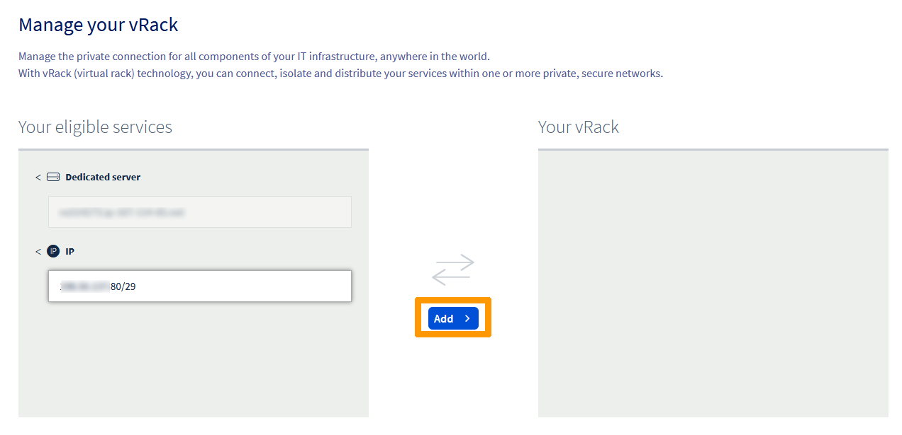
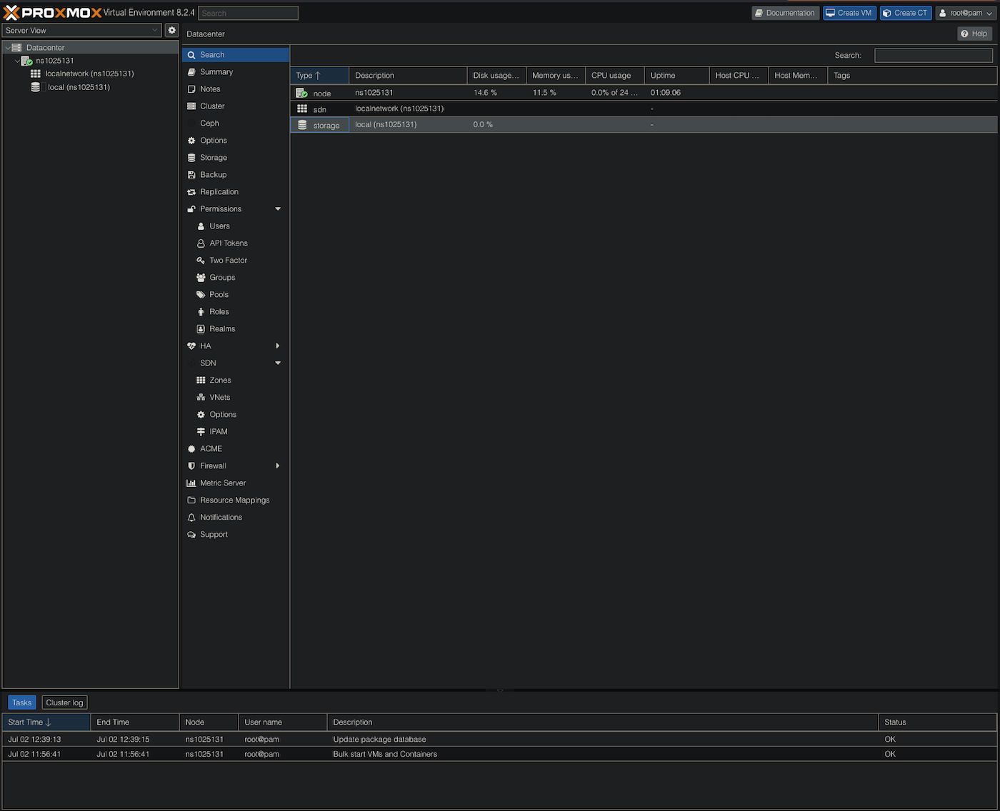
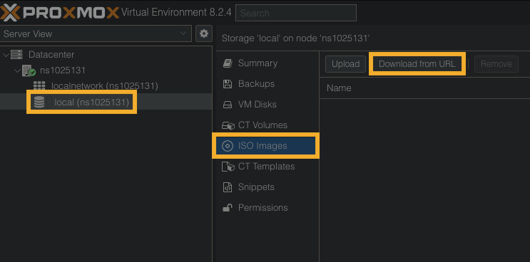
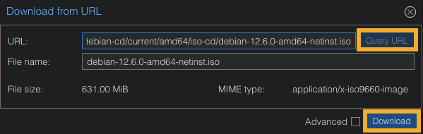
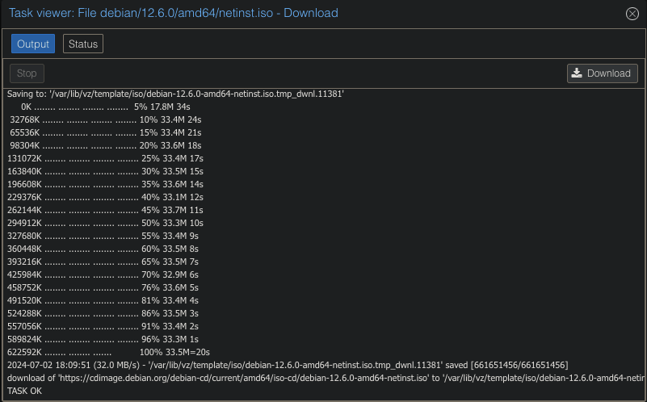
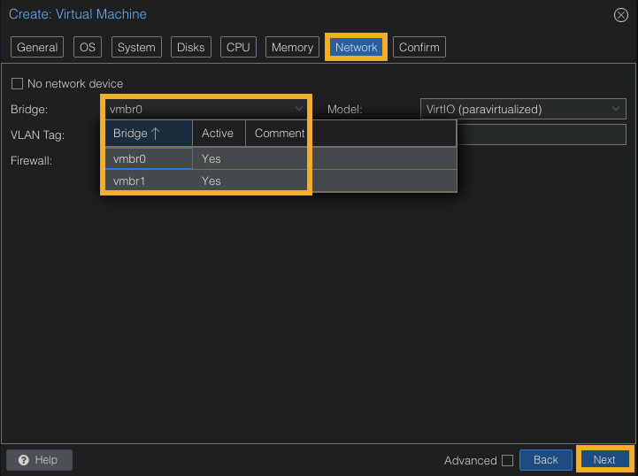

## Objective

On the Advance range, it is not possible to operate Additional IPs in bridged mode (via virtual MACs). Configuring Additional IPs in routed mode or via the vRack is necessary.

**Find out how to configure the network on Proxmox VE with ADVANCE servers**

> [!warning]
> No virtual MACs should be applied to Additional IPs in the OVHcloud Control Panel.

## Requirements

- A public block of IP addresses in your account, with a minimum of four addresses, attached to the vRack
- Your chosen private IP address range
- An [Advance server](/links/bare-metal/advance)
- A [vRack service](/links/network/vrack) activated in your account
- Access to the [OVHcloud Control Panel](/links/manager)

## Instructions

> [!primary]
> Once an IP block is added to the vRack, it is no longer attached to a physical server.
> This setup allows you to configure IPs of the same block on multiple servers, provided that these servers are all in the same vRack as the IP block.
> The IP block must have at least two usable IPs or more for this to be possible.

### Step 1 - Configure an Additional IP block on a vRack

Log in to the [OVHcloud Control Panel](/links/manager), go to the `Bare Metal Cloud`{.action} section and click on `Network`{.action}. Next, open the `vRack`{.action} menu.

Select your vRack from the list to display the list of eligible services. Click the IP block you wish to add to the vRack and click on the `Add`{.action} button.

{.thumbnail}

Edit the network configuration file based on the following template:

> [!warning]
> The `#Public Interface` section is an example but **must not be changed**. The goal here is to create a private, second interface.

> [!primary]
> The subnet mask (e.g. 255.255.255.xxx) is provided to you via email after ordering an IP block.

```bash
/etc/network/interfaces 

#Public Interface - do NOT change

auto lo
iface lo inet loopback
iface enp8xxxxx inet manual
    auto vmbrx
    iface vmbrx inet static
    address 40.16x.xx.xx/xx
    gateway x.xx.x.x
    bridge-ports enp8xxxxx
    bridge-stp off
    hwaddress AA:BB:CC:DD:EE:FF
iface ens18 inet6 static
    address AAAA:BBBB:CCC:DDDD::/xx
    gateway FFFF::x

#Private Interface

auto <NETWORK_INTERFACE_ID>
iface <NETWORK_INTERFACE_ID> inet static
    address <USABLE_IP_1_BLOCK_1>
    netmask <255.255.255.XXX>
    broadcast <NETWORK_BROADCAST_IP_1>
    bridge-ports <PRIVATE_BROADCAST_INTERFACE>
    bridge-stp off
    bridge-fd 0
post-up ip route add <NETWORK_ADDRESS_IP_1> dev <NETWORK_INTERFACE_ID> table vrack
post-up ip route add default via <NETWORK_GATEWAY_IP_1> dev <NETWORK_INTERFACE_ID> table vrack
post-up ip rule add from <NETWORK_ADDRESS_IP_1> table vrack
post-up ip rule add to <NETWORK_ADDRESS_IP_1> table vrack
```

#### Configuration example of a client VM on Debian

File contents `/etc/network/interfaces`:

```bash
#Public Interface - do NOT change

auto lo
iface lo inet loopback
iface enp8xxxxx inet manual

auto ensX
iface ensX inet static
    address 40.16x.xx.xx/xx
    gateway x.xx.x.x
    bridge-ports enp8xxxx0
    bridge-stp off
    hwaddress AA:BB:CC:DD:EE:FF

iface ensX inet6 static
    address AAAA:BBBB:CCC:DDDD::/xx
    gateway FFFF::x

#Private Interface

auto ensY
iface ensY inet static
    address xxx.xxx.xxx.xxx
    netmask 255.255.255.xxx
    broadcast xxx.xxx.xx.xxx
    bridge-ports enp8xxxx1
    bridge-stp off
    bridge-fd 0
post-up ip route add xxx.xxx.xx.xxx/xx dev ensY table vrack
post-up ip route add default via xxx.xxx.xx.xxx dev ensY table vrack
post-up ip rule add from xxx.xxx.xx.xxx/xx table rack
post-up rule add to xxx.xxx.xx.xxx/xx table rack
```

#### Restart and verification

Restart the network services:

```bash
systemctl restart networking.service
```

When creating the VM in Proxmox (e.g. `vmbr1), select the **network interface ID** under the Network tab. From this point, you will be on the new VM's interface block that you configured above, which will be using the Additional IP configured in vRack.

Verify that the private interface has been successfully configured:

```bash
ip a
```

Example output:

```bash
enp8xxxx1: <BROADCAST,MULTICAST,UP,LOWER_UP> mtu 1500 qdisc mq master vmbr1 state UP group default qlen 1000
    link/ether <VRACK_MAC_ADDRESS> brd ff:ff:ff:ff:ff:ff
```

### Step 2 - Configuring the VM network on Proxmox

Log in to Proxmox using the credentials sent to you via email.

{.thumbnail}

Select `local (xxxxx)`{.action}, then `ISO Images`{.action}, and then `Download from URL`{.action}.

{.thumbnail}

Select `Query URL`{.action} and then `Download`{.action}.

{.thumbnail}

You will see the progress of your download.

{.thumbnail}

Create a new VM and, in the `Network`{.action} tab, use the private interface you configured above by clicking the `Bridge`{.action} dropdown menu and selecting that interface (e.g. "vmbr1".)

Click `Next`{.action} to continue.

{.thumbnail}

Verify the configuration settings for your VM and click `Finish`{.action} to create it.

{.thumbnail}

Boot the VM and go through the OS install configuration in Proxmox while ensuring that you use the private interface networking information that was configured in the previous steps.

## Go further <a name="go-further"></a>

Join our [community of users](/links/community).