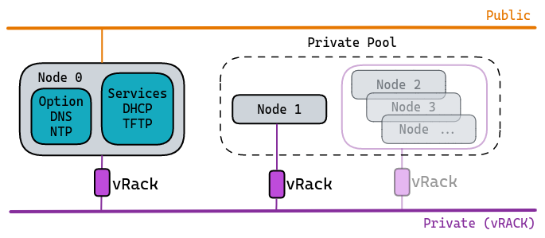
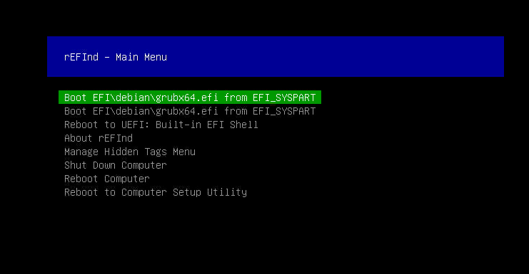

**Last updated 14th December 2022**

## Objective

This guide is designed to help you deploy all of the components and services you need to launch your OVHcloud solutions successfully in a **fully private** environment.<br>
Get a private infrastructure without having to change the default configuration for your [OVHcloud dedicated servers](https://www.ovhcloud.com/en-au/bare-metal/).

> [!warning]
>
> We have already carried out all our tests, qualifications and configuration validations, based on well-defined parameters and operating criteria, in order to offer you technical environments that are best adapted to your hardware.
> 
> Netboot (Network Boot) consists of using your network interface (in low-level mode) as a tool to select the boot of your operating system.
>
> You can boot any system from a network volume, such as SAN or NFS. However, the system usually boots from a local volume: local disk, CD/DVD or USB.
>
> As a reminder, we strongly advise against changing the default configurations: BIOS configuration, Boot Order, etc.
> 
> We have pre-configured this startup mechanism in our solutions, and have integrated all of our tools into it: netboot, monitoring, recycling, etc.
> If these settings were to be modified, our teams would no longer be able to perform the tasks dedicated to them under the conditions we have chosen, and above all, you could render the boot inoperative.
>

With [OVHcloud dedicated servers](https://www.ovhcloud.com/en-au/bare-metal/), you can configure/declare your own networks.<br>
Each server is equipped with at least 2 network interfaces, effectively functioning as aggregated links, ensuring redundancy in the event of failure.<br>
You can therefore use/declare your *public* and *private* networks via our solution [vRack](/pages/bare_metal_cloud/dedicated_servers/vrack_configuring_on_dedicated_server).

We will present the case of [dedicated server(s)](https://www.ovhcloud.com/en-au/bare-metal/) configured in **OLA** mode, i.e. with **only** private networks.
This choice offers your infrastructure the best possible isolation/protection for your hosted service.<br>
The only significant difference is that [private networks](/pages/network/ovhcloud_connect/occ-concepts-overview#private-connection) do not have access to everything that does not belong to your infrastructure.<br>
As a result, a server isolated by its private network prevents the boot mechanism. This means that when systems are booted via the **Netboot** (Network Boot) method, they are based on OVHcloud’s internal network and shared services.

### Netboot startup overview

A major component exists in 2 versions:

- **PXE**: Using a standardised client/server environment, based on BOOTP/DHCP/TFTP protocols, to enable boot/deployment through the client system network.<br>
- **iPXE**: Using a more advanced, standardised client/server environment, based on HTTP, iSCSI, AoE, FCoE, Wi-Fi protocols to enable client system network boot/deployment.

### A quick overview of Netboot startup at OVHcloud 

List of components involved during startup:

- A **DHCP** server: Assigns a network configuration (lease with IP address) for a client machine that is attempting to boot.
- A **TFTP** service: Resources available across the network that will be queried by PXE and iXPE.
- The **rEFInd** solution, in the form of a **BootLoader**, was chosen because it was perfectly adapted. It will allow the search of boot sectors of client machines: local disk, USB, etc.

Here is a (logical) Netboot boot schema:


|Description/Details|
|---|
|1. Sending a discover request to DHCP from the client machine (in broadcast)|
|2. DHCP assigns an IP address to the client machine (offer/request/ack). iPXE binary recovery request|
|3. iPXE binary TFTP recovery|
|4. Loading iPXE binary as firmware|
|5. iPXE firmware recovery request|
|6. Retrieving the associated iPXE script in TFTP|
|7. Running the iPXE script. Retrieving rEFInd resources: required binary and configuration file|
|8. Running and loading the rEFInd binary|
|9. rEFInd launches its scan task to identify boot sectors for local disks|

> [!primary]
>
> This description is as generic as possible, in order to remain clear, and so as not to add technical elements or constraints that go beyond our example. The aim of this scheme is to provide an overall view of the operating principle.
>

## Requirements

> [!warning]
> 
> This article is intended for experienced users who have at least basic knowledge of the open-source world, as well as knowledge of system and network administration.
> 

- Access to the [OVHcloud Control Panel](https://www.ovh.com/manager/#/dedicated/configuration).
- At least one [dedicated server](https://www.ovhcloud.com/en-au/bare-metal/) with an operating system **already installed**.
- An additional dedicated server with the default network interfaces configured, namely public and private network access. This server will host all services (**DHCP** and **TFTP**). The operating system will be one of your choice.
- You must have all of the network interfaces for this server in **private** mode, which implies that you have already configured [our OLA feature](/pages/bare_metal_cloud/dedicated_servers/ola-enable-manager/).<br>

>
> To check that your machine is eligible for our procedure, log in to the [OVHcloud Control Panel](https://ca.ovh.com/auth/?action=gotomanager&from=https://www.ovh.com.au/&ovhSubsidiary=au) and click on the `Bare Metal Cloud`{.action} tab.
>
> Select your server and check that it is eligible for `OLA: OVHcloud Link Aggregation` in the `Network interfaces`{.action} tab.
>
> {.thumbnail}
>
> {.thumbnail}

## Instructions

### Deploy your DHCP and TFTP services

1. Install the packages for DHCP/TFTP services.
2. Perform the basic configuration for each service.
3. Turn on your server.

Below is an example of a basic private infrastructure (layer 2 diagram):



**Example:**

- Services hosted/shared on **Node 0**.
- Only one **Node 1** client machine with active OLA.


> [!primary]
>
> After booting the systems, and in order for DHCP services and optional services (DNS and NTP) to be fully functional, consider declaring/adding rules in the local firewall, via the private network interface of the machine hosting the services.
>

#### DHCP service

Below is a sample configuration file for your **DHCP** service.<br>
Depending on your distribution, the tree may be different (`dhcpd.conf`).

In general, it is sufficient to:

- Declare a network interface for listening (waiting for requests).
- Specify the IP protocol version (v4 or v6).
- Enter a primary configuration file (as an example, see file below).

```bash
default-lease-time 7200;
max-lease-time 7200;

allow booting;
allow bootp;
allow unknown-clients;

###PXE###

option space PXE;
option PXE.mtftp-ip code 1 = ip-address;
option PXE.mtftp-cport code 2 = unsigned integer 16;
option PXE.mtftp-sport code 3 = unsigned integer 16;
option PXE.mtftp-tmout code 4 = unsigned integer 8;
option PXE.mtftp-delay code 5 = unsigned integer 8;
option arch code 93 = unsigned integer 16;

option space ipxe;
option ipxe-encap-opts code 175 = encapsulate ipxe;
option ipxe.priority code 1 = signed integer 8;
option ipxe.keep-san code 8 = unsigned integer 8;
option ipxe.skip-san-boot code 9 = unsigned integer 8;
option ipxe.syslogs code 85 = string;
option ipxe.cert code 91 = string;
option ipxe.privkey code 92 = string;
option ipxe.crosscert code 93 = string;
option ipxe.no-pxedhcp code 176 = unsigned integer 8;
option ipxe.bus-id code 177 = string;
option ipxe.san-filename code 188 = string;
option ipxe.bios-drive code 189 = unsigned integer 8;
option ipxe.username code 190 = string;
option ipxe.password code 191 = string;
option ipxe.reverse-username code 192 = string;
option ipxe.reverse-password code 193 = string;
option ipxe.version code 235 = string;
option iscsi-initiator-iqn code 203 = string;

# Feature indicators
option ipxe.pxeext code 16 = unsigned integer 8;
option ipxe.iscsi code 17 = unsigned integer 8;
option ipxe.aoe code 18 = unsigned integer 8;
option ipxe.http code 19 = unsigned integer 8;
option ipxe.https code 20 = unsigned integer 8;
option ipxe.tftp code 21 = unsigned integer 8;
option ipxe.ftp code 22 = unsigned integer 8;
option ipxe.dns code 23 = unsigned integer 8;
option ipxe.bzimage code 24 = unsigned integer 8;
option ipxe.multiboot code 25 = unsigned integer 8;
option ipxe.slam code 26 = unsigned integer 8;
option ipxe.srp code 27 = unsigned integer 8;
option ipxe.nbi code 32 = unsigned integer 8;
option ipxe.pxe code 33 = unsigned integer 8;
option ipxe.elf code 34 = unsigned integer 8;
option ipxe.comboot code 35 = unsigned integer 8;
option ipxe.efi code 36 = unsigned integer 8;
option ipxe.fcoe code 37 = unsigned integer 8;
option ipxe.vlan code 38 = unsigned integer 8;
option ipxe.menu code 39 = unsigned integer 8;
option ipxe.sdi code 40 = unsigned integer 8;
option ipxe.nfs code 41 = unsigned integer 8;

subnet 192.168.1.0 netmask 255.255.255.240 {

    range 192.168.1.2 192.168.1.5;
    option broadcast-address 192.168.1.15;
    option routers 192.168.1.1;
    ping-check = 1;
    next-server 192.168.1.1;                        # Determines the IP of your tftp server

    if option arch = 00:07 {                        # Determines the architecture type, here 64 bits
      if exists user-class and option user-class = "iPXE" {
          filename "refind.pxe";                    # Determines the script called by the binary
      } else {
            filename "ipxe.efi";                    # Determines iPXE binary
      }

    } else if option arch = 00:06 {                 # Determines the architecture type, here 32 bits
      if exists  user-class and option user-class = "iPXE" {
              filename "refind.pxe";                # Determines the script called by the binary
      } else {
              filename "ipxe32.efi";                # Determines iPXE binary
      }
    }
}

# Declare each host here
host node_1 {
    hardware ethernet xx:xx:xx:xx:xx:xx;
    server-name "node_1";
}
```

**Details:**

- Private network (e.g. 192.168.1.0/28)
- `subnet_mask`: 255.255.255.240
- `broadcast_address`: 192.168.1.15
- `dns_servers`: See optional chapter
- `ntp_servers`: See optional chapter
- `default_router` : 192.168.1.1
- `next-server`: 192.168.1.1
- `host`: Client machine name
- `hardware ethernet`: Client machine hardware address (MAC)
- `server-name`: Client hostname machine


#### TFTP service

Depending on your distribution, there are several packages performing the TFTP server function.<br>
For example: *tftp-server*, *tftpd*, *tftpd-hpa* or *atftpd*.

> [!primary]
> 
> The installation tree may be different depending on the version of the package and the operating system you are using.
> 

What you need to know:

- This service uses port 69 (UDP).
- It is mandatory to declare a "target" directory, corresponding to a local tree that will be used for receiving and downloading files.

Configuration example with `tftpd-hpa` software:

```bash
# /etc/default/tftpd-hpa
TFTP_USERNAME="tftp"
TFTP_DIRECTORY="/srv/tftp"
TFTP_ADDRESS="TFTP_server_address:69"
TFTP_OPTIONS="--secure"
```

We will use the path `/srv/tftp` as an example, and upload the necessary files:

```bash
root@node_0:/srv/tftp# tree
.
|-- ipxe.efi
|-- ipxe32.efi
|-- refind.conf
|-- refind.pxe
`-- refind_x64.efi
```

#### The rEFInd bootloader

- File contents `refind.pxe`:

```bash
#!ipxe 

echo Boot to local disk

iseq ${platform} efi && goto is_efi_x86_64 || goto end

:is_efi_x86_64
echo EFI boot mode

# Retrieve configuration file
imgfetch --name refind.conf tftp://${next-server}/refind.conf

# Load rEFIND binary
imgfetch --name refind tftp://${next-server}/refind_x64.efi
chain refind

:end
echo Chain on hard drive failed
sleep 10
exit 1
```

- File contents `refind.conf`:

*This involves integrating the minimum guidelines for proper integration with OVHcloud SI.*

```bash

timeout 1
default_selection 1
hideui hwtest
hideui hints
banner_scale
textonly
scanfor internal
uefi_deep_legacy_scan
scan_delay 0

```

### Getting started

Below is a preview of what you get when displaying a UEFI Netboot (default):<br>
*Corresponds to steps 1 through 8.*<br>

{.thumbnail}

*Corresponds to the result of steps 8 and 9.*<br>

{.thumbnail}<br>

Above, we have the **rEFInd** bootloader loaded on a machine with a *debian* system installed.

You will find on <a href="https://raw.githubusercontent.com/ovh/docs/develop/pages/bare_metal_cloud/dedicated_servers/pxe-with-full-private-dedicated/files/src.zip" download>this link</a> the resources used to develop our tests and examples throughout this presentation. They can be used as templates, depending on your needs.

#### Optional

We also recommend deploying DNS and NTP services.

These are not necessary for the system startup phases, so not imposed in this procedure. They are, however, among the services that will be important in the future, especially for the stability of your infrastructure.

##### **Service DNS**

You can use the local table for each *Node*, i.e. the `/etc/hosts` file, or you can use a service like [dnsmasq](https://en.wikipedia.org/wiki/Dnsmasq).

##### **Service NTP**

It is strongly recommended that you use an NTP service, especially if your infrastructure includes several machines.

- List of ports to authorise on your local firewall (on the machine hosting the services):
    - NTP port 123
    - DNS port 53

## Go further

[Understanding and customising your DHCP service](https://wiki.debian.org/DHCP_Server)<br>
[Understanding and customising your iPXE service](https://ipxe.org/docs)<br>
[Understanding and customising your rEFInd service](https://en.wikipedia.org/wiki/REFInd)<br>
[Discovering and understanding NTP](https://en.wikipedia.org/wiki/Network_Time_Protocol)<br>
[Discovering and understanding Dnsmasq](https://wiki.debian.org/dnsmasq)<br>

Join our community of users on <https://community.ovh.com/en/>.
