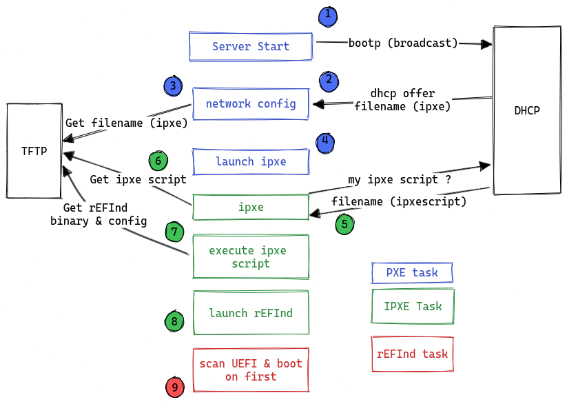
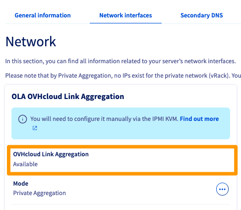
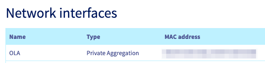
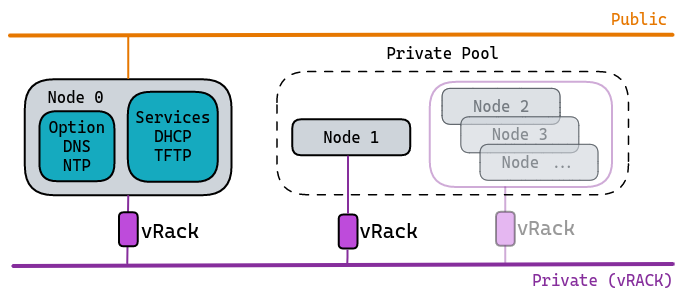
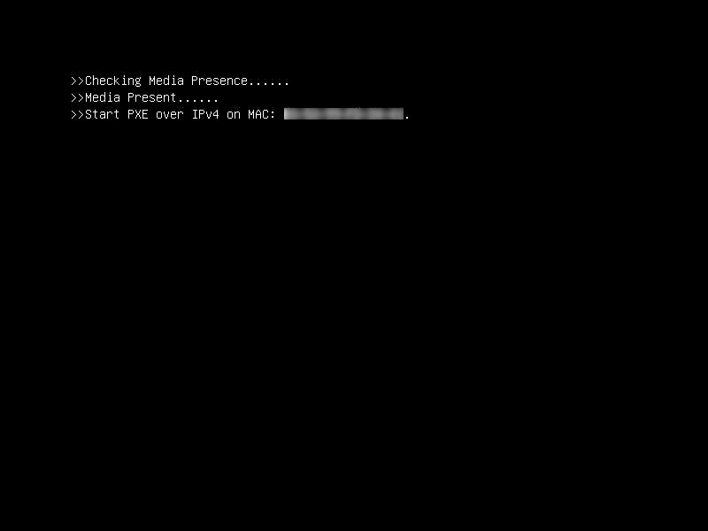
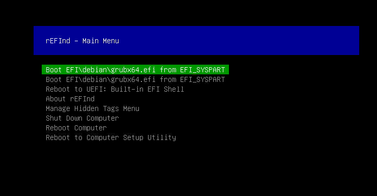

## Objectif

Ce guide a pour but de vous accompagner pour déployer tous les composants et services nécessaires au bon redémarrage de vos solutions OVHcloud en environnement **entièrement privé**.<br>
Profitez d'une infrastructure privée sans avoir modifié la configuration par défaut de vos [serveurs dédiés OVHcloud](/links/bare-metal/bare-metal).

> [!warning]
>
> Nous avons au préalable effectué tous nos tests, qualifications et validations de configurations, à partir de paramètres et critères de fonctionnement bien définis, afin de vous proposer des environnements techniques les mieux adaptés à votre matériel.
> 
> De par ses différentes séquences, le Netboot (Network Boot) consiste à utiliser votre interface réseau (en mode bas niveau) comme outil de sélection du boot de votre système d'exploitation.
>
> Sachez qu'il est possible de démarrer n'importe quel système à partir d'un volume réseau, par exemple SAN ou NFS. Cependant, le système démarre généralement à partir d'un volume local : disque local, CD/DVD ou USB.
>
> Pour rappel, il est fortement déconseillé de modifier les configurations par défaut : configuration BIOS, Boot Order, etc.
> 
> En effet, nous avons pré-configuré ce mécanisme de démarrage à nos solutions et y avons intégré tous nos outils : netboot, monitoring, recycling, etc.
> Si ces paramètres étaient amenés à être modifiés, nos équipes ne pourraient plus effectuer les tâches qui leur sont dédiées dans les conditions que nous avons choisies, et surtout vous risqueriez de rendre le démarrage inopérant.
>

Les [serveurs dédiés OVHcloud](/links/bare-metal/bare-metal) vous permettent de configurer/déclarer vos propres réseaux.<br>
Chaque serveur est muni au minimum de 2 interfaces réseaux, fonctionnant en réalité en liens agrégés et assurant la redondance en cas de panne.<br>
Vous avez donc la possiblité d'utiliser/déclarer vos réseaux *publics* et *privés* en passant par notre solution [vRack](/pages/bare_metal_cloud/dedicated_servers/vrack_configuring_on_dedicated_server).

Nous allons présenter le cas de [serveur(s) dédié(s)](/links/bare-metal/bare-metal) configuré(s) en mode **OLA**, c'est-à-dire possédant **uniquement** des réseaux privés.
Ce choix propose à votre infrastructure la meilleure isolation/protection possible pour votre service hébergé.<br>
La seule différence majeure notable est que les [réseaux privés](/pages/network/ovhcloud_connect/occ-concepts-overview#prive) n'ont donc pas accès à tout ce qui n'appartient pas à votre infrastructure.<br>
Par conséquent, un serveur isolé de par son réseau privé empêche le mecanisme de démarrage. C'est à dire que lorsque les systèmes sont démarrés via le méthode **Netboot** (Network Boot), ces derniers s'appuient sur le réseau interne d'OVHcloud et ses services mutualisés.

### Présentation rapide d'un démarrage en Netboot

Un composant majeur existe en 2 versions :

- **PXE** : utilisant un environnement standardisé client/serveur, basé sur les protocoles BOOTP/DHCP/TFTP, afin de permettre un démarrage/déploiement via le réseau du système client.<br>
- **iPXE** : utilisant un environnement standardisé client/serveur plus évolué, basé sur les protocoles HTTP, iSCSI, AoE, FCoE, Wi-Fi afin de permettre un démarrage/déploiement via le réseau du système client.

### Présentation rapide d'un démarrage en Netboot chez OVHcloud 

Liste des composants intervenants lors du démarrage :

- Un serveur **DHCP** : attribue une configuration réseau  (bail avec adresse IP) pour une machine cliente qui tente de démarrer.
- Un service **TFTP** : ressources disponibles à travers le réseau et qui seront interrogées/requêtées par PXE et iXPE.
- La solution **rEFInd**, sous forme de **BootLoader**, a été retenue car parfaitement adaptée. Elle permettra la recherche de secteurs d'amorçage des machines clientes : disque local, USB, etc...

Voici un schéma (logique) de démarrage Netboot :



|Description / Détails|
|---|
|1. Envoi d'une requête discover vers le DHCP depuis la machine cliente (en broadcast)|
|2. Le DHCP affecte une adresse IP à la machine cliente (offer/request/ack). Requête de récupération du binaire iPXE|
|3. Récupération en TFTP du binaire iPXE|
|4. Chargement du binaire iPXE en tant que firmware|
|5. Requête de récupération de script iPXE par le firmware iPXE|
|6. Récupération du script iPXE associé en TFTP|
|7. Exécution du script iPXE. Récupération des ressources nécessaires à rEFInd : binaire et fichier de configuration requis|
|8. Exécution et chargement du binaire rEFInd|
|9. rEFInd lance sa tâche de scan afin de repérer les secteurs d'amorçage des disques locaux|

> [!primary]
>
> Cette description reste la plus générique possible afin de rester claire, et ainsi ne pas ajouter des éléments ou contraintes techniques qui sortent du cadre de notre exemple. L'objectif de ce schéma est de donner une vision globale du principe de fonctionnement.
>

## Prérequis

> [!warning]
> 
> Cet article est destiné aux utilisateurs expérimentés qui ont un minimum de connaissances concernant le monde open source, ainsi que des notions d'administration système et réseau.
> 

- Posséder au moins un [serveur dédié](/links/bare-metal/bare-metal) ayant un système d'exploitation **déjà installé**.
- Un serveur dédié supplémentaire avec les interfaces réseau configurées par défaut, à savoir un accès au réseau public et privé. Ce serveur hébergera tous les services (**DHCP** et **TFTP**). Le système d'exploitation sera celui de votre choix.
- Avoir toutes les interfaces réseau de ce serveur en mode **privé**, ce qui sous-entend que vous avez préalablement configuré [notre fonctionnalité OLA](/pages/bare_metal_cloud/dedicated_servers/ola-enable-manager).<br>

<!-- CP-NAV-START:baremetal-dedicated-servers -->
---

### Accès à l'espace client OVHcloud

- **Lien direct :** [Serveurs dédiés](/links/control-panel/baremetal-dedicated-servers)
- **Pour accéder à vos services :** `Bare Metal Cloud`{.action} > `Serveurs dédiés`{.action} > Sélectionnez votre serveur

---
<!-- CP-NAV-END:baremetal-dedicated-servers -->

>
> Sélectionnez votre serveur et vérifiez son éligibilité à `OLA: OVHcloud Link Aggregation` dans l'onglet `Interfaces réseau`{.action}.
>
> {.thumbnail}
>
> {.thumbnail}

## En pratique

### Déployer vos services DHCP et TFTP

1. Installez les packages pour les services DHCP/TFTP.
2. Effectuez la configuration basique pour chaque service.
3. Mettez en marche votre serveur.

Ci-dessous un exemple d'infrastructure privée basique (schéma layer 2) :



**Exemple :**

- Services hébergés/mutualisés sur **Node 0**.
- Une seule machine cliente **Node 1** avec OLA actif.

> [!primary]
>
> Après le démarrage des systèmes, et afin que les services DHCP et ceux optionels (DNS et NTP) soient pleinement fonctionnels, pensez à déclarer/ajouter les règles dans le firewall local, via l'interface réseau privée de la machine hébergeant les services.
>

#### Le service DHCP

Retrouvez ci-dessous un exemple de fichier de configuration pour votre service **DHCP**.<br>
Selon votre distribution, l'arborescence peut être différente (`kea-dhcp4.conf`).

En règle générale, il suffit de :

- déclarer une interface réseau pour l'écoute (en attente de requêtes) ;
- renseigner un fichier de configuration principale (à titre d'exemple, cf fichier ci-dessous).

```bash
{
"Dhcp4": {
    "interfaces-config": {
        "interfaces": [ "eth1" ]
    },

    "control-socket": {
        "socket-type": "unix",
        "socket-name": "kea4-ctrl-socket"
    },

    "lease-database": {
        "type": "memfile",
        "lfc-interval": 3600
    },

    "expired-leases-processing": {
        "reclaim-timer-wait-time": 10,
        "flush-reclaimed-timer-wait-time": 25,
        "hold-reclaimed-time": 3600,
        "max-reclaim-leases": 100,
        "max-reclaim-time": 250,
        "unwarned-reclaim-cycles": 5
    },

    "renew-timer": 900,
    "rebind-timer": 1800,
    "valid-lifetime": 3600,

    "client-classes": [
        {
            "name": "iPXE script",
            "test": "option[user-class].exists and substring(option[user-class].hex,0,4) == 'iPXE' and option[client-system].hex == 0x0007", # Détermine le type d'architecture, ici 64bits
            "next-server": "192.168.1.1", # Détermine l'IP de votre serveur tftp
            "boot-file-name": "refind.pxe", # Détermine le script appelé par le binaire iPXE
        },
        {
            "name": "PXE UEFI",
            "test": "not option[user-class].exists and option[client-system].hex == 0x0007", # Détermine le type d'architecture, ici 64bits
            "next-server": "192.168.1.1", # Détermine l'IP de votre serveur tftp
            "boot-file-name": "ipxe.efi" # Détermine le binaire iPXE
        },
    ],

    "subnet4": [
        {
            "id": 1,
            "subnet": "192.168.1.0/28",
            "pools": [ { "pool": "192.168.1.2 - 192.168.1.14" } ],
            "option-data": [
                {
                    "name": "routers",
                    "data": "192.168.1.1"
                },
            ],
        }
    ],

    "loggers": [
    {
        "name": "kea-dhcp4",
        "output-options": [
            {
                "output": "stdout",
                "pattern": "%-5p %m\n",
            }
        ],
        "severity": "INFO",
        "debuglevel": 0
    }
  ]
}
}
```

**Détails :**

- réseau privé (ex: 192.168.1.0/28)
- `subnet_mask` : 255.255.255.240
- `broadcast_address` : 192.168.1.15
- `dns_servers` : cf chapitre optionnel
- `ntp_servers` : cf chapitre optionnel
- `default_router` : 192.168.1.1
- `next-server` : 192.168.1.1
- `host` : nom machine cliente
- `hardware ethernet` : adresse matérielle (MAC) machine cliente
- `server-name` : hostname machine cliente

#### Le service TFTP

Selon votre distribution, il existe plusieurs paquets réalisant la fonction de serveur TFTP.<br>
Par exemple : *tftp-server*, *tftpd*, *tftpd-hpa* ou encore *atftpd*.

> [!primary]
> 
> L'arborescence d'installation peut être différente selon la version du package et de votre système d'exploitation utilisé.
> 

Ce qu'il faut savoir :

- Ce service utilise le port 69 (UDP).
- Il est obligatoire de déclarer un répertoire « cible », correspondant à une arborescence locale qui sera utilisée pour la réception et le téléchargement des fichiers.

Exemple de configuration avec le logiciel `tftpd-hpa` :

```bash
# /etc/default/tftpd-hpa
TFTP_USERNAME="tftp"
TFTP_DIRECTORY="/srv/tftp"
TFTP_ADDRESS="TFTP_server_address:69"
TFTP_OPTIONS="--secure"
```

Nous utiliserons comme exemple le chemin `/srv/tftp`, et y déposerons les fichiers nécessaires :

```bash
root@node_0:/srv/tftp# tree
.
|-- ipxe.efi
|-- refind.conf
|-- refind.pxe
`-- refind_x64.efi
```

#### Le bootloader rEFInd

- Contenu du fichier `refind.pxe` :

```bash
#!ipxe

echo Boot to local disk

iseq ${platform} efi && goto is_efi_x86_64 || goto end

:is_efi_x86_64
echo EFI boot mode

# Récuperer le fichier de configuration
imgfetch --name refind.conf tftp://${next-server}/refind.conf

# Charger le binaire rEFIND
imgfetch --name refind tftp://${next-server}/refind_x64.efi
chain refind

:end
echo Chain on hard drive failed
sleep 10
exit 1
```

- Contenu du fichier `refind.conf` :

*Il s'agit d'intégrer les directives minimales pour une bonne intégration au SI d'OVHcloud.*

```bash

timeout 1
default_selection 1
hideui hwtest
hideui hints
banner_scale noscale
textonly
scanfor internal
uefi_deep_legacy_scan
scan_delay 0

```

### Mise en marche

Ci-dessous un aperçu de ce que l'on obtient à l'affichage lors d'un Netboot UEFI (par défaut) :<br>
*Correspond aux étapes 1 à 8.*<br>

{.thumbnail}

*Correspond au résultat des étapes 8 et 9.*<br>

{.thumbnail}<br>

Ci-dessus, nous avons le bootloader **rEFInd** chargé sur une machine avec un système *debian* installé.

Vous trouverez sur <a href="https://raw.githubusercontent.com/ovh/docs/develop/pages/bare_metal_cloud/dedicated_servers/pxe-with-full-private-dedicated/files/src.zip" download>ce lien</a> les ressources qui ont servi à élaborer nos tests et exemples présents tout au long de cette présentation. Ils pourront servir de template selon vos besoins.

#### Optionnel

Il est également recommandé de déployer les services DNS et NTP.

Ceux-ci ne sont pas nécessaires pour les phases de démarrage des systèmes, donc pas imposés dans cette procédure. Ils font néanmoins partie des services importants par la suite, principalement pour la stabilité de votre infrastructure.

##### **Service DNS**

Vous pouvez utiliser la table locale de chaque *Node*, à savoir le fichier `/etc/hosts`, ou bien utiliser un service tel que [dnsmasq](https://en.wikipedia.org/wiki/Dnsmasq).

##### **Service NTP**

Il est fortement conseillé d'utiliser un service NTP, surtout si votre infrastructure comprend plusieurs machines.

- Liste des ports à autoriser dans votre firewall local (de la machine hébergeant les services) :
    - NTP port 123
    - DNS port 53

## Aller plus loin

[Comprendre et/ou personnaliser votre service DHCP](https://wiki.debian.org/fr/DHCP_Server).<br>
[Comprendre et/ou personnaliser votre service iPXE](https://ipxe.org/docs).<br>
[Comprendre et/ou personnaliser votre service rEFInd](https://fr.wikipedia.org/wiki/REFInd).<br>
[Comprendre ou découvrir NTP](https://fr.wikipedia.org/wiki/Network_Time_Protocol).<br>
[Comprendre ou découvrir Dnsmasq](https://wiki.debian.org/dnsmasq).<br>

[Comprendre le processus de démarrage des serveurs dédiés](/pages/bare_metal_cloud/dedicated_servers/boot-process)

[Configurer un script iPXE personnalisé pour démarrer votre serveur via l'API OVHcloud](/pages/bare_metal_cloud/dedicated_servers/ipxe-scripts)

Échangez avec notre [communauté d'utilisateurs](/links/community).
