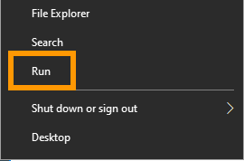

> [!primary]
> Questa traduzione è stata generata automaticamente dal nostro partner SYSTRAN. I contenuti potrebbero presentare imprecisioni, ad esempio la nomenclatura dei pulsanti o alcuni dettagli tecnici. In caso di dubbi consigliamo di fare riferimento alla versione inglese o francese della guida. Per aiutarci a migliorare questa traduzione, utilizza il pulsante "Contribuisci" di questa pagina.
>


## Obiettivo

Su un sistema Windows, la ridondanza dei dati è assicurata dall'mirror del disco principale su un secondo disco. Questa configurazione è simile a una configurazione in RAID 1, ma riguarda solo due dischi.

**Questa guida ti mostra come configurare lo specchio di un disco del tuo sistema Windows nel caso in cui sia necessario ricostruirlo a causa della corruzione o del malfunzionamento del disco.**

## Prerequisiti

- Un [server dedicato Windows](https://www.ovhcloud.com/it/bare-metal/) con uno specchio software
- Un accesso amministrativo al server tramite RDP

## Procedura

Installa una connessione RDP (Remote Desktop) con il tuo server.

Una volta connesso, clicca con il tasto destro sul pulsante `Inizia`{.action} e apri `Esegui`{.action}.

{.thumbnail}

Inserisci `cmd` e clicca su `OK`{.action}.

{.thumbnail}

Il metodo da utilizzare varia in base al tipo di partizione dei dischi. Segui le istruzioni di [questa sezione](#mbr) per **MBR** o passa alla [sezione successiva](#gpt) per **GPT**. Se non ne sei sicuro, esegui il comando `diskpart` nel prompt dei comandi e inserisci `list disk`. Verifica la colonna "Gpt" nel risultato fornito.

### Ricostruzione dello specchio (schema di partizione MBR) <a name="mbr"></a>

Dal prompt dei comandi, apri DiskPart:

```
C:\Windows\system32> diskpart
```

> [!alert]
>
> DiskPart esegue gli ordini senza emettere avvertimenti o richiedere conferma. Qualsiasi modifica effettuata in DiskPart è irreversibile. L'inserimento di comandi quando viene selezionato il disco sbagliato o il volume sbagliato può causare la perdita immediata dei dati e/o impedire l'avvio del sistema. Ti consigliamo di effettuare l'operazione con cautela e verificare ogni ordine.
>

#### Lista di tutti i dischi e volumi


```console
DISKPART> list disk
 
  Disk ###  Status         Size     Free     Dyn  Gpt
  --------  -------------  -------  -------  ---  ---
  Disk 0    Online          447 GB      0 B   *
  Disk 1    Online          447 GB   447 GB
  Disk M0   Missing            0 B      0 B   *
 
DISKPART> list volume
 
  Volume ###  Ltr  Label        Fs     Type        Size     Status     Info
  ----------  ---  -----------  -----  ----------  -------  ---------  --------
  Volume 0     C   Windows      NTFS   Mirror       447 GB  Failed Rd  System

```

In questo esempio, il `Disk 1` è un disco sostitutivo installato per sostituire il `Disk M0` difettoso che era stato precedentemente [fisicamente rimosso](/pages/bare_metal_cloud/dedicated_servers/disk_replacement).


> [!primary]
>
> Le seguenti sezioni di codice sono fornite a titolo puramente illustrativo, a seconda dell'esempio di uscita di cui sopra. È necessario adattare le istruzioni in base alla configurazione effettiva, sostituendo i valori nei comandi con le credenziali di disco e di volume.
>

#### Rimuovi il disco sostituito dalla configurazione

```console
DISKPART> select volume c
 
Volume 0 is the selected volume.
 
DISKPART> break disk M0 nokeep
 
DiskPart successfully broke the mirror volume.
 
DISKPART> list volume
 
  Volume ###  Ltr  Label        Fs     Type        Size     Status     Info
  ----------  ---  -----------  -----  ----------  -------  ---------  --------
  Volume 0     C   Windows      NTFS   Simple       447 GB  Healthy    System
 
DISKPART> select disk m0
 
Disk M0 is now the selected disk.
 
DISKPART> delete disk
 
DiskPart successfully deleted the missing disk.
 
DISKPART> list disk
 
  Disk ###  Status         Size     Free     Dyn  Gpt
  --------  -------------  -------  -------  ---  ---s
  Disk 0    Online          447 GB      0 B   *
  Disk 1    Online          447 GB   447 GB
 
```


#### Inizializzazione del disco sostitutivo

```console
DISKPART> select disk 1
 
Disk 1 is now the selected disk.
 
DISKPART> convert mbr
 
DiskPart successfully converted the selected disk to MBR format.
 
DISKPART> convert dynamic
 
DiskPart successfully converted the selected disk to dynamic format.

```

#### Ricreazione dello specchio tra il primo e il secondo disco

```console
DISKPART> select volume c
 
Volume 0 is the selected volume.
 
DISKPART> add disk 1
 
DiskPart succeeded in adding a mirror to the volume.
<===>
 
DISKPART> list disk
 
  Disk ###  Status         Size     Free     Dyn  Gpt
  --------  -------------  -------  -------  ---  ---
* Disk 0    Online          447 GB      0 B   *
  Disk 1    Online          447 GB      0 B   *

``` 

Ripeti questo step per ogni volume esistente a partire dal `Disk 0` che desideri mettere in mirror sul `Disk 1`, utilizzando la lettera del lettore associato (ad esempio, *d*, *e*, *f*, ecc...).

Lo stato del volume sarà `Rebuild` durante il processo, che potrebbe richiedere diverse ore in base ai dati salvati sul disco. Verifica lo stato in DiskPart:
 
```console
DISKPART> list volume
 
  Volume ###  Ltr  Label        Fs     Type        Size     Status     Info
  ----------  ---  -----------  -----  ----------  -------  ---------  --------
* Volume 0     C   Windows      NTFS   Mirror       447 GB  Rebuild    System

```

È preferibile non riavviare il server fino al completamento del processo di ricostruzione.

### Ricostruzione dello specchio (schema di partizione GPT) <a name="gpt"></a>

Dal prompt dei comandi, apri DiskPart:

```
C:\Windows\system32> diskpart
```

> [!alert]
>
> DiskPart esegue gli ordini senza emettere avvertimenti o richiedere conferma. Qualsiasi modifica effettuata in DiskPart è irreversibile. L'inserimento di comandi quando viene selezionato il disco sbagliato o il volume sbagliato può causare la perdita immediata dei dati e/o impedire l'avvio del sistema. Ti consigliamo di effettuare l'operazione con cautela e verificare ogni ordine.
>

#### Lista di tutti i dischi e volumi

```console
DISKPART> list disk
 
  Disk ###  Status         Size     Free     Dyn  Gpt
  --------  -------------  -------  -------  ---  ---
  Disk 0    Online         1863 GB      0 B   *    *
  Disk 1    Online         1863 GB  1863 GB
  Disk M0   Missing           0  B      0 B   *   
 
 
DISKPART> list volume
 
  Volume ###  Ltr  Label        Fs     Type        Size     Status     Info
  ----------  ---  -----------  -----  ----------  -------  ---------  --------
  Volume 0     C   Windows      NTFS   Mirror      1862 GB  Failed Rd  Boot
  Volume 1         EFI          FAT32  Partition    350 MB  Healthy    System
 
```

In questo esempio, il `Disk 1` è un disco sostitutivo installato per sostituire il `Disk M0` difettoso che era stato precedentemente [fisicamente rimosso](/pages/bare_metal_cloud/dedicated_servers/disk_replacement).

> [!primary]
>
> Le seguenti sezioni di codice sono fornite a titolo puramente illustrativo, a seconda dell'esempio di uscita di cui sopra. È necessario adattare le istruzioni in base alla configurazione effettiva sostituendo i valori nei comandi con le credenziali di disco e di volume.
>

#### Rimuovi il disco sostituito dalla configurazione

```console
DISKPART> select volume c
  
Volume 0 is the selected volume.
  
DISKPART> break disk M0 nokeep
  
DiskPart successfully broke the mirror volume.
 
DISKPART> list volume
 
  Volume ###  Ltr  Label        Fs     Type        Size     Status     Info
  ----------  ---  -----------  -----  ----------  -------  ---------  --------
  Volume 0     C   Windows      NTFS   Simple      1862 GB  Healthy    Boot
  Volume 1         EFI          FAT32  Partition    350 MB  Healthy    System
 
DISKPART> select disk M0
 
Disk M0 is now the selected disk.
 
DISKPART> delete disk
 
DiskPart successfully deleted the missing disk.
 
DISKPART> list disk
 
  Disk ###  Status         Size     Free     Dyn  Gpt
  --------  -------------  -------  -------  ---  ---
  Disk 0    Online         1863 GB      0 B   *    *
  Disk 1    Online         1863 GB  1863 GB
 
DISKPART> list volume
 
  Volume ###  Ltr  Label        Fs     Type        Size     Status     Info
  ----------  ---  -----------  -----  ----------  -------  ---------  --------
  Volume 0     C   Windows      NTFS   Simple      1862 GB  Healthy    Boot
  Volume 1         EFI          FAT32  Partition    350 MB  Healthy    System
 
```

#### Inizializzazione del disco sostitutivo

Sul nuovo disco, create le partizioni di default e obbligatorie, che riflettono il partizionamento esistente del primo disco:

```console
DISKPART> select disk 1
 
Disk 1 is now the selected disk.
 
DISKPART> clean
 
DiskPart succeeded in cleaning the disk.
 
DISKPART> convert gpt
 
DiskPart successfully converted the selected disk to GPT format.
 
DISKPART> select partition 1
 
Partition 1 is now the selected partition.
 
DISKPART> delete partition override
 
DiskPart successfully deleted the selected partition.
 
DISKPART> create partition efi size=350
 
DiskPart succeeded in creating the specified partition.
 
DISKPART> format quick fs=fat32 label=EFI
 
  100 percent completed
 
DiskPart successfully formatted the volume.
 
DiskPart successfully formatted the volume.
 
DISKPART> assign letter=t
 
DiskPart successfully assigned the drive letter or mount point.
 
DISKPART> create partition msr size=128
 
DiskPart succeeded in creating the specified partition.
 
DISKPART> list partition
 
  Partition ###  Type              Size     Offset
  -------------  ----------------  -------  -------
  Partition 1    System             350 MB  1024 KB
* Partition 2    Reserved           128 MB   351 MB

```

#### Ricreazione dello specchio tra il primo e il secondo disco 

```console
DISKPART> select volume c
 
Volume 0 is the selected volume.
 
DISKPART> add disk 1
 
DiskPart succeeded in adding a mirror to the volume.
 
DISKPART> list disk
 
  Disk ###  Status         Size     Free     Dyn  Gpt
  --------  -------------  -------  -------  ---  ---
* Disk 0    Online         1863 GB      0 B   *    *
  Disk 1    Online         1863 GB      0 B   *    *

```

Ripeti questo step per ogni volume esistente a partire dal `Disk 0` che desideri mettere in mirror sul `Disk 1`, utilizzando la lettera del lettore associato (ad esempio, *d*, *e*, *f*, ecc...).

#### Ripristino dell'ambiente di inizializzazione e definizione delle opzioni di inizializzazione del secondo disco

```console
DISKPART> select disk 0
 
Disk 0 is now the selected disk.
 
DISKPART> list partition
 
  Partition ###  Type              Size     Offset
  -------------  ----------------  -------  -------
  Partition 1    System             350 MB  1024 KB
  Partition 2    Dynamic Reserved  1024 KB   351 MB
  Partition 3    Reserved           127 MB   352 MB
  Partition 4    Dynamic Data      1862 GB   479 MB
  Partition 5    Dynamic Data        71 KB  1863 GB
 
DISKPART> select partition 1
 
Partition 1 is now the selected partition.
 
DISKPART> assign letter=s
 
DiskPart successfully assigned the drive letter or mount point.
 
DISKPART> list volume
 
  Volume ###  Ltr  Label        Fs     Type        Size     Status     Info
  ----------  ---  -----------  -----  ----------  -------  ---------  --------
  Volume 0     C   Windows      NTFS   Mirror      1862 GB  Rebuild    Boot
* Volume 1     S   EFI          FAT32  Partition    350 MB  Healthy    System
  Volume 2     T   EFI          FAT32  Partition    350 MB  Healthy    Hidden
 
DISKPART> exit
 
Leaving DiskPart...
```

Di ritorno al prompt del comando, copia i file di avvio della partizione di avvio (EFI) sul primo disco (`Disk 0`) verso la partizione di avvio sul secondo disco (`Disk 1`).

Effettua i 3 comandi seguenti ed eseguili con il tasto `Inserisci`:

```
robocopy s:\ t:\ * /e /copyall /xf BCD.* /xd "System Volume Information"
bcdedit /export t:\EFI\Microsoft\Boot\BCD
bcdedit /store t:\EFI\Microsoft\Boot\BCD /set {bootmgr} device partition=t:
``` 

Riavvia DiskPart ed esegui questi comandi:

```console
DISKPART> select volume s
 
Volume 2 is the selected volume.
 
DISKPART> remove
 
DiskPart successfully removed the drive letter or mount point.
 
DISKPART> select volume t
 
Volume 1 is the selected volume.
 
DISKPART> remove
 
DiskPart successfully removed the drive letter or mount point.

```

Lo stato del volume sarà `Rebuild` durante il processo, che potrebbe richiedere diverse ore in base ai dati salvati sul disco. Verifica lo stato in DiskPart:

```console
DISKPART> list volume
 
  Volume ###  Ltr  Label        Fs     Type        Size     Status     Info
  ----------  ---  -----------  -----  ----------  -------  ---------  --------
  Volume 0     C   Windows      NTFS   Mirror      1862 GB  Rebuild    Boot
  Volume 1         EFI          FAT32  Partition    350 MB  Healthy    Hidden
  Volume 2         EFI          FAT32  Partition    350 MB  Healthy    System

```

È preferibile non riavviare il server fino al completamento del processo di ricostruzione.

## Per saperne di più

Contatta la nostra Community di utenti all’indirizzo <https://community.ovh.com/en/>.