> [!primary]
> Esta traducción ha sido generada de forma automática por nuestro partner SYSTRAN. En algunos casos puede contener términos imprecisos, como en las etiquetas de los botones o los detalles técnicos. En caso de duda, le recomendamos que consulte la versión inglesa o francesa de la guía. Si quiere ayudarnos a mejorar esta traducción, por favor, utilice el botón "Contribuir" de esta página.
> 

## Objetivo

Esta guía explica cómo restaurar la contraseña de `Administrator` con **Windows customer rescue system**.

## Requisitos

- Microsoft Windows debe estar instalado en su [servidor dedicado](/links/bare-metal/bare-metal)
- Disponer de al menos 16 GB de RAM en el servidor
- Estar conectado al [área de cliente de OVHcloud](/links/manager)

> [!warning]
>
> Esta guía no es compatible con el modo WinPE Rescue.
> Consulte [esta guía](/pages/bare_metal_cloud/dedicated_servers/changing-admin-password-on-windows) si utiliza el modo `WinPe Rescue`.
>

## Procedimiento

### Paso 1 - Reiniciar el servidor en modo de rescate <a name="step1"></a>

El sistema se debe iniciar en modo **Windows customer rescue system** para poder cambiar la contraseña.

Para más información, consulte la [guide sur le mode rescue](/pages/bare_metal_cloud/dedicated_servers/rescue-customer-windows).

### Paso 2 - Borrar la contraseña actual <a name="step2"></a>

Conéctese al servidor con la conexión a Escritorio remoto (RDP) y las credenciales de correo electrónico.

Tenga en cuenta que el nombre de usuario es `Administrator`.

- Si su servidor utiliza un RAID por software en el disco del sistema, deberá importarlo antes de poder restablecer la contraseña: siga las instrucciones de la [sección A](#sectionA) de esta guía.
- Si su servidor no utiliza RAID por software en el disco del sistema, puede restablecer directamente la contraseña siguiendo las instrucciones de la [sección B](#sectionB) de esta guía.

#### A - Importar el disco local de Windows <a name="sectionA"></a>

##### 1. Acceder a la gestión de discos

Haga clic derecho en el menú `Inicio`{.action} y seleccione `Disk Management`{.action}.

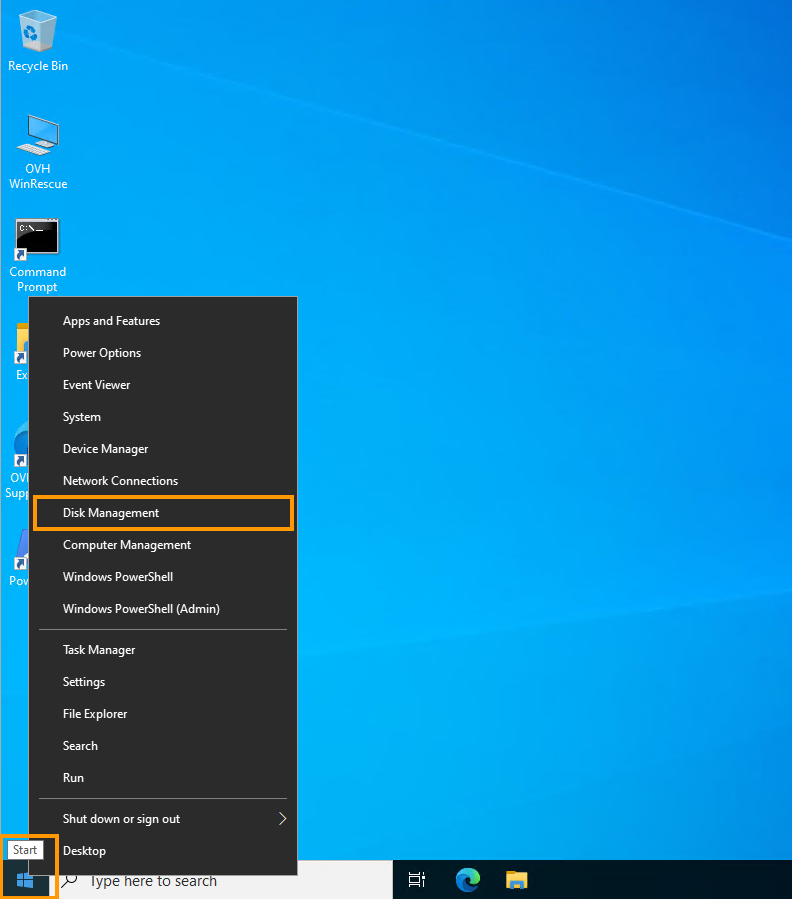{.thumbnail}

Ahora puede ver los discos y volúmenes del servidor.

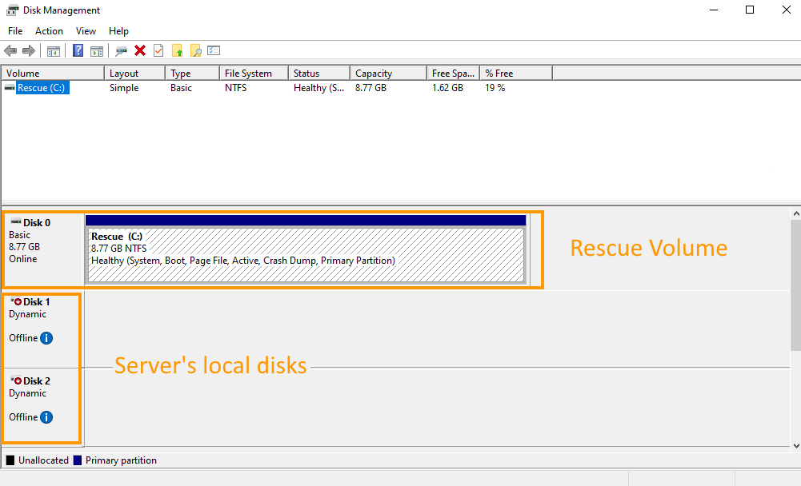{.thumbnail}

El disco que contiene Windows en su servidor es probablemente el *disk 1*, por lo que deberá importarlo para poder acceder a él.

Tenga en cuenta que si su servidor tiene varios grupos de discos, el número de disco que contiene Windows puede ser diferente y es posible que tenga que importar varios discos antes de encontrarlo.

También debe importar el segundo disco para importar correctamente el volumen de RAID por software.

##### 2. Importar discos

Haga clic derecho en *Disk 1* y seleccione `Online`{.action}.

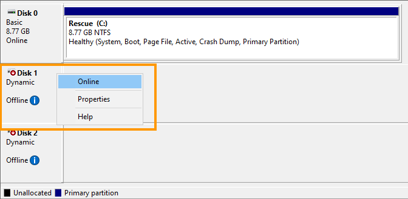{.thumbnail}

Haga lo mismo con el segundo disco (Disk 2) para importar correctamente el volumen de RAID por software.

Haga clic derecho en *Disk 2* y seleccione`Online`{.action}.

{.thumbnail}

Los discos ahora aparecen como "*Dynamic*" y "*Foreign*".

Haga clic derecho en *Disk 1* y seleccione `Import Foreign Disks`{.action}.

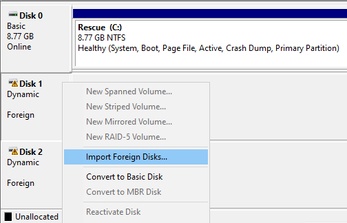{.thumbnail}

Haga doble clic en `OK`{.action}.

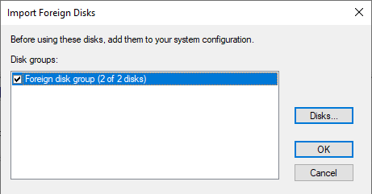{.thumbnail}

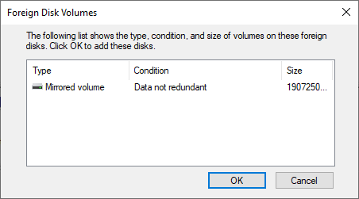{.thumbnail}

El disco local ya está accesible y el disco Windows corresponde al volumen `(E:)` (que se extiende en dos discos configurados en RAID por software de tipo Mirrored volume).

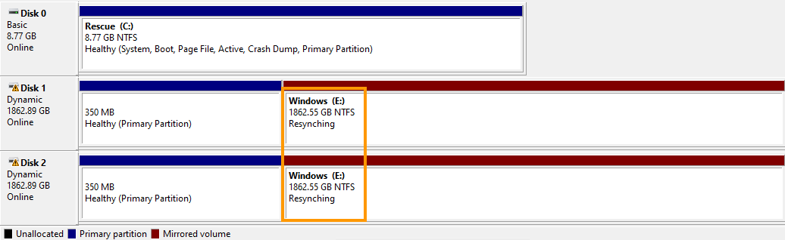{.thumbnail}

__Note__: En este ejemplo, el estado del volumen es "Resynching" porque el servidor se reinició de forma inesperada en modo de rescate. Es un estado normal que no es causado por el rescate en sí.
Esto no afectará a los datos del volumen y la resincronización continuará después de reiniciar el servidor en su sistema instalado.

> [!warning]
>
> Debe utilizar la ruta de acceso a la carpeta local de Windows (en este caso, E:\Windows) cuando vaya a buscar el archivo de configuración _SAM_ en la siguiente sección.

Ahora puede restablecer la contraseña siguiendo las instrucciones de la siguiente sección.

#### B - Restablecer la contraseña <a name="sectionB"></a>

Para restablecer una contraseña, es necesario utilizar la utilidad NTPWEdit.

Una vez conectado a través del Escritorio remoto (RDP), abra el explorador de Internet (MS Edge) y descargue la utilidad desde el [sitio web oficial](http://www.cdslow.org.ru/files/ntpwedit/ntpwed07.zip).

Desplácese hasta la carpeta en la que se encuentra el archivo ZIP descargado y extraiga el contenido.

A continuación, abra el ejecutable `ntpwedit64.exe` para iniciar la aplicación.

En esta interfaz, puede manipular el archivo *SAM* para borrar la contraseña del usuario admin.

Debe explorar la carpeta local de Windows para encontrar el archivo *SAM* del sistema.

Haga clic en el botón `...`{.action} para navegar a la unidad en la que se encuentra la carpeta local de Windows.

Normalmente, es la unidad `Windows (E:\)`

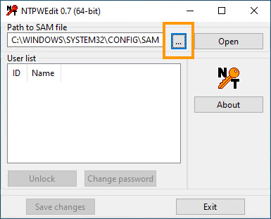{.thumbnail}

Desplácese hasta `E:\WINDOWS\SYSTEM32\CONFIG\`.

Seleccione y abra el archivo *SAM* para ver las cuentas de usuario seleccionando `Open`{.action}.

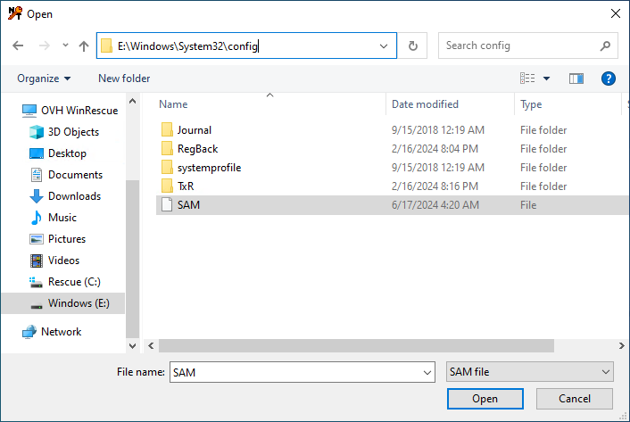

Seleccione la cuenta de usuario "admin" y haga clic en `Change password`{.action}.

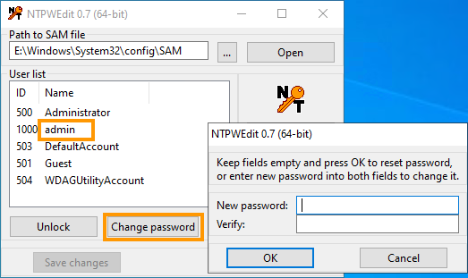{.thumbnail}

En la nueva ventana, deje los campos en blanco y haga clic en `Aceptar`{.action}. Finalice haciendo clic en `Guardar cambios`{.action} y luego en `Salir`{.action}.

El servidor debe reiniciarse en el sistema operativo normal.

### Paso 3 - Reiniciar el servidor <a name="step3"></a>

En primer lugar, sustituya el netboot por `Booter en el disco duro`{.action} en el área de cliente de OVHcloud (ver [Paso 1](#step1)).

A continuación, reinicie el servidor desde el área de cliente. Haga clic en el botón `...`{.action} junto a "Estado de los servicios" y seleccione `Reiniciar`{.action}.

{.thumbnail}

### Paso 4 - Establecer una nueva contraseña (IPMI) <a name="step4"></a>

En el [área de cliente de OVHcloud](/links/manager), acceda a la pestaña `IPMI`{.action} para abrir una sesión KVM.

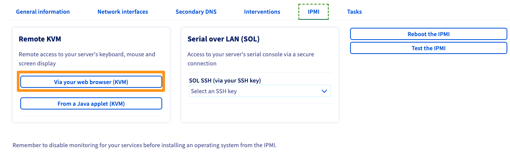{.thumbnail}

#### Para una versión reciente de Windows

Una vez que se haya conectado al servidor, haga clic en el icono del menú "Inicio" en la parte inferior izquierda.

Comience a escribir `opciones de conexión` y haga clic en `Opciones de conexión`{.action} cuando aparezca en el menú.

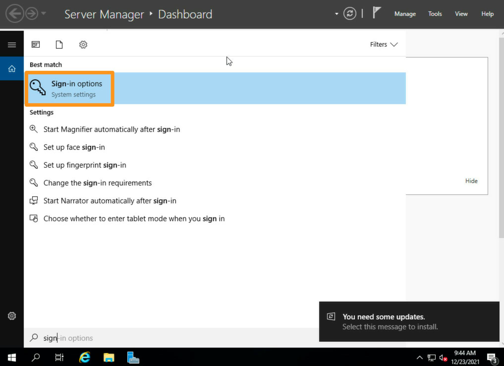{.thumbnail}

A continuación, en la sección "Contraseña", haga clic en el botón `Añadir`{.action} para establecer la nueva contraseña.

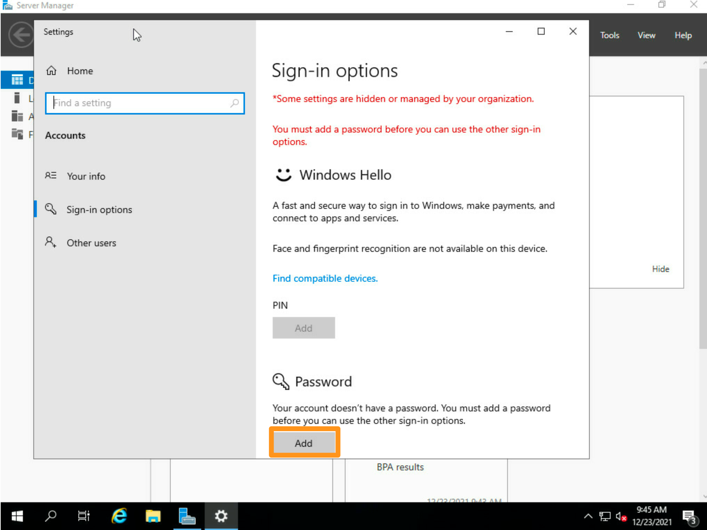{.thumbnail}

#### Para una versión anterior de Windows

Una ventana de línea de comandos (cmd) debe abrirse cuando se establece la sesión KVM.

Establezca la contraseña del usuario actual ("Administrator"):

```bash
net user Administrator *
```

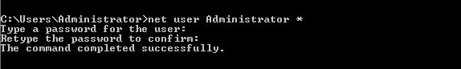{.thumbnail}

Le recomendamos que utilice el teclado virtual al introducir contraseñas en esta interfaz.

## Más información

Interactúe con nuestra [comunidad de usuarios](/links/community).