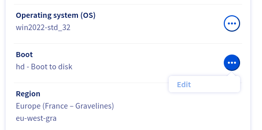
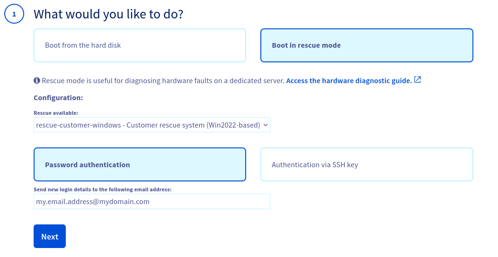
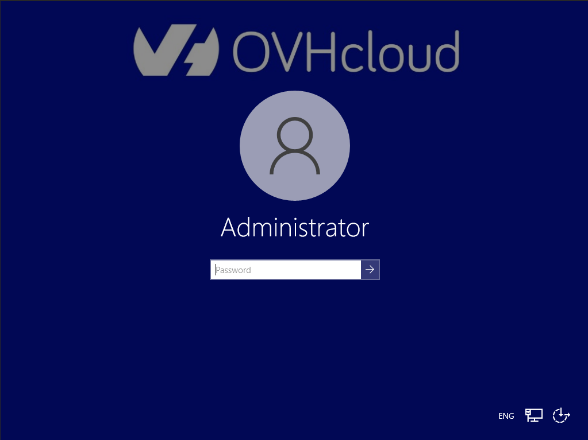
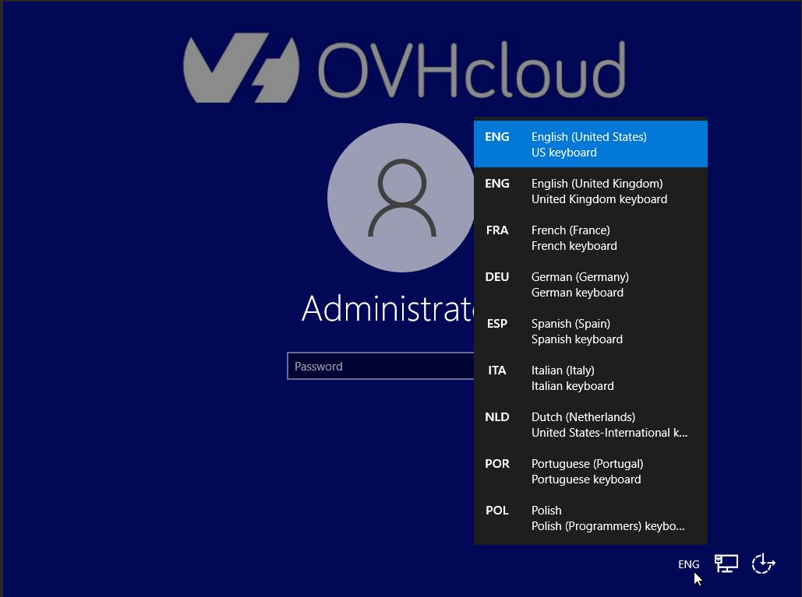
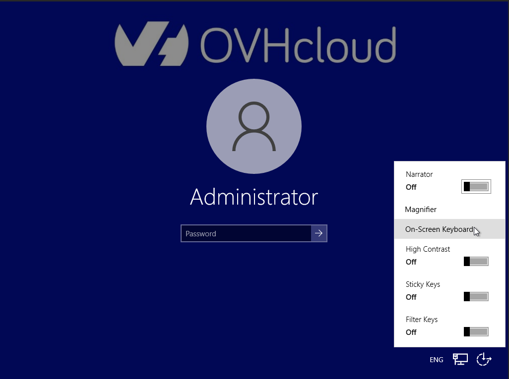
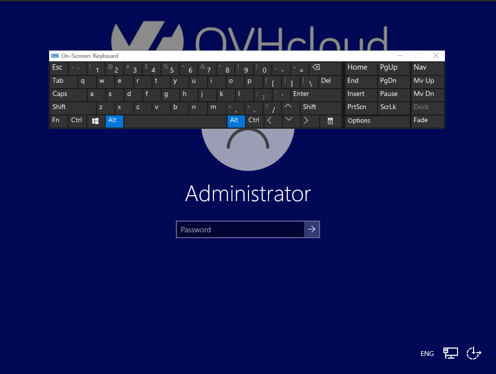

## Objective

The *rescue-customer-windows* mode is a tool provided by OVHcloud that allows you to boot to a temporary operating system with the aim of diagnosing and resolving problems on your server.

Usual tasks this rescue mode is appropriate for include:

- [Resetting the administrator password](/pages/bare_metal_cloud/dedicated_servers/rcw-changing-admin-password-on-windows)
- Repairing a broken operating system
- Fixing a software firewall misconfiguration

> [!warning]
>
> Backing up your data should be the first step in rescue mode if you do not already have recent backups available.
>
> If you have any services still online, rescue mode will interrupt them as the machine is being rebooted into the auxiliary rescue environment.
>

**This guide explains how to reboot a server into *rescue-customer-windows* mode.**

## Requirements

- Microsoft Windows installed on your [dedicated server](/links/bare-metal/bare-metal)
- At least 16 GB of RAM installed on the server
- Access to the [OVHcloud Control Panel](/links/manager)

## Functional information

The *rescue-customer-windows* mode runs in a virtual machine (VM) launched from the *rescue* system (based on Debian GNU/Linux). 
The server disks are attached to the VM with *passthrough*, so it is possible to access them. 
Other server components will not be accessible (CPU, RAM, network card, RAID card). 
The network is mounted with *passthrough* but without direct access to the network card, this implies that the VM carries the IP address and the MAC address of the *bare metal* server.

> [!warning]
>
> Restarting or shutting down the VM of *rescue-customer-windows* will not reboot the server on its original OS.
> To reboot on the original OS, please refer to the documentation below.

## Instructions

You can only activate rescue mode from your [OVHcloud Control Panel](/links/manager). Go to the `Bare Metal Cloud`{.action} section and select the server from `Dedicated servers`{.action}.

Look for "Boot" in the **General information** box and click on `...`{.action}, then on `Edit`{.action}.

{.thumbnail}

On the next page, select **Boot in rescue mode**.

Choose `rescue-customer-windows`{.action}. Specify an alternative email address below if you do **not** want the login credentials sent to your customer account's primary address.

Click `Next`{.action} and `Confirm`{.action}.

{.thumbnail}

Once the modification is complete, click the `...`{.action}' button to the right of "Status" in the box labelled **Service status**.

Click `Restart`{.action} and the server will reboot into rescue mode. This may take a few minutes.

You can check the progress in the `Tasks`{.action} tab. Once the rescue system is available, you will be sent an email containing the credentials (including the login password) of the rescue mode Administrator user.

{.thumbnail}

Once you have finished your tasks in rescue mode, please remember to reset the boot mode (netboot) to `Boot from the hard disk`{.action}, then reboot your server.

### Connection to *rescue-customer-windows*

Once you have retrieved your password, you have three options for connecting to the server:

- Remote Desktop Protocol (RDP)
- SSH (official Windows OpenSSH Server component)
- KVM IP (if your server allows it)

> [!warning]
>
> In any case, you will be asked to enter your password.
>
> The user to log in is `Administrator`.
>
> The password is sent via a `secret-as-a-service` link.

#### KVM IP usage

From the KVM login screen, you can select a different keyboard language.

{.thumbnail}

{.thumbnail}

You can change the accessibility options and enable the virtual keyboard:

{.thumbnail}

{.thumbnail}

### Mounting disks

Attached disks may be displayed as `Dynamic Volumes`. To access them, please refer to the [official Microsoft documentation](https://learn.microsoft.com/en-us/troubleshoot/windows-server/backup-and-storage/troubleshoot-disk-management#a-dynamic-disks-status-is-foreign).

### Recommended utilities

> [!warning]
>
> Below is a list of recommended software for certain use cases.
> This software is not installed by default on the *rescue* image and are easily available on the internet.

| Software | Description |
| --- | --- |
| CrystalDiskInfo | Disk Diagnostics Tool |
| 7Zip | Archive Management Tool |
| FileZilla | Open source FTP client |

## Go further

[How to activate and use rescue mode](/pages/bare_metal_cloud/dedicated_servers/rescue_mode)

Join our [community of users](/links/community).
