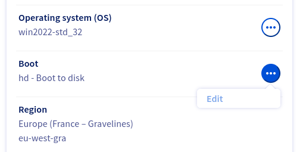
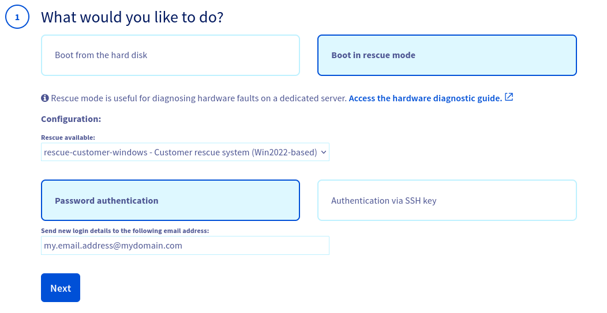
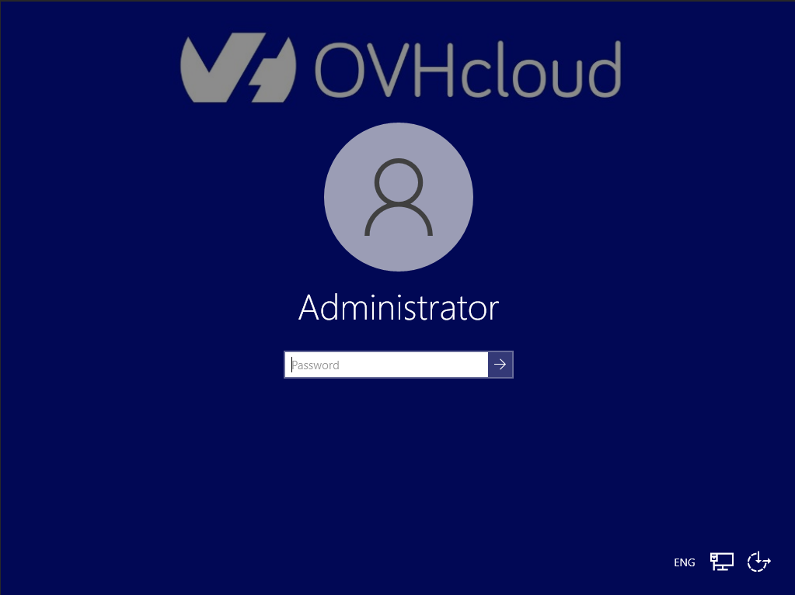
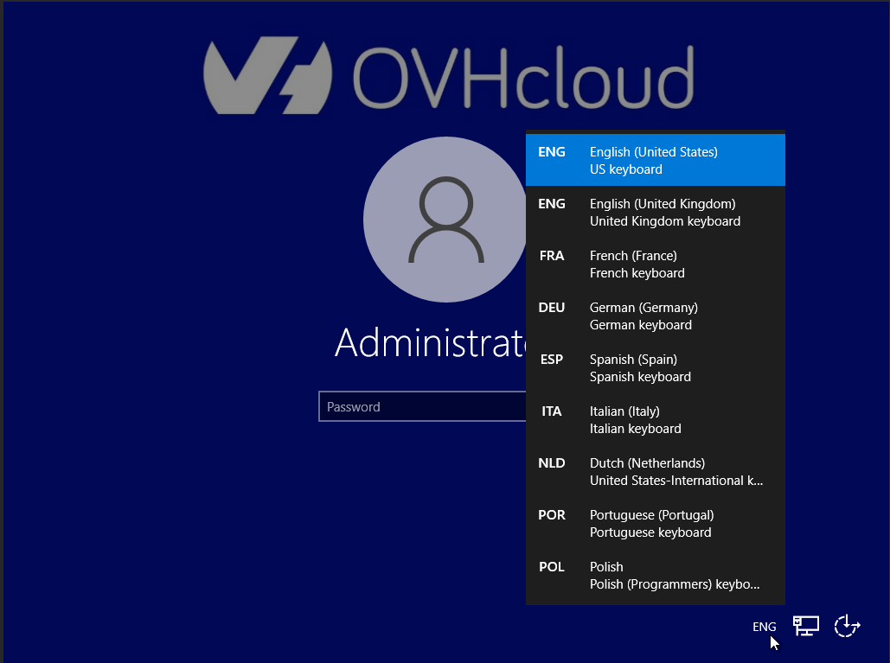
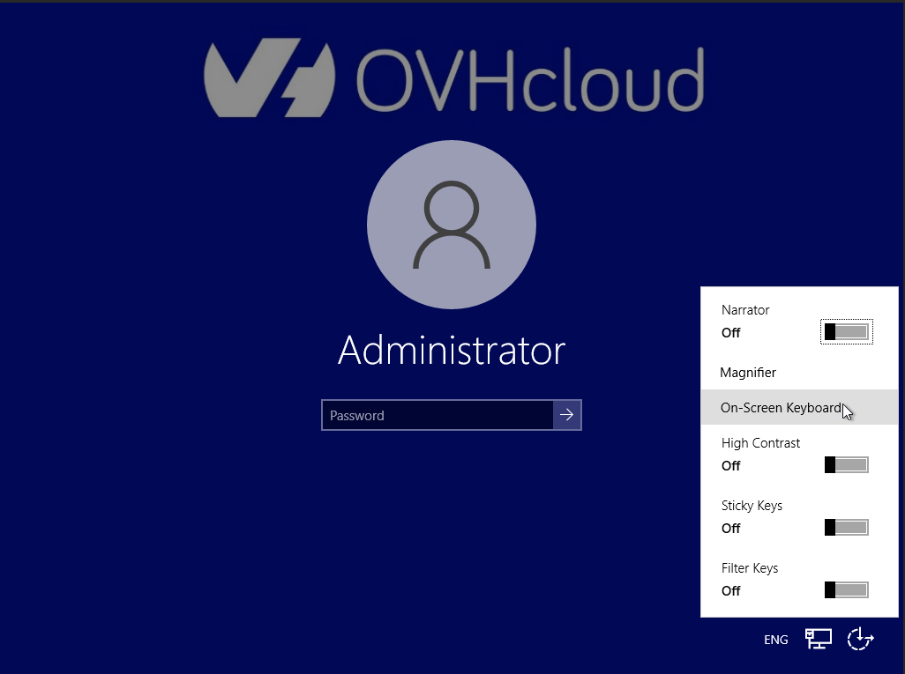
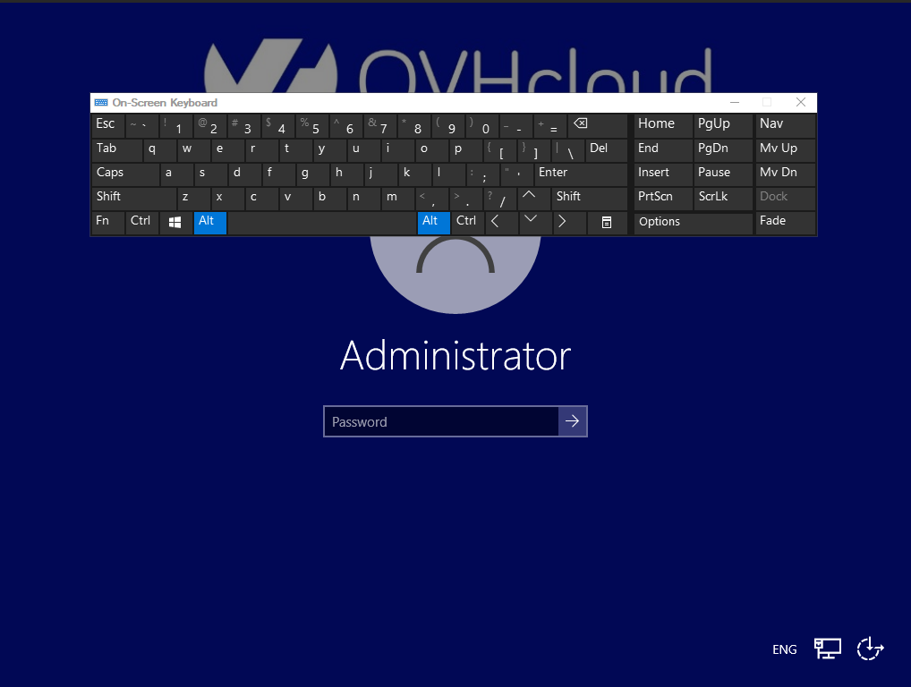

<style>
details>summary {
    color:rgb(33, 153, 232) !important;
    cursor: pointer;
}
details>summary::before {
    content:'\25B6';
    padding-right:1ch;
}
details[open]>summary::before {
    content:'\25BC';
}
</style>

## Objetivo

O modo rescue é uma ferramenta fornecida pela OVHcloud que permite iniciar num sistema operativo temporário. Tem como objetivo diagnosticar e resolver os problemas no seu servidor.

O funcionamento geral do modo rescue é descrito no nosso guia [Como ativar e utilizar o modo rescue](/pages/bare_metal_cloud/dedicated_servers/rescue_mode).

A opção **Windows customer rescue system** só está disponível para os servidores dedicados nos quais está instalado um sistema operativo **Windows Server**. São aplicáveis as seguintes condições:

- O sistema rescue para Windows (`rescue-customer-windows`) funciona numa máquina virtual (VM) lançada a partir do sistema rescue client (`rescue-customer`, baseado em Debian GNU/Linux).
- Os discos do servidor estão ligados à VM com *passthrough*. Assim, é possível aceder aos mesmos.
- Os outros componentes do servidor ficarão inacessíveis (CPU, RAM, NIC, RAID).
- A rede é montada com *passthrough* mas sem acesso direto ao adaptador de rede. A VM porta o endereço IP e o endereço MAC do servidor *bare metal*.

> [!warning]
>
> Certifique-se de que efetua um backup dos seus dados se ainda não dispõe de um backup recente.
>
> Se tiver serviços em produção no seu servidor, o modo rescue interrompe-os-á enquanto a máquina não for reiniciada em modo normal.
>

**Saiba como iniciar um servidor no SO Windows Client.**

## Requisitos

- Microsoft Windows instalado no seu [servidor dedicado](/links/bare-metal/bare-metal)
- Pelo menos 16 GB de RAM instaladas no servidor

<!-- CP-NAV-START:baremetal-dedicated-servers -->
---

### Acesso à Área de Cliente OVHcloud

- **Ligação direta:** [Servidores dedicados](/links/control-panel/baremetal-dedicated-servers)
- **Caminho de navegação:** `Bare Metal Cloud`{.action} > `Servidores dedicados`{.action} > Selecione o seu servidor

---
<!-- CP-NAV-END:baremetal-dedicated-servers -->

## Instruções

### Ativação do modo rescue para Windows

Clique no nome do seu servidor para abrir o separador `Informações gerais`{.action}.

<a name="netboot"></a>

Na casa **Informações gerais**, clique no botão `...`{.action} ao lado de `Boot`. Clique em `Alterar`{.action} no menu contextual.

{.thumbnail}

Na página **Alterar o netboot**, selecione `Fazer boot em modo rescue`{.action}.

Selecione `Windows customer rescue system`{.action} no menu pendente.

{.thumbnail width="800"}

O e-mail de notificação do modo rescue, bem como os seus dados de acesso, serão enviados para o endereço de e-mail de contacto da sua conta OVHcloud. Para utilizar outro endereço de e-mail, introduza-o no campo `Receber os dados de acesso ao modo para o e-mail:`.

Clique em `Seguinte`{.action}.

Na etapa **Resumo**, clique em `Validar`{.action}.

{.thumbnail}

Já deverá ter uma notificação relativa ao parâmetro `Netboot` no separador `Informações gerais`{.action}.

{.thumbnail}

O último passo consiste em reiniciar o servidor. Clique no botão `...`{.action} ao lado de "Estado" na zona **Estado dos serviços** e, a seguir, clique em `Reiniciar`{.action}. Clique em `Validar`{.action} na janela pop-up.

{.thumbnail}

Este *hard reboot* demorará alguns minutos a terminar. Pode verificar o estado atual no separador `Tarefas`{.action}.

> [!primary]
>
> Depois de concluir as suas ações em modo rescue, não se esqueça de redefinir o parâmetro `Netboot` em `Fazer boot no disco rígido`{.action} antes de reiniciar o servidor.

### Aceder ao seu servidor em modo rescue

Depois de receber um e-mail a informar que o modo rescue está ativado, poderá aceder ao sistema através do modo rescue do Windows e aceder ao servidor.  
Este e-mail também estará disponível no seu [Área de Cliente OVHcloud](/links/manager) assim que for enviado. Clique no seu ID de cliente no canto superior direito e, em seguida, selecione `E-mails de serviço`{.action}.

Para efetuar uma sessão remota no sistema em modo rescue do Windows, precisará das seguintes informações de identificação:

- Endereço IP do servidor
- Nome de utilizador da conta de administrador temporário (`Administrator`)
- Palavra-passe da conta de administrador temporário

Pode utilizar os seguintes métodos de ligação para aceder ao servidor através do sistema em modo Rescue do Windows:

- Remote Desktop Protocol (RDP)
- KVM over IP (se o seu servidor o permitir)
- OpenSSH (componente oficial do Windows Server)

#### RDP

/// details | Expanda esta secção

Para se conectar, utilize o cliente `Remote Desktop Connection` do Windows ou qualquer aplicação compatível.

{.thumbnail}

///

#### KVM

/// details | Expanda esta secção

No ecrã de ligação KVM, pode selecionar outro idioma do teclado.

{.thumbnail width="800"}

{.thumbnail width="800"}

Pode alterar as opções de acessibilidade e ativar o teclado virtual:

{.thumbnail width="800"}

{.thumbnail width="800"}

Para mais informações, consulte o nosso manual: [Como utilizar a consola IPMI com um servidor dedicado](/pages/bare_metal_cloud/dedicated_servers/using_ipmi_on_dedicated_servers)

///

#### SSH

/// details | Expanda esta secção

Abra a aplicação de linha de comandos no seu dispositivo local e introduza este comando:

```bash
ssh Administrator@SERVER_IP
```

Exemplo:

```bash
ssh Administrator@203.0.113.100
```

Introduza a palavra-passe do Modo Rescue Temporário quando tal lhe for solicitado. Exemplo:

```console
Administrator@ns9356771.ip-203-0-113.eu's password:
administrator@WINRESCUEOVH C:\Users\Administrator>
```

Encontre mais informações sobre as ligações SSH no nosso [guia de introdução ao SSH](/pages/bare_metal_cloud/dedicated_servers/ssh_introduction).  
Também pode utilizar qualquer ferramenta de ligação SSH, como [PuTTY](/pages/web_cloud/web_hosting/ssh_using_putty_on_windows).

///

### Importação de discos para aceder aos seus ficheiros

Uma vez ligado ao cliente de backup do Windows, tem de importar (*mount*) os discos do servidor Windows antes de aceder ao sistema de ficheiros.

/// details | Expanda esta secção

> [!warning]
> Os exemplos de instruções e capturas de ecrã que se seguem ilustram o processo de montagem baseado num servidor com dois discos espelhados (RAID1). Os detalhes apresentados pela Ferramenta de Gestão de Discos dependem da configuração de disco do servidor.  
> Para mais informações, consulte a [documentação oficial da Microsoft](https://learn.microsoft.com/en-us/windows-server/storage/disk-management/overview-of-disk-management).
>
> Se necessitar de assistência profissional para a administração do seu servidor, consulte a secção [Quer saber mais](#gofurther) deste guia.

| {.thumbnail} |
|---|
| Clique com o botão direito do rato no botão `Start Menu`{.action} e abra o `Disk Management`{.action}. |

| {.thumbnail width="700"} |
|---|
| `Disk 0` contém o sistema rescue (volume `C:`). Os discos do seu servidor Windows serão apresentados como `Offline`. |

| {.thumbnail} |
|---|
| Clique com o botão direito do rato em cada disco e selecione `Online`{.action} no menu contextual. |

| {.thumbnail} |
|---|
Os discos do servidor são agora [reconhecidos pelo sistema rescue como `Foreign`](https://learn.microsoft.com/en-us/troubleshoot/windows-server/backup-and-storage/troubleshoot-disk-management#a-dynamic-disks-status-is-foreign), um estado que indica que os discos ligados pertencem a um sistema operativo diferente. |

| {.thumbnail} |
|---|
| Clique com o botão direito do rato num disco e selecione `Import Foreign Disks...`{.action} no menu contextual. |

| {.thumbnail} |
|---|
| Se aplicável, selecione os discos que pretende importar. Clique em `OK`{.action}. |

| {.thumbnail} |
|---|
| Clique em `OK`{.action}. |

| {.thumbnail} |
|---|
Neste exemplo, os dois discos do servidor são espelhados, pelo que o estado `Resynching` será apresentado. Esse é o processo normal e a ressincronização continuará quando o servidor for reiniciado no sistema operativo instalado. |

| {.thumbnail} |
|---|
| Para aceder aos seus ficheiros, clique com o botão direito do rato na partição Windows do seu `Disk 1` e selecione `Open`{.action} no menu contextual. |

///

### Utilitários recomendados

> [!primary]
>
> Não é pré-instalado qualquer software adicional no sistema em modo Rescue. Abaixo, encontrará uma lista das ferramentas recomendadas, disponíveis no website dos respetivos programadores.

| Software | Descrição |
| --- | --- |
| CrystalDiskInfo | Ferramenta de diagnóstico do disco |
| 7-Zip | Ferramenta de gestão de arquivos |
| FileZilla | Cliente FTP |

### Saída do modo rescue

Em [Área de Cliente OVHcloud](/links/manager), [altere o modo de arranque](#netboot) novamente em `Fazer boot no disco rígido`{.action} e valide.

{.thumbnail width="800"}

A seguir, utilize a função `Reiniciar`{.action} na sua Área de Cliente OVHcloud.

<a name="gofurther"></a>

## Quer saber mais?

[Como ativar e utilizar o modo rescue](/pages/bare_metal_cloud/dedicated_servers/rescue_mode)

[Como alterar a palavra-passe de administrador num servidor dedicado Windows](/pages/bare_metal_cloud/dedicated_servers/rcw-changing-admin-password-on-windows)

Para serviços especializados (referenciamento, desenvolvimento, etc), contacte os [parceiros OVHcloud](/links/partner).

Se pretender usufruir de uma assistência na utilização e na configuração das suas soluções OVHcloud, consulte as nossas diferentes [ofertas de suporte](/links/support).

Fale com nossa [comunidade de utilizadores](/links/community).