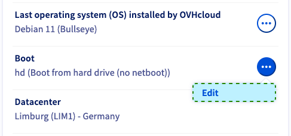
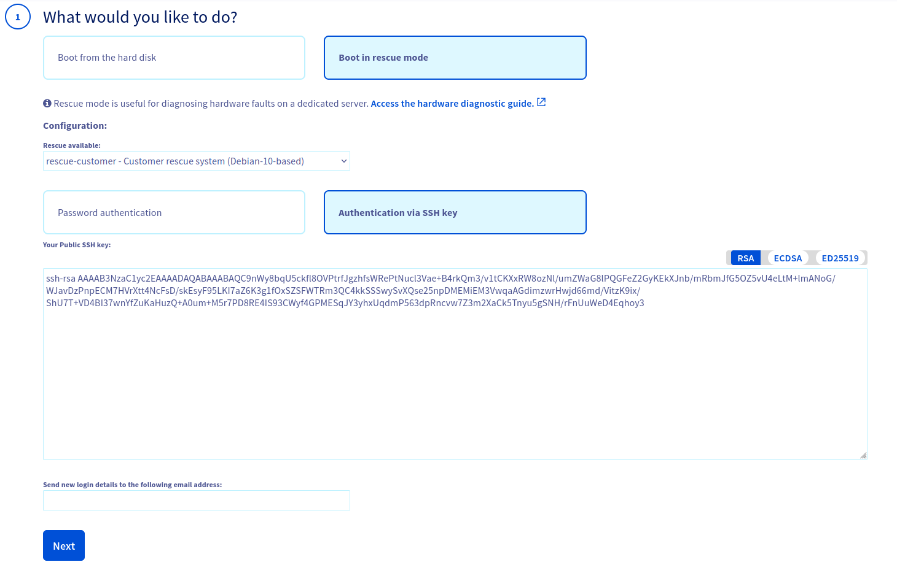
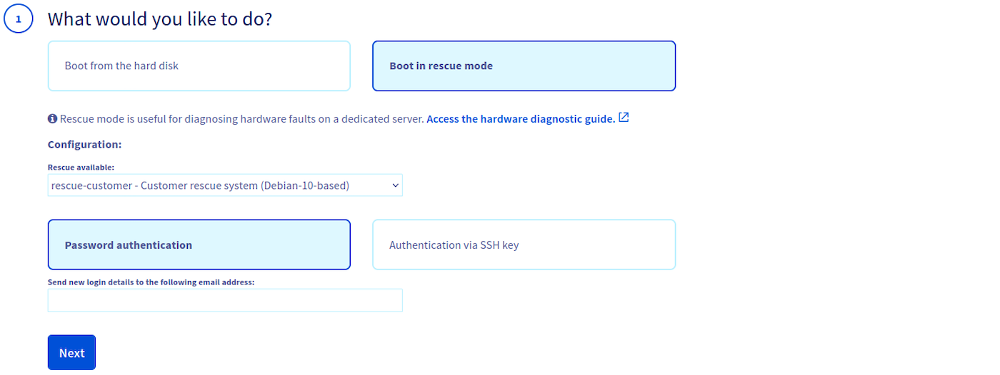
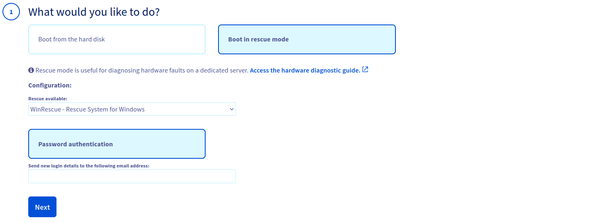
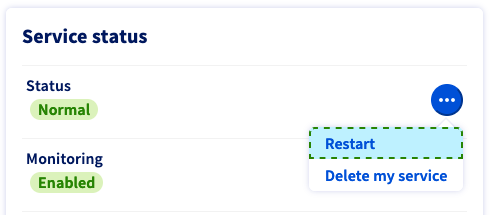
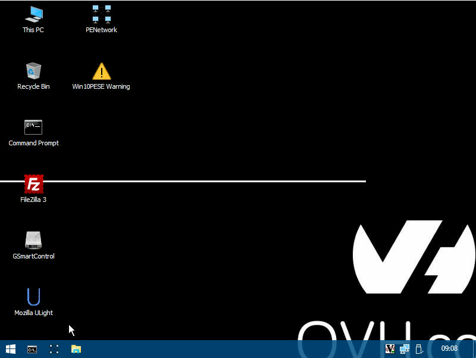

> [!primary]
> Esta traducción ha sido generada de forma automática por nuestro partner SYSTRAN. En algunos casos puede contener términos imprecisos, como en las etiquetas de los botones o los detalles técnicos. En caso de duda, le recomendamos que consulte la versión inglesa o francesa de la guía. Si quiere ayudarnos a mejorar esta traducción, por favor, utilice el botón «Contribuir» de esta página.
> 

## Objetivo

El modo de rescate es una herramienta proporcionada por OVHcloud que le permite arrancar en un sistema operativo temporal con el objetivo de diagnosticar y resolver los problemas en su servidor.

El modo de rescate suele ser adecuado para las siguientes tareas:

- [Restablecimiento de contraseña de usuario](/pages/bare_metal_cloud/dedicated_servers/replacing-user-password)
- [Diagnóstico de problemas de red](/pages/bare_metal_cloud/dedicated_servers/hardware-diagnose)
- Reparación de un sistema operativo defectuoso
- Corrección de una configuración incorrecta de un cortafuegos de software
- [Prueba del rendimiento de los discos](/pages/bare_metal_cloud/dedicated_servers/hardware-diagnose)
- [Prueba del procesador y la memoria RAM](/pages/bare_metal_cloud/dedicated_servers/hardware-diagnose)

> [!warning]
>
> Asegúrese de realizar una copia de seguridad de sus datos si aún no dispone de copias de seguridad recientes.
>
> Si tiene servicios en producción en su servidor, el modo de rescate los interrumpirá hasta que la máquina se haya reiniciado en modo normal.
>

**Esta guía explica cómo reiniciar un servidor en modo de rescate y montar particiones.**

## Requisitos

- Tener un [servidor dedicado](/links/bare-metal/bare-metal).
- Haber iniciado sesión en el [área de cliente de OVHcloud](/links/manager).

## Procedimiento

Solo es posible activar el modo de rescate desde el [área de cliente de OVHcloud](/links/manager){.external} en la sección `Bare Metal Cloud`{.action}. En la columna izquierda, haga clic en `Servidores dedicados`{.action} y seleccione el servidor.

Busque "Boot" en la zona **Información general** y haga clic en `...`{.action} y luego en `Editar`{.action}.

{.thumbnail}

En la siguiente página, seleccione **Arrancar en modo rescue**.

### Rescue Linux

Si su servidor dispone de un sistema operativo Linux, seleccione `rescue-customer`{.action} en el menú desplegable.

En esta situación, puede utilizar dos modos de autenticación:

- Autenticación con contraseña
- Autenticación con clave SSH

#### Autenticación con clave SSH

> [!primary]
>
> Si elige la autenticación con clave SSH, asegúrese de que su llave SSH pública respeta uno de los formatos entre `RSA`, `ECDSA`, o `ED25519`.
>

Seleccione la opción "Autenticación con clave SSH" e introduzca su llave SSH **pública** en el cuadro de texto dedicado.

{.thumbnail}

#### Autenticación con contraseña

Seleccione la opción "Autenticación con contraseña".<br>
Las claves de conexión se enviarán por defecto a la dirección de correo electrónico principal de su cuenta de OVHcloud. Puede introducir una dirección diferente en el campo "Recibir las claves del modo seleccionado en la siguiente dirección de correo electrónico".

{.thumbnail}

### Rescue Windows

Para los servidores con sistema operativo Windows, consulte la [guía dedicada](/pages/bare_metal_cloud/dedicated_servers/rescue-customer-windows).

La opción `WinRescue`{.action} también puede estar disponible en función de su servidor. Para más información sobre este modo, consulte la [sección de la guía a continuación](#windowsrescue). Tenga en cuenta que solo la autenticación con contraseña está disponible con este tipo de modo de rescate.

Indique una dirección de correo electrónico diferente si no desea **no** que las claves de conexión se envíen a la dirección principal de su cuenta de OVHcloud.

{.thumbnail}

### Pasos finales

Haga clic en `Siguiente`{.action} y `Aceptar`{.action}.

{.thumbnail}

Una vez que haya realizado los cambios, haga clic en `...`{.action} a la derecha de "Estado" en la zona titulada **Estado de los servicios**.
<br>Haga clic en `Reiniciar`{.action} y el servidor se reiniciará en modo de rescate. Esta operación puede tardar unos minutos.
<br>Puede comprobar el progreso en la pestaña `Tareas`{.action}. Recibirá un mensaje de correo electrónico con los identificadores (incluida la contraseña de conexión) del usuario root del modo de rescate.

{.thumbnail}

Una vez que haya finalizado las tareas en modo de rescate, no olvide redefinir el netboot en `Arrancar en el disco duro`{.action} y reiniciar el servidor.

### Linux

#### Uso del modo de rescate (SSH)

> [!primary]
> 
> Si utiliza una llave SSH (activa también en su área de cliente de OVHcloud), no recibirá ninguna contraseña. Una vez que el servidor esté en modo de rescate, podrá conectarse directamente con su llave SSH.
>

Una vez reiniciado el servidor, recibirá por correo electrónico las claves de acceso en modo de rescate. Este mensaje de correo electrónico también está disponible en el [área de cliente de OVHcloud](/links/manager). En la esquina superior derecha del área de cliente, haga clic en el nombre asociado a su identificador de cliente y seleccione `Emails de servicio`{.action}.

A continuación, acceda al servidor en línea de comandos o a través de una herramienta [SSH](/pages/bare_metal_cloud/dedicated_servers/ssh_introduction), utilizando la contraseña root generada para el modo de rescate.

Por ejemplo:

```bash
ssh root@ns3956771.ip-169-254-10.eu
root@ns3956771.ip-169-254-10.eu's password:
```


> [!warning]
>
> Es probable que el cliente SSH bloquee la conexión en un primer momento debido a la incompatibilidad de la huella digital ECDSA. Esto es normal porque el modo de rescate utiliza su propio servidor SSH temporal.
>
> Una forma de evitar este problema es «comentar» la huella digital de su servidor añadiendo un `#` delante de su línea en el archivo `known_hosts`. No olvide deshacer este cambio antes de volver a poner el netboot en modo «normal».<br>También puede eliminar la línea del archivo. El cliente SSH añadirá una nueva huella digital para el servidor cuando vuelva a conectarse. Si necesita instrucciones más detalladas, consulte nuestra guía [Introducción al SSH](/pages/bare_metal_cloud/dedicated_servers/ssh_introduction#login).
>

#### Montaje de sus particiones

A menos que configure los discos del servidor de una forma que requiera que se desvinculen (*unmounted*), primero debe montar la partición del sistema.

Para montar las particiones, utilice el comando `mount` por SSH. Previamente deberá mostrar la lista de las particiones para conocer el nombre de la partición que quiera montar. A continuación ofrecemos algunos ejemplos de código:

```bash
fdisk -l
```

```console
Disk /dev/hda 40.0 GB, 40020664320 bytes
255 heads, 63 sectors/track, 4865 cylinders
Units = cylinders of 16065 * 512 = 8225280 bytes

Device Boot Start End Blocks Id System
/dev/hda1 * 1 1305 10482381 83 Linux
/dev/hda2 1306 4800 28073587+ 83 Linux
/dev/hda3 4801 4865 522112+ 82 Linux swap / Solaris

Disk /dev/sda 8254 MB, 8254390272 bytes
16 heads, 32 sectors/track, 31488 cylinders
Units = cylinders of 512 * 512 = 262144 bytes

Device Boot Start End Blocks Id System
/dev/sda1 1 31488 8060912 c W95 FAT32 (LBA)
```

Una vez que haya identificado el nombre de la partición que quiere montar, utilice el siguiente comando:

```bash
mount /dev/hda1 /mnt/
```

> [!primary]
>
> La partición se montará. A continuación, puede realizar operaciones en el sistema de archivos.
> 
> Si el servidor dispone de una configuración RAID por software, debe montar el volumen RAID (en general `/dev/mdX`).
>

Para salir del modo de rescate, redefina el modo de arranque en `Arrancar en el disco duro`{.action} en el [área de cliente de OVHcloud](/links/manager) y reinicie el servidor en línea de comandos.

#### VMware - Montaje de un datastore

Puede montar un datastore VMware de la misma manera que se describe en el paso anterior.

Enumere sus particiones para obtener el nombre de la partición del datastore:

```bash
fdisk -l
```

Monte la partición con el siguiente comando, sustituyendo `sdbX` por el valor identificado en el paso anterior:

```bash
vmfs-fuse /dev/sdbX /mnt
```

Si tiene datastores `VMFS 6`, vaya a la carpeta `sbin` y cree la carpeta de montaje:

```bash
cd /usr/local/sbin/
mkdir /mnt/datastore
```

Enumere sus particiones para obtener el nombre de la partición del datastore:

```bash
fdisk -l
```

Monte la partición con el siguiente comando, sustituyendo `sdbX` por el valor identificado en el paso anterior:

```bash
vmfs6-fuse /dev/sdbX /mnt/datastore/
```

Para salir del modo de rescate, redefina el modo de arranque en `Arrancar en el disco duro`{.action} en el [área de cliente de OVHcloud](/links/manager) y reinicie el servidor en línea de comandos.

### Windows <a name="windowsrescue"></a>

Para los servidores con sistema operativo Windows, consulte la [guía dedicada](/pages/bare_metal_cloud/dedicated_servers/rescue-customer-windows).

#### Uso de herramientas WinRescue (obsoleto)

Una vez reiniciado el servidor, recibirá por correo electrónico las claves de acceso en modo de rescate. Este mensaje de correo electrónico también está disponible en el [área de cliente de OVHcloud](/links/manager). En la esquina superior derecha del área de cliente, haga clic en el nombre asociado a su identificador de cliente y seleccione `Emails de servicio`{.action}.

Para utilizar el modo de rescate que ofrece Windows, es necesario descargar e instalar una consola VNC o utilizar el módulo `IPMI` en el [área de cliente de OVHcloud](/links/manager){.external}.

{.thumbnail}

Las siguientes herramientas ya están instaladas en este modo:

|Herramienta|Descripción|
|---|---|
|Mozilla ULight|Un navegador web.|
|Memory Diagnostics Tool|Una herramienta Windows que permite probar la memoria RAM.|
|Explorer_Q-Dir|Un explorador de archivos.|
|GSmartControl|Una herramienta de verificación de discos duros y discos duros SSD.|
|PhotoRec|Una herramienta de recuperación de archivos potencialmente perdidos en un disco.|
|SilverSHielD|Un servidor SSH2 y SFTP.|
|System Recovery|Una herramienta Windows de restauración y reparación del sistema.|
|TestDisk|Potente aplicación para recuperar datos. Permite recuperar y modificar particiones corruptas, recuperar particiones eliminadas, reparar un sector de arranque o incluso reconstruir un MBR dañado.|
|FileZilla|Cliente FTP de código abierto. Soporta los protocolos SSH y SSL, y dispone de una interfaz clara e intuitiva que permite arrastrar los elementos. Puede utilizarse para transferir sus datos a un servidor FTP, como el espacio de backup FTP incluido con la mayoría de los servidores de OVHcloud.|
|7-Zip|Herramienta de compresión y archivado compatible con los siguientes formatos: ARJ, CAB, CHM, CPIO, CramFS, DEB, DMG, FAT, HFS, ISO, LZH, LZMA, MBR, MSI, NSIS, NTFS, RAR, RPM, SquashFS, UDF, VHD, WIM, XAR y Z. Con 7-Zip también podrá crear sus propios archivos en los siguientes formatos: BZIP2, GZIP, TAR, WIM, XZ, Z y ZIP.|

## Más información

[Cambiar la contraseña de administrador en un servidor dedicado Windows](/pages/bare_metal_cloud/dedicated_servers/changing-admin-password-on-windows)

Interactúe con nuestra comunidad de usuarios en <https://community.ovh.com/en/>.
