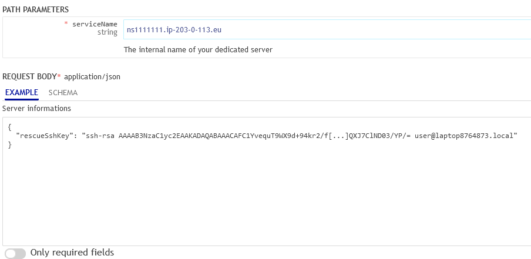

> [!primary]
> Questa traduzione è stata generata automaticamente dal nostro partner SYSTRAN. I contenuti potrebbero presentare imprecisioni, ad esempio la nomenclatura dei pulsanti o alcuni dettagli tecnici. In caso di dubbi consigliamo di fare riferimento alla versione inglese o francese della guida. Per aiutarci a migliorare questa traduzione, utilizza il pulsante "Contribuisci" di questa pagina.
>

## Obiettivo

La modalità Rescue è una funzione che permette di avviare il tuo servizio su un sistema operativo temporaneo, per diagnosticare e risolvere problemi.

La modalità Rescue è generalmente adatta alle seguenti operazioni:

- [Reimpostare la password utente](/pages/bare_metal_cloud/dedicated_servers/replacing-user-password)
- [Diagnostica dei problemi di rete](/pages/bare_metal_cloud/dedicated_servers/hardware-diagnose)
- Riparazione di un sistema operativo difettoso
- Correzione di una configurazione errata di un firewall software
- [Test delle prestazioni dei dischi](/pages/bare_metal_cloud/dedicated_servers/hardware-diagnose)
- [Test del processore e della memoria RAM](/pages/bare_metal_cloud/dedicated_servers/hardware-diagnose)

> [!warning]
>
> Assicurati di eseguire un backup dei tuoi dati se ancora non ne hai.
>
> Se sul server sono presenti servizi in produzione, la modalità Rescue li interrompe fino al riavvio della macchina in modalità normale.
>

**Questa guida ti mostra come riavviare un server in modalità Rescue e montare le partizioni.**

## Prerequisiti

- Disporre di un [server dedicato OVHcloud](/links/bare-metal/bare-metal)
- Avere accesso allo [Spazio Cliente OVHcloud](/links/manager)

## Procedura

La modalità Rescue può essere attivata solo dallo [Spazio Cliente OVHcloud](/links/manager){.external}. Seleziona il tuo server nella sezione `Bare Metal Cloud`{.action} e poi `Server dedicati`{.action}.

Cerca "Boot" nel riquadro **Informazioni generali** e clicca su `...`{.action} poi su `Modifica`{.action}.

{.thumbnail}

Nella pagina successiva, seleziona **Avviare in Rescue mode**.

### Rescue Linux

Se il tuo server utilizza un sistema operativo Linux, seleziona `rescue-customer`{.action} nel menu a tendina.

In questa situazione, vengono proposte due modalità di autenticazione:

- Autenticazione tramite password
- Autenticazione tramite chiave SSH

#### Autenticazione tramite chiave SSH

> [!primary]
>
> Se scegli l’autenticazione tramite chiave SSH, verifica che la tua chiave SSH pubblica rispetti uno dei formati tra `RSA`, `ECDSA`, o `ED25519`.
>

Seleziona l’opzione "Autenticazione tramite chiave SSH" e inserisci la chiave SSH **pubblica* nella casella di testo dedicata.

{.thumbnail}

> [!primary]
> 
> È possibile aggiungere una chiave SSH di default per la modalità Rescue di un server tramite l’API OVHcloud. Per maggiori informazioni, consulta [questa parte di questa guida](#rescuessh).
>

#### Autenticazione tramite password

Seleziona l’opzione "Autenticazione tramite password".<br>
Le credenziali di accesso verranno inviate di default all’indirizzo email principale associato all’account OVHcloud. È possibile inserire un indirizzo differente nel campo `Ricevi le credenziali della modalità selezionata all'indirizzo email`.

{.thumbnail}

### Rescue Windows

Per i server che dispongono di un sistema operativo Windows, consulta la [guida dedicata](/pages/bare_metal_cloud/dedicated_servers/rescue-customer-windows).

L’opzione `WinRescue`{.action} può essere proposta anche in base al server. Per maggiori informazioni su questa modalità, consulta la [sezione della guida qui di seguito](#windowsrescue)). Ti ricordiamo che con questa modalità rescue è disponibile solo l’autenticazione tramite password.

Se non si desidera **** che le credenziali di accesso vengano inviate all'indirizzo principale del proprio account OVHcloud, specificare un altro indirizzo email.

{.thumbnail}

### Fasi finali

Clicca su `Continua`{.action} per procedere al passo successivo, poi su `Conferma`{.action}.

{.thumbnail}

Una volta terminata la modifica, clicca sui tre puntini `...`{.action} in corrispondenza della voce "Stato" nella sezione intitolata **Stato dei servizi**.
<br>Clicca su `Riavvia`{.action} e il server riavvia in modalità Rescue. Questa operazione potrebbe richiedere alcuni minuti.
<br>Per verificare lo stato di avanzamento, clicca sulla scheda `Operazioni`{.action}. Riceverai un'email con le credenziali (inclusa la password di accesso) dell'utente "root" della modalità Rescue.

{.thumbnail}

Una volta terminate le operazioni in modalità Rescue, ricordate di ridefinire il netboot su `Avviare da hard disk`{.action} e riavviare il server.

### Linux

#### Utilizzo della modalità Rescue (SSH)

> [!primary]
>
> Se utilizzi una chiave SSH (attiva anche nello Spazio Cliente OVHcloud), non riceverai alcuna password. Una volta che il server è in modalità Rescue, potrai accedere direttamente alla tua chiave SSH.
>

Dopo il riavvio del server, riceverai un'email con le credenziali di accesso in modalità Rescue. Questa email è disponibile anche nello [Spazio Cliente OVHcloud](/links/manager). Clicca sul nome associato al tuo identificativo cliente nell'angolo in alto a destra del tuo Spazio Cliente e poi su `Email di servizio`{.action}.

A questo punto dovrai accedere al tuo server da riga di comando o tramite un tool [SSH](/pages/bare_metal_cloud/dedicated_servers/ssh_introduction), utilizzando la password di root generata per la modalità Rescue.

ad esempio:

```bash
ssh root@ns3956771.ip-169-254-10.eu
root@ns3956771.ip-169-254-10.eu's password:
```

> [!warning]
>
> Il tuo client SSH bloccherà probabilmente la connessione in un primo momento a causa di un'incompatibilità dell'impronta ECDSA. Questo è normale perché la modalità Rescue utilizza il proprio server SSH temporaneo.
>
> Un modo per ovviare a questo problema è "commentare" l’impronta del tuo server aggiungendo un `#` davanti alla sua riga nel file `known_hosts`. Ricordarsi di annullare la modifica prima di ripristinare il netboot in modalità "normale".<br>È inoltre possibile eliminare la riga dal file. Una volta stabilita nuovamente la connessione, il client SSH aggiungerà una nuova voce per il server. Per maggiori informazioni, consulta la nostra guida "[Introduzione a SSH](/pages/bare_metal_cloud/dedicated_servers/ssh_introduction#login)".
>

#### Montaggio delle partizioni

A meno che non si configurino i dischi del server in modo che debbano essere scollegati (*unmounted*), è necessario innanzitutto montare la partizione di sistema.

Il mount delle partizioni viene realizzato con il comando `mount` in SSH. Dovrai prima listare le tue partizioni al fine di poter recuperare il nome di quella che vorrai montare. Puoi fare riferimento ai seguenti esempi di codice:

```bash
fdisk -l
```

```console
Disk /dev/hda 40.0 GB, 40020664320 bytes
255 heads, 63 sectors/track, 4865 cylinders
Units = cylinders of 16065 * 512 = 8225280 bytes

Device Boot Start End Blocks Id System
/dev/hda1 * 1 1305 10482381 83 Linux
/dev/hda2 1306 4800 28073587+ 83 Linux
/dev/hda3 4801 4865 522112+ 82 Linux swap / Solaris

Disk /dev/sda 8254 MB, 8254390272 bytes
16 heads, 32 sectors/track, 31488 cylinders
Units = cylinders of 512 * 512 = 262144 bytes

Device Boot Start End Blocks Id System
/dev/sda1 1 31488 8060912 c W95 FAT32 (LBA)
```

Una volta identificato il nome della partizione da montare, esegui il comando:

```bash
mount /dev/hda1 /mnt/
```

> [!primary]
>
> La tua partizione verrà ora montata. A questo punto puoi effettuare operazioni sul file system.
>
> Se il tuo server dispone di una configurazione RAID software, devi montare il tuo volume RAID (in generale `/dev/mdX`).
>

Per uscire dalla modalità Rescue, ridefinisci la modalità di avvio su `Avviare da hard disk`{.action} nello [Spazio Cliente OVHcloud](/links/manager) e riavvia il server da riga di comando.

#### VMware - Installazione di un datastore

È possibile creare un datastore VMware nello stesso modo descritto nello step precedente.

Per recuperare il nome della partizione del datastore, è sufficiente elencare le proprie partizioni:

```bash
fdisk -l
```

Monta la partizione con questo comando, sostituendo `sdbX` con il valore identificato nel passaggio precedente:


```bash
vmfs-fuse /dev/sdbX /mnt
```

Se disponete di datastore `VMFS 6`, passate alla cartella `sbin` e create la cartella di mount:

```bash
cd /usr/local/sbin/
mkdir /mnt/datastore
```

Per recuperare il nome della partizione del datastore, è sufficiente elencare le proprie partizioni:

```bash
fdisk -l
```

Monta la partizione con questo comando, sostituendo `sdbX` con il valore identificato nel passaggio precedente:

```bash
vmfs6-fuse /dev/sdbX /mnt/datastore/
```

Per uscire dalla modalità Rescue, ridefinisci la modalità di avvio su `Avviare da hard disk`{.action} nello [Spazio Cliente OVHcloud](/links/manager) e riavvia il server da riga di comando.

### Windows <a name="windowsrescue"></a>

Per i server che dispongono di un sistema operativo Windows, consulta la [guida dedicata](/pages/bare_metal_cloud/dedicated_servers/rescue-customer-windows).

#### Utilizzo degli strumenti WinRescue (obsoleti)

Dopo il riavvio del server, riceverai un'email con le credenziali di accesso in modalità Rescue. Questa email è disponibile anche nello [Spazio Cliente OVHcloud](/links/manager). Clicca sul nome associato al tuo identificativo cliente nell'angolo in alto a destra del tuo Spazio Cliente e poi su `Email di servizio`{.action}.

Per utilizzare la modalità Rescue offerta da Windows, scarica e installa una console VNC o utilizza il modulo `IPMI` nel tuo [Spazio Cliente OVHcloud](/links/manager){.external}.

{.thumbnail}

Questi strumenti sono già installati in questa modalità:

|Strumento|Descrizione|
|---|---|
|Mozilla ULight|Un browser Web.|
|Memory Diagnostics Tool|Utilizza Windows per testare la memoria RAM.|
|Explorer_Q-Dir|Un provider di file.|
|GSmartControl|Uno strumento di verifica degli hard disk e degli hard disk SSD.|
|PhotoRec|Un tool di recupero di file potenzialmente persi su un disco.|
|SilverSHielD|Un server SSH2 e SFTP.|
|System Recovery|Un tool Windows di ripristino e riparazione del sistema.|
|TestDisk|Software di recupero dati. Ti permette di recuperare e modificare partizioni corrotte, ritrovare partizioni scomparse, riparare un settore di boot e ricostruire un MBR difettoso.|
|FileZilla|Un client FTP open source. Prende in carico i protocolli SSH e SSL e dispone di un’interfaccia <i>Drag and Drop</i> (trascina e rilascia) chiara e intuitiva.  Può essere utilizzato per trasferire i tuoi dati verso un server FTP, come il backup FTP fornito con la maggior parte dei modelli di server OVHcloud.|
|7-ZIP|Software per la compressione e archiviazione di file e cartelle, che legge questi formati: ARJ, CAB, CHM, CPIO, CramFS, DEB, DMG, FAT, HFS, ISO, LZH, LZMA, MBR, MSI, NSIS, NTFS, RAR, RPM, SquashFS, UDF, VHD, WIM, XAR e Z. Con 7-ZIP è inoltre possibile creare archivi nei formati: BZIP2, GZIP, TAR, WIM, XZ, Z e ZIP.|

<a name="rescuessh"></a>

### Come aggiungere una chiave SSH di default per la modalità Rescue

Per accelerare il processo, è possibile aggiungere una chiave SSH di default per la modalità Rescue del server tramite l’[API OVHcloud](/pages/manage_and_operate/api/first-steps).

A tale scopo, nella console Web API aprire il seguente endpoint API:

> [!api]
>
> @api {v1} /dedicated/server PUT /dedicated/server/{serviceName}
>

Inserisci il nome interno del tuo server nel campo corrispondente.

Modificare quindi il campo di testo seguente:

```bash
{
  "rescueSshKey": "string"
}
```

Sostituisci `string` con la tua chiave pubblica SSH.

Il risultato deve essere simile a quanto indicato nell'esempio seguente:

{.thumbnail}

Una volta inseriti i valori corretti, clicca sul pulsante `TRY`{.action}.

Il campo chiave SSH verrà riempito automaticamente con questa stringa di chiave quando si cambia modalità Netboot.

## Per saperne di più

[Modifica la password amministratore su un server dedicato Windows](/pages/bare_metal_cloud/dedicated_servers/changing-admin-password-on-windows)

Contatta la nostra Community di utenti all’indirizzo <https://community.ovh.com/en/>.
