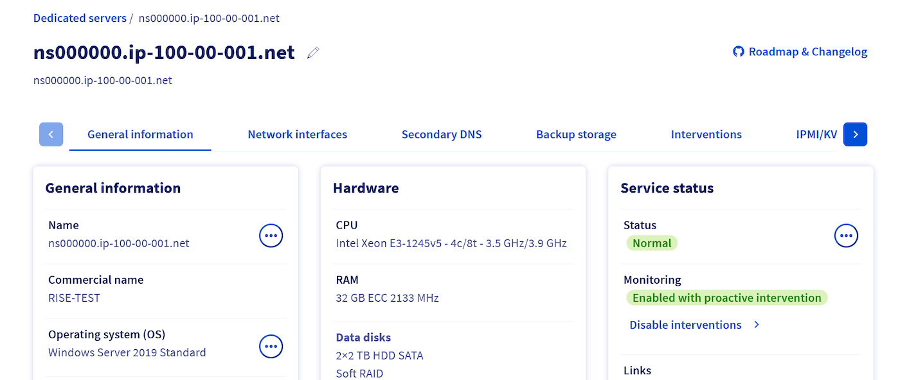
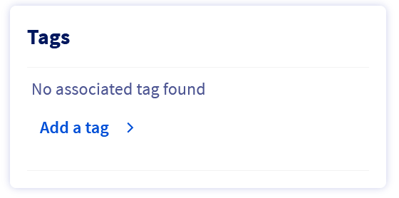
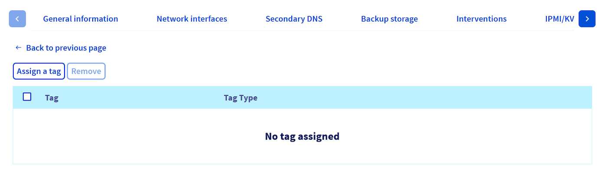
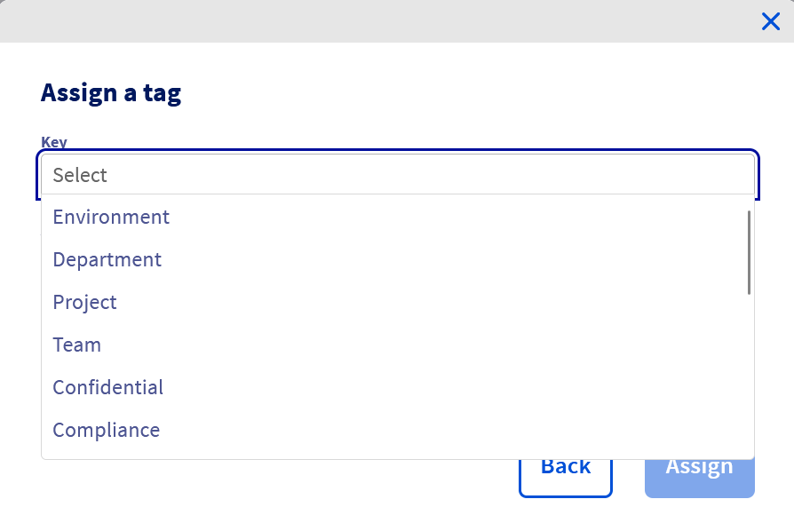
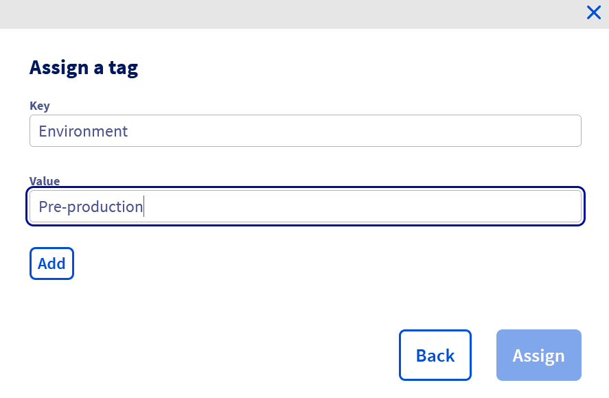
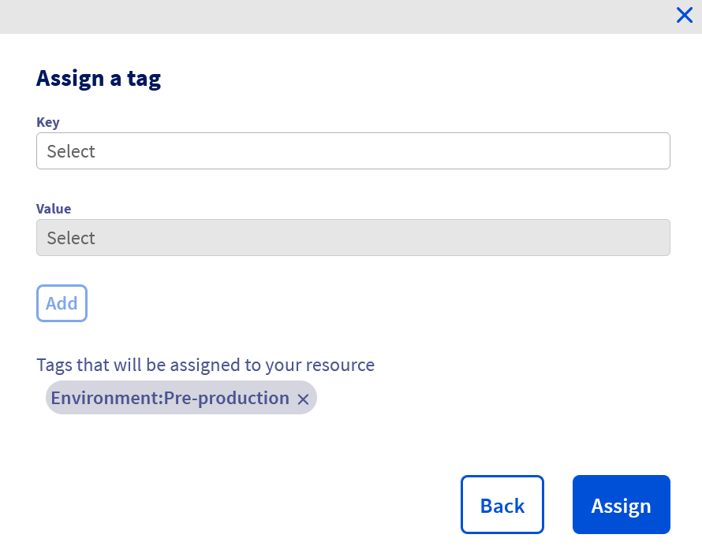
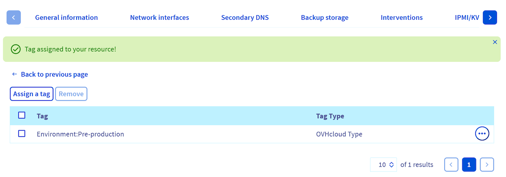
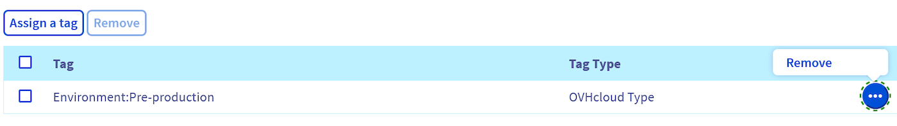
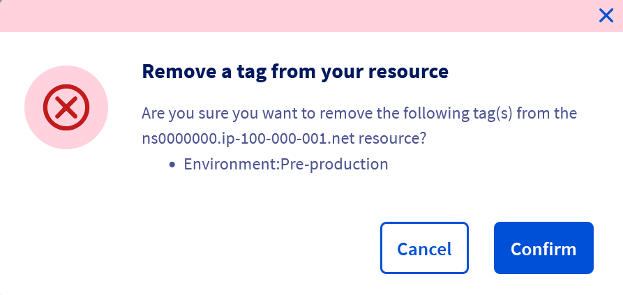

## Objective

Tags are labels that can be attributed to your resources, allowing you to organize and manage them more efficiently.

Each tag consists of two parts:

- **Key**: Represents an attribute or category.
- **Value**: Corresponds to the information associated with that key.

For example, you can categorize your resources by site, service, or even security level. Using tags can make it easier to search, organize your resources, manage associated costs, and apply policies with the desired granularity.

**This guide explains how to create, assign and delete tags for each dedicated server from the OVHcloud Control Panel.**

## Requirements

- A [dedicated server](/links/bare-metal/bare-metal) in your OVHcloud account.

<!-- CP-NAV-START:baremetal-dedicated-servers -->
---

### OVHcloud Control Panel Access

- **Direct link:** [Dedicated Servers](/links/control-panel/baremetal-dedicated-servers)
- **Navigation path:** `Bare Metal Cloud`{.action} > `Dedicated servers`{.action} > Select your server

---
<!-- CP-NAV-END:baremetal-dedicated-servers -->

## Instructions

### Assign a tag to a dedicated server via the OVHcloud Control Panel

<!-- CP-STEPS-START:assign-tag -->

{.thumbnail}

In the **Tags** box, click `Add a tag`{.action}.

{.thumbnail}

You are automatically pointed to the `Tags` tab.

Click the `Assign a tag`{.action} button.

{.thumbnail}

In the window that pops up, click in the `Key`{.action} field to open the dropdown menu, then select the key you want.

{.thumbnail}

Next, click in the `Value`{.action} field and select the appropriate value from the dropdown menu.

{.thumbnail}

> [!warning]
>
> **If you want to use a key or value that does not yet exist**, you can create it by entering it, then clicking `Add your-value`{.action}, where "your-value" corresponds to the text you have entered.
>

Finally, click the `Add`{.action} button to create the tag, then click the `Assign`{.action} button in the lower right-hand part of the window.

{.thumbnail}

You will receive a green confirmation message, then see the list of tags applied to the chosen server.

{.thumbnail}
<!-- CP-STEPS-END:assign-tag -->

### Delete a tag on a dedicated server

<!-- CP-STEPS-START:delete-tag -->
To find the list of tags assigned to your server:

1. Log in to your [OVHcloud Control Panel](/links/manager).
1. Go to the `Bare Metal Cloud`{.action} section.
1. Click `Dedicated servers`{.action} and select your server from the list.
1. Go to the `Tags`{.action} tab.

Click the `...`{.action} button, to the right of the tag you want to remove from your server.
Then click `Remove`{.action}.

{.thumbnail}

A confirmation window will appear. Click the `Confirm`{.action} button to unassign the tag.

{.thumbnail}
<!-- CP-STEPS-END:delete-tag -->

## Go further

[How to get started with a Dedicated Server](/pages/bare_metal_cloud/dedicated_servers/getting-started-with-dedicated-server)

[OVHcloud Monitoring IP Addresses for Dedicated Servers](/pages/bare_metal_cloud/dedicated_servers/network_ip_monitoring)

Join our [community of users](/links/community).