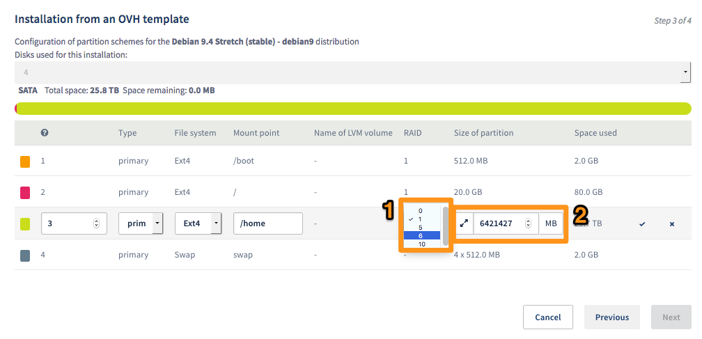

**Ultimo aggiornamento: 12/09/2018**

## Introduzione 

I dati digitali sono informazioni sensibili: la loro perdita o compromissione potrebbe avere impatto sulla tua attività. Dato che la totale eliminazione di questi rischi non esiste, è consigliabile realizzare una copia dei propri dati almeno una volta al giorno e preferibilmente su server o soluzioni di storage diversi dalle infrastrutture di produzione.

OVHcloud offre una [gamma di server dedicati](https://www.ovhcloud.com/it/bare-metal/storage/){.external} appositamente sviluppata per operazioni di archiviazione. Queste macchine sono dotate di un minimo di 4 hard disk, che possono essere utilizzati per il backup di infrastrutture ospitate in OVHcloud o presso altri provider tramite la rete pubblica.

<b>Questa guida ti mostra come configurare un server di storage OVHcloud per rispondere alle tue esigenze, creare cartelle in cui salvare le copie eseguite e automatizzare i backup dei dati di due server remoti tramite protocollo SCP.</b>


## Prerequisiti

### Conoscenze necessarie

- Nozioni di gestione di Linux
- Effettuare l’accesso in SSH  
- Connettersi a un database 
- Effettuare il backup di un database
- Installare una distribuzione (in questa guida utilizzeremo Debian 9.4)

### Hardware e software necessari

- Un [server di storage OVHcloud](https://www.ovhcloud.com/it/bare-metal/storage/){.external}
- Un’infrastruttura di produzione ([VPS](https://www.ovhcloud.com/it/vps/){.external}, [server dedicati](https://www.ovhcloud.com/it/bare-metal/){.external}, [Public Cloud](https://www.ovhcloud.com/it/public-cloud/){.external}...)
- Una connessione SSH configurata tra il server di storage e l’infrastruttura di produzione
- Una rete privata [vRack](https://www.ovh.it/soluzioni/vrack/){.external} tra i tuoi server (consigliato)


## Procedura

### Step 1: scegli il livello di RAID più appropriato

I [server di storage OVHcloud](https://www.ovhcloud.com/it/bare-metal/storage/){.external} dispongono di configurazioni hardware con diversi hard disk. In questa guida, utilizzeremo un server con RAID software (o _softRAID_) di quattro dischi da 6 TB ciascuno.

Per configurare lo storage dei dati, OVHcloud propone i livelli di RAID 0, 1, 5, 6 e 10, ognuno dei quali presenta vantaggi e inconvenienti in termini di prestazioni e resilienza. Con quattro dischi, per salvare i nostri dati nel modo più efficace, possiamo scegliere tra RAID 5, 6 o 10 (in questo caso, il RAID 0 e 1 non sono adeguati).

Ecco alcune informazioni su questi livelli di RAID.

#### RAID 5

Il sistema RAID 5 distribuisce uniformemente i dati su un minimo di tre dischi e ne utilizza un quarto per ricostruire gli altri in caso di malfunzionamenti, salvandovi informazioni di parità. Questa configurazione presenta quindi una fault tolerance di un disco. Le prestazioni sono abbastanza elevate in lettura ma lente in scrittura (a causa dei bit di parità).

Nel nostro caso, la capacità del volume è di 18 TB.

#### RAID 6

Il sistema RAID 6 è una versione migliorata del RAID 5 che utilizza un minimo di quattro dischi. Le informazioni di parità vengono scritte su due dischi invece che in uno solo, assicurando maggiore ridondanza (fault tolerance di due dischi). Le prestazioni sono migliorate sia in lettura che in scrittura.

Nel nostro caso, la capacità del volume è di 12 TB.

#### RAID 10

Il sistema RAID 10 è la combinazione di due processi: il primo consiste nel “dividere” i dati e salvarli sui due dischi, raggiungendo performance elevate in quanto entrambi i dischi possono funzionare simultaneamente; il secondo consiste invece nel duplicare i dati sui due dischi in modalità “mirror”, ottenendo la fault tolerance di due dischi su uno stesso cluster.

Nel nostro caso, la capacità del volume è di 12 TB.

Non esiste un sistema RAID migliore di un altro: ognuno risponde a necessità differenti. Nell’esempio proposto in questa guida, vogliamo ottenere la massima tolleranza ai guasti sui dischi mantenendo prestazioni elevate sia in lettura che in scrittura: proseguiamo quindi installando il RAID 6.


### Step 2: installa e configura il server

Accedi allo [Spazio Cliente OVHcloud](https://www.ovh.com/auth/?action=gotomanager&from=https://www.ovh.it/&ovhSubsidiary=it){.external} e installa il tuo server (come già detto nella parte iniziale di questa guida, utilizzeremo Debian 9.4). Per maggiori informazioni, consulta la nostra guida [Iniziare a utilizzare un server dedicato](/pages/bare_metal_cloud/dedicated_servers/getting-started-with-dedicated-server#installa-o-reinstalla-il-tuo-server-dedicato){.external}.

Una volta selezionato il sistema operativo, spunta la casella `Personalizza la configurazione delle partizioni`{.action} e clicca su `Seguente`{.action}.

{.thumbnail}

Nella nuova finestra, è possibile modificare il tipo di RAID dalla tua `/home` (1) ed eventualmente estendere la partizione (2).

{.thumbnail}

> [!primary]
> 
> Il livello di RAID della partizione `/boot` non può essere modificato.
> 

### Step 3: crea le cartelle di destinazione

Per archiviare i backup in maniera chiara, è consigliabile creare directory di destinazione. Accedi al tuo server dedicato in SSH e visualizza i dati relativi alla tua partizione:

```sh
df -h

Filesystem      Size    Used Avail Use% Mounted on
udev            7,8G       0  7,8G   0% /dev
tmpfs           1,6G     51M  1,6G   4% /run
/dev/md3         20G    740M   18G   4% /
tmpfs           7,9G       0  7,9G   0% /dev/shm
tmpfs           5,0M       0  5,0M   0% /run/lock
tmpfs           7,9G       0  7,9G   0% /sys/fs/cgroup
/dev/md2        487M     32M  426M   7% /boot
/dev/sda1       510M    152K  510M   1% /boot/efi
/dev/md4         11T     31M   11T   1% /home
```

Definisci le tue cartelle utilizzando il comando `mkdir`. Nel nostro esempio il server riceverà i backup dei due server Web in produzione. Creiamo quindi due cartelle: *server 1* e *server2*. Ognuna conterrà una sottocartella *dump* per i backup SQL e una sottocartella *data* per i dati Web.

Per visualizzare la gerarchia delle cartelle, esegui il comando `tree`, che restituirà un risultato di questo tipo:

```sh
tree
.
└── backups
    ├── server1
    │   ├── datas
    │   └── dump
    └── server2
        ├── datas
        └── dump

7 directories, 0 files
```

### Step 4: trasferisci i dati dei server remoti verso il server di storage

A questo punto, il server di storage è pronto per ricevere i backup.

> [!primary]
> 
> Se le tue infrastrutture di produzione sono ospitate in OVHcloud e dispongono della nostra rete privata vRack, puoi configurarle in modo che i tuoi dati non passino per la rete pubblica (Internet).
>

Per effettuare questa operazione è necessario accedere in SSH ai server di produzione, che a loro volta si connetteranno al server di storage tramite il protocollo SCP. Tutte le risorse devono poter comunicare tra loro via SSH.

Per prima cosa, eseguiamo il backup del database MySQL, comunemente chiamato *dump*. Per un utilizzo avanzato, consulta la documentazione ufficiale del database in uso.

```sh
mysql --host=localhost --user=myname --password=password mydb
mysqldump --all-databases > dump.sql
```

Una volta configurato il servizio SSH, accedi ai tuoi server di produzione ed esegui il comando `scp`.

```sh
scp tuo_file_dump user@IP_Storage:/home/backups/server1/dump

The authenticity of host 'IP_Storage (IP_Storage)' can't be established.
ECDSA key fingerprint is SHA256:fmmeu5feHlnaUC56+2DB73sgNd4aMPVkS7oEtcyO2o8.
Are you sure you want to continue connecting (yes/no)? yes
Warning: Permanently added 'IP_Storage' (ECDSA) to the list of known hosts.

user@IP_Storage's password: 
```

> [!primary]
> 
> Se hai modificato la porta SSH del tuo server di storage, aggiungi l’argomento `-P`.
>

Esegui la stessa operazione per i tuoi file. Il comando `scp` permette anche di creare il backup di cartelle complete.

```sh
scp -r cartella_da_copiare user@IP_Storage:/home/backups/server1/datas/2018_01_01ome/backups/server1/datas/2018_01_01
```

Esistono anche strumenti più efficaci, ad esempio *rsync*, disponibili gratis e con funzionalità avanzate, come la ripresa di un invio non andato a buon fine.


### Step 5: realizza una pianificazione giornaliera con Cron

Accedere quotidianamente a tutti i server di cui è necessario eseguire il backup è un’operazione noiosa. Esistono strumenti molto efficienti per automatizzare le attività. Il più diffuso è *Cron*, il programma Unix che consente di pianificare l’esecuzione di comandi con frequenza oraria, giornaliera, mensile o annuale. Ciascun utente Unix dispone della propria lista di attività pianificate, il *crontab*.

Per una maggiore sicurezza, ti consigliamo di creare un utente Unix dedicato e assegnargli delle attività pianificate.

Per modificare questa lista, esegui il comando:

```sh
crontab -e
```

Aggiungi questa riga per automatizzare l’invio del tuo dump SQL, ad esempio, tutti i giorni alle 2:00 del mattino:

```sh
0 2 * * * scp tuo_file_dump user@IP_Storage:/home/backups/server1/dump >/dev/null 2>&1
```

Per maggiori informazioni relativamente alla sintassi del *crontab*, consulta uno dei siti Web specializzati disponibili in rete.


## Conclusione

In questa guida abbiamo configurato un server di storage OVHcloud in base a esigenze specifiche e creato una semplice automazione per il backup dei file in esso contenuti. È un’operazione importante per proteggere la tua attività ed evitare eventuali perdite di dati.

Come già affermato, esistono altri metodi, sia gratuiti che a pagamento. per ottimizzare i tuoi backup. Se i tuoi dati sono sensibili, ti consigliamo inoltre di cifrarli e trasmetterli soltanto utilizzando reti private come la vRack OVHcloud.