## Objective

With the IPMI (Intelligent Platform Management Interface) console, you can access your dedicated server directly, without depending on the operating system connectivity state. This guide will explain how to boot this console.

## Requirements

<!-- CP-NAV-START:baremetal-dedicated-servers -->
---

### OVHcloud Control Panel Access

- **Direct link:** [Dedicated Servers](/links/control-panel/baremetal-dedicated-servers)
- **Navigation path:** `Bare Metal Cloud`{.action} > `Dedicated servers`{.action} > Select your server

---
<!-- CP-NAV-END:baremetal-dedicated-servers -->

> [!warning]
> This feature might be unavailable or limited on servers of the [**Eco** product line](/links/bare-metal/eco-about).
>
> Please visit our [comparison page](/links/bare-metal/eco-compare) for more information.

<a name="procedure"></a>

## Instructions

You can access the IPMI using several different methods¹. SSH keys stored on the server will not be used for these connections. Here is a summary:

|Method Name|Short Name|Description|Copy-Paste|Virtual ISO reader²|Use Case Example|
|---|---|---|---|---|---|
|**KVM**³ via **web browser**|**HTML KVM**|Redirection of the video screen to an **HTML canvas**, exactly as if you were physically connecting a keyboard/mouse via USB and a screen via VGA to your dedicated server.|❌|⚠️⁴|- Troubleshoot a boot issue on your dedicated server.|
|**KVM**³ via **Java applet**|**Java KVM**|Same as HTML KVM, except that it uses **Java applet** rather than HTML canvas.|❌|✅|- Troubleshoot a boot issue on your dedicated server. <br />- Perform a manual installation of a specific OS (not in the [catalog](/links/bare-metal/os))⁵.|
|**SoL**⁶ via **web browser**|**JavaScript SoL**|Redirection of a serial connection to the web browser, exactly as if you were physically connecting a serial console via RS-232 to your dedicated server.|✅|❌|- Troubleshoot a network issue: get system logs and manipulate configuration files.|
|**SoL**⁶ via **SSH**|**SSH SoL**|Same as JavaScript SoL, except redirection is done to an SSH gateway. You then connect via your preferred SSH client to a remote SSH server that converts SSH commands to serial commands to the dedicated server.|✅|❌|- Same as JavaScript SoL but from a machine without any graphical interface.|

¹ Depending on your dedicated server hardware compatibility (some methods will not be shown in the [OVHcloud Control Panel](/links/manager)).<br />
² Feature that enables the user to mount an ISO image stored locally on your machine to your remote dedicated server, so you can install an OS via IPMI.<br />
³ KVM = Keyboard Video and Mouse<br />
⁴ Depending on your dedicated server hardware compatibility: use Java KVM instead if not compatible.<br />
⁵ If the OS you want to install is not in the list of [operating systems available with OVHcloud Bare Metal servers](/links/bare-metal/os), please note that you can also use a custom image: See [Bring Your Own Image (BYOI) / Bring Your Own Linux (BYOLinux), a comparison sheet](/pages/bare_metal_cloud/dedicated_servers/bring-your-own-image-versus-bring-your-own-linux) for more details.<br />
⁶ SoL = Serial over Lan

<!-- CP-STEPS-START:open-ipmi-kvm-tab -->
To enable one of these methods, click on the `IPMI/KVM`{.action} tab.
<!-- CP-STEPS-END:open-ipmi-kvm-tab -->

### Open KVM via Java applet <a name="applet-java"></a>

> [!primary]
> We recommend installing the latest version of Java.
>

You will need to ensure that Java is installed on your desktop for the Java applet to work. If you do not have Java installed, go to the [official page](https://www.java.com/en/download/) to do so.

<!-- CP-STEPS-START:open-kvm-java-applet -->
In the `Remote KVM`{.action} section of the OVHcloud Control Panel, click on `From a Java applet (KVM)`{.action}:

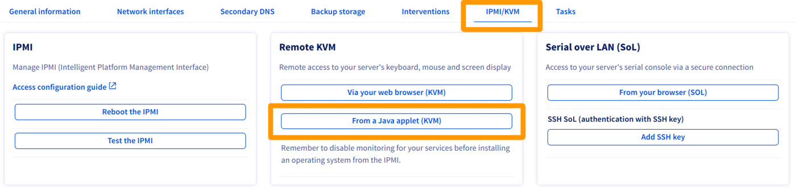{.thumbnail}
<!-- CP-STEPS-END:open-kvm-java-applet -->

Download the file `kvm.jnlp` when you are prompted to do so, and run it:

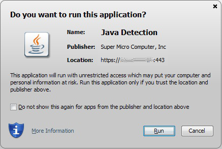{.thumbnail}

You will then land on the login page, where you will be prompted to enter your credentials, as you would need to when logging in via a terminal or external software application:

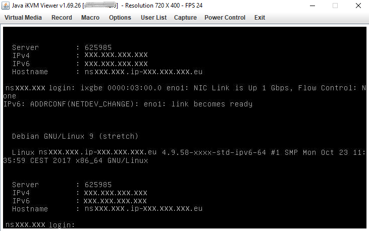{.thumbnail}

You can now manage your server.

### Open KVM via web browser <a name="kvm-browser"></a>

<!-- CP-STEPS-START:open-kvm-web-browser -->
In the `Remote KVM`{.action} section of the OVHcloud Control Panel, click on `Via your web browser (KVM)`{.action}.

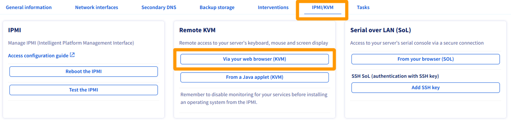{.thumbnail}

Activation takes a few seconds. You will receive a message confirming that the IPMI connection is available.

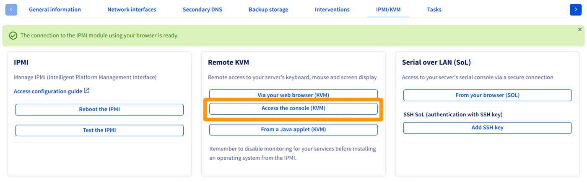{.thumbnail}

Click on `Access the console (KVM)`{.action} to open the console in your web browser.

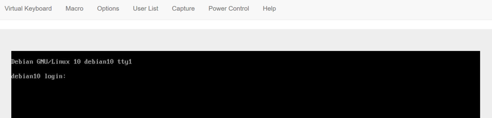{.thumbnail}
<!-- CP-STEPS-END:open-kvm-web-browser -->

### Open SoL via SSH <a name="sol-ssh"></a>

For more details about creating SSH key pairs, see [this page](/pages/bare_metal_cloud/dedicated_servers/creating-ssh-keys-dedicated#create-ssh-key).

<!-- CP-STEPS-START:open-sol-ssh -->
In the `Serial over LAN (SoL)`{.action} section of the OVHcloud Control Panel, click on `Add SSH key`{.action}.

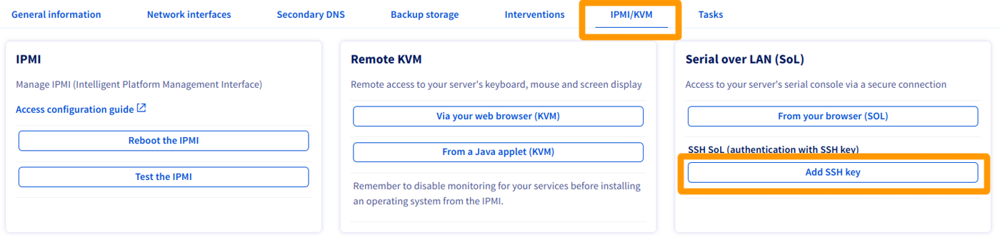{.thumbnail}

A popup will open so you can enter the public SSH key you want to use to connect with. Then click `Launch SoL session via SSH`{.action}.

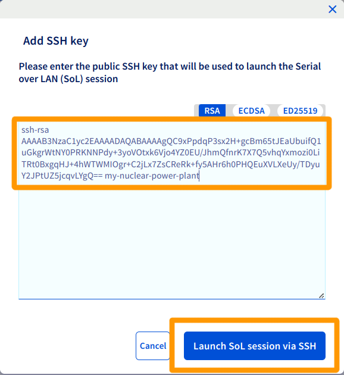{.thumbnail}

When the session is ready, a success message and an URI will appear so you can connect to the dedicated server via Serial via SSH. Copy that URI to the clipboard.

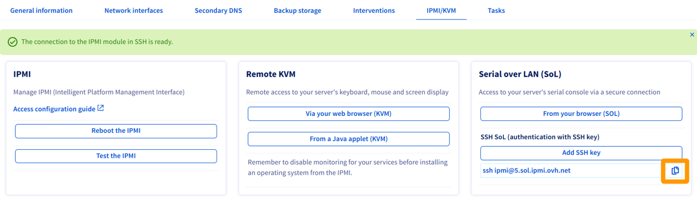{.thumbnail}
<!-- CP-STEPS-END:open-sol-ssh -->

For more details about using SSH keys to establish an SSH connection, see [this page](/pages/bare_metal_cloud/dedicated_servers/creating-ssh-keys-dedicated#multiplekeys).

### Open SoL via web browser <a name="sol-browser"></a>

<!-- CP-STEPS-START:open-sol-web-browser -->
Click on `From your browser (SoL)`{.action} in the `Serial over LAN (SoL)`{.action} section of the OVHcloud Control Panel:

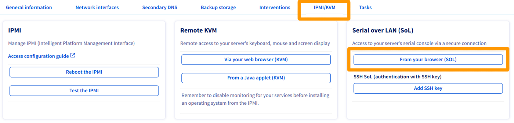{.thumbnail}

> [!primary]
>
> If the switch to the popup does not happen automatically, you can still click the `Go to console (SoL)`{.action} button.
>

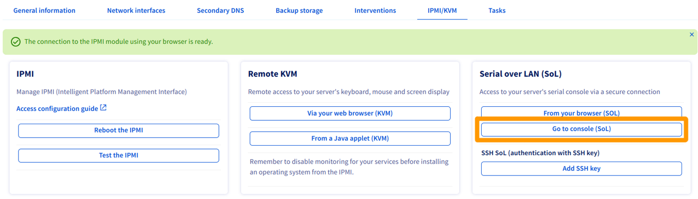{.thumbnail}
<!-- CP-STEPS-END:open-sol-web-browser -->

### Test and reboot the IPMI <a name="ipmi-test-reboot"></a>

<!-- CP-STEPS-START:test-reboot-ipmi -->
Your IPMI may stop responding. If you cannot access it, you can test it first by clicking on `Test the IPMI`{.action}, and checking the result of the diagnostic:

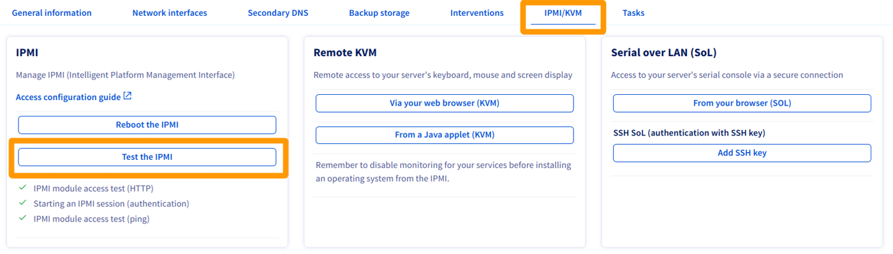{.thumbnail}

If everything appears to be normal, as per our example, you may be experiencing a local technical issue (internet connection, local desktop). If the IPMI encounters any issues, you can reboot it by clicking `Reboot the IPMI`{.action}.

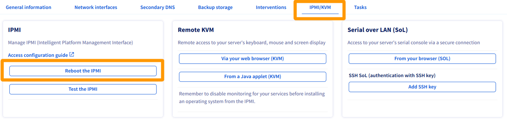{.thumbnail}

It will take several minutes for the IPMI to reboot.

> [!primary]
> This operation will not affect the applications, data and services running on your dedicated server.
>
<!-- CP-STEPS-END:test-reboot-ipmi -->

### Installing an OS using IPMI v1

> [!warning]
> OVHcloud does not guarantee the functionality of any operating systems installed via IPMI. This route should only be taken by an experienced server administrator.
>
> 64-bit versions of Java can prevent the `Redirect ISO`/`Redirect CDROM` menus from opening and cause JViewer to crash.

To begin, open [IPMI in a Java applet](#applet-java) from the [OVHcloud Control Panel](/links/manager). Then, click `Device`{.action} from the menu bar and select `Redirect ISO`{.action} from the drop-down menu.

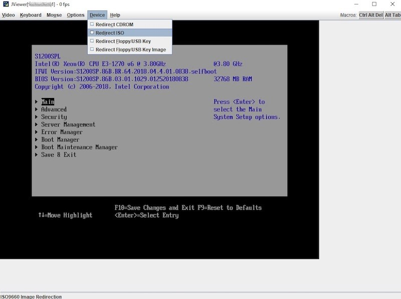{.thumbnail}

Next, select the ISO you wish to use from your local computer's file system. Once you have selected your ISO, press the `Ctrl Alt Del`{.action} button in the top-right corner of the screen to reboot the server. Press the appropriate `F` key to access the boot options.

> [!primary]
> You may need to use the soft keyboard for inputs to register in IPMI. To access this, click the `Keyboard`{.action} option from the menu bar at the top of the window. Then, select `Soft Keyboard` from the dropdown menu and click `Show`{.action}.
>

Select the **UEFI Virtual CDROM 1.00** option from the boot menu to start the server from the ISO attached previously.

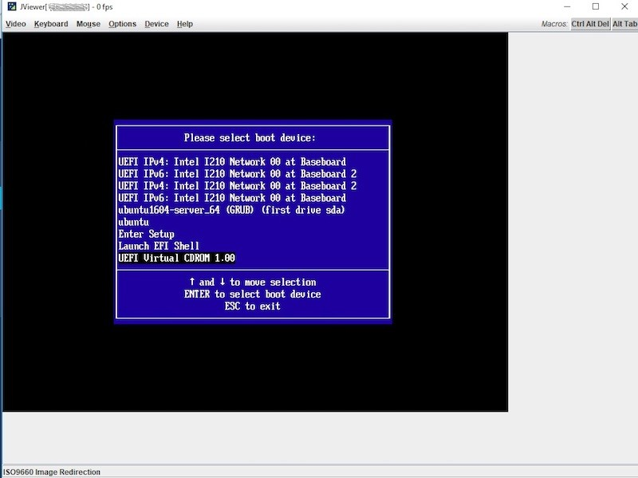{.thumbnail}

Complete the steps required to install the operating system. Do not forget to remove the ISO from the "Redirect ISO" option.

### Installing an OS using IPMI v2

> [!warning]
> OVHcloud does not guarantee the functionality of any operating systems installed via IPMI. This route should only be taken by an experienced server administrator.
>

To begin, open [IPMI in a Java applet](#applet-java) from the [OVHcloud Control Panel](/links/manager). Then, click `Virtual Media`{.action} and select `Virtual Storage`{.action}.

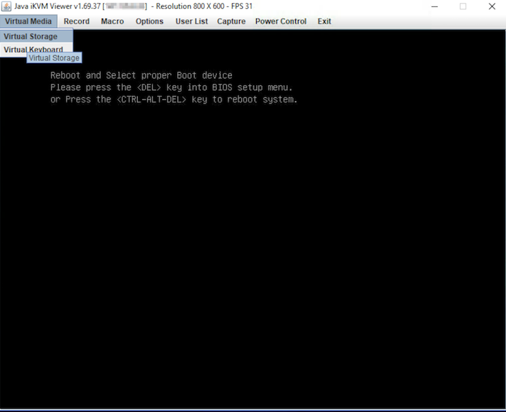{.thumbnail}

From the new screen, select `ISO File` from the "Logical Drive Type" drop-down menu. Next, click `Open Image`{.action} and navigate to your ISO file. Finally, click `Plug-in`{.action} and `OK`{.action} to finish.

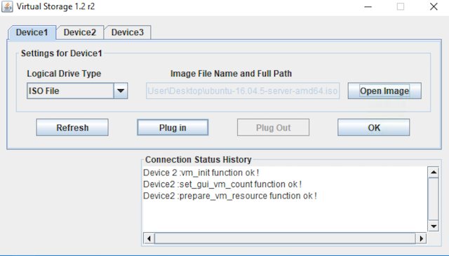{.thumbnail}

In order to be able to boot from our ISO file, we need to access the BIOS and switch our boot options. To do so, select `Power Control`{.action} and click `Set Power Reset`{.action}.

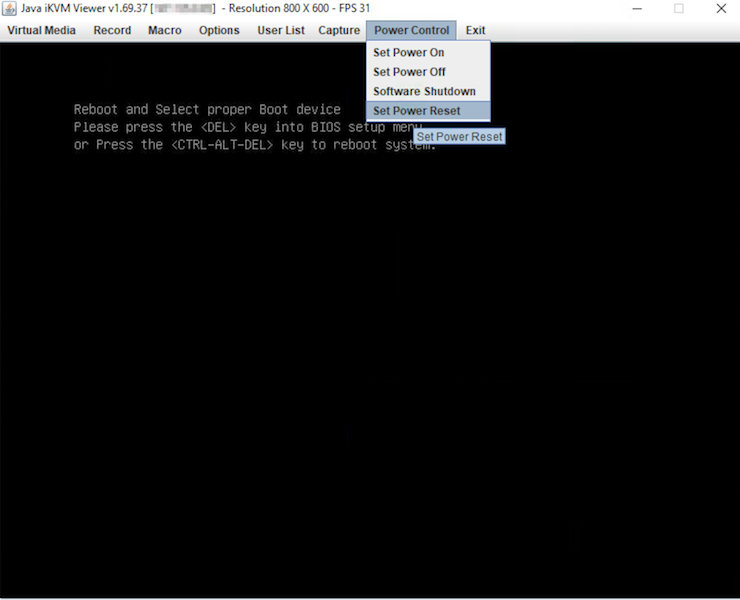{.thumbnail}

> [!primary]
>
> You may need to use the soft keyboard for inputs to register in IPMI. To access this, click the `Virtual Media`{.action} option from the menu bar at the top of the window. Then, select `Virtual Keyboard`{.action} from the drop-down menu.
>

During the bootup process, press the `DEL` key when prompted to access the BIOS. You may also press the `F11` key and navigate to the BIOS by selecting the option `Enter Setup`{.action}.

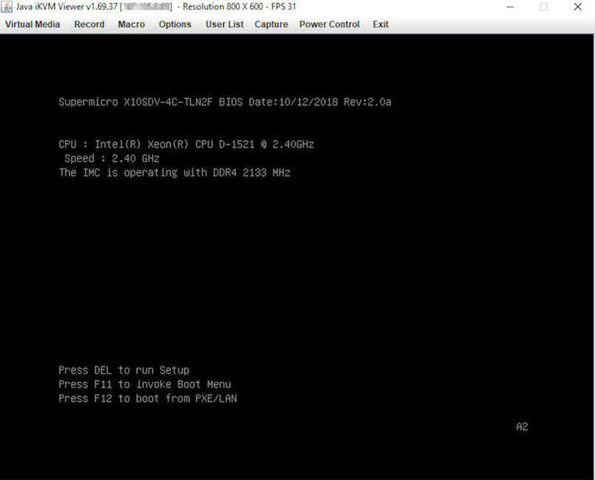{.thumbnail}

In the BIOS navigate to the `Boot`{.action} tab and change the `UEFI Boot Order #1` to `UEFI USB CD/DVD:UEFI: CDROM virtual ATEN YSOJ`.

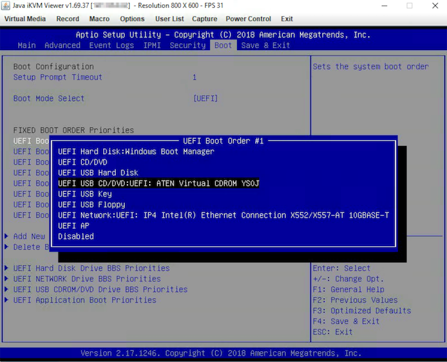{.thumbnail}

Lastly, press the `F4` key to save your changes and restart the server.

### Installing an OS using web browser KVM (only for the latest servers)

> [!warning]
> OVHcloud does not guarantee the functionality of any operating systems installed via IPMI. This route should only be taken by an experienced server administrator.
>

In the [OVHcloud Control Panel](/links/manager), open the [KVM web browser console](./#kvm-browser).

Here you have access to the same information and functionalities as in the Java-based IPMI modules.

> [!primary]
>
> Be sure to execute the next steps at a good pace. The process might be cancelled if there are longer pauses between actions.
>

Click on the `Browse File`{.action} button and select your image file.

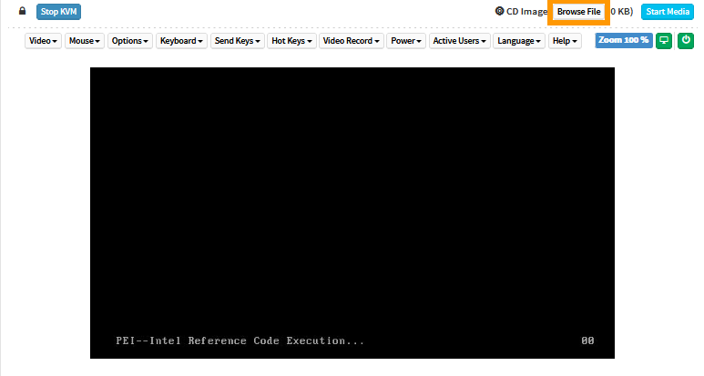{.thumbnail}

Click on `Start Media`{.action}. This will prepare the ISO for the installation process.

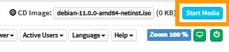{.thumbnail}

The file size displayed is not the actual size. This is normal, since the file is not fully uploaded in this step.

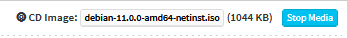{.thumbnail}

Click on `Power`{.action} and select `Reset Server`{.action} from the drop-down menu.

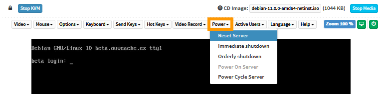{.thumbnail}

Wait for the boot selection screen to appear and press the appropriate key to enter the boot menu (`F11` in this example).

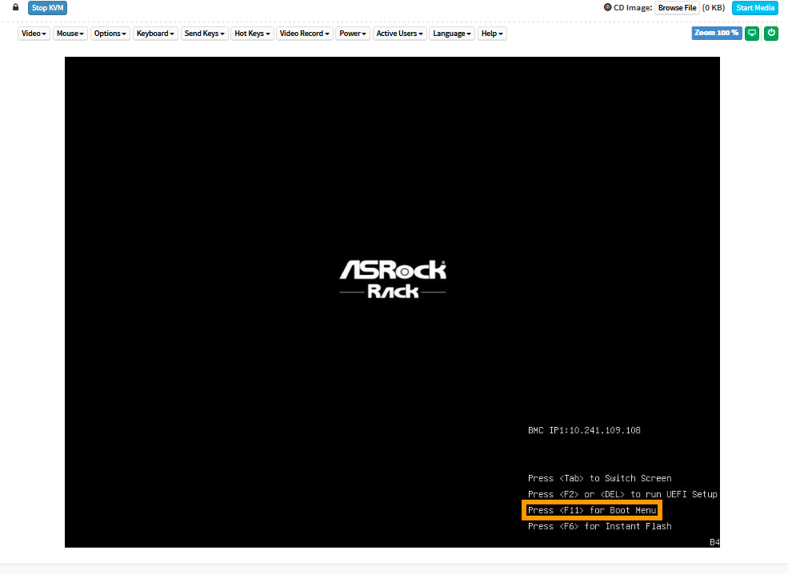{.thumbnail}

In the boot menu, select the optical drive (`UEFI: AMI Virtual CDROM0` in this example) and press `Enter`.

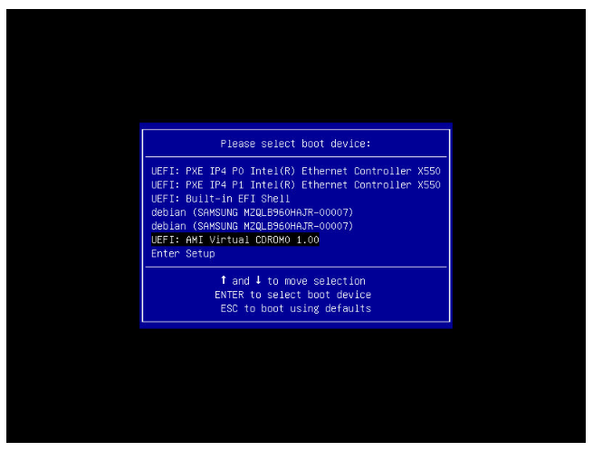{.thumbnail}

The ISO file will now be uploaded, then the server will boot from the file.

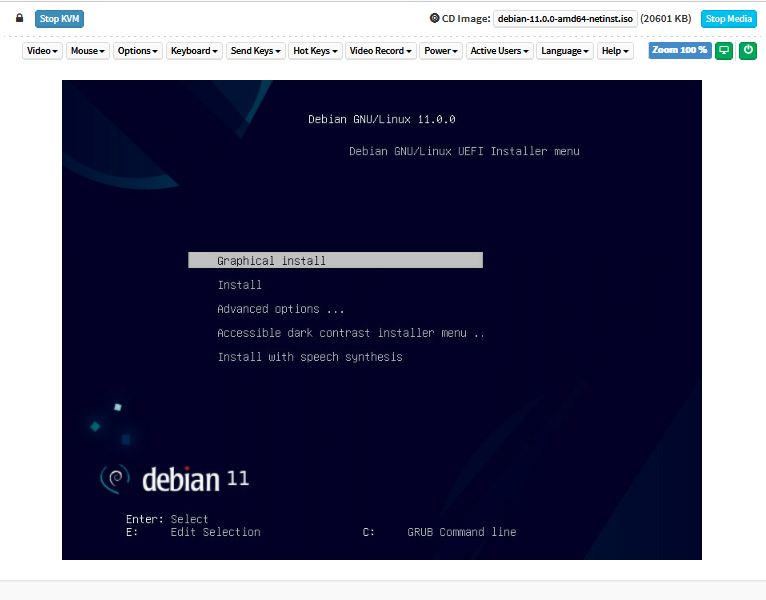{.thumbnail}

<a name="bios"></a>

### Rebooting a server into the BIOS menu

You might want to access the BIOS when configuring or troubleshooting your server. A convenient way to achieve this is by using the tool `ipmiutil` (refer to the [project page](https://ipmiutil.sourceforge.net/) for more information).

When the server is in [rescue mode](/pages/bare_metal_cloud/dedicated_servers/rescue_mode) and you have logged in, install it with the following commands:

```bash
apt install ipmiutil
```

Then reboot the server with this command:

```bash
ipmiutil reset -b
```

Afterwards, access the [IPMI console](#procedure) in your [OVHcloud Control Panel](/links/manager). You should see the server's BIOS menu displayed.

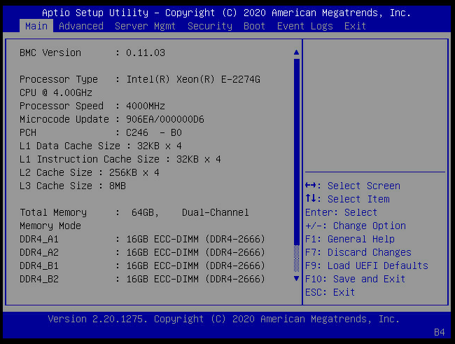{.thumbnail}

## Go further

If you need training or technical assistance to implement our solutions, contact your sales representative or click on [this link](/links/professional-services) to get a quote and ask our Professional Services experts for a custom analysis of your project.

[How to get started with a Dedicated Server](/pages/bare_metal_cloud/dedicated_servers/getting-started-with-dedicated-server)

Join our [community of users](/links/community).
