> [!primary]
> Esta traducción ha sido generada de forma automática por nuestro partner SYSTRAN. En algunos casos puede contener términos imprecisos, como en las etiquetas de los botones o los detalles técnicos. En caso de duda, le recomendamos que consulte la versión inglesa o francesa de la guía. Si quiere ayudarnos a mejorar esta traducción, por favor, utilice el botón «Contribuir» de esta página.
> 

## Objetivo

La consola IPMI (Intelligent Platform Management Interface) permite establecer una conexión directa con un servidor dedicado sin depender del estado de conectividad del sistema operativo. Esta guía explica cómo iniciar esta consola.

## Requisitos

- Haber iniciado sesión en el [área de cliente de OVHcloud](/links/manager).

> [!warning]
> Esta funcionalidad puede no estar disponible o estar limitada en los [servidores dedicados **Eco**](/links/bare-metal/eco-about).
>
> Para más información, consulte nuestra [comparativa](/links/bare-metal/eco-compare).

<a name="procedure"></a>

## Procedimiento

Existen varios métodos para conectarse a IPMI¹. Las claves SSH almacenadas en el servidor no se utilizarán para estas conexiones. A continuación ofrecemos un resumen:

|Nombre Método|Nombre alternativo|Descripción|Copiar y pegar|Unidad ISO virtual²|Ejemplos de uso|
|---|---|---|---|---|---|
|**KVM**³ a través de **navegador Web**|**KVM HTML**|Emulación de la pantalla de vídeo a través de un **canvas HTML**, igual que si conectara físicamente un teclado/ratón USB y una pantalla de vídeo en VGA a su servidor dedicado.|❌|⚠️⁴|- Diagnosticar un problema de arranque del servidor dedicado.|
|**KVM**³ a través de **applet Java**|**KVM Java**|Igual que para el KVM HTML, con la excepción de que la emulación se realiza a través de un **applet Java** en lugar del canal HTML.|❌|✅|- Diagnosticar un problema de arranque del servidor dedicado. <br />- Realizar una instalación de un SO específico (fuera de [catálogo](/links/bare-metal/os)) manualmente.
|**SoL**✓ a través de **navegador Web*|**SoL JavaScript**|Emulación de un enlace serie a través del navegador Web, igual que si conectara una consola serie físicamente en RS-232 a su servidor dedicado.|✅|❌|- Diagnosticar un problema de red: recuperar los logs y manipular los archivos de configuración.|
|**SoL**✓ a través de **SSH**|**SoL SSH**|Idéntico que para el SoL JavaScript, con la excepción de que la emulación se efectúa a través de una pasarela SSH. Se conecta con su cliente SSH favorito a un servidor remoto por SSH, que luego transpone los comandos en enlace serie al servidor dedicado.|✅|❌|- Idem SoL JavaScript pero desde una máquina que no tiene interfaz gráfica.|

¹ Según la compatibilidad de hardware de su servidor dedicado (algunos métodos no se mostrarán en el [área de cliente de OVHcloud](/links/manager)).<br />
² Función que permite montar una imagen ISO almacenada localmente en su máquina al servidor dedicado remoto, y por tanto instalar un SO a través de IPMI.<br />
³ KVM = Keyboard Video and Mouse<br />
⁴ Según la compatibilidad material de su servidor dedicado: utilizar el KVM Java en su lugar si es incompatible.<br />
⁵ Si el SO que desea instalar no está disponible en el [catálogo de sistemas operativos disponibles en los servidores dedicados OVHcloud](/links/bare-metal/os), tenga en cuenta que también puede utilizar una imagen personalizada: ver [Comparación entre Bring Your Own Image (BYOI) y Bring Your Own Linux (BYOLinux)](/pages/bare_metal_cloud/dedicated_servers/bring-your-own-image-versus-bring-your-own-linux) para más detalles<br />
⁶ SoL = Serial over Lan

Para activar uno de estos métodos, conéctese al [área de cliente de OVHcloud](/links/manager). En la pestaña `Bare Metal Cloud`{.action}, haga clic en `Servidores dedicados`{.action} y seleccione su servidor. A continuación, abra la pestaña `IPMI/KVM`{.action}.

### Abrir un KVM a través de un applet Java <a name="applet-java"></a>

Para que el applet funcione, debe tener Java instalado en su equipo. Si todavía no lo ha hecho, visite la [página oficial](https://www.java.com/en/download/){.external}.

En la sección `Remote KVM`{.action} del área de cliente de OVHcloud, haga clic en `Desde un applet Java (KVM)`{.action}:

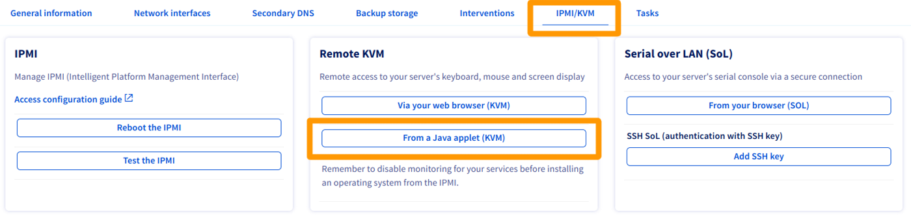{.thumbnail}

Descargue el archivo `kvm.jnlp` cuando se le pida, y ejecute el siguiente comando:

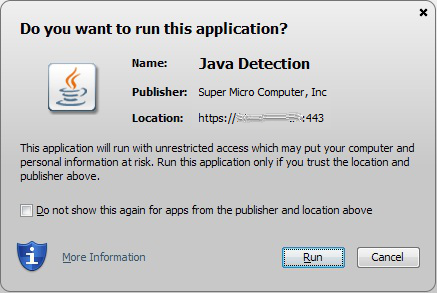{.thumbnail}

Se abrirá la página de conexión. Introduzca sus claves `root`, como cuando se conecta a través de un terminal o un programa externo:

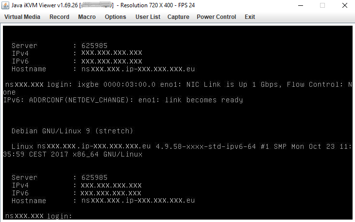{.thumbnail}

Ya puede gestionar su servidor.

### Abrir un KVM a través del navegador web <a name="kvm-browser"></a>

En la sección `Remote KVM`{.action} del área de cliente de OVHcloud, haga clic en `Desde su navegador (KVM)`{.action}:

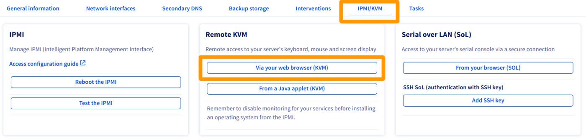{.thumbnail}

La activación tarda unos segundos. Aparecerá un mensaje informándole de la disponibilidad de la conexión mediante IPMI.

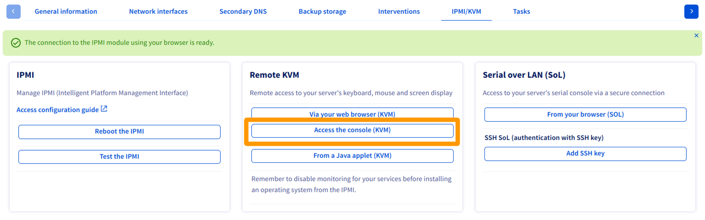{.thumbnail}

Haga clic en `Acceder a la consola (KVM)`{.action} para abrir la consola en su navegador.

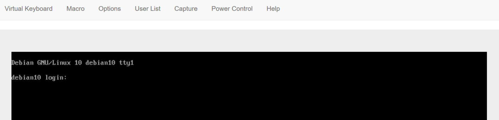{.thumbnail}

### Abrir SoL por SSH <a name="sol-ssh"></a>

Para más información sobre la creación de pares de claves SSH, consulte [esta página](/pages/bare_metal_cloud/dedicated_servers/creating-ssh-keys-dedicated#create-ssh-key).

En la sección `Serial over LAN» (SoL)`{.action} del área de cliente de OVHcloud, haga clic en `Añadir la llave SSH`{.action}.

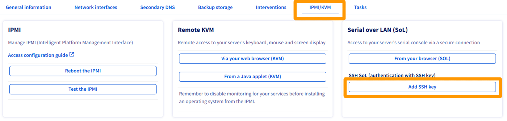{.thumbnail}

Se abrirá una ventana emergente en la que podrá introducir la llave pública SSH con la que quiere autenticarse para conectarse. A continuación, haga clic en `Iniciar la sesión SoL por SSH`{.action}.

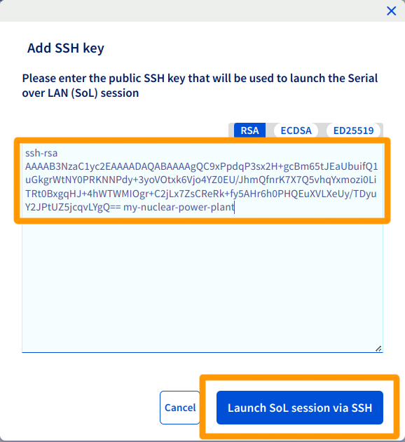{.thumbnail}

Cuando la sesión esté lista, aparecerá un mensaje de confirmación y una URI, para que pueda establecer una conexión serie a su servidor dedicado a través de SSH. Copie este URI en el portapapeles.

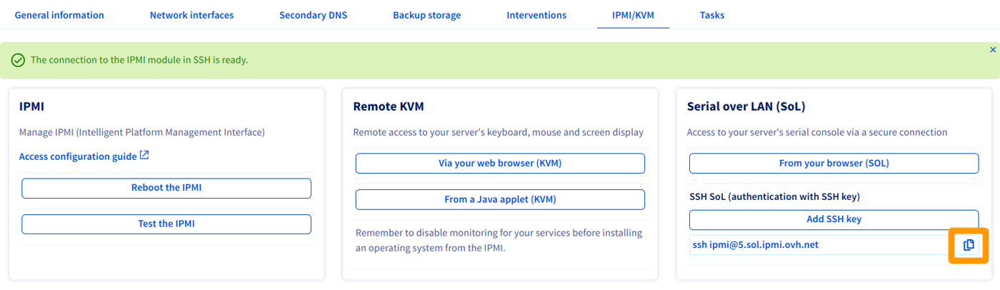{.thumbnail}

Para más información sobre el uso de una llave SSH para conectarse por SSH, consulte [esta página](/pages/bare_metal_cloud/dedicated_servers/creating-ssh-keys-dedicated#multiplekeys).

### Abrir SoL a través del explorador web <a name="sol-browser"></a>

En la sección `Serial over LAN (SoL)`{.action} del área de cliente de OVHcloud, haga clic en `Desde su navegador (SoL)`{.action}.

{.thumbnail}

> [!primary]
> Si la migración a la ventana emergente no se realiza automáticamente, siempre puede hacer clic en el botón `Ir a la consola (SoL)`{.action}.

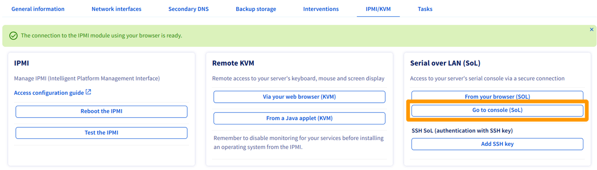{.thumbnail}

### Probar y reiniciar el IPMI <a name="ipmi-test-reboot"></a>

Es posible que IPMI ya no responda. Si no puede acceder, realice una prueba haciendo clic en `Probar IPMI`{.action} y consulte el resultado del diagnóstico.

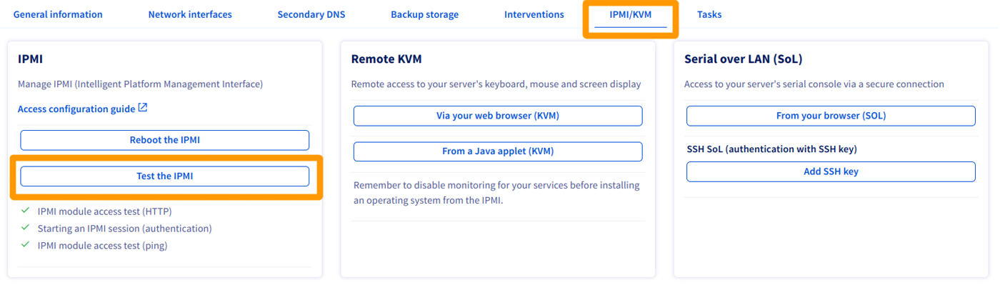{.thumbnail}

Si todo es normal, como en nuestro ejemplo, probablemente se trate de un problema local (conexión a Internet, correo local). Si, por el contrario, existe un problema relacionado con IPMI, puede reiniciarlo haciendo clic en `Reiniciar IPMI`{.action}.

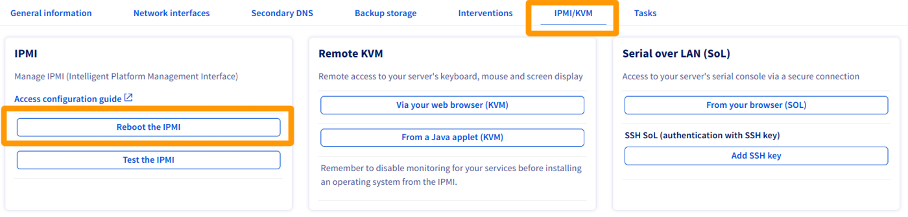{.thumbnail}

El reinicio del IPMI tarda unos minutos.

> [!primary]
> Esta operación no afecta al funcionamiento del servidor.
>

### Instalación de un sistema operativo con IPMI v1

> [!warning]
> OVHcloud no garantiza la funcionalidad de los sistemas operativos instalados mediante IPMI. Este método solo debe ser considerado por un administrador de servidores con experiencia.
>
> Las versiones de 64 bits de Java pueden impedir que se abran los menús `Redirect ISO`/`Redirect CDROM` y provocar el bloqueo de JViewer.

En primer lugar, abra [IPMI desde un applet Java](#applet-java) desde el [área de cliente de OVHcloud](/links/manager). A continuación, haga clic en `Device`{.action} en la barra de menú y seleccione `Redirect ISO`{.action} en el menú desplegable.

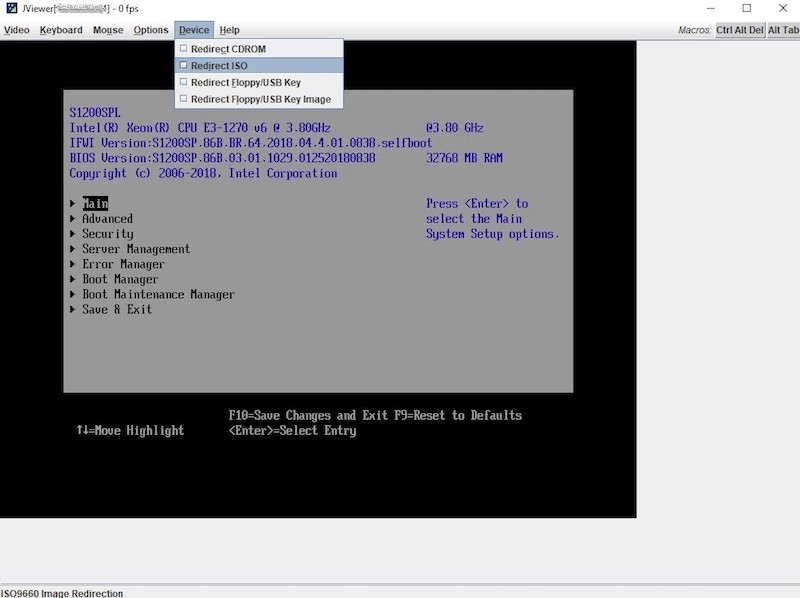{.thumbnail}

A continuación, seleccione la ISO que desee utilizar en el sistema de archivos de su ordenador local. Una vez que haya seleccionado su ISO, pulse el botón `Ctrl Alt Del`{.action} en la esquina superior derecha de la pantalla para reiniciar el servidor. Pulse la tecla `F` para acceder a las opciones de arranque.

> [!primary]
> Puede que necesite utilizar el teclado de software para guardar las entradas en IPMI. Para acceder, haga clic en la opción `Keyboard`{.action} en la barra de menú situada en la parte superior de la ventana. Seleccione `Soft Keyboard` en el menú desplegable y haga clic en `Show`{.action}.
>

Seleccione la opción `UEFI Virtual CDROM 1.00` en el menú de arranque (Boot) para arrancar el servidor a partir de la ISO asociada anteriormente.

{.thumbnail}

Siga los pasos necesarios para instalar el sistema operativo. No olvide eliminar la ISO de la opción "Redirect ISO".

### Instalación de un sistema operativo con IPMI v2

> [!warning]
> OVHcloud no garantiza la funcionalidad de los sistemas operativos instalados mediante IPMI. Este método solo debe ser considerado por un administrador de servidores con experiencia.
>

En primer lugar, abra [IPMI desde un applet Java](#applet-java) desde el [área de cliente de OVHcloud](/links/manager). Haga clic en `Virtual Media`{.action} y seleccione `Virtual Storage`{.action}.

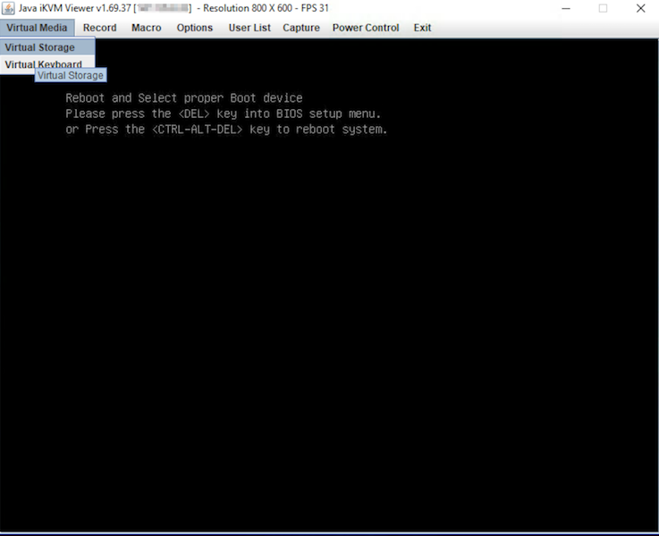{.thumbnail}

En la nueva ventana, seleccione `ISO File` en la lista desplegable Logical Drive Type. Haga clic en `Open Image`{.action} y navegue hasta su archivo ISO. Por último, haga clic en `Plug-in`{.action} y `OK`{.action}.

{.thumbnail}

Para empezar desde su archivo ISO, debe acceder a la BIOS y cambiar las opciones de inicio. Para ello, haga clic en `Power Control`{.action} y seleccione `Set Power Reset`{.action}.

{.thumbnail}

> [!primary]
> Puede que necesite utilizar el teclado de software para guardar las entradas en IPMI. Para acceder, haga clic en la opción `Virtual Media`{.action} en la barra de menú situada en la parte superior de la ventana. A continuación, seleccione `Virtual Keyboard`{.action} en el menú desplegable.
>

Durante el proceso de arranque, pulse la tecla `SUPPR` cuando se le pida acceder a la BIOS. También puede pulsar la tecla `F11` y acceder a la BIOS seleccionando la opción `Enter Setup`{.action}.

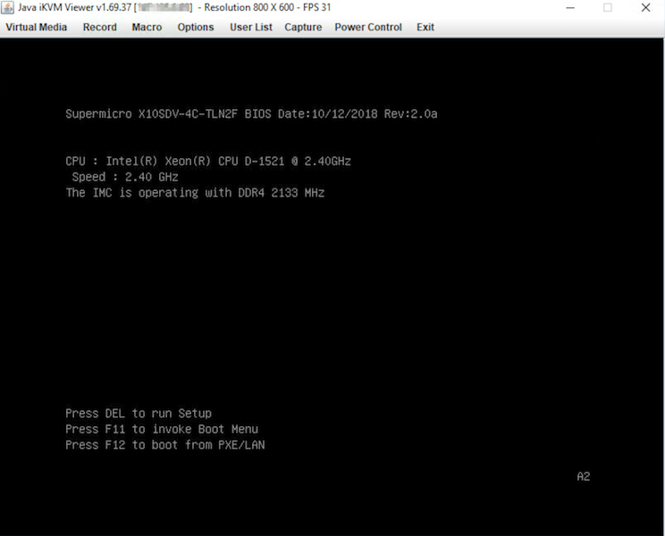{.thumbnail}

En la BIOS, navegue hasta la pestaña `Boot`{.action} y sustituya `UEFI Boot Order #1` por `UEFI USB CD/DVD:UEFI: CDROM virtual ATEN YSOJ`.

{.thumbnail}

Por último, pulse la tecla `F4` para guardar los cambios y reiniciar el servidor.

### Instalar un SO utilizando el navegador web KVM (solo para los servidores más recientes)

> [!warning]
> OVHcloud no garantiza la funcionalidad de los sistemas operativos instalados mediante IPMI. Este método solo debe ser considerado por un administrador de servidores con experiencia.
>

En el [área de cliente](/links/manager), abra la [consola KVM](#kvm-browser).

Aquí podrá acceder a la misma información y funcionalidades que en los módulos IPMI basados en Java.

> [!primary]
>
> Asegúrese de ejecutar los siguientes pasos a un buen ritmo. El proceso puede cancelarse si hay pausas más largas entre las acciones.
>

Haga clic en el botón `Browse File`{.action} y seleccione su archivo de imagen.

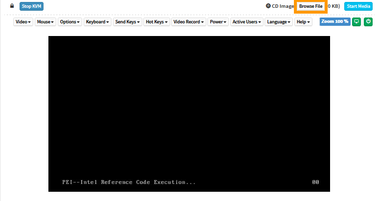{.thumbnail}

Haga clic en `Start Media`{.action}. Esto preparará la ISO para el proceso de instalación.

{.thumbnail}

El tamaño de archivo mostrado no es el tamaño real. Esto es normal, ya que el archivo no se carga completamente en este paso.

{.thumbnail}

Haga clic en `Power`{.action} y seleccione `Reset Server`{.action} (reiniciar el servidor) en el menú desplegable.

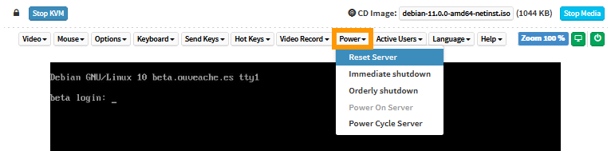{.thumbnail}

Espere a que se muestre la pantalla de selección de arranque y pulse la tecla adecuada para entrar en el menú de arranque (`F11` en este ejemplo).

{.thumbnail}

En el menú "boot", seleccione el lector óptico (`UEFI: AMI Virtual CDROM0` en este ejemplo) y pulse `Entrar`.

{.thumbnail}

El archivo ISO se descargará y el servidor se iniciará a partir del archivo.

{.thumbnail}

<a name="bios"></a>

### Reiniciar un servidor en el menú BIOS

Puede acceder al BIOS durante la configuración o la solución de problemas del servidor. Una forma práctica de hacerlo es utilizar la herramienta `ipmiutil` (consulte la [página del proyecto](https://ipmiutil.sourceforge.net/) para obtener más información).

Cuando el servidor esté en [modo rescue](/pages/bare_metal_cloud/dedicated_servers/rescue_mode) y una vez conectado, instálelo con el siguiente comando:

```bash
apt install ipmiutil
```

A continuación, reinicie el servidor con el siguiente comando:

```bash
ipmiutil reset -b
```

Acceda a la [consola IPMI](#procedure) desde el [área de cliente de OVHcloud](/links/manager). Debe aparecer el menú del BIOS del servidor.

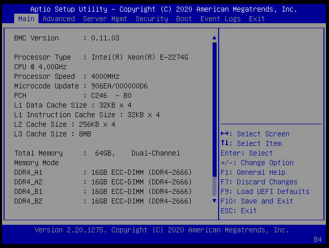{.thumbnail}

## Más información

Si necesita formación o asistencia técnica para implantar nuestras soluciones, póngase en contacto con su representante de ventas o haga clic en [este enlace](/links/professional-services) para obtener un presupuesto y solicitar un análisis personalizado de su proyecto a nuestros expertos del equipo de Servicios Profesionales.

Interactúe con nuestra [comunidad de usuarios](/links/community).
