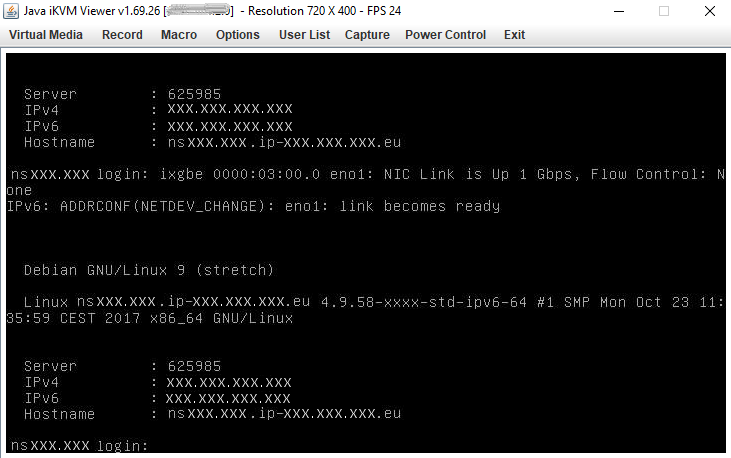

> [!primary]
> Questa traduzione è stata generata automaticamente dal nostro partner SYSTRAN. I contenuti potrebbero presentare imprecisioni, ad esempio la nomenclatura dei pulsanti o alcuni dettagli tecnici. In caso di dubbi consigliamo di fare riferimento alla versione inglese o francese della guida. Per aiutarci a migliorare questa traduzione, utilizza il pulsante "Contribuisci" di questa pagina.
>

## Obiettivo

La console IPMI (Intelligent Platform Management Interface) permette di stabilire una connessione diretta al server dedicato senza dipendere dallo stato di connettività del sistema operativo. Questa guida ti mostra come avviare la console.

## Prerequisiti

- Avere accesso allo [Spazio Cliente OVHcloud](/links/manager)

> [!warning]
> Questa funzionalità può non essere disponibile o limitata sui [server dedicati **Eco**](/links/bare-metal/eco-about).
>
> Per maggiori informazioni, consulta la nostra [a confronto](/links/bare-metal/eco-compare).

<a name="procedure"></a>

## Procedura

Per connettersi all’IPMI è possibile utilizzare diversi metodi¹. Le chiavi SSH archiviate sul server non saranno utilizzate per queste connessioni. Ecco una tabella riassuntiva:

|Nome Metodo|Altro Nome|Descrizione|Copia-Incolla|Unità ISO Virtuale²|Esempi di casi d'uso|
|---|---|---|---|---|---|
|**KVM**³ via **browser Web**|**KVM HTML**|Emulazione dello schermo video attraverso un **canvas HTML**, esattamente come se si collegasse fisicamente una tastiera/mouse in USB e uno schermo video in VGA al proprio server dedicato.|❌|⚠️⁴|-- Diagnosi di un problema di boot del server dedicato.|
|**KVM**³ via **applet Java**|**KVM Java**|Come per il KVM HTML, ad eccezione che l'emulazione si effettua tramite un **applet Java** al posto del canale HTML.|❌|✅|- Diagnosticare un problema di boot del server dedicato. <br />- Eseguire l'installazione di un OS specifico (escluso [catalogo](/links/bare-metal/os)) manualmente.|
|**SoL**─ via **browser Web**|**SoL JavaScript**|Emulazione di un collegamento seriale tramite browser Web, esattamente come se si collegasse una console seriale in RS-232 fisicamente al server dedicato.|✅|❌|- Diagnosticare un problema di rete: recuperare i log e modificare i file di configurazione.|
|**SoL**∕via **SSH**|**SoL SSH**|Come per SoL JavaScript, ad eccezione del fatto che l'emulazione avviene tramite un gateway SSH. Accedi con il tuo client SSH preferito a un server remoto in SSH, che trasferisce in seguito gli ordini in collegamento seriale al server dedicato.|✅|❌|- Idem SoL JavaScript ma da una macchina che non ha interfaccia grafica.|

¹ In base alla compatibilità hardware del server dedicato (alcuni metodi non saranno disponibili nello [Spazio Cliente OVHcloud](/links/manager).<br />
² Funzionalità che permette di montare un'immagine ISO memorizzata localmente sulla tua macchina sul server dedicato remoto, e quindi di installare un OS tramite l'IPMI.<br />
³ KVM = Keyboard Video and Mouse<br />
⁴ In base alla compatibilità hardware del tuo server dedicato: utilizza il KVM Java al posto del server se incompatibile.<br />
⁵ Se il sistema operativo che vuoi installare non è disponibile nel [catalogo dei sistemi operativi disponibili sui server dedicati OVHcloud](/links/bare-metal/os), ti ricordiamo che puoi anche utilizzare un'immagine personalizzata: per maggiori dettagli, consulta [Bring Your Own Image (BYOI) e Bring Your Own Linux (BYOLinux)](/pages/bare_metal_cloud/dedicated_servers/bring-your-own-image-versus-bring-your-own-linux).<br />
⁶ SoL = Serial over Lan

Per attivare uno di questi metodi, accedi allo [Spazio Cliente OVHcloud](/links/manager). Nella sezione `Bare Metal Cloud`{.action}, clicca su `Server dedicati`{.action} e seleziona il tuo server, poi clicca sulla scheda `IPMI/KVM`{.action}.

### Aprire un KVM tramite applet Java <a name="applet-java"></a>

Per il corretto funzionamento dell'applet, è necessario che Java sia installato sul dispositivo. Se non lo hai ancora fatto, accedi alla [pagina ufficiale](https://www.java.com/en/download/){.external}.

Nella sezione `Remote KVM`{.action} dello Spazio Cliente OVHcloud, clicca su `Da applet Java (KVM)`{.action}:

{.thumbnail}

Scarica il file `kvm.jnlp` quando sei invitato e lancialo:

{.thumbnail}

A questo punto accedi alla pagina di login. Inserisci le credenziali di `root`, come in caso di connessione da un terminale o da un software esterno:

{.thumbnail}

Da questo momento puoi gestire il tuo server.

### Aprire un KVM tramite browser Web <a name="kvm-browser"></a>

Nella sezione `Remote KVM`{.action} dello Spazio Cliente OVHcloud, clicca su `Dal browser (KVM)`{.action}:

{.thumbnail}

L'attivazione richiede alcuni secondi. Un messaggio ti informerà della disponibilità della connessione via IPMI.

{.thumbnail}

Clicca su `Accedi alla console (KVM)`{.action} per aprire la console nel browser.

{.thumbnail}

### Apri SoL via SSH <a name="sol-ssh"></a>

Per maggiori informazioni sulla creazione di coppie di chiavi SSH, consulta [questa pagina](/pages/bare_metal_cloud/dedicated_servers/creating-ssh-keys-dedicated#create-ssh-key).

Nella sezione `Serial over LAN (SoL)`{.action} dello Spazio Cliente OVHcloud, clicca su `Aggiungi la chiave SSH`{.action}.

{.thumbnail}

A questo punto si aprirà un popup in cui sarà possibile inserire la chiave pubblica SSH con la quale si desidera autenticarsi per accedere. Clicca su `Avvia la sessione SSL via SSH`{.action}.

{.thumbnail}

Quando la sessione è pronta, compare un messaggio di conferma e un URI, per permetterti di stabilire una connessione seriale al tuo server dedicato in SSH. Copiare l'URI negli appunti.

{.thumbnail}

Per maggiori informazioni sull'utilizzo di una chiave SSH per connettersi in SSH, consulta [questa pagina](/pages/bare_metal_cloud/dedicated_servers/creating-ssh-keys-dedicated#multiplekeys).

### Apri SoL tramite browser Web <a name="sol-browser"></a>

Nella sezione `Serial over LAN (SoL)`{.action} dello Spazio Cliente OVHcloud, clicca su `Dal browser (SoL)`{.action}.

{.thumbnail}

> [!primary]
> Se il trasferimento verso il popup non avviene automaticamente, clicca comunque sul pulsante `Accedi alla console (SoL)`{.action}.

{.thumbnail}

### Testare e riavviare l’IPMI <a name="ipmi-test-reboot"></a>

È possibile che l'IPMI non risponda più. Se non riesci ad accedervi, per prima cosa esegui un test cliccando su `Testa IPMI`{.action} e visualizzando il risultato della diagnostica:

{.thumbnail}

Se tutto è normale, come nel nostro esempio, probabilmente ti trovi di fronte a un problema locale (connessione a Internet, postazione locale). Se l'IPMI riscontra effettivamente un problema, hai la possibilità di riavviarlo cliccando su `Riavvia IPMI`{.action}.

{.thumbnail}

Il riavvio dell'IPMI richiede alcuni minuti.

> [!primary]
> Questa operazione non incide sul funzionamento del server.
>

### Installazione di un sistema operativo con IPMI v1

> [!warning]
> OVHcloud non garantisce la funzionalità dei sistemi operativi installati tramite IPMI. Questo metodo deve essere preso in considerazione solo da un amministratore di server esperto.
>
> Le versioni a 64 bit di Java possono impedire l’apertura dei menu `Redirect ISO`/`Redirect CDROM` e provocare il blocco di JViewer.

Per iniziare, apri [IPMI da una applet Java](#applet-java) attraverso il tuo [Spazio Cliente OVHcloud](/links/manager). Clicca su `Device`{.action} nella barra dei menu e seleziona `Redirect ISO`{.action} nel menu a tendina.

{.thumbnail}

Seleziona l'ISO che vuoi utilizzare nel file system del tuo computer locale. Una volta selezionato il tuo ISO, premi il pulsante `Ctrl Alt Del`{.action} nell'angolo superiore destro dello schermo per riavviare il server. Premi il tasto `F` per accedere alle opzioni di avvio.

> [!primary]
> Potrai utilizzare la tastiera software per registrare i record in IPMI. Per effettuare l'accesso, clicca sull'opzione `Keyboard`{.action} nella barra dei menu in alto a destra. Seleziona `Soft Keyboard` nel menu a tendina e clicca su `Show`{.action}.
>

Seleziona l'opzione `UEFI Virtual CDROM 1.00` nel menu di avvio (Boot) per avviare il server a partire dall'ISO precedentemente associata.

{.thumbnail}

Segui gli step per installare il sistema operativo. Ricordati di eliminare l'ISO dall'opzione "Redirect ISO".

### Installazione di un sistema operativo con IPMI v1

> [!warning]
> OVHcloud non garantisce la funzionalità dei sistemi operativi installati tramite IPMI. Questo metodo deve essere preso in considerazione solo da un amministratore di server esperto.
>

Per iniziare, apri [IPMI da una applet Java](#applet-java) attraverso il tuo [Spazio Cliente OVHcloud](/links/manager). Clicca su `Virtual Media`{.action} e poi su `Virtual Storage`{.action}.

{.thumbnail}

Nella nuova finestra, seleziona `ISO File` nel menu a tendina "Logical Drive Type". Clicca su `Open Image`{.action} e naviga fino al tuo file ISO. Infine clicca su `Plug-in`{.action} e `OK`{.action} per completare.

{.thumbnail}

Per iniziare dal tuo file ISO, è necessario accedere al BIOS e modificare le opzioni di avvio. Clicca su `Power Control`{.action} e poi su `Set Power Reset`{.action}.

{.thumbnail}

> [!primary]
> Potrai utilizzare la tastiera software per registrare i record in IPMI. Per accedervi, clicca sull'opzione `Virtual Media`{.action} nella barra dei menu in alto alla finestra. Seleziona `Virtual Keyboard`{.action} nel menu a tendina.
>

Per accedere al BIOS, premi il tasto `SUPPR` durante il processo di avvio. Premi il tasto `F11` e accedi al BIOS selezionando l'opzione `Enter Setup`{.action}.

{.thumbnail}

Nel BIOS, naviga fino alla scheda `Boot`{.action} e sostituisci `UEFI Boot Order #1` con `UEFI USB CD/DVD:UEFI: CDROM virtual ATEN YSOJ`.

{.thumbnail}

Premi il tasto `F4` per salvare le modifiche e riavviare il server.

### Installare un OS utilizzando il browser web KVM (solo per i server più recenti)

> [!warning]
> OVHcloud non garantisce la funzionalità dei sistemi operativi installati tramite IPMI. Questo metodo deve essere preso in considerazione solo da un amministratore di server esperto.
>

Dallo [Spazio Cliente OVHcloud](/links/manager) è possibile aprire la [console KVM](#kvm-browser).

In questo caso, hai accesso alle stesse informazioni e funzionalità dei moduli IPMI basati su Java.

> [!primary]
>
> Assicurati di eseguire i prossimi step a un buon ritmo. La procedura può essere annullata se tra le azioni si verificano pause più lunghe.
>

Clicca sul pulsante `Browse File`{.action} e seleziona il tuo file di immagine.

{.thumbnail}

Clicca su `Start Media`{.action}. Ciò preparerà l'ISO per il processo di installazione.

{.thumbnail}

La dimensione del file visualizzato non corrisponde alla dimensione effettiva. È normale perché il file non è completamente trasmesso in questo step.

{.thumbnail}

Clicca su `Power`{.action} e seleziona `Reset Server`{.action} (reinizializza il server) nel menu a tendina.

{.thumbnail}

Attendi che la schermata di avvio venga visualizzata e premi il tasto corrispondente per accedere al menu di Boot (`F11` in questo esempio).

{.thumbnail}

Nel menu boot, seleziona il lettore ottico (`UEFI: AMI Virtual CDROM0` in questo esempio) e clicca su `Entrata`.

{.thumbnail}

Il file ISO verrà televersato e il server inizierà dal file.

{.thumbnail}

<a name="bios"></a>

### Riavvia un server dal menu BIOS

È possibile accedere al BIOS durante la configurazione o la risoluzione dei problemi del server. Un modo pratico per farlo è utilizzare lo strumento `ipmiutil` (per ulteriori informazioni, consulta la [pagina del progetto](https://ipmiutil.sourceforge.net/)).

Quando il server è in [modalità rescue](/pages/bare_metal_cloud/dedicated_servers/rescue_mode) e una volta effettuato l’accesso, installalo con il comando:

```bash
apt install ipmiutil
```

Riavvia il server con questo comando:

```bash
ipmiutil reset -b
```

Accedi alla [console IPMI](#procedure) dal tuo [Spazio Cliente OVHcloud](/links/manager). Verrà visualizzato il menu BIOS del server.

{.thumbnail}

## Per saperne di più

Se avete bisogno di formazione o di assistenza tecnica per implementare le nostre soluzioni, contattate il vostro rappresentante o cliccate su [questo link](/links/professional-services) per ottenere un preventivo e richiedere un'analisi personalizzata del vostro progetto da parte dei nostri esperti del team Professional Services.

Contatta la nostra [Community di utenti](/links/community).
