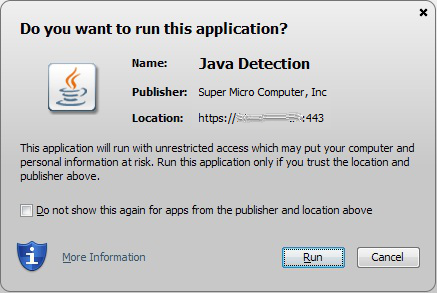

> [!primary]
> Tłumaczenie zostało wygenerowane automatycznie przez system naszego partnera SYSTRAN. W niektórych przypadkach mogą wystąpić nieprecyzyjne sformułowania, na przykład w tłumaczeniu nazw przycisków lub szczegółów technicznych. W przypadku jakichkolwiek wątpliwości zalecamy zapoznanie się z angielską/francuską wersją przewodnika. Jeśli chcesz przyczynić się do ulepszenia tłumaczenia, kliknij przycisk "Zgłóś propozycję modyfikacji" na tej stronie.
> 

## Wprowadzenie

Przyłącz się do społeczności [user community](/links/community).Konsola IPMI (Intelligent Platform Management Interface) umożliwia bezpośrednie połączenie do serwera dedykowanego bez zależności od stanu łączności z systemem operacyjnym. Niniejszy przewodnik wyjaśnia, jak uruchomić tę konsolę.

## Wymagania początkowe

- Dostęp do [Panelu klienta OVHcloud](/links/manager).

> [!warning]
> Funkcja ta może być niedostępna lub ograniczona na [serwerach dedykowanych **Eco**](/links/bare-metal/eco-about).
>
> Aby uzyskać więcej informacji, zapoznaj się z naszym [porównaniem](/links/bare-metal/eco-compare).

<a name="procedure"></a>

## W praktyce

Przyłącz się do społeczności [user community](/links/community).Konsola IPMI (Intelligent Platform Management Interface) umożliwia bezpośrednie połączenie do serwera dedykowanego bez zależności od stanu łączności z systemem operacyjnym. Niniejszy przewodnik wyjaśnia, jak uruchomić konsolę. Logowanie do IPMI można wykonać kilkoma dostępnymi metodami. Tabela podsumowująca:

|Nazwa metody|Inna nazwa|Opis|Kopiuj-wklej|Wirtualny dysk ISO²|Przykłady zastosowania|
|---|---|---|---|---|---|
|**KVM**³ przez **przeglądarkę internetową**|**KVM HTML**|Emulacja ekranu wideo przez **kanwę HTML**, dokładnie tak, jak w przypadku fizycznego podłączenia klawiatury/myszy USB i ekranu wideo w formacie VGA do serwera dedykowanego.|❌|⚠️⁴|- Diagnozowanie problemu z uruchamianiem serwera dedykowanego.|
|**KVM**³ przez **aplet Java**|**KVM Java**|Idem jak w przypadku KVM HTML, z wyjątkiem emulacji przez **aplet Java** zamiast kanwy HTML.|❌|✅|- Diagnozowanie problemu z uruchamianiem serwera dedykowanego. <br />- Ręcznie zainstaluj określony system operacyjny (spoza [katalog](/links/bare-metal/os))⁵.|
|**SoL**⁶ przez **przeglądarkę internetową**|**SoL JavaScript**|Emulacja połączenia szeregowego w przeglądarce internetowej — działa to tak, jakby połączenie konsoli szeregowej RS-232 fizycznie z serwerem dedykowanym.|✅|❌|- Diagnozowanie problemu z siecią: pobieranie logów i manipulowanie plikami konfiguracyjnymi.|
|**SoL**⁶ przez **SSH**|**SoL SSH**|Idem jak w przypadku SoL JavaScript, z wyjątkiem emulacji przez bramę SSH. Łączysz się za pomocą ulubionego klienta SSH ze zdalnym serwerem za pomocą SSH, który następnie transponuje polecenia łącząc szeregowo do serwera dedykowanego.|✅|❌|- Idem SoL JavaScript, ale z maszyny, która nie ma graficznego interfejsu użytkownika.|

¹ W zależności od kompatybilności sprzętowej Twojego serwera dedykowanego (niektóre metody nie będą wyświetlane w panelu klienta [OVHcloud](/links/manager)).<br />
² Funkcja pozwalająca na zamontowanie obrazu ISO przechowywanego lokalnie na Twojej maszynie na zdalnym serwerze dedykowanym i tym samym na zainstalowanie systemu operacyjnego za pośrednictwem IPMI.<br />
³ KVM = Keyboard Video and Mouse<br />
⁴ w zależności od kompatybilności sprzętowej Twojego serwera dedykowanego: użyj KVM Java zamiast niego, jeśli jest on niekompatybilny.<br />
⁵ Jeśli system operacyjny, który chcesz zainstalować, nie jest dostępny w [katalogu systemów operacyjnych dostępnych na serwerach dedykowanych OVHcloud](/links/bare-metal/os), możesz również użyć spersonalizowanego obrazu: zobacz [Porównanie Bring Your Own Image (BYOI) i Bring Your Own Linux (BYOLinux)](/pages/bare_metal_cloud/dedicated_servers/bring-your-own-image-versus-bring-your-own-linux)], aby uzyskać więcej informacji.<br />
⁶ SoL = numer seryjny

Aby aktywować jedną z tych metod, zaloguj się do [Panelu klienta OVHcloud](/links/manager). W sekcji `Bare Metal Cloud`{.action} kliknij `Serwery dedykowane`{.action} i wybierz swój serwer, a następnie kliknij zakładkę `IPMI/KVM`{.action}.

### Otwórz KVM za pomocą apletu Java <a name="applet-java"></a>

Aby aplet Java działał, na komputerze musi być zainstalowana Java. Jeśli jeszcze tego nie zrobiłeś, przejdź do [oficjalnej strony](https://www.java.com/en/download/){.external}.

W sekcji `Remote KVM`{.action} Panelu klienta OVHcloud kliknij `Z apletu Java (KVM)`{.action}:

{.thumbnail}

Pobierz plik `kvm.jnlp`, gdy zostaniesz zaproszony, a następnie uruchom go:

{.thumbnail}

Następnie przejdź do strony logowania. Wprowadź dane dostępowe `root`, tak jak przy logowaniu przy użyciu terminala lub programu zewnętrznego:

{.thumbnail}

Możesz teraz zarządzać serwerem.

### Otwórz KVM za pomocą przeglądarki sieci Web <a name="kvm-browser"></a>

W sekcji `Remote KVM`{.action} Panelu klienta OVHcloud kliknij `Z przeglądarki (KVM)`{.action}:

{.thumbnail}

Aktywacja zajmie kilka sekund. Pojawi się komunikat o dostępności połączenia przez IPMI.

{.thumbnail}

Kliknij `Dostęp do konsoli (KVM)`{.action}, aby otworzyć konsolę w przeglądarce.

{.thumbnail}

### Otwórz SoL przez SSH <a name="sol-ssh"></a>

Więcej informacji na temat tworzenia par kluczy SSH znajdziesz na [tej stronie](/pages/bare_metal_cloud/dedicated_servers/creating-ssh-keys-dedicated#create-ssh-key).

W sekcji `Serial over LAN (SoL)`{.action} Panelu klienta OVHcloud kliknij przycisk `Dodaj klucz SSH`{.action}.

{.thumbnail}

Otworzy się wtyczka, dzięki czemu będziesz mógł wprowadzić publiczny klucz SSH, za pomocą którego chcesz się zalogować. Następnie kliknij `Uruchom sesję SoL przez SSH`{.action}.

{.thumbnail}

Gdy sesja jest gotowa, pojawia się komunikat potwierdzenia i URI, dzięki czemu możesz ustanowić połączenie szeregowe z Twoim serwerem dedykowanym przez SSH. Skopiuj ten identyfikator URI do schowka.

{.thumbnail}

[ta strona](/pages/bare_metal_cloud/dedicated_servers/creating-ssh-keys-dedicated#multiplekeys) zawiera więcej informacji na temat używania klucza SSH do łączenia się przez SSH.

### Otwórz SoL w przeglądarce sieci Web <a name="sol-browser"></a>

W sekcji `Serial over LAN (SoL)`{.action} Panelu klienta OVHcloud kliknij z poziomu przeglądarki (SoL)`{.action}.

{.thumbnail}

> [!primary]
> Jeśli przełączenie na popup nie odbywa się automatycznie, zawsze możesz kliknąć przycisk `Dostęp do konsoli (SoL)`{.action}.

{.thumbnail}

### Testowanie i restartowanie IPMI <a name="ipmi-test-reboot"></a>

Możliwe, że IPMI nie odpowiada. Jeśli nie możesz uzyskać do niego dostępu, możesz najpierw wykonać test, klikając `Przetestuj IPMI`{.action} i wyświetlić wynik diagnostyki:

{.thumbnail}

Jeśli wszystko jest normalne, jak w naszym przykładzie, prawdopodobnie masz do czynienia z lokalnym problemem (połączenie z Internetem, poczta lokalna). Jeśli wystąpił problem z IPMI, możesz uruchomić go ponownie klikając `Zrestartuj IPMI`{.action}.

{.thumbnail}

Ponowne uruchomienie IPMI zajmuje kilka minut.

> [!primary]
> Operacja ta nie ma wpływu na działanie serwera.
>

### Instalacja systemu operacyjnego za pomocą IPMI v1

> [!warning]
> OVHcloud nie gwarantuje funkcjonalności systemów operacyjnych zainstalowanych za pomocą IPMI. Metoda ta powinna być rozważana tylko przez doświadczonego administratora serwerów.
>
> 64-bitowe wersje Javy mogą uniemożliwić otwarcie menu `Redirect ISO`/`Redirect CDROM` i spowodować zablokowanie JViewera.

Aby rozpocząć, otwórz [IPMI z poziomu apletu Java](#applet-java) w [Panelu klienta OVHcloud](/links/manager). Następnie kliknij `Device`{.action} na pasku menu i wybierz `Redirect ISO`{.action} z rozwijanego menu.

{.thumbnail}

Następnie wybierz ISO, której chcesz użyć w systemie plików Twojego lokalnego komputera. Po wybraniu ISO naciśnij przycisk `Ctrl Alt Del`{.action} w prawym górnym rogu ekranu, aby uruchomić serwer. Wciśnij przycisk `F`, aby uzyskać dostęp do opcji startowych.

> [!primary]
> Być może będziesz musiał użyć klawiatury oprogramowania do zapisywania wpisów w IPMI. Aby się zalogować, kliknij opcję `Keyboard`{.action} na pasku menu na górze okna. Następnie wybierz `Soft Keyboard` z rozwijanego menu i kliknij `Show`{.action}.
>

Wybierz opcję `UEFI Virtual CDROM 1.000` w menu startowym (Boot), aby uruchomić serwer z wcześniej podłączonego ISO.

{.thumbnail}

Postępuj zgodnie z instrukcjami potrzebnymi do zainstalowania systemu operacyjnego. Pamiętaj, aby usunąć ISO z opcji Redirect ISO.

### Instalacja systemu operacyjnego za pomocą IPMI v1

> [!warning]
> OVHcloud nie gwarantuje funkcjonalności systemów operacyjnych zainstalowanych za pomocą IPMI. Metoda ta powinna być rozważana tylko przez doświadczonego administratora serwerów.
>

Aby rozpocząć, otwórz [IPMI z poziomu apletu Java](#applet-java) w [Panelu klienta OVHcloud](/links/manager). Kliknij `Virtual Media`{.action}, a następnie `Virtual Storage`{.action}.

{.thumbnail}

W oknie, które się wyświetla wybierz `ISO File` z rozwijanej listy "Logical Drive Type". Następnie kliknij `Open Image`{.action} i przejdź do pliku ISO. Na koniec kliknij `Plug-in`{.action} i `OK`{.action}.

{.thumbnail}

Aby rozpocząć korzystanie z pliku ISO, należy uzyskać dostęp do BIOS i zmienić opcje uruchamiania. W tym celu kliknij `Power Control`{.action}, a następnie `Set Power Reset`{.action}.

{.thumbnail}

> [!primary]
> Być może będziesz musiał użyć klawiatury oprogramowania do zapisywania wpisów w IPMI. Aby się zalogować, kliknij opcję `Virtual Media`{.action} na pasku menu na górze okna. Wybierz następnie `Virtual Keyboard`{.action} z rozwijanego menu.
>

Podczas procesu uruchamiania, naciśnij przycisk `DEDIP`, gdy zostaniesz poproszony o dostęp do BIOSu. Możesz również nacisnąć przycisk `F1` i uzyskać dostęp do BIOS, wybierając opcję `Enter Setup`{.action}.

{.thumbnail}

W BIOS przejdź do karty `Boot`{.action} i zastąp `UEFI Boot Order #1` > `UEFI USB CD/DVD:UEFI: CDROM virtual ATEN YSOJ`.

{.thumbnail}

Na koniec, naciśnij klawisz `F4`, aby zapisać zmiany i zrestartować serwer.

### Zainstaluj system operacyjny korzystając z przeglądarki KVM (tylko dla najnowszych serwerów)

> [!warning]
> OVHcloud nie gwarantuje funkcjonalności systemów operacyjnych zainstalowanych za pomocą IPMI. Metoda ta powinna być rozważana tylko przez doświadczonego administratora serwerów.
>

W [Panelu client OVHcloud](/links/manager) otwórz [konsolę KVM](#kvm-browser).

Tutaj masz dostęp do tych samych informacji i funkcji, co w modułach IPMI opartych na Java.

> [!primary]
>
> Upewnij się, że kolejne kroki są realizowane w dobrym tempie. Proces może zostać anulowany, jeśli między działaniami występują dłuższe przerwy.
>

Kliknij przycisk `Browse File`{.action} i wybierz Twój plik obrazu.

{.thumbnail}

Kliknij `Start Media`{.action}. Przygotuje to ISO dla procesu instalacji.

{.thumbnail}

Rozmiar wyświetlanego pliku nie jest rzeczywistym rozmiarem. To normalne, ponieważ plik nie jest do końca wysyłany na ten etap.

{.thumbnail}

Kliknij `Power`{.action} i wybierz `Reset Server`{.action} (zresetuj serwer) z rozwijanego menu.

{.thumbnail}

Poczekaj, aż pojawi się ekran wyboru boot i naciśnij odpowiedni przycisk, aby przejść do menu Boot (`F11` w tym przykładzie).

{.thumbnail}

W menu boot wybierz czytnik optyczny (`UEFI: AMI Virtual CDROM0` w tym przykładzie) i naciśnij `Enter`.

{.thumbnail}

Plik ISO zostanie teraz przesłany, a następnie serwer zostanie uruchomiony z pliku.

{.thumbnail}

<a name="bios"></a>

### Restart serwera w menu BIOS

Skonfiguruj serwer i rozwiąż problemy, uzyskując dostęp do systemu BIOS. Praktycznym sposobem na to jest użycie narzędzia `ipmiutil` (więcej informacji znajduje się na [stronie projektu](https://ipmiutil.sourceforge.net/)).

Gdy serwer znajduje się w trybie [rescue](/pages/bare_metal_cloud/dedicated_servers/rescue_mode) i zalogujesz się do niego, zainstaluj go za pomocą następującego polecenia:

```bash
apt install ipmiutil
```

Następnie zrestartuj serwer za pomocą polecenia:

```bash
ipmiutil reset -b
```

Następnie przejdź do [konsoli IPMI](#procedure) w [Panelu klienta OVHcloud](/links/manager). Powinno pojawić się menu BIOS serwera.

{.thumbnail}

## Sprawdź również

Jeśli potrzebujesz szkolenia lub pomocy technicznej w celu wdrożenia naszych rozwiązań, skontaktuj się z przedstawicielem handlowym lub kliknij [ten link](/links/professional-services), aby uzyskać wycenę i poprosić o spersonalizowaną analizę projektu od naszych ekspertów z zespołu Professional Services.

Przyłącz się do [społeczności użytkowników](/links/community).
