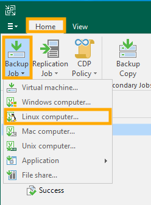
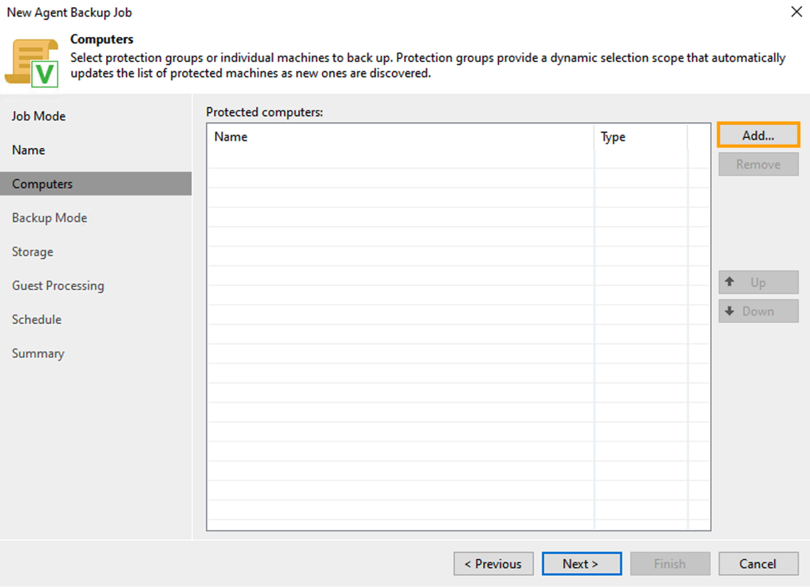
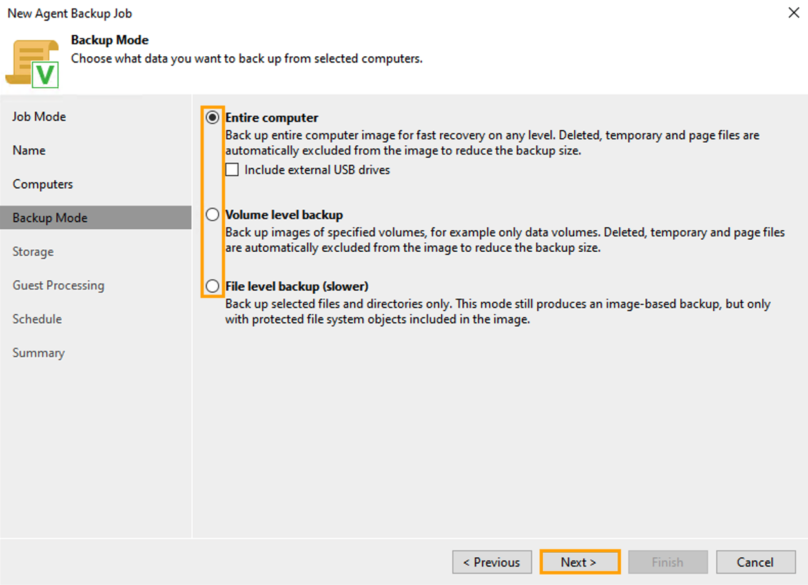
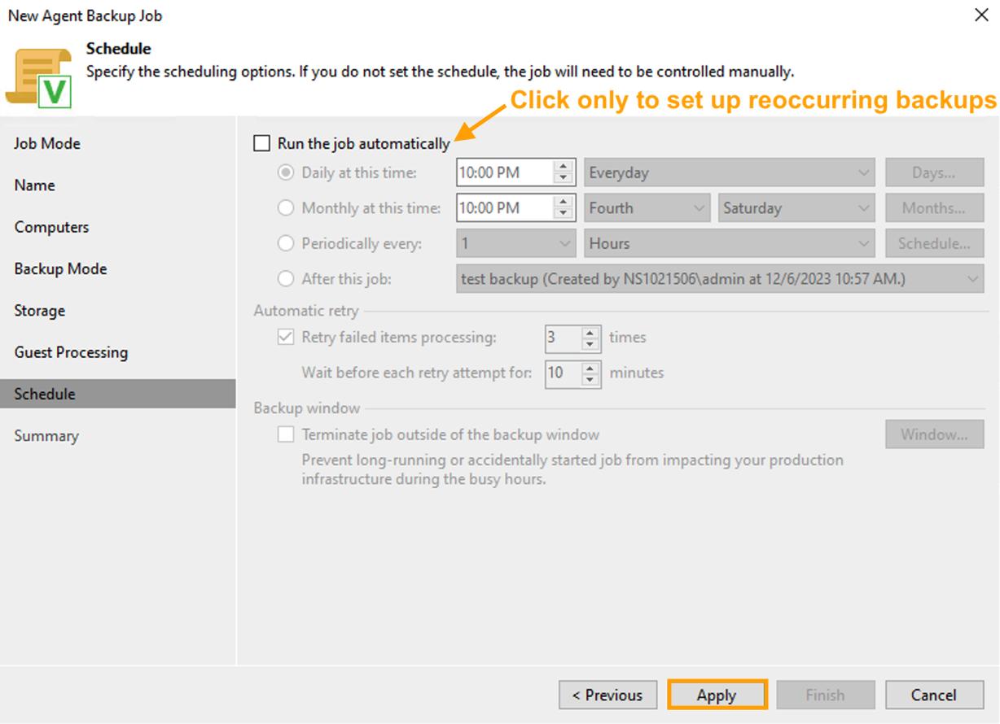

## Objectif

Qu'il s'agisse d'une panne matérielle ou de la suppression accidentelle d'un fichier important, effectuer des sauvegardes fréquentes est extrêmement important et peut vous faire économiser de nombreuses heures de travail inutiles.

**Découvrez comment réaliser une sauvegarde de votre serveur Bare Metal Linux avec Veeam Backup and Replication (Enterprise).**

> [!primary]
> Pour sauvegarder un serveur Bare Metal Windows avec Veeam Agent pour Microsoft Windows, consultez [ce guide](/pages/bare_metal_cloud/dedicated_servers/veeam-enterprise-server-backup-windows-agent).

## Prérequis

- Un [serveur Bare Metal Linux OVHcloud](/links/bare-metal/bare-metal)
- [Veeam Backup & Replication installé et enregistré](/pages/storage_and_backup/backup_and_disaster_recovery_solutions/veeam/veeam_veeam_backup_replication)

> [!warning]
> Pour suivre les étapes de ce guide, vous devez avoir préalablement suivi les étapes détaillées de notre premier guide « [Préparer une sauvegarde de serveur Bare Metal avec Veeam Enterprise](/pages/bare_metal_cloud/dedicated_servers/veeam-enterprise-server-backup-preparation) ».

## En pratique

Dans l'onglet `Home`{.action} de Veeam, cliquez sur le bouton `Backup Job`{.action} et sélectionnez l'option `Linux computer...`.

{.thumbnail}

Dans la section **Job Mode**, sélectionnez le **Type** de serveur et le **Mode** pour la sauvegarde.

Cliquez ensuite sur le bouton `Next`{.action}.

{.thumbnail}

Dans la section **Name**, attribuez un **Nom** et une **Description** à votre tâche de sauvegarde.

Cliquez ensuite sur le bouton `Next`{.action}.

{.thumbnail}

Dans la section **Computers**, cliquez sur le bouton `Add...`{.action}.

{.thumbnail}

Dans la fenêtre **Add Computer**, entrez le **nom d'hôte ou l'adresse IP** du serveur.

Cliquez ensuite sur le bouton `Add...`{.action}, sélectionnez `Stored`{.action} puis `Linux account...`{.action}.

{.thumbnail}

Entrez le **Nom d'utilisateur** et le **Mot de passe**, cochez la case **Elevate account privileges automatically** puis cliquez sur `OK`{.action}.

{.thumbnail}

Dans la section **Backup Mode**, sélectionnez le mode de sauvegarde de cette tâche de sauvegarde.

Cliquez ensuite sur le bouton `Next`{.action}.

{.thumbnail}

Dans la section **Storage**, choisissez le **Backup repository** (répertoire de sauegarde) et les paramètres.

Cliquez ensuite sur le bouton `Next`{.action}.

{.thumbnail}

Cliquez de nouveau sur le bouton `Next`{.action} pour ignorer la section **Guest Processing**,$ car aucune configuration n'y est nécessaire.

Dans la section **Schedule**, vous pouvez cocher la case `Run the job automatically`{.action} si vous souhaitez que la tâche de sauvegarde se produise de manière récurrente.

Pour ce guide, nous allons exécuter la sauvegarde manuellement. Nous allons donc cliquer sur le bouton `Apply`{.action} pour continuer.

{.thumbnail}

Vérifiez que toutes les informations sont correctes dans la section **Summary**.

Si vous souhaitez lancer la tâche de sauvegarde dès la fin de la configuration, cochez la case `Run the job when I click Finish`{.action}.

{.thumbnail}

Cliquez sur le bouton `Finish`{.action} pour terminer la configuration de la tâche de sauvegarde. Une nouvelle fenêtre s'ouvre, vous permettant de visualiser le détail de la sauvegarde en cours.

{.thumbnail}

Une fois la tâche terminée, votre sauvegarde sera alors scréée.

Pour plus d'informations sur la restauration d'un serveur Bare Metal, consultez notre guide « [Restaurer un serveur Bare Metal avec Veeam Backup & Replication](/pages/bare_metal_cloud/dedicated_servers/veeam-enterprise-server-restore) ».

## Aller plus loin

Échangez avec notre communauté d’utilisateurs sur <https://community.ovh.com/>.
