## Objective

Learn how to configure the Veeam Agent for Microsoft Windows to back up your Bare Metal Windows server.

> [!primary]
> To back up a Bare Metal Linux server using Veeam Backup and Replication (Enterprise), see [this guide](/pages/bare_metal_cloud/dedicated_servers/veeam-enterprise-server-backup-linux).

## Requirements

- An [OVHcloud Bare Metal Windows server](https://www.ovhcloud.com/asia/bare-metal/)
- [Veeam Backup and Replication 12.0](https://www.veeam.com/download-version.html?ad=downloads&tab=previous) installed
- Veeam Agent for Microsoft Windows 6.0.2 [installation software](https://login.veeam.com/realms/veeamsso/protocol/openid-connect/auth?client_id=veeam-com&response_type=code&redirect_uri=https%3A%2F%2Fwww.veeam.com%2Foauth&scope=profile&state=e9a55dcbf050f86c5eb69ea264b8fb86) (Veeam account required)

> [!warning]
> This guide presupposes that you have followed the steps detailed in our first guide [Preparing a Bare Metal Server backup with Veeam Enterprise](/pages/bare_metal_cloud/dedicated_servers/veeam-enterprise-server-backup-preparation).

## Instructions

### Download and install Veeam Agent

Download [Veeam Agent for Microsoft Windows 6.0.2](https://login.veeam.com/realms/veeamsso/protocol/openid-connect/auth?client_id=veeam-com&response_type=code&redirect_uri=https%3A%2F%2Fwww.veeam.com%2Foauth&scope=profile&state=e9a55dcbf050f86c5eb69ea264b8fb86) on the target server for your backup.

Install the Veeam Agent and select `No`{.action} when prompted to install a license file.

{.thumbnail}

Click the menu button and select `+ Add New Job...`{.action}.

{.thumbnail}

### Backup configuration

#### Name

Modify the default **Name** and/or **Description**, if you want to, and click `Next`{.action}.

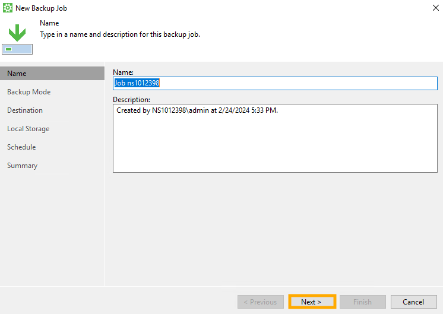{.thumbnail}

#### Backup Mode

Choose what data you want to back up and click `Next`{.action}.

{.thumbnail}

#### Destination

Choose `Veeam backup repository`{.action}. and click `Next`{.action}.

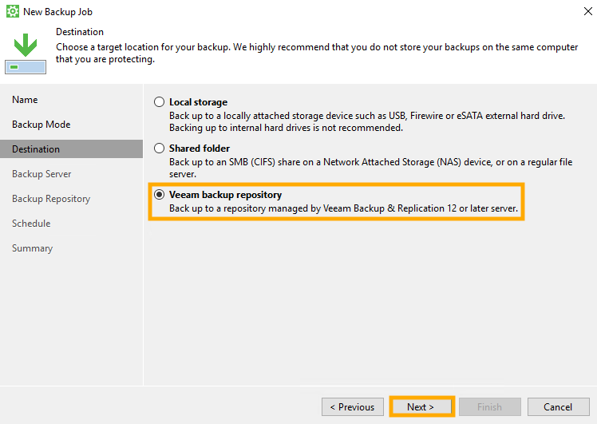{.thumbnail}

#### Backup server

Enter the **Veeam backup server name or IP address** and **Specify your personal credentials** (from a valid [Veeam Enterprise service account](/pages/storage_and_backup/backup_and_disaster_recovery_solutions/veeam/veeam_veeam_backup_replication#create)).

Click `Next`{.action}.

It will take a moment for your license to load.

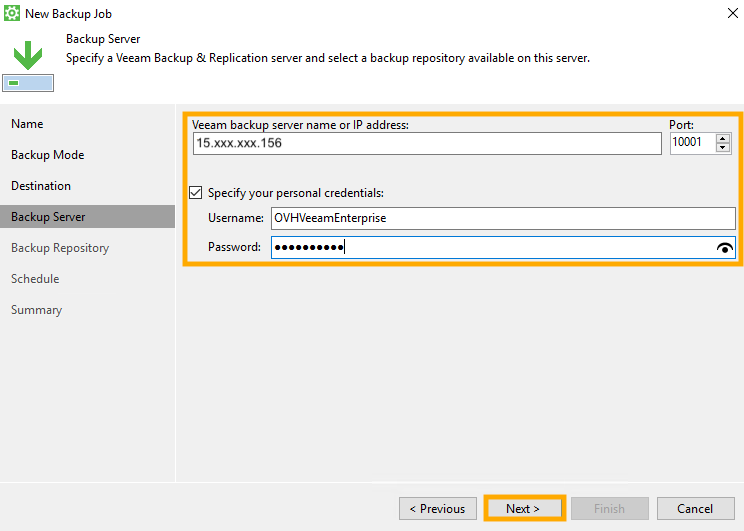{.thumbnail}

#### Backup repository

Select your **Backup repository** and, if desired, modify the retention policy.

Click `Next`{.action}.

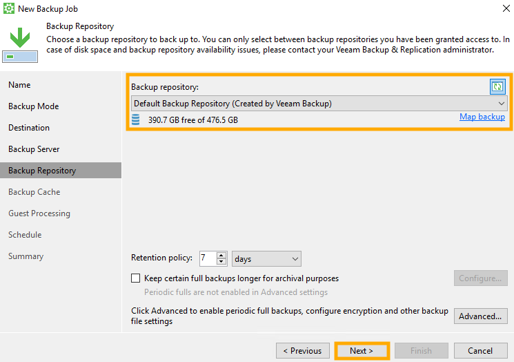{.thumbnail}

> [!warning]
> If you do not see "Standard S3" as an option for your backup repository, use the steps below to check the access permissions.
> From the Veeam Enterprise application interface, select `Backup Repositories`{.action}, right-click on your repository, and select `Access permissions...`{.action}.
>
> 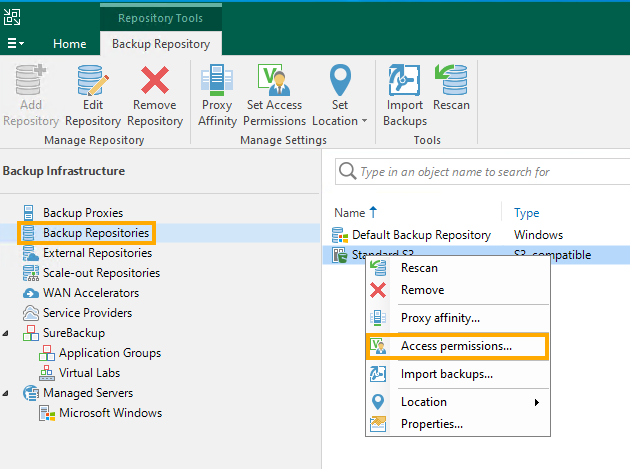{.thumbnail}
>
> In the `Standalone applications`{.action} tab, make sure one of the **Allow** options is selected for repository access. If you need to add your account or group, you can use the `Add...`{.action} button. If you made changes, select `OK`{.action} to apply them.
>
> 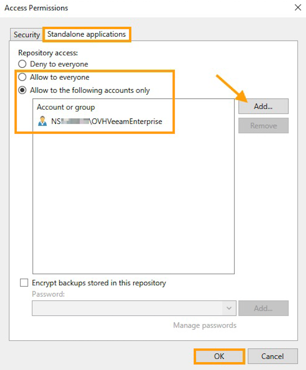{.thumbnail}
>

#### Backup cache (optional)

If desired, you can enable the backup cache if the remote backup target is temporarily unavailable.

Click `Next`{.action}.

{.thumbnail}

#### Guest processing (optional)

If you want, you can choose guest processing options.

Click `Next`{.action}.

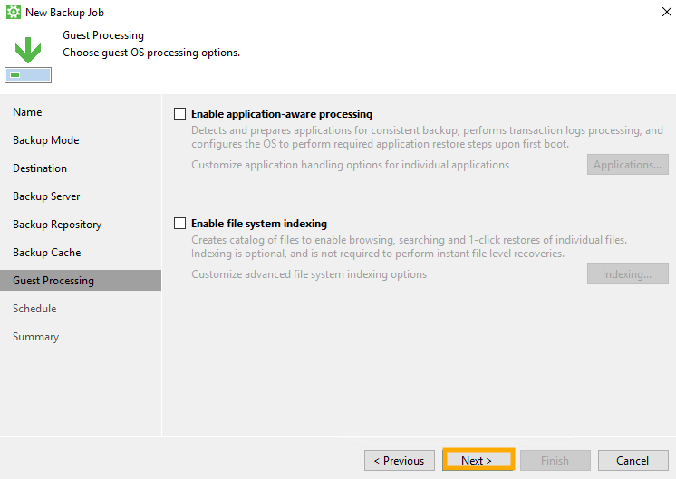{.thumbnail}

#### Schedule

Choose your backup schedule preferences and click `Apply`{.action}.

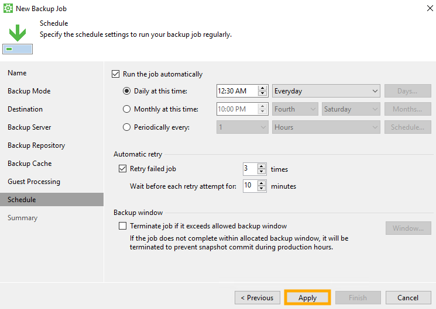{.thumbnail}

#### Summary

Review your settings. If you want the backup job to run as soon as you finish, tick the checkbox ☑ at the bottom of the window.

Click `Finish`{.action}.

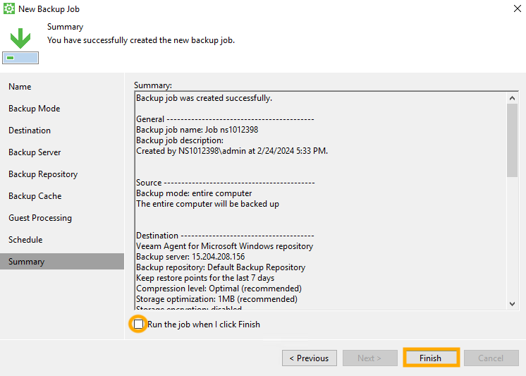{.thumbnail}

### Start your backup

Click the menu ☰ button, select the job you just created, and click `Backup Now`{.action}.

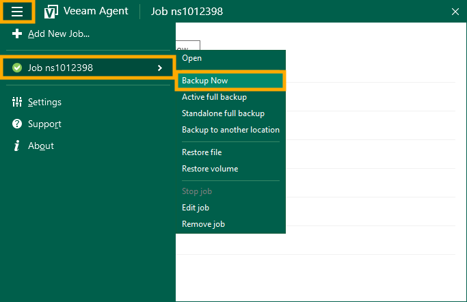{.thumbnail}

You can view the progress of your backup in the Veeam Agent application:

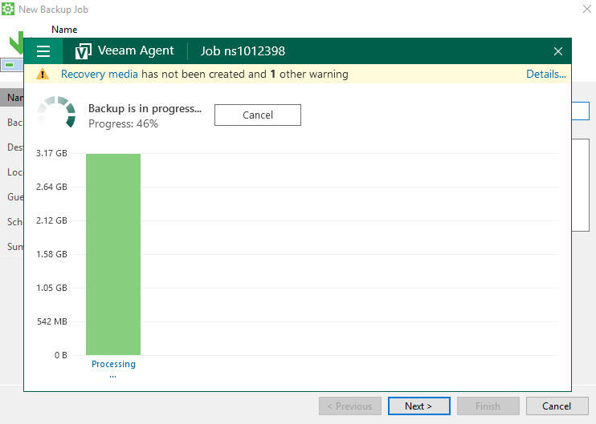{.thumbnail}

On the Veeam Backup and Recovery server, the backup job will appear:

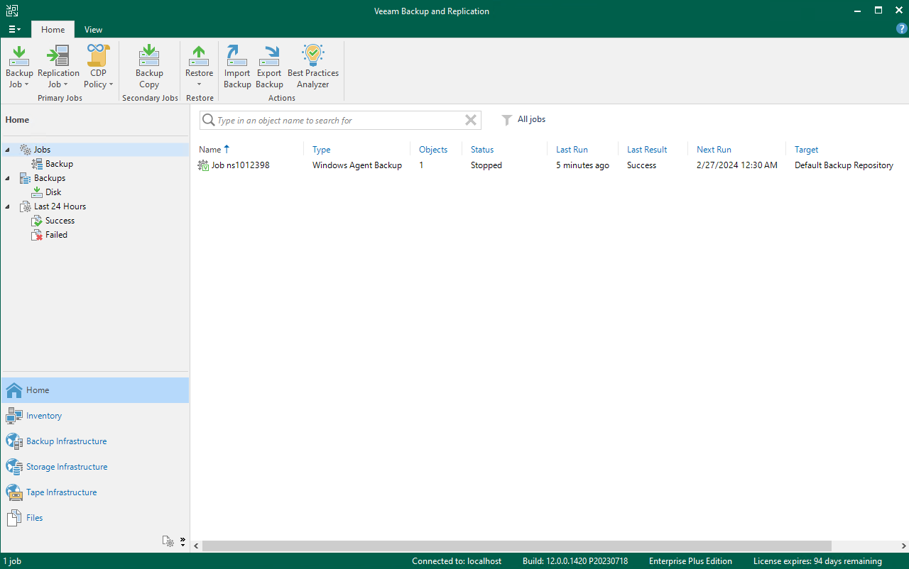{.thumbnail}

## Go further

[Restoring a Bare Metal Server with Veeam Enterprise](/pages/bare_metal_cloud/dedicated_servers/veeam-enterprise-server-restore)

[Veeam support site](https://www.veeam.com/knowledge-base.html)

Join our community of users on <https://community.ovh.com/en/>.
