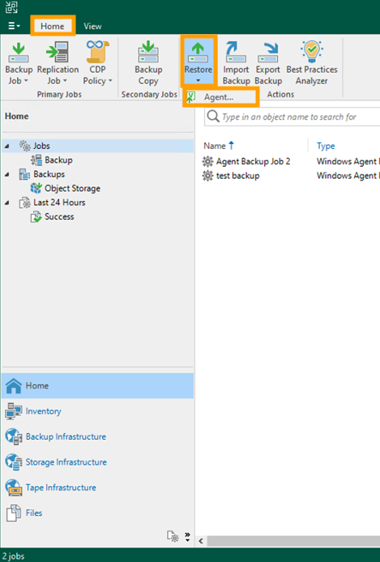
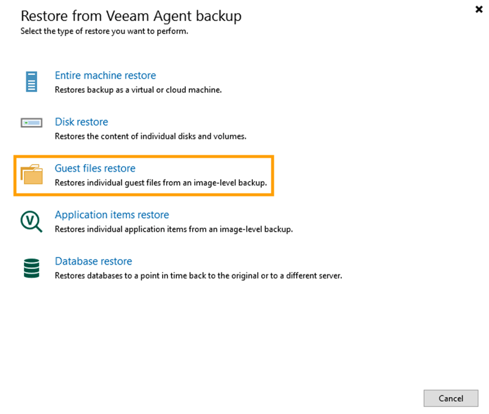
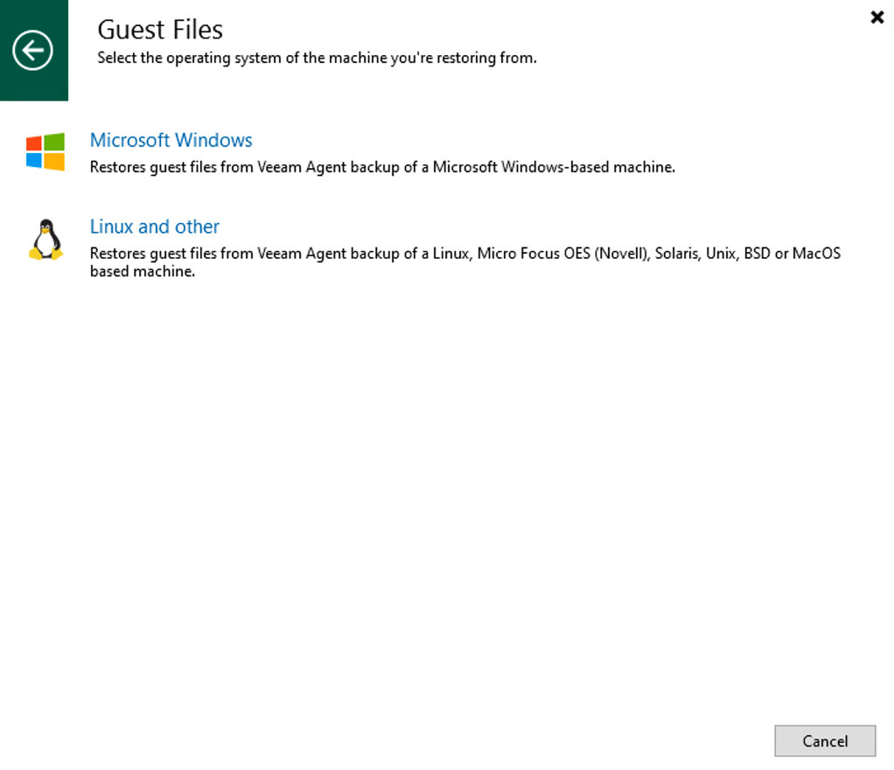
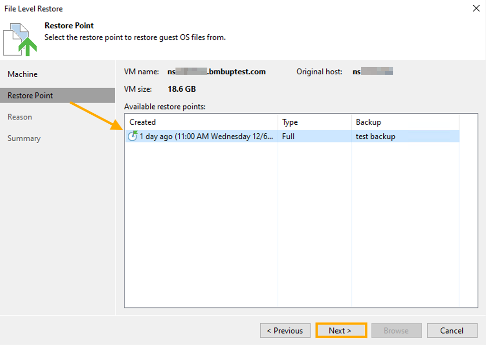
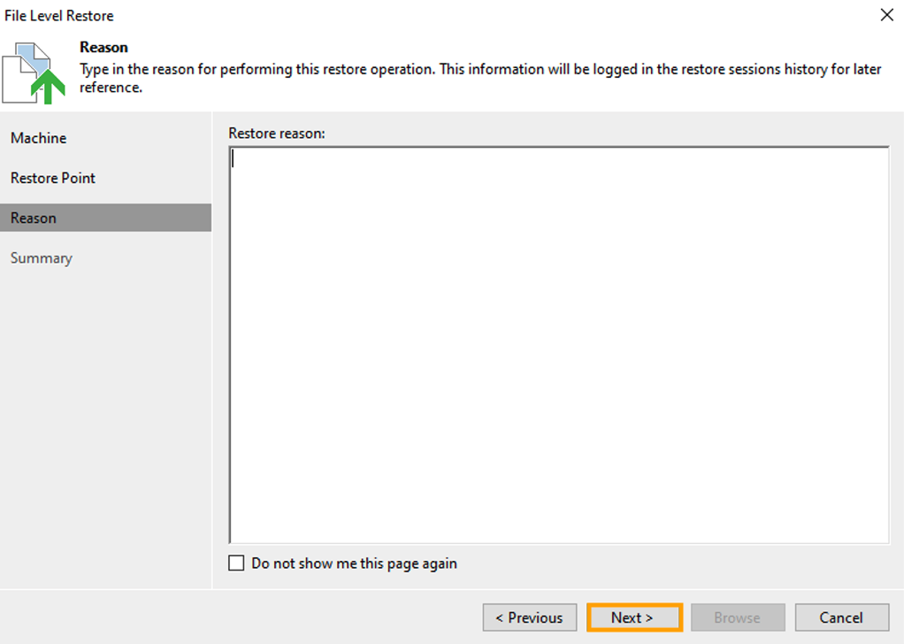
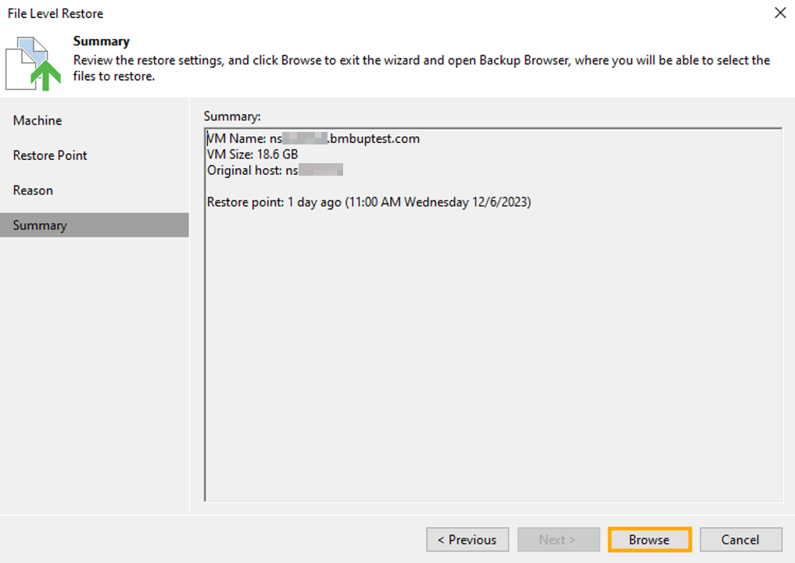
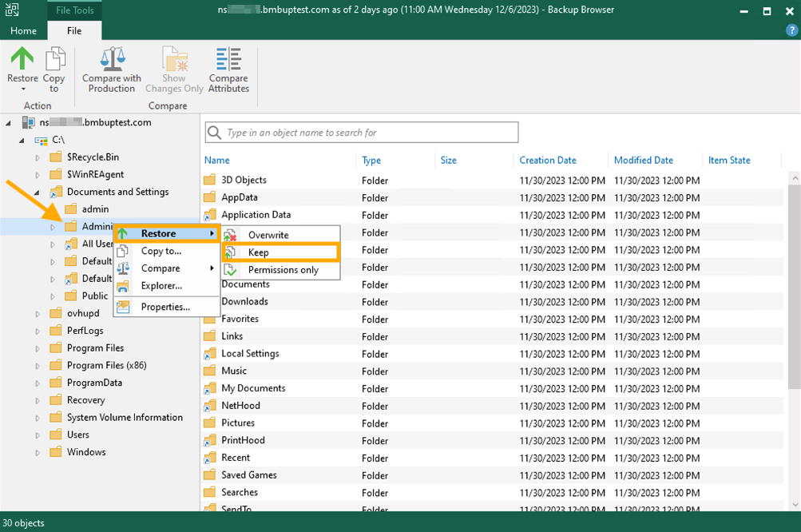

## Objective

If you are unable to restore data from a backup, it serves no purpose. After reading this article, you should have a clear process for restoring a Bare Metal Server or an individual file using Veeam Backup & Replication.

**Learn how to restore a Bare Metal Server using the Veeam Backup & Replication application.**

## Requirements

- An [OVHcloud Bare Metal server](https://www.ovhcloud.com/en-ca/bare-metal/)
- [Veeam Backup & Replication installed and registered](/pages/storage_and_backup/backup_and_disaster_recovery_solutions/veeam/veeam_veeam_backup_replication)

> [!primary]
> This guide presupposes that you have followed the steps detailed in our [Backing up a Bare Metal Server guides](/products/bare-metal-cloud-dedicated-servers-backup-restore).

## Instructions

There are several options for restoring data on a server. In this guide, we will be showing you the "Guest files restore" option.

In the Veeam Backup & Replication application, from the `Home`{.action} tab, click `Restore`{.action} and select the `Agent...`{.action} option.

{.thumbnail}

In the pop-up window, select `Guest files restore`{.action}.

{.thumbnail}

Choose the operating system of the machine from which you are restoring.

{.thumbnail}

Select the **Machine** that has the files you wish to restore.

Click the `Next`{.action} button.

{.thumbnail}

Choose the **Restore Point** from which to restore the files.

Click the `Next`{.action} button.

{.thumbnail}

Enter the **Restore reason**.

Click the `Next`{.action} button.

{.thumbnail}

At the Summary section, click the `Browse`{.action} button.

{.thumbnail}

Navigate through the browser and choose the file or files that you wish to restore. Once you have selected the file(s), right-click on one of them, hover your mouse over `Restore`.action}, and select `Keep`.action}.

{.thumbnail}

A pop-up window will appear that displays the progress of the restore. Once the progress is complete, the file has been restored and you can close the "Backup Browser" window.

{.thumbnail}

## Go further

Join our community of users on <https://community.ovh.com/en/>.
