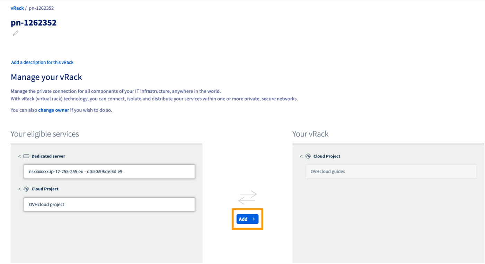
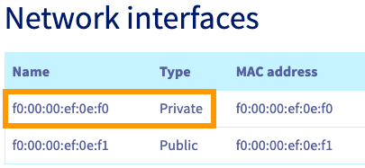
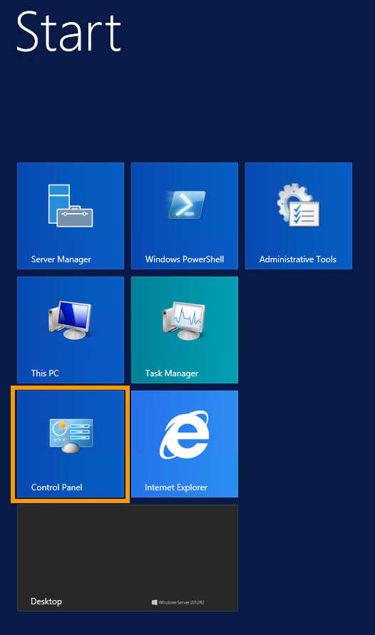
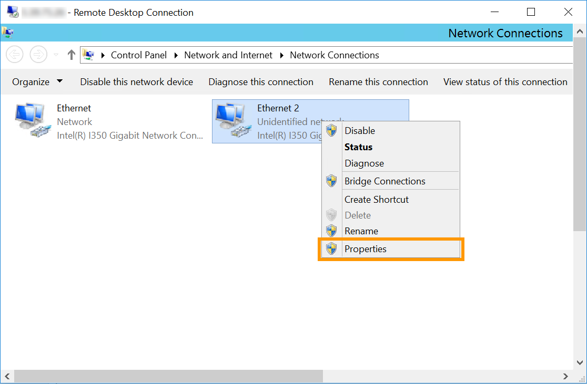
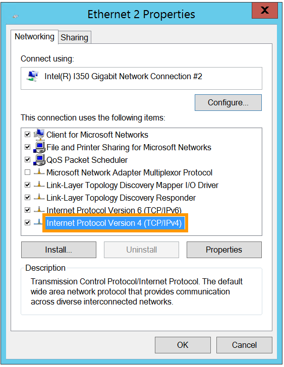

## Objetivo

O vRack (rack virtual) da OVHcloud permite agrupar virtualmente vários servidores (independentemente do seu número e da sua localização física nos nossos datacenters) e ligá-los a um switch virtual dentro da mesma rede privada. Desta forma, os seus servidores podem comunicar de forma privada e segura entre eles, no seio de uma VLAN dedicada.

**Saiba como configurar o vRack em vários servidores dedicados.**

<iframe class="video" width="560" height="315" src="https://www.youtube.com/embed/ZA7IsbDdAmc?rel=0" frameborder="0" allow="autoplay; encrypted-media" allowfullscreen></iframe>

## Requisitos

- Um serviço [vRack](/links/network/vrack) ativado na sua conta
- Vários [servidores dedicados](/links/bare-metal/bare-metal) (compatíveis com vRack)
- Dispor de um acesso de administrador (sudo) ao servidor através de SSH ou RDP
- Preparar o intervalo de endereços IP privados que escolheu

> [!warning]
> Esta funcionalidade pode estar indisponível ou limitada nos [servidores dedicados **Eco**](/links/bare-metal/eco-about).
>
> Para mais informações, consulte o nosso [comparativo](/links/bare-metal/eco-compare).

<!-- CP-NAV-START:network-vrack -->
---

### Acesso à Área de Cliente OVHcloud

- **Ligação direta:** [vRack](/links/control-panel/network-vrack)
- **Caminho de navegação:** `Network`{.action} > `Rede privada vRack`{.action}

---
<!-- CP-NAV-END:network-vrack -->

## Instruções

### Etapa 1: encomendar o vrack

Clique no botão `Adicionar um serviço`{.action} (ícone de um carrinho de compras) no menu à esquerda. Utilize o filtro na parte superior da página ou percorra a página até encontrar o serviço `vRack`{.action}.

{.thumbnail}

Clique na caixa `vRack`{.action} para ser redirecionado para a página a partir da qual poderá validar a encomenda. A configuração do vRack na sua conta demora alguns minutos.

### Etapa 2: adicionar os seus servidores ao vRack

Depois de ativar o vRack na sua conta, selecione o seu vRack na lista para apresentar a lista dos serviços elegíveis. Clique em cada um dos servidores que deseja adicionar ao vRack e, a seguir, em `Adicionar`{.action}.

{.thumbnail}

### Etapa 3: configuração das suas interfaces de rede

As etapas seguintes contêm as configurações das distribuições/sistemas operativos recentes mais frequentemente utilizadas. A primeira etapa consiste sempre em [ligar-se ao seu servidor](/pages/bare_metal_cloud/dedicated_servers/getting-started-with-dedicated-server) em SSH ou em sessão RDP (para Windows). Os exemplos abaixo pressupõem que está ligado enquanto utilizador com autorizações elevadas (Administrador/sudo).

> [!primary]
>
Relativamente às diferentes distribuições, saiba que o procedimento a seguir para configurar a sua interface de rede, bem como os nomes de ficheiros, podem ter sofrido alterações. Se encontrar dificuldades, recomendamos que consulte os manuais e as bases de conhecimentos das respetivas versões do sistema operativo.
>
Por exemplo, os detalhes de configuração abaixo terão o endereço IP `192.168.0.0/16` (**Máscara de sub-rede**: `255.255.0.0`).
>
Pode utilizar qualquer intervalo de IP privados à sua escolha e qualquer endereço nesta gama.
>

#### Identificação da interface vRack <a name="vrack-interface"></a>

Os nomes das interfaces de rede dos seus servidores nem sempre são os mesmos.

A melhor forma de verificar a interface correta para o vRack é verificar o separador `Interfaces de rede`{.action} do seu servidor na sua [Área de Cliente OVHcloud](/links/manager). Na tabela abaixo, tome nota do endereço MAC, que é também o **nome** da interface **Privada**.

{.thumbnail}

Depois de aceder ao servidor através de SSH, pode listar as suas interfaces de rede com o seguinte comando:

```bash
ip a
```

Na linha que começa por ```link ether```, pode verificar que esta interface corresponde à interface **Private** indicada na sua [Área de Cliente OVHcloud](/links/manager). Utilize este nome de interface para substituir `NETWORK_INTERFACE` nas configurações abaixo (exemplo: `eno2`).

```console
link ether f0:00:00:ef:0e:f0
```

Para efeitos de exemplo, utilizaremos o intervalo de endereços IP `192.168.0.0/16` (**Máscara de sub-rede**: `255.255.0.0`).

#### Configurações GNU/Linux

> [!tabs]
> **Debian 11**
>>
>> Num editor de texto, abra o ficheiro de configuração de rede situado em `/etc/network/interfaces.d` para o alterar. Aqui, o ficheiro chama-se `50-cloud-init`.
>>
>> ```bash
>> sudo nano /etc/network/interfaces.d/50-cloud-init
>> ```
>>
>> Adicione as seguintes linhas à configuração existente, substitua `NETWORK_INTERFACE`, `IP_ADDRESS` e `NETMASK` pelos seus próprios valores:
>>
>> ```console
>> auto NETWORK_INTERFACE
>> iface NETWORK_INTERFACE inet static
>>    address IP_ADDRESS
>>    netmask NETMASK
>> ```
>>
>> **Exemplo:**
>>
>> {.thumbnail}
>>
>> Registe as suas modificações no ficheiro de configuração e saia do editor.
>>
>> Reinicie o serviço de rede para aplicar a configuração:
>>
>> ```bash
>> sudo systemctl restart networking
>> ```
>>
>> Repita este procedimento para os seus outros servidores e atribua a cada um deles um endereço IP não utilizado a partir do seu intervalo privado. A partir daí, os seus servidores poderão comunicar entre si na rede privada.
>>
> **Ubuntu & Debian 12+**
>>
>> Com a ajuda do editor de texto à sua escolha, abra o ficheiro de configuração de rede que se encontra em `/etc/netplan/` para o editar. Aqui, o ficheiro chama-se `50-cloud-init.yaml`.
>>
>> ```bash
>> sudo nano /etc/netplan/50-cloud-init.yaml
>> ```
>>
>> Adicione as seguintes linhas à configuração existente após a linha `version: 2`. Substitua `NETWORK_INTERFACE` e `IP_ADDRESS/PREFIX` pelos seus próprios valores.
>>
>> ```yaml
>>    ethernets:
>>        NETWORK_INTERFACE:
>>            dhcp4: false
>>            addresses:
>>              - IP_ADDRESS/PREFIX
>> ```
>>
>> **Exemplo:**
>>
>> {.thumbnail}
>>
>> > [!warning]
>> >
>> > É importante respeitar o alinhamento de cada elemento nos ficheiros `yaml`, como representado no exemplo acima. Não utilize a tecla de tabulação para criar o seu espaçamento. Só deve ser utilizada a tecla de espaço.
>> >
>>
>> Registe as suas modificações no ficheiro de configuração e saia do editor.
>>
>> Aplicar a configuração:
>>
>> ```bash
>> sudo netplan apply
>> ```
>>
>> Repita este procedimento para os seus outros servidores e atribua a cada um deles um endereço IP não utilizado a partir do seu intervalo privado. A partir daí, os seus servidores poderão comunicar entre si na rede privada.
>>
> **AlmaLinux e Rocky Linux (8/9)**
>>
>> Depois de identificar a interface de rede privada, utilize o seguinte comando para criar um ficheiro de configuração de rede.
>>
>> Substitua `NETWORK_INTERFACE` pelo seu próprio valor.
>>
>> ```bash
>> sudo touch /etc/sysconfig/network-scripts/ifcfg-NETWORK_INTERFACE
>> ```
>>
>> Por exemplo, se a interface privada se chama `eth1`, obtemos o seguinte:
>>
>> ```bash
>> sudo touch /etc/sysconfig/network-scripts/ifcfg-eth1
>> ```
>>
>> Em seguida, utilize o editor de texto da sua escolha para editar este ficheiro.
>>
>> ```bash
>> sudo nano /etc/sysconfig/network-scripts/ifcfg-eth1
>> ```
>>
>> Adicione estas linhas, substituindo `NETWORK_INTERFACE`, `IP_ADDRESS` e `NETMASK` pelos seus próprios valores:
>>
>> ```console
>> DEVICE=NETWORK_INTERFACE
>> BOOTPROTO=static
>> IPADDR=IP_ADDRESS
>> NETMASK=NETMASK
>> ONBOOT=yes
>> TYPE=Ethernet
>> ```
>>
>> **Exemplo:**
>>
>> {.thumbnail}
>>
>> Registe as suas modificações no ficheiro de configuração e saia do editor.
>>
>> Reinicie o serviço de rede para aplicar as modificações:
>>
>> ```bash
>> sudo systemctl restart NetworkManager.service
>> ```
>>
>> Repita este procedimento para os seus outros servidores e atribua a cada um deles um endereço IP não utilizado a partir do seu intervalo privado. A partir daí, os seus servidores poderão comunicar entre si na rede privada.
>>
> **Fedora 42+, AlmaLinux e Rocky Linux (10)**
>>
>> Depois de identificar o nome da sua interface privada (como explicado [aqui](#vrack-interface)), execute o comando seguinte para verificar se ela está corretamente ligada. No nosso exemplo, a nossa interface é chamada `eno2`:
>>
>> ```bash 
>> $ nmcli device status
>>
>> DEVICE           TYPE      STATE                   CONNECTION
>> eno1             ethernet  connected               cloud-init eno1
>> lo               loopback  connected (externally)  lo
>> eno2             ethernet  disconnected            --
>> ```
>>
>> Se o `STATE` do `DEVICE` aparecer como `disconnected`, é necessário ligá-lo antes de configurar o IP.
>>
>> Ao adicionar uma ligação **ethernet**, é necessário criar um perfil de configuração que atribuiremos a um dispositivo.
>>
>> Execute o seguinte comando, substituindo `INTERFACE_NAME` e `CONNECTION_NAME` pelos seus próprios valores.
>>
>> No nosso exemplo, nomeámos o nosso perfil de configuração `private-interface`.
>>
>> ```bash
>> sudo nmcli connection add type ethernet con-name CONNECTION_NAME ifname INTERFACE_NAME
>> ```
>>
>> **Exemplo:**
>>
>> ```bash
>> sudo nmcli connection add type ethernet con-name private-interface ifname eno2
>> ```
>>
>> - Verifique se a interface está ligada corretamente:
>>
>> ```bash
>> $ nmcli device status
>> 
>> DEVICE           TYPE      STATE                   CONNECTION
>> eno1             ethernet  connected               cloud-init eno1
>> eno2             ethernet  connected               private-interface
>> lo               loopback  connected (externally)  lo              
>> ```
>>
>> Depois de fazer isto, será criado um novo ficheiro de configuração chamado *xxxxxxxxx.nmconnection* na pasta `/etc/NetworkManager/system-connections`.
>> 
>>
>> ```bash
>> [user@server ~]$ cd /etc/NetworkManager/system-connections
>> [user@server system-connections]$ ls
>> cloud-init-eno1.nmconnection  private-interface.nmconnection
>> ```
>>
>> Pode editar este ficheiro utilizando o gestor `nmcli`, substituindo `IP_ADDRESS`, `PREFIX` e `CONNECTION_NAME` pelos seus próprios valores.
>>
>> - Adicione o seu IP:
>>
>> ```bash
>> sudo nmcli connection modify CONNECTION_NAME IPv4.address IP_ADDRESS/PREFIX
>> ```
>>
>> **Exemplo:**
>>
>> ```bash
>> sudo nmcli connection modify private-interface IPv4.address 192.168.0.1/16
>> ```
>>
>> - Alterar a configuração de **auto** para **manual**:
>>
>> ```bash
>> sudo nmcli connection modify CONNECTION_NAME IPv4.method manual
>> ```
>>
>> **Exemplo:**
>>
>> ```bash
>> sudo nmcli connection modify private-interface IPv4.method manual
>> ```
>>
>> - Faça a configuração persistente:
>>
>> ```bash
>> sudo nmcli con mod CONNECTION_NAME connection.autoconnect true
>> ```
>>
>> **Exemplo:**
>>
>> ```bash
>> sudo nmcli con mod private-interface connection.autoconnect true
>> ```
>>
>> - Reinicie a sua rede com o seguinte comando:
>>
>> ```bash
>> sudo systemctl restart NetworkManager
>> ```

#### Configuração Windows

A título de exemplo, as seguintes configurações utilizarão o intervalo de endereços IP de `192.168.0.0/16` (**Máscara de sub-rede**: `255.255.0.0`).

Ligue-se ao seu servidor Windows através do ambiente de trabalho remoto e entre no **Painel de Controlo**.

{.thumbnail}

Clique em `Rede e Internet`{.action}.

{.thumbnail}

Abra `Centro de Rede e Partilha`{.action}.

{.thumbnail}

Clique em `Alterar definições de placa`{.action}.

{.thumbnail}

Clique com o botão direito do rato na interface de rede secundária e clique em `Propriedades`{.action}.

Note que, no nosso exemplo, o `Ethernet 2` é a interface utilizada para o vRack. No entanto, é possível que a placa de rede vRack utilize uma interface diferente. Utilize uma interface que não possui o endereço IP principal do servidor ou que utiliza um endereço IP autoatribuído.

{.thumbnail}

Clique duas vezes em `Internet Protocol Version 4 (TCP/IPv4)`{.action}.

{.thumbnail}

Clique em `Utilizar o seguinte endereço IP`{.action}. Introduza qualquer **Endereço IP** da sua gama privada e a **Máscara de sub-rede** adequada (`255.255.0.0` neste exemplo) no campo correspondente.

{.thumbnail}

Clique em `OK`{.action} para guardar as modificações e reinicie o seu servidor para as aplicar.

Repita este procedimento para os seus outros servidores e atribua a cada um deles um endereço IP não utilizado a partir do seu intervalo privado. A partir daí, os seus servidores poderão comunicar entre si na rede privada.

## Quer saber mais?

[Criar várias VLAN no vRack](/pages/bare_metal_cloud/dedicated_servers/creating-multiple-vlans-in-a-vrack)

Junte-se à nossa [comunidade de utilizadores](/links/community).