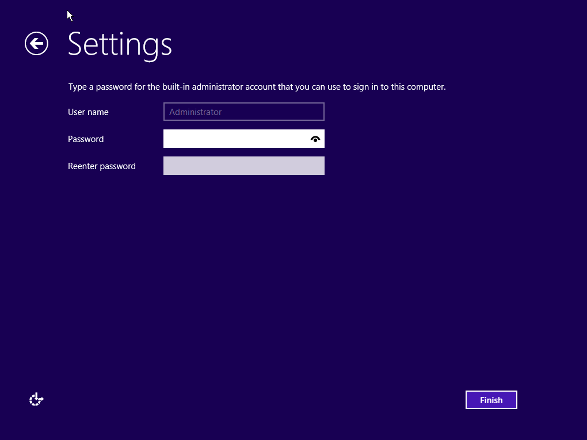
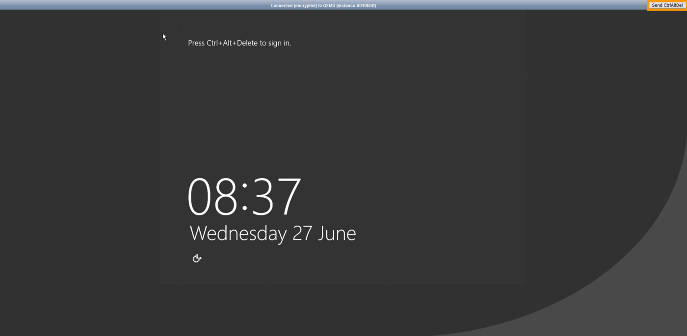
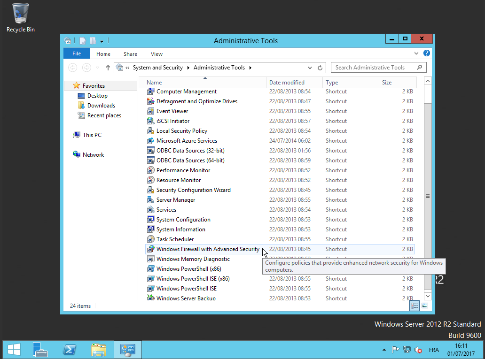

> [!primary]
> Questa traduzione è stata generata automaticamente dal nostro partner SYSTRAN. I contenuti potrebbero presentare imprecisioni, ad esempio la nomenclatura dei pulsanti o alcuni dettagli tecnici. In caso di dubbi consigliamo di fare riferimento alla versione inglese o francese della guida. Per aiutarci a migliorare questa traduzione, utilizza il pulsante "Contribuisci" di questa pagina.
>

## Obiettivo

Dopo una nuova installazione di un sistema operativo Windows Server su un server dedicato, l'accesso remoto e la risposta ICMP (Internet Control Message Protocol) possono essere disattivati.

**Questa guida ti mostra come configurare Windows per riattivare l'ICMP e autorizzare le connessioni tramite il protocollo Remote Desktop Protocol.**

## Prerequisiti

- Una distribuzione Windows installata su un [server dedicato OVHcloud](https://www.ovhcloud.com/it/bare-metal/)
- Avere accesso allo [Spazio Cliente OVHcloud](https://www.ovh.com/auth/?action=gotomanager&from=https://www.ovh.it/&ovhSubsidiary=it)

## Procedura

### Step 1: accesso al KVM

Per accedere alla console KVM del tuo server dedicato, consulta la [guida KVM](/pages/bare_metal_cloud/dedicated_servers/using_ipmi_on_dedicated_servers#utilizza-kvm-sul-tuo-browser-web-solo-per-i-server-piu-recenti).

### Step 2: completare l'installazione di Windows

Una volta stabilita la sessione KVM, visualizzi gli schermi di configurazione iniziale. È necessario configurare qui il tuo **paese/regione**, la **lingua di Windows** e la tua **disposizione di tastiera**. Una volta completata l'operazione clicca su `Next`{.action}.

{.thumbnail}

Nel secondo schermo, inserisci una password per il tuo account Amministratore e confermala, poi clicca su `Finish`{.action}.

{.thumbnail}

Windows applicherà le tue impostazioni e mostrerà la schermata di connessione. Clicca sul pulsante `Send CtrlAltDel`{.action} nell'angolo superiore destro per connetterti.

{.thumbnail}

Inserisci la password creata per il tuo account Amministratore e clicca sulla freccia.

{.thumbnail}

La configurazione iniziale è stata completata. Una volta connesso, è necessario modificare i parametri del firewall Windows.

### Step 3: modifica il firewall Windows

Apri gli `strumenti di amministrazione`{.action} del pannello di configurazione `Sistema e Sicurezza`{.action} e clicca su `Firewall Windows con sicurezza avanzata`{.action}.

{.thumbnail}

Puoi attivare qui le regole "ICMP" e "Remote Desktop" (desktop remoto) rispettive. Clicca con il tasto destro sulla regola e seleziona `Autorizza la regola`{.action} nel menu contestuale.

{.thumbnail}

A questo punto il tuo server dovrebbe rispondere alle richieste che utilizzano questi protocolli.

> [!primary]
> Per rendere sicuro il tuo sistema Windows con le regole del firewall, consulta la nostra guida [Configura il firewall su Windows](/pages/bare_metal_cloud/dedicated_servers/activate-port-firewall-soft-win).
>

### Attivazione dei log di avvio (boot log) Windows (facoltativo)

L'attivazione dei log di avvio (*boot log*) Windows può essere utile per la diagnostica di errori sul server.

Accedi al tuo server tramite una sessione "Remote Desktop" (desktop remoto) o [KVM](/pages/bare_metal_cloud/dedicated_servers/using_ipmi_on_dedicated_servers#utilizza-kvm-sul-tuo-browser-web-solo-per-i-server-piu-recenti). Apri il menu Start di Windows e clicca su `Esegui`{.action}.

{.thumbnail}

Inserisci "msconfig" e clicca su `OK`{.action}.

{.thumbnail}

Nella nuova finestra, spunta la casella accanto a `Boot log`. Clicca su `OK`{.action}.

{.thumbnail}

Al prossimo avvio del tuo server, i log saranno registrati in un file .txt. La via del file è `C:\Windows\ntbtlog.txt`.

Per accedere al contenuto di questo file in modalità Rescue, segui le indicazioni descritte nella [guida sulla modalità Rescue](/pages/bare_metal_cloud/dedicated_servers/rescue_mode).

## Per saperne di più

[Configura il firewall su Windows](/pages/bare_metal_cloud/dedicated_servers/activate-port-firewall-soft-win)

Se avete bisogno di formazione o di assistenza tecnica per implementare le nostre soluzioni, contattate il vostro rappresentante o cliccate su [questo link](https://www.ovhcloud.com/it/professional-services/) per ottenere un preventivo e richiedere un'analisi personalizzata del vostro progetto da parte dei nostri esperti del team Professional Services.

Contatta la nostra Community di utenti all’indirizzo <https://community.ovh.com/en/>.
