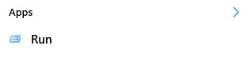
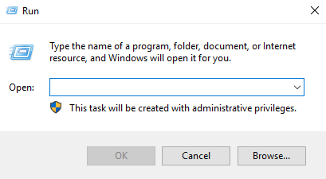

> [!primary]
> Esta tradução foi automaticamente gerada pelo nosso parceiro SYSTRAN. Em certos casos, poderão ocorrer formulações imprecisas, como por exemplo nomes de botões ou detalhes técnicos. Recomendamos que consulte a versão inglesa ou francesa do manual, caso tenha alguma dúvida. Se nos quiser ajudar a melhorar esta tradução, clique em "Contribuir" nesta página.
>

## Sumário

Por vezes, durante a instalação de um sistema operativo Windows Server, a chave de produto não é inserida de forma correta. Neste caso, o sistema é ativado em modo de avaliação (período de 120 dias) com uma chave predefinida. Terminado este prazo, o sistema fica indisponível.

**Este guia explica como inserir a chave de produto correta do Windows Server.**

## Requisitos

- Ter um [servidor dedicado](/links/websitebare-metal/os/server-windows/) com Windows instalado na sua conta OVHcloud
- Ter uma licença Windows SPLA na sua conta OVHcloud
- Ter acesso ao servidor via desktop remoto

## Instruções

### Eliminar chave predefinida

No período de avaliação, o sistema Windows funciona com uma chave predefinida. Para alterar esta chave, abra a janela `Executar`{.action} (prima o logo Windows + tecla `R`{.action}):

{.thumbnail}

{.thumbnail}

Agora insira a seguinte comando:

```bash
cscript.exe c:\windows\system32\slmgr.vbs -upk
```

### Adicionar a nova chave

Para adicionar a nova chave, volte à janela `Executar`{.action} e insira o comando:

```bash
cscript.exe c:\windows\system32\slmgr.vbs -ipk CHAVE KMS
```

As chaves do produto das versões suportadas do Windows Server podem ser encontradas na tabela disponível na [página oficial da Microsoft](https://learn.microsoft.com/en-gb/windows-server/get-started/kms-client-activation-keys).

> [!primary]
>
> As versões Server Core e não Core usam as mesmas chaves.
> 

### Usar kms.ovh.net

Para que a chave seja associada ao nosso robot de ativação, abra a janela `Executar`{.action} e execute o comando indicado abaixo.

```bash
cscript.exe c:\windows\system32\slmgr.vbs -skms kms.ovh.net
```

> [!primary]
>
> Se estiver a usar um VPS, ou uma instância Public Cloud, é necessário usar `kms.cloud.ovh.net`.
> 

### Ativar o sistema

Finalmente, para ativar o sistema Windows, basta executar este comando:

```bash
cscript.exe c:\windows\system32\slmgr.vbs -ato
```

## Quer saber mais?

Fale com a nossa comunidade de utilizadores: <https://community.ovh.com/en/>.