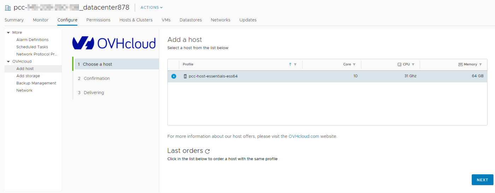
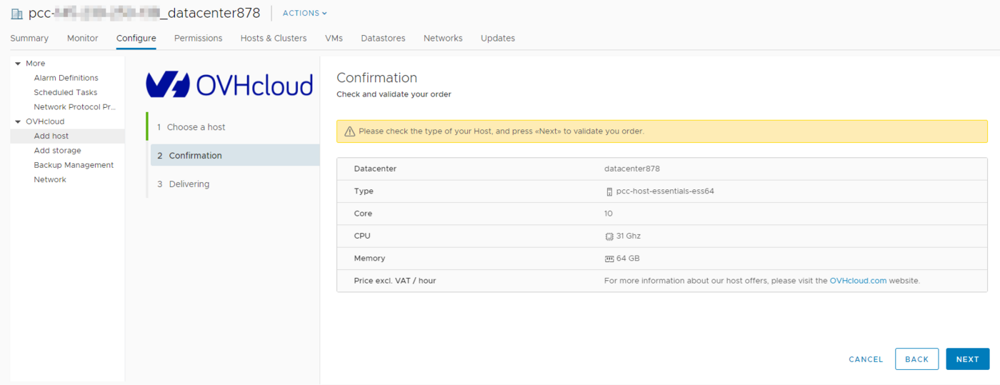
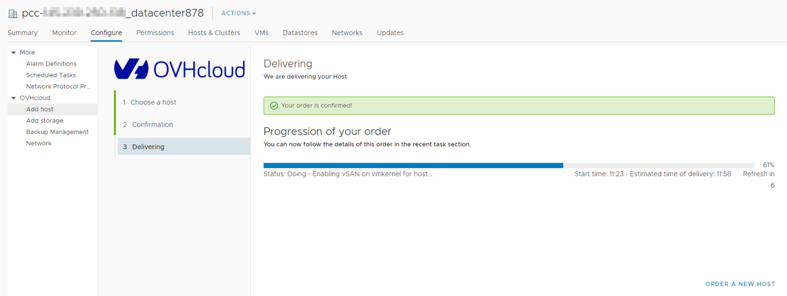

**Last updated 15th December 2020**

## Objective

With our [Managed Bare Metal solutions](https://www.ovhcloud.com/en-gb/managed-bare-metal/){.external}, you can add resources that are billed per hour of usage.

**This guide will show you how to add hourly resources via the Managed Bare Metal vSphere interface.**

## Requirements

- a [Managed Bare Metal](https://www.ovhcloud.com/en-gb/managed-bare-metal/){.external} solution
- [the "Add resources"](/pages/bare_metal_cloud/managed_bare_metal/change-user-rights){.external} right for the datacentre concerned (this right is granted via the [OVHcloud Control Panel](https://www.ovh.com/auth/?action=gotomanager&from=https://www.ovh.co.uk/&ovhSubsidiary=GB){.external})
- access to the vSphere client

## Instructions

### Select the resource

To access the interface where you can add hourly resources, select the datacenter, then click `Configure`{.action}.

{.thumbnail}

In our example, we will add a host server that will be billed per hour. Once you have chosen a model, click `Next`{.action}. Please note that to add a datastore, you will need to click on the `Add storage`{.action} tab.

{.thumbnail}

### Confirm the order

To confirm and finalise your order, click `Next`{.action}.

{.thumbnail}

### Track the setup

Once you have confirmed your order, you can track progress as the resource is being added.

{.thumbnail}

A task will also appear in the 'recent tasks' list on your vSphere interface. You can also use this task to track the resource addition.

## Go further

Join our community of users on <https://community.ovh.com/en/>.