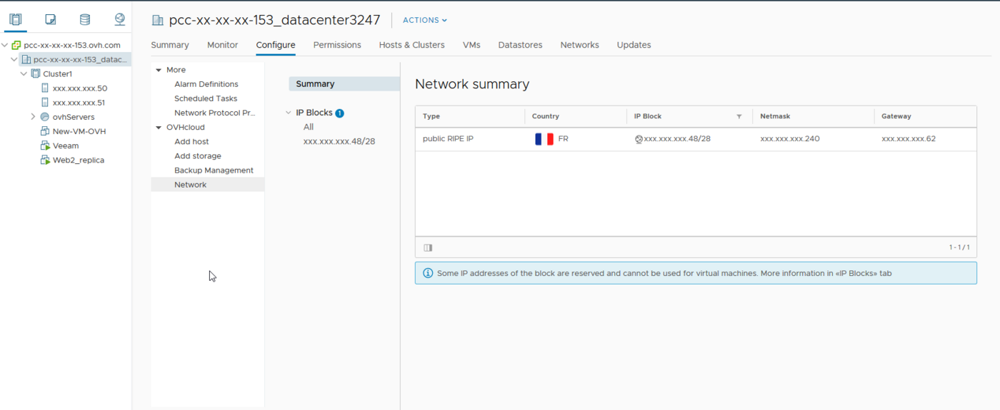

## Objective

After you have created a virtual machine (VM), you can assign to it a public or private IP address so that the VM has internet and/or private network connectivity.

**This guide will show you how to assign a public or private IP address to a virtual machine.**

## Requirements

- You must have already created a virtual machine.
- You will need an IP block.

## Instructions

### Retrieve your information

> [!tabs]
> IPv4
>>
>> You can retrieve the information of your public IPv4 address block directly from the vSphere client, by going to the `Hosts and clusters`{.action} section. Then click on your datacentre and choose the `Configure`{.action} tab. Then click `Network`{.action} below `OVHcloud`.
>>
>> {.thumbnail}
>>
>> On each block delivered by OVHcloud, 5 IP addresses are reserved for network configuration and should never be used for your virtual machines. This is the first and the last four IPs in the block.
>
>> A Private Cloud IP block is organized as follows:
>>
>> - The first IP address marked as `reserved` corresponds to the network address.
>> - The following IPs can be used for your virtual machines. They are marked as `Available` if no VM is using them, or as `Used` if they are being used.
>> - The last four IPs in the block are reserved, two are dedicated to OVHcloud routers for operating the block, and the other two are used for gateway and broadcast.
>>
>> {.thumbnail}
>>
> IPv6
>>
>>> [!warning]
>>>
>>> By default, the IPv6 block delivered with your Dedicated Cloud is not activated, so you will need to open a [support request](https://help.ovhcloud.com/csm?id=csm_get_help) to request its activation.
>>>
>>
>> You can retrieve your public IPv6 address block information via the OVHcloud Control Panel by going to the [Manage my IPs](https://www.ovh.com/manager/#/dedicated/ip?serviceType=pcc&page=1) section.
>>
>> Before you begin, and in order to use the same terminology during the changes, please read the table below. It references terms that we will use in this documentation:
>>
>> |Term|Description|Example|
>> |---|---|---|
>> |YOUR_IPV6|This is an IPv6 address of the IPv6 block assigned to your service|2001:41d0:xxxx:xxxx::1|
>> |IPv6_PREFIX|This is the prefix (or *netmask*) of your IPv6 block, usually 64|2001:41d0:xxxx:xxxx::/56|
>> |IPv6_GATEWAY|This is the gateway (or *gateway*) of your IPv6 block|2001:41d0:xxxx:xxxx:ffff:ffff:ffff:ffff|
>>

### Configure a public IP address

To configure a public IP address on your virtual machine, you must first choose the `VMNetwork`{.action} interface in your VM network adapter settings:

{.thumbnail}

> [!tabs]
> Linux IPv4
>>
>> Here is an example of a configuration on the Debian distribution:
>>
>> {.thumbnail}
>>
>> ```sh
>> auto eth0
>> iface eth0 inet static
>> address 46.105.220.xxx
>> netmask 255.255.255.240
>> broadcast 46.105.220.xxx
>> gateway 46.105.220.xxx
>> dns-nameservers 213.186.33.99
>> ```
>>
>> Restart your network system with `systemctl restart networking`.
>>
>> You can check the configuration with `ip a`.
>>
>> If your virtual machine cannot find the network, make sure that the network adapter is configured on *VMNetwork* and not on *LocalPortGroup* or a VLAN, and that the adapter’s connection box is ticked.
>>
> Windows IPv4
>>
>> Here is an example of a configuration on Windows:
>>
>> In the `Control Panel`{.action}, go to `Network and Internet`{.action} then `Network and Sharing Center`{.action} and then `Modify the network adapter`{.action}.
>>
>> To go faster, you can click on the Windows search field and write `Run` (which corresponds to simultaneously pressing the *Windows* key and the *R* key of your keyboard). The Windows command console will open, and you can enter the following command:
>>
>> ```shell
>> ncpa.cpl
>> ```
>>
>> Then right-click the network adapter corresponding to the VMNetwork and select `Properties`{.action). Then select `TCP/IP v4 protocol`{.action} and click on `Properties`{.action) and enter your IP information as follows:
>>
>> {.thumbnail}
>>
>>```sh
>> IP Address: 46.105.220.xxx
>> Subnet Mask: 255.255.255.240
>> Default Gateway: 46.105.220.yyy
>> DNS Server: 213.186.33.99
>> ```
>>
> Linux IPv6
>>
>> Here is an example of a network configuration on the Debian distribution:
>>
>> {.thumbnail}
>>
>> ```sh
>> auto eth0
>> iface eth0 inet6 static
>> address 2001:41d0:xxxx:xxxx::
>> netmask 56
>> gateway 2001:41d0:xxxx:xxxx:ffff:ffff:ffff:ffff
>> ```
>>
>> Restart your network system with `systemctl restart networking`.
>>
>> You can check the configuration with `ip a`.
>>
>> If your virtual machine cannot find the network, make sure to check if the network card is configured on VMNetwork and not on LocalPortGroup or a VLAN, and that the network card's connection checkbox is checked.
>>
> Windows IPv6
>>
>> Here is an example of a configuration on Windows:
>>
>> In the `Control Panel`{.action}, go to `Network and Internet`{.action} then `Network and Sharing Center`{.action} and then `Modify the network adapter`{.action}.
>>
>> To go faster, you can click on the Windows search field and write `Run` (which corresponds to simultaneously pressing the *Windows* key and the *R* key of your keyboard). The Windows command console will open, and you can enter the following command:
>>
>> ```shell
>> ncpa.cpl
>> ```
>>
>> Then right-click the network adapter corresponding to the VMNetwork and select `Properties`{.action). Then select `TCP/IP v4 protocol`{.action} and click on `Properties`{.action) and enter your IP information as follows:
>>
>> {.thumbnail}
>>
>> ```sh
>> IP Address: 2001:41d0:xxxx:xxxx::
>> Subnet Mask: 56
>> Default Gateway: 2001:41d0:xxxx:xxxx:ffff:ffff:ffff:ffff
>> DNS Server: 2001:41d0:3:163::1
>> ```
>>

### Configure a private IP address

The process for configuring a private IP address is similar to that of a public IP address. However, you must use the network adapter configured for your VLAN or VxLAN.

In your interface options, you can edit the following settings:

- A VLAN interface (10 to 20 by default and linked to the vRack, you can create more by consulting [this guide](/pages/hosted_private_cloud/hosted_private_cloud_powered_by_vmware/creation_vlan)).

- A VxLAN interface (vxw-dvs, etc.).

In your virtual machine settings, you can use a VLAN or a VxLAN:

{.thumbnail}

{.thumbnail}

{.thumbnail}

#### Linux

Here is a configuration example on a Debian operating system:

{.thumbnail}

By editing the interfaces file, you can assign a private IP address on your chosen IP range:

```sh
auto eth0
iface eth0 inet static
address 192.168.70.1
netmask 255.255.255.0
gateway 192.168.70.254
```

Restart your network system with `systemctl restart networking`.

You can check the configuration with `ip a`.

#### Windows

Here is a configuration example for Windows:

In the `configuration panel`{.action}, go to `Network and Internet`{.action}, then `Network and Sharing Centre`{.action}, and then to `Change Network Adapter`{.action}.

To speed up the process, you can click on the Windows search field and write `Run` (or press the *Windows* and *R* keys at the same time). The Windows command console will open, and you can enter this command:

```shell
ncpa.cpl
```

Right-click on the corresponding VMNetwork adapter and click `Properties`{.action}. Then select `TCP/IPv4 protocol`{.action} and click again on `Properties`{.action}, then enter your IP information as follows:

{.thumbnail}

By modifying this interface, you can assign a private IP address on your chosen IP range:

```sh
IP address: 192.168.70.2
Subnet mask: 255.255.255.0
Default gateway: 192.168.70.254
```

## Go further

Join our community of users on <https://community.ovh.com/en/>.
