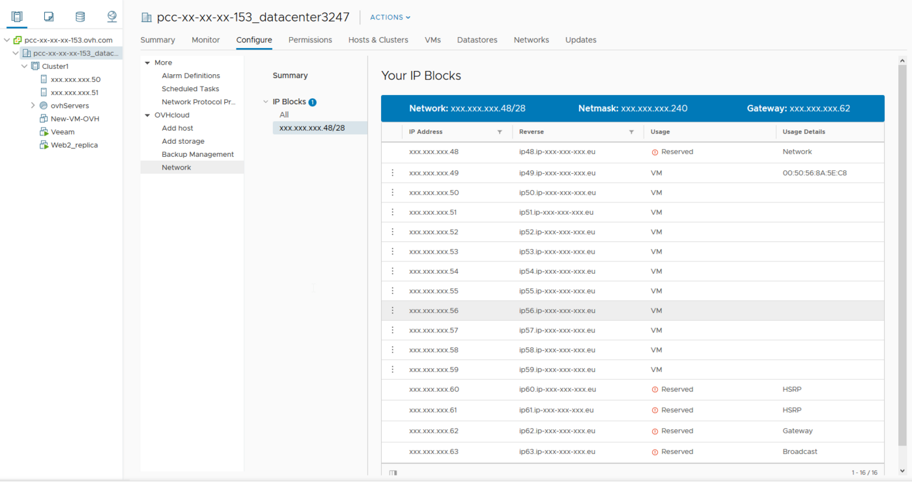

**Última atualização: 18/11/2020**

## Objetivo

Depois de criar uma máquina virtual (VM) na sua infraestrutura, pode atribuir-lhe um IP público ou privado.

**Este manual explica-lhe como realizar esta configuração.**

## Requisitos

- Ter criado uma máquina virtual.
- Dispor de um bloco de endereços IP.

## Instruções

### Obter as informações

Pode recuperar as informações do bloco de endereços IP públicos diretamente a partir do cliente vSphere, acedendo à secção `Hosts e clusters`{.action}. A seguir, clique no seu datacenter e selecione o separador `Configurar`{.action}. Clique em `Rede`{.action} abaixo de `OVHcloud`.

{.thumbnail}

Em cada bloco entregue pela OVHcloud, cinco endereços IP são reservados para a configuração da rede e nunca devem ser utilizados para as suas máquinas virtuais. Trata-se do primeiro e dos últimos quatro endereços IP do bloco.

Um bloco IP Managed Bare Metal está organizado da seguinte forma:

- o primeiro endereço IP marcado como reservado (`Reserved`) corresponde ao endereço da rede;
- os seguintes endereços IP podem ser usados para as suas máquinas virtuais. Estão indicados como disponíveis (`Available`) se nenhuma VM as explorar ou como utilizados (`Used`), caso contrário;
- os quatro últimos endereços IP do bloco estão reservados, dois são dedicados aos routers da OVHcloud para o funcionamento do bloco e os outros dois são utilizados para a gateway e o broadcast.

{.thumbnail}

### Configurar um IP público

Para configurar um IP público na sua máquina virtual, deve ter previamente escolhido a interface `VMNetwork`{.action} nos parâmetros da placa de rede da sua VM:

{.thumbnail}

#### Linux

Eis um exemplo de configuração na distribuição Debian:

{.thumbnail}

```sh
auto eth0
iface eth0 inet static
address 46.105.220.xxx
netmask 255.255.255.240
broadcast 46.105.220.xxx
gateway 46.105.220.xxx
dns-nameservers 213.186.33.99
```

Monte a placa com um `ifup` da sua interface.

Também pode verificar a configuração com um `ifconfig`.

Se a sua máquina virtual não encontrar a rede, verifique se a placa de rede está configurada no *VMNetwork* e não no *LocalPortGroup* ou numa VLAN, e que a caixa de ligação da placa está selecionada.

#### Windows

Eis um exemplo de configuração no Windows:

No `painel de configuração`{.action}, deverá aceder a `Rede e Internet`{.action} > `Centro de rede e partilha`{.action} e, por fim, `Modificar o adaptador de rede`{.action}.

Para ir mais rápido, pode clicar no campo de pesquisa Windows e escrever `Run` (o que corresponde a pressionar simultaneamente a tecla *Windows* do seu teclado e a tecla *R*). A consola de execução Windows será aberta e poderá introduzir o seguinte comando:

```shell
ncpa.cpl
```

De seguida, clique com o botão direito do rato na placa de rede correspondente ao VMNetwork e em `Propriedades`{.action). Selecione `Protocolo TCP/IP v4`{.action}, clique novamente em 'Properties' e introduza as informações do seu IP da seguinte forma:

{.thumbnail}

```sh
Endereço IP: 46.105.220.xxx
Máscara de sub-rede: 255.255.255.240
Gateway predefinida: 46.105.220.yyy
Servidor DNS: 213.186.33.99
```

### Configurar um IP privado

A configuração de um IP privado é semelhante à de um IP público. No entanto, deve utilizar a placa de rede configurada para a sua VLAN.

Na escolha da sua interface, pode editar os seguintes parâmetros:

- uma interface VLAN (10 a 20 por predefinição e ligadas ao vRack, pode criar mais através [deste manual](/pages/bare_metal_cloud/managed_bare_metal/vlan-creation)).

Nos parâmetros da sua máquina virtual, pode utilizar uma VLAN :

{.thumbnail}

{.thumbnail}

#### Linux

Eis um exemplo de configuração na distribuição Debian:

{.thumbnail}

Ao editar o ficheiro de interfaces, pode indicar um IP privado no intervalo IP à sua escolha:

```sh
auto eth0
iface eth0 inet static
address 192.168.70.1
netmask 255.255.255.0
gateway 192.168.70.254
```

Monte a placa com um `ifup` da sua interface.

Também poderá verificar a configuração com um `ifconfig`.

#### Windows

Eis um exemplo de configuração no Windows:

No `painel de configuração`{.action}, aceda a `Rede e Internet`{.action} > `Centro de rede e partilha`{.action} e, por fim, `Modificar o adaptador de rede`{.action}.

Para ir mais rápido, pode clicar no campo de pesquisa Windows e escrever `Run` (o que corresponde a pressionar simultaneamente a tecla *Windows* do seu teclado e a tecla *R*). A consola de execução Windows será aberta e poderá introduzir o seguinte comando:

```shell
ncpa.cpl
```

De seguida, clique com o botão direito do rato na placa de rede correspondente ao VMNetwork e em `Propriedades`{.action). De seguida, selecione o `Protocolo TCP/IP v4`{.action} e clique novamente em 'Properties' e introduza as informações do seu IP da seguinte forma:

{.thumbnail}

Ao alterar esta interface, pode indicar um IP privado no intervalo IP à sua escolha:

```sh
Endereço IP: 192.168.70.2
Máscara de sub-rede: 255.255.255.0
Gateway predefinida: 192.168.70.254
```


## Quer saber mais?

Fale com a nossa comunidade de utilizadores em <https://community.ovh.com/en/>.
