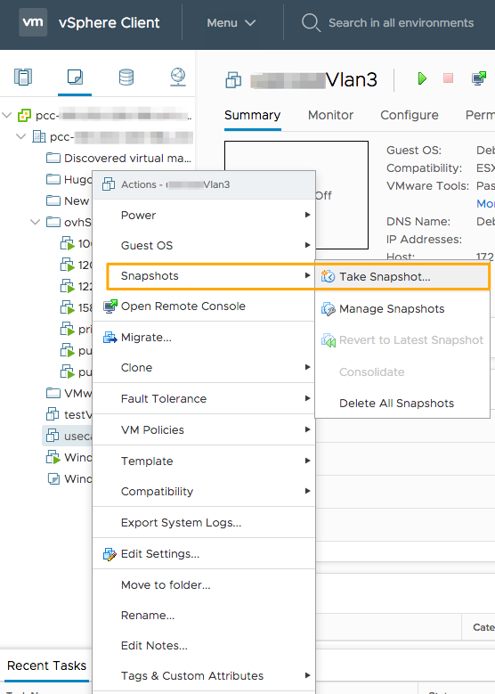
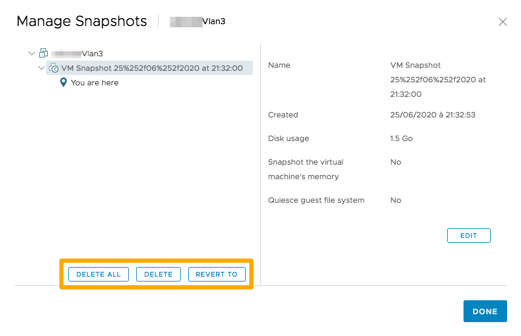

**Última atualização: 18/11/2020**

## Objetivo 

Pode tirar uma snapshot de uma máquina virtual. Uma vez tirada a snapshot, pode restaurar todas as máquinas virtuais na snapshot mais recente ou eliminar a snapshot.

**Este manual explica o funcionamento das snapshots.**

## Requisitos

- Ter um produto [Managed Bare Metal](https://www.ovhcloud.com/pt/managed-bare-metal/){.external}.
- Estabelecer uma ligação ao cliente vSphere HTML

## Instruções

As snapshots são úteis quando precisa de voltar várias vezes ao mesmo estado, sem criar várias máquinas virtuais. Com as snapshots, pode criar posições de restauro. 

Assim, pode conservar o estado de base de uma VM antes de a migrar para outro tipo de funcionamento. 

Embora as snapshots forneçam uma imagem “instantânea” do disco, recomenda-se a supressão regular das snapshots presentes. De facto, se possuir um grande número de snapshots, estas ocuparão muito espaço em disco e penalizam a VM em termos de desempenho.

> [!primary]
> 
> É desaconselhado utilizar as snapshots como método de backup de máquina virtual.
> 

A snapshot permite-lhe capturar o estado da sua VM no momento em que a lança. Esta snapshot inclui (consoante as suas escolhas):

- O estado de todos os discos da máquina virtual.
- O conteúdo da memória da máquina virtual.

> [!warning]
> 
> Não é possível modificar o tamanho de um disco quando uma snapshot é tirada numa VM.
> 

### Tirar uma snapshot

Clique com o botão direito do rato na sua VM e escolha a opção `Snapshots`{.action} e `Efetuar uma Snapshot`{.action}:

{.thumbnail}

A seguir, deverá indicar o nome que quer atribuir a esta snapshot, a sua descrição e se pretende que a memória da VM seja igualmente incluída na snapshot.

Aqui, poderá efetuar uma snapshot com ou sem a RAM utilizada pela VM. Se integrar a RAM na snapshot, isso prolongará o tempo de execução da tarefa, mas permitir-lhe-á não ter de efetuar o reboot aquando do seu restauro. 

No caso contrário, uma vez que a RAM não é guardada, a tarefa será mais rápida, mas um reboot da VM será necessário em caso de restauro.

{.thumbnail}

### Gestão das snapshots

Pode consultar todas as snapshots de uma VM no gestor de snapshots. Para isso, clique com o botão direito do rato na VM e escolha a opção `Snapshots`{.action} e `Gerir as snapshots`{.action}:

{.thumbnail}

### Eliminar uma snapshot

No gestor de snapshots, selecione a snapshot que pretende eliminar e clique em `Eliminar`{.action}.

É possível eliminar todas as snapshots da VM numa única ação clicando em `Eliminar tudo`{.action}.

### Restaurar uma snapshot

No gestor de snapshots, selecione a snapshot que pretende restaurar e clique em `Restaurar`{.action}.

### Consolidar as snapshots

A presença de discos redundantes pode prejudicar o desempenho das máquinas virtuais.

A consolidação das snapshots é útil quando os discos das snapshots não conseguem comprimir-se após uma operação de eliminação. Após a consolidação, os discos redundantes são eliminados, o que melhora os desempenhos das máquinas virtuais e permite economizar espaço de armazenamento.

Para efetuar uma consolidação, clique com o botão direito na VM e selecione `Snapshots`{.action} > `Consolidar`{.action}.

{.thumbnail}

Poderá consultar mais informações [na documentação de VMware](https://docs.vmware.com/en/VMware-vSphere/6.7/com.vmware.vsphere.vm_admin.doc/GUID-2F4A6D8B-33FF-4C6B-9B02-C984D151F0D5.html){.external}.

## Quer saber mais?

Fale com a nossa comunidade de utilizadores em <https://community.ovh.com/en/>.
