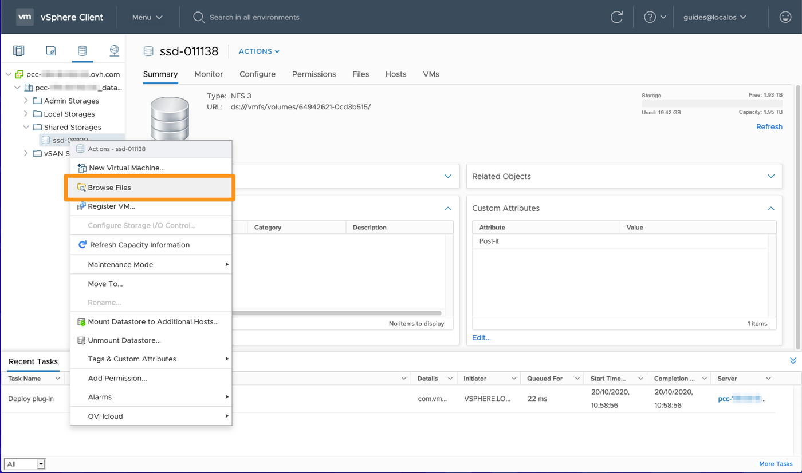
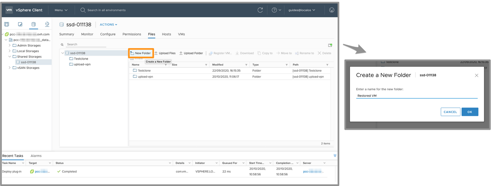
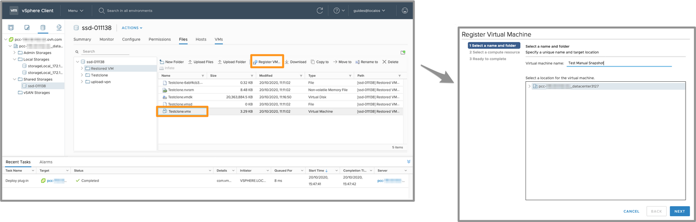

> [!primary]
> Esta tradução foi automaticamente gerada pelo nosso parceiro SYSTRAN. Em certos casos, poderão ocorrer formulações imprecisas, como por exemplo nomes de botões ou detalhes técnicos. Recomendamos que consulte a versão inglesa ou francesa do manual, caso tenha alguma dúvida. Se nos quiser ajudar a melhorar esta tradução, clique em "Contribuir" nesta página.
>

## Sumário

De forma a assegurar uma continuidade de serviço e evitar a perda de dados, a OVHcloud realiza automaticamente snapshots do seu rack de armazenamento (datastore) de hora em hora.

**Este guia explica como funciona**

## Requisitos

* Dispor de uma [infraestrutura Managed Bare Metal](https://www.ovhcloud.com/pt/managed-bare-metal/){.external} na sua conta OVHcloud.
* Aceder à interface de gestão vSphere Web Client HTML.

## Instruções

Um sistema de ficheiros é constituído por blocos que alojam dados. No início do sistema de ficheiros, há um índice que contém os apontadores, e estes permitem encontrar a localização dos diferentes blocos.

Um ficheiro é frequentemente fragmentado em vários blocos, pelo que o índice permite otimizar o tempo de acesso a um ficheiro. O índice é como o sumário de um livro, permite conhecer o número da página do capítulo que queremos ler.
 
Uma snapshot ZFS é como uma fotografia tirada do sistema de ficheiros num instante T. Ela serve normalmente de base para um backup.
 
Aquando da criação da snapshot, ZFS não precisa de copiar a integralidade do disco rígido pois todos os ficheiros já estão presentes. A snapshot regista o índice que contém os apontadores que referenciam os blocos livres e os blocos utilizados. Globalmente, armazena o posicionamento dos blocos e ZFS adicionará blocos em função das modificações dos dados. A snapshot ocupa muito pouco espaço até que nenhum dado seja modificado e é muito rápido.
 
Depois de criar a snapshot, o ZFS intercetará os pedidos de escrita. Se o apontador do índice fizer referência a:
 
- Um bloco utilizado; vai copiar o bloco para a snapshot e atualizar o índice para que aponte para este novo bloco, e não para o antigo bloco.
- Um bloco livre; irá copiar o bloco para o sistema de ficheiros e o ZFS irá atualizar o índice global do sistema de ficheiros.
 
A adição do ficheiro não faz aumentar a snapshot, pois esta não se ocupa dos blocos livres. Da mesma forma, os blocos reescritos múltiplos não afetam o tamanho da snapshot, pois esta só conserva uma versão para cada bloco: a que data do instante T.
 
Por conseguinte, pode dizer-se que a dimensão de uma snapshot é aproximadamente igual à dimensão dos blocos utilizados na sua criação e que foram alterados desde então. Mas, acima de tudo, é preciso ter em conta que o tamanho de uma snapshot depende da utilização que fazemos do seu sistema de ficheiros e da duração de vida da snapshot.
 
Na prática, uma snapshot criada no instante T só terá alguns quilos de byte. O tamanho da snapshot irá aumentar de acordo com as alterações efetuadas até à próxima snapshot. Se eliminar os seus dados, o espaço só será libertado após a eliminação da snapshot.

## Snapshot a H-1

Tem a possibilidade de recuperar o snapshot ZFS da última hora (H-1) a partir do vSphere Web Client HTML, pois este é diretamente armazenado nos seus datastores. 

### Recuperar uma snapshot a H-1

A partir do vSphere Web Client HTML, dirija-se à vista dos datastores e, a seguir, à pasta `Shared Storages` no datastore que contém a máquina virtual a restaurar.

Explorar o datastore ao clicar em `Browse Files`.

{.thumbnail}

Crie uma pasta na qual irá copiar os ficheiros a restaurar mais tarde.

{.thumbnail}

Dirija-se à pasta `.zfs` e depois desplique a arborescência até à pasta da máquina virtual a restaurar e depois copie o conjunto dos ficheiros presentes na pasta para a nova pasta criada na etapa anterior.

{.thumbnail}

Os ficheiros estão presentes agora basta adicionar esta máquina ao seu **inventário** clicando no ficheiro `.vmx` e, a seguir, no `register VM`{.action} acima.

{.thumbnail}

Só precisa de seguir o assistente de criação de VM para concluir o procedimento.

## E as snapshots depois da última hora?

A OVHcloud conserva as outras 23 snapshots horárias (até H-24) num rack de armazenamento (datastore) ao qual não tem acesso direto. No entanto, é possível, através de um pedido de intervenção feito ao suporte técnico (faturado a 80€ s/IVA), solicitar o restauro de uma snapshot (acima de H-1, portanto) para uma VM em particular. Só poderemos restaurar a snapshot solicitada no mesmo datastore e este restauro não pode, em caso algum, ser garantido.

Trata-se de uma segurança normalmente de uso interno da OVHcloud, as snapshots horárias pas são um sistema de backup e pas.

Trata-se de uma segurança suplementar de uso interno implementada nos datastores, que apenas deve ser utilizada como último recurso para evitar uma eventual perda de dados.

Recomendamos a utilização de uma solução completa de backup, como o nosso serviço [Veeam Backup](/pages/bare_metal_cloud/managed_bare_metal/veeam_backup_as_a_service) ou qualquer outro sistema que realize um backup completo das suas máquinas virtuais.

## Quer saber mais?

Fale com a nossa comunidade de utilizadores em <https://community.ovh.com/en/>.
