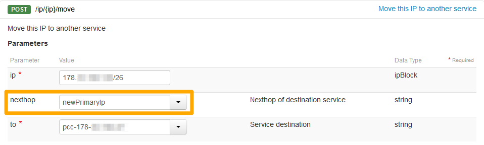
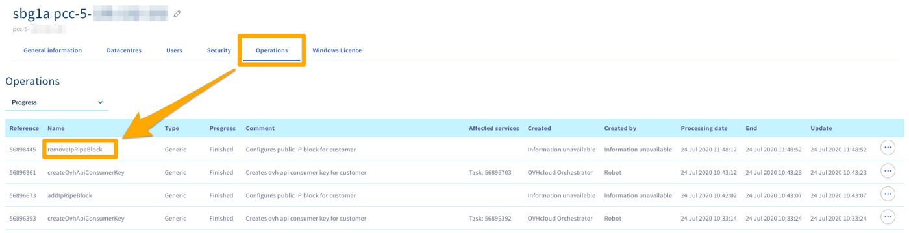

## Objectif

Un bloc IP peut vous servir à rendre vos services accessibles sur Internet. 

**Ce guide explique comment commander, ajouter et migrer un bloc IP associé à votre Managed Bare Metal.**

## Prérequis

* Être connecté à votre [espace client OVHcloud](https://www.ovh.com/auth/?action=gotomanager&from=https://www.ovh.com/fr/&ovhSubsidiary=fr){.external}.
* Posséder une [infrastructure Managed Bare Metal](https://www.ovhcloud.com/fr/managed-bare-metal/){.external} sur votre compte OVHcloud.

## En pratique

### Commander un bloc IP

Pour commander un bloc IP supplémentaire pour votre **Managed Bare Metal** , dirigez-vous sur votre espace client OVHcloud. Dans la section `Serveur`, cliquez sur la rubrique `IP` dans la colonne de gauche puis cliquez sur `Commander des IP additionnelles`{.action}. Sélectionnez ensuite votre **Managed Bare Metal** dans le menu déroulant avant de passer à l'étape suivante.

Plusieurs champs seront à remplir pour la création de votre bloc IP

- Taille du Bloc IP (de /28 à /24)

> [!primary]
>
> Pour rappel, voici un tableau récapitulant le nombres d'IPs présentes dans un bloc, et le nombres d'IP utilisables.
> 

|Taille du bloc|IP dans le bloc|IP utilisables chez OVHcloud|
|:---:|:---:|:---:|
|28|16|11|
|27|32|27|
|26|64|59|
|25|128|123|
|24|256|251|

> [!primary]
>
> N'hésitez pas à consulter notre guide sur le [plugin OVHcloud Network](/pages/bare_metal_cloud/managed_bare_metal/plugin_ovh_network){.external-link} afin de savoir quelles sont les IPs réservées de votre bloc ainsi que leur utilisation.
>

- Pays du bloc IP, important dans certains cas pour le référencement de vos services (un site à affluence française aura un meilleur référencement en France si l'IP est française également)
- Nom du réseau (Information visible dans le whois du bloc ip).
- Nombre de clients estimés (Combient de clients finaux seront hébérgés sur ces IPs).
- Description du réseau (Information visible dans le whois du bloc ip).
- Usage (Information sur l'utilisation (Web, SSL, Cloud...)).

Après avoir confirmé la dernière étape, vous obtenez le bon de commande de votre bloc IP. Si celui-ci est conforme à votre souhait, il vous suffit de le payer avec les moyens de paiement proposés en bas de page afin que celui-ci soit livré.

### Migrer un bloc IP entre deux Managed Bare Metal

La migration d'un bloc d'IP nécessite de déplacer manuellement les blocs via l'APIv6 OVHcloud.

Utilisez l'appel API suivant :

> [!api]
>
> @api {v1} /ip POST /ip/{ip}/move
> 

Les champs doivent être complétés ainsi :

- ip : bloc IP avec le /mask
- nexthop « newPrimaryIp » (sensible a la casse)
- to : Managed Bare Metal de destination sous la forme pcc-XXX-XXX-XXX-XXX

{.thumbnail}

Le résultat sera sous cette forme :

{.thumbnail}

Utilisez ensuite cet appel API pour déplacer l'IP dans le parking des IPS :

> [!api]
>
> @api {v1} /ip POST /ip/{ip}/park
> 

> [!warning]
>
> Cet appel coupe le réseau sur les VMs qui utilisent les IPs en question.
>

Vous pourrez suivre le déplacement du bloc IP depuis votre [espace client OVHcloud](https://www.ovh.com/auth/?action=gotomanager&from=https://www.ovh.com/fr/&ovhSubsidiary=fr){.external} dans la partie `Bare Metal Cloud`{.action} puis `Managed Bare Metal`{.action}. Cliquez sur votre service Managed Bare Metal puis sur l'onglet `Operations`{.action}.

La référence de l'opération est « removeIpRipeBlock ».

{.thumbnail}

## Aller plus loin

Échangez avec notre communauté d'utilisateurs sur <https://community.ovh.com>.
