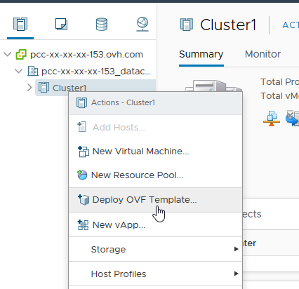
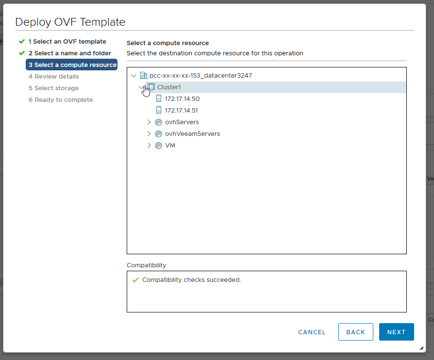
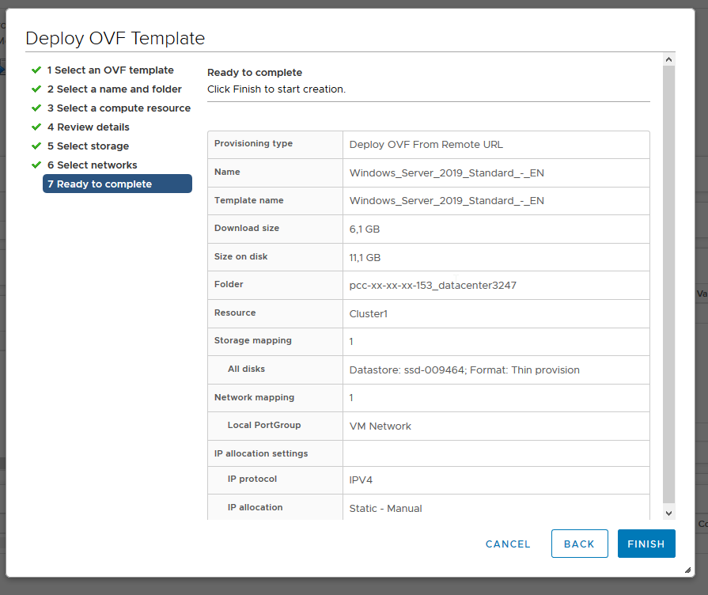
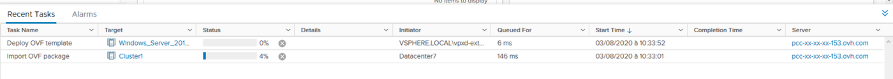

**Last updated 18th November 2020**

## Objective

OVHcloud offers Linux, Windows Server and Windows SQL server templates (in OVF format) that you can deploy directly from your web client (HTML 5).

Windows VMs deployed from a template automatically use the SPLA licences provided by OVHcloud. Deploying a Windows VM will therefore automatically trigger additional billing.

**This guide will show you where you can find the source files, and how to deploy them.**

> [!primary]
> 
> You can find the prices of the images offered by OVHcloud on this [page](https://www.ovhcloud.com/en-ie/managed-bare-metal/options/).
>

## Requirements

- Web client access (HTML5)
- [active Windows licences](/pages/bare_metal_cloud/managed_bare_metal/manager-ovhcloud#windows-licence-tab) (activate via the [OVHcloud Control Panel](https://www.ovh.com/auth/?action=gotomanager&from=https://www.ovh.ie/&ovhSubsidiary=ie){.external}, in the `Windows licence`{.action} tab for the datacentre)

## Instructions

### Find the URL of the OVF template

In your web browser, go to your Managed Bare Metal homepage, and click on `OVH Templates`{.action}.

{.thumbnail}

In the `OVH Templates` screen that opens, you will see the details of the Linux, Windows and SQL templates available. 

Select the template you want. A window will open and offer you the links that you will use to deploy the template, depending on your vSphere version.

{.thumbnail}

### Deploy the OVF template

Once you have logged into your vSphere Web Client, go to the `Hosts and clusters`{.action} page, right-click on your datacentre and click `Deploy OVF template...`{.action}:

{.thumbnail}

The context menu will open, and you can start configuring how the template is deployed. The first step is to add the OVH template URL:

{.thumbnail}

In the next step, you can choose the datacentre:

{.thumbnail}

Now you can choose the cluster in which the virtual machine will be deployed:

{.thumbnail}

This page lists all of the template’s details, including its default password. For security reasons, it is important that you change your password as soon as you log in for the first time:

{.thumbnail}

Select the datastore in which the virtual machine will be located, and the format of the disk:

{.thumbnail}

You now need to select the network that will be used. 

{.thumbnail}

The configuration process is nearly complete, and you will see a summary of the configuration requested:

{.thumbnail}

When you click on `Finish`{.action}, a task is created, and you can use it to track the progress of the deployment.

{.thumbnail}

Once the deployment is complete, you can close this window.

You will now find the new virtual machine in your inventory.

{.thumbnail}

### Finalising Setup for SQL Server

Start your newly deployed virtual machine and open the console.

Log in to Windows and enter your SQL instance name, password and character set in the window provided.

{.thumbnail}

> [!primary]
> 
> We recommend setting a password that meets these criteria:
> 
> * Must contain at least eight characters.
> * Must contain at least three types of characters (uppercase, lowercase, numbers, special characters).
> * Not to be taken from the dictionary.
> * Do not include personal information (e.g. your first name, surname or date of birth).
>

Once you have entered this information, click `Ok`{.action}.

A window will open showing the deployment. At the end of the installation, a final window will open, informing you that the deployment has been successful.

Click `OK`{.action} again to complete the installation and restart your virtual machine.

Following this reboot, you can start using your virtual machine.

## Go further

Join our community of users on <https://community.ovh.com/en/>.
