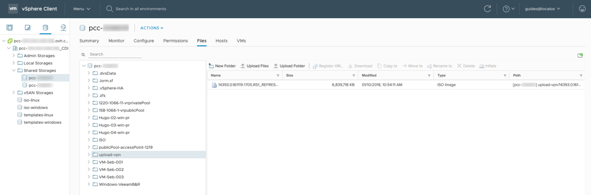

**Última actualización: 18/11/2020**

## Objetivo

La conexión a sus datastores por SFTP (Secure File Transfert Protocol) permite añadir a su infraestructura archivos locales de backup. Es posible conectarse desde una interfaz gráfica a través de programas como FileZilla, disponible en Windows y Mac. También puede conectarse por línea de comandos desde un sistema operativo Linux.

Este sistema solo le permitirá acceder a la carpeta «upload-vpn» de sus datastores.  Tenga en cuenta que, con este método, no podrá acceder a los archivos que se encuentren fuera de esta carpeta.

**Esta guía explica cómo conectarse por SFTP a través de una interfaz gráfica o en línea de comandos.**

## Requisitos

- Haber creado una cuenta de usuario desde el [área de cliente de OVHcloud](https://ca.ovh.com/auth/?action=gotomanager&from=https://www.ovh.com/world/&ovhSubsidiary=ws){.external}.

## Procedimiento

### Conexión desde una interfaz gráfica

Desde su cliente FTP (FileZilla en este ejemplo), introduzca los siguientes valores:

```
Host: [sftp://pcc-xxx-xxx-xxx-xxx.ovh.com] / Username: user / Password: password
```

{.thumbnail}

Una vez conectado, su equipo local aparecerá a la izquierda y los datastores a la derecha:

{.thumbnail}

### Conexión desde un terminal

Desde un terminal, compruebe que el comando `sftp` está instalado escribiendo:

```sh
sftp
```

Introduzca el siguiente comando para conectarse:

```sh
sftp user@pcc-xxx-xxx-xxx-xxx.ovh.com
```

A continuación, deberá introducir la contraseña del usuario. Una vez conectado, consulte los datastores utilizando el comando `ls`:

```sh
sftp> ls pcc-000714
```

Puede recorrer la lista de datastores encontrados con el comando anterior:

```sh
sftp> pcc-000714
```

Utilice el comando `put` para exportar los archivos de su datastore hacia su equipo local.

```sh
sftp> put /home/ubuntu-18.04-server-amd64.iso
/datastore/pcc-000714/ubuntu-18.04-server-amd64.iso  
```

Utilice el comando `get` para importar los archivos desde su equipo local hacia el datastore.

```sh
sftp> get /datastore/pcc-00714/ubuntu-18.04-server-amd64.iso /home/
```

El comando `exit` permite cerrar la conexión.

### Resumen desde vSphere

Desde la interfaz vSphere, es posible visualizar el contenido que acaba de enviar navegando en el datastore. Para ello, haga clic en el datastore correspondiente en la carpeta «upload-vpn»:

{.thumbnail}

## Más información

Interactúe con nuestra comunidad de usuarios en <https://community.ovh.com/en/>.
