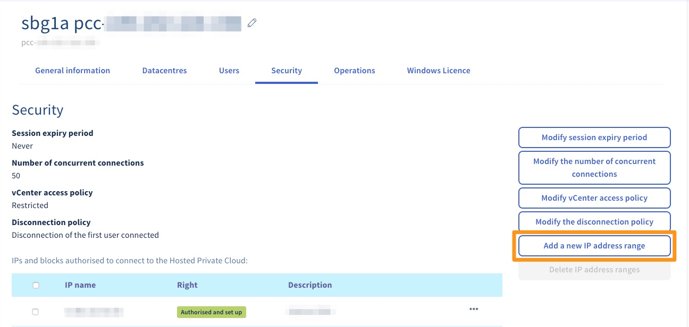

**Última atualização: 18/11/2020**

## Objetivo

É possível limitar o acesso ao vCenter autorizando que apenas alguns endereços IP se liguem. 

**Saiba como autorizar endereços IP a ligarem-se ao vCenter.**

## Requisitos

* Ter acesso à [Área de Cliente OVHcloud](https://www.ovh.com/auth/?action=gotomanager&from=https://www.ovh.pt/&ovhSubsidiary=pt){.external}.
* Dispor de uma [infraestrutura Managed Bare Metal](https://www.ovhcloud.com/pt/managed-bare-metal/){.external} na sua conta OVHcloud.

## Instruções

Quando [a política de acesso ao vCenter é limitada](/pages/bare_metal_cloud/managed_bare_metal/vcenter-modify-access-policy), é necessário adicionar os IP que serão autorizados a ligar-se ao serviço.

A operação pode ser realizada a partir da [Área de Cliente OVHcloud](https://www.ovh.com/auth/?action=gotomanager&from=https://www.ovh.pt/&ovhSubsidiary=pt){.external-link}. Na secção `Bare Metal Cloud`, clique na opção `Managed Bare Metal`. Selecione a infraestrutura e aceda ao separador `Segurança` e clique em `Adicionar um novo intervalo de endereços IP`{.action}.

{.thumbnail}

Aqui, deve adicionar o IP em questão e eventualmente uma descrição para o encontrar facilmente na lista mais tarde.

Só precisa de validar clicando em `Seguinte`{.action} e, uma vez que o IP está corretamente marcado como **Autorizado e implementado**, a ligação ao vSphere será possível a partir do IP em questão.

{.thumbnail}

## Quer saber mais?

Fale com a nossa comunidade de utilizadores em <https://community.ovh.com/en/>.
