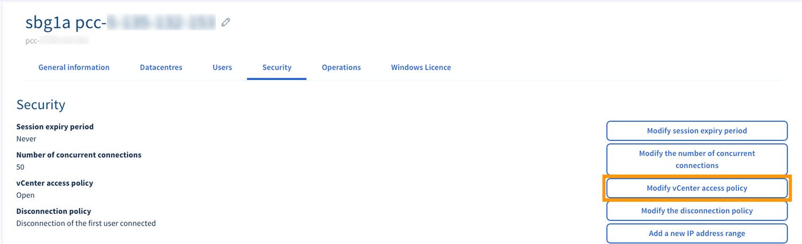

**Ultimo aggiornamento: 18/11/2020**

## Obiettivo

Per aumentare la sicurezza di un’infrastruttura Managed Bare Metal, è possibile limitare e gestire l’accesso al vCenter.

**Questa guida ti mostra come modificare la politica di accesso al vCenter nello Spazio Cliente.**

## Prerequisiti

- Disporre di una soluzione [Managed Bare Metal](https://www.ovhcloud.com/it/managed-bare-metal/){.external}
- Avere accesso allo [Spazio Cliente OVHcloud](https://www.ovh.com/auth/?action=gotomanager&from=https://www.ovh.it/&ovhSubsidiary=it)

## Procedura

Accedi allo [Spazio Cliente](https://www.ovh.com/auth/?action=gotomanager&from=https://www.ovh.it/&ovhSubsidiary=it) e, nella sezione `Bare Metal Cloud`{.action}, clicca su `Managed Bare Metal`{.action} nella colonna a sinistra e seleziona il servizio in questione.

Nella pagina principale, clicca sulla scheda `Sicurezza`{.action} e poi su `Modifica la politica di accesso al vCenter`{.action}.

{.thumbnail}

Nella nuova finestra, seleziona “Aperta” o “Limitata” nel menu a tendina e clicca su `Conferma`{.action} per applicare l’opzione scelta.

{.thumbnail}

> [!primary]
>
> Se la politica di accesso al vCenter è configurata come “Limitata”, consulta la guida [Autorizzare IP ad accedere al vCenter](/pages/bare_metal_cloud/managed_bare_metal/vcenter-authorise-ip-access)
> 

## Per saperne di più

[Autorizzare IP ad accedere al vCenter](/pages/bare_metal_cloud/managed_bare_metal/vcenter-authorise-ip-access)

Contatta la nostra Community di utenti all’indirizzo [https://community.ovh.com/en/](https://community.ovh.com/en/){.external}.

