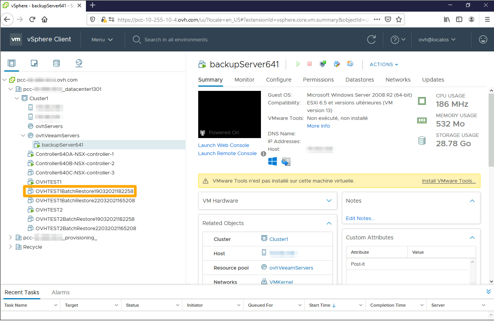

## Objective

**This guide will explain how to identify and restore backups via the OVHcloud API**

## Requirements

- Access to the [OVHcloud API](https://ca.api.ovh.com/)
- [Veeam Managed Backup enabled](/pages/bare_metal_cloud/managed_bare_metal/veeam_backup_as_a_service) on your Hosted Private Cloud solution

## Instructions

If you are not familiar with OVHcloud APIs, please refer to our [Getting started with OVHcloud APIs](/pages/manage_and_operate/api/first-steps) guide.

### Step 1: Generating a backup report

First, you need to target the backups you want to restore.

Log in to [https://ca.api.ovh.com/](https://ca.api.ovh.com/) and use the following call:

> [!api]
>
> @api {v1} /dedicatedCloud POST /dedicatedCloud/{serviceName}/datacenter/{datacenterId}/backup/generateReport

Enter the variables:

- serviceName: the reference for your PCC as `pcc-XX-XX-XX-XX`.
- datacenterId: the ID of the data centre your Veeam Managed Backup solution is activated in.

This call will generate a backup report. It will be sent by email to the address listed on the Hosted Private Cloud service administrator account.
 The email lists the following:

- VM name
- Backups performed (BackupJobName)
- Size of each backup
- **Storage Folder (BackupRepository)**
- Last restore point

{.thumbnail}

Take note of the BackupRepository reference, this will allow you to restore backups in the next step.

### Step 2: Restoring backups

> [!warning]
>
> Before starting restoration on your datastore, ensure that it has enough storage capacity to accommodate all of the data to be restored.
>
> If not, you will be notified by email and the operation will be cancelled.

The API call will restore the last valid restore points for each backup in the storage folder.

Log in to [https://ca.api.ovh.com/](https://ca.api.ovh.com/) and use the following call:

> [!api]
>
> @api {v1} /dedicatedCloud POST /dedicatedCloud/{serviceName}/datacenter/{datacenterId}/backup/batchRestore
>

Enter the variables:

- serviceName: the reference for your PCC as `pcc-XX-XX-XX-XX`.
- datacenterId: the ID of the data centre your Veeam Managed Backup solution is activated in.
- backupJobName (optional): the name of a backup, obtained in step 1, as `pcc-XXX-XXX-XXX-XXX_vm-XXX`, if you want to restore only one VM.
- backupRepositoryName: the backupRepository name obtained in step 1.

Once the restore is complete, you will find the VMs corresponding to the restored backups in your vSphere interface.
 To identify them, their names contain the *BatchRestore* suffix and a restore timestamp.
 VMs are restored and switched off. It is up to you to switch them back on.

{.thumbnail}

## Go further

Join our community of users on <https://community.ovh.com/en/>.
