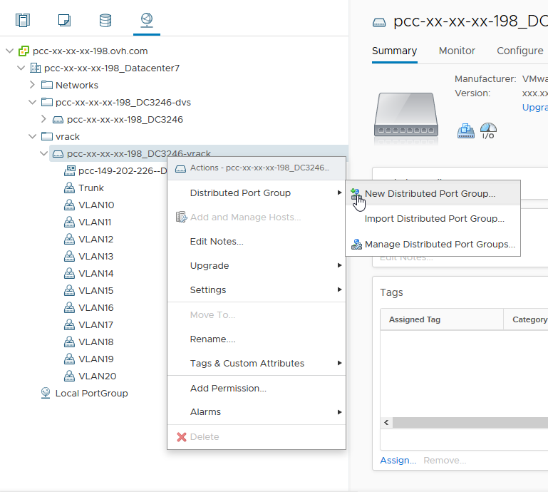
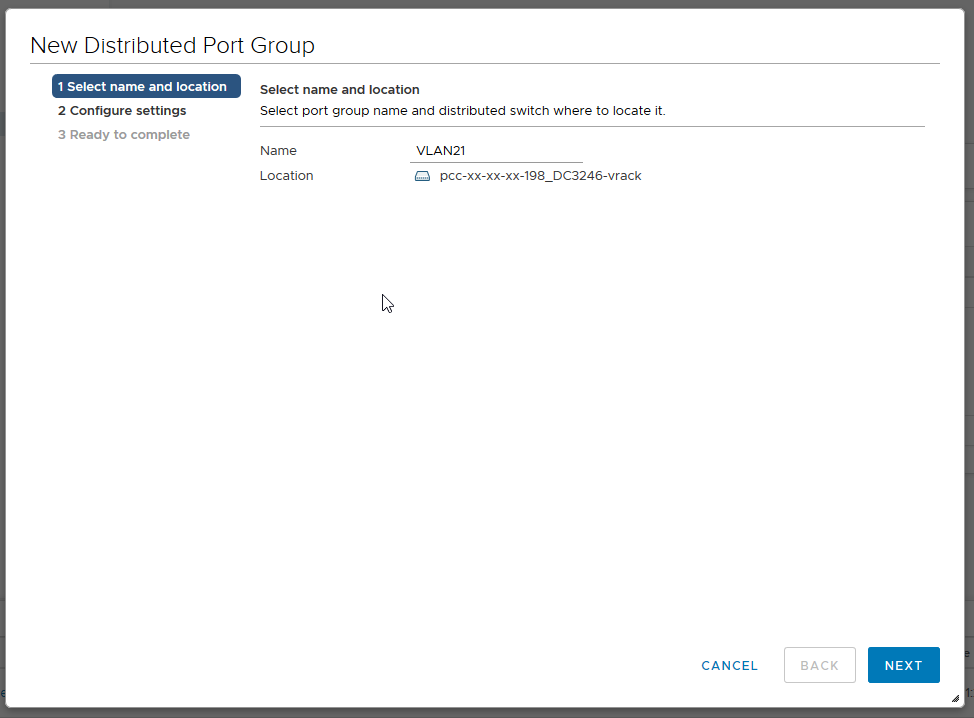
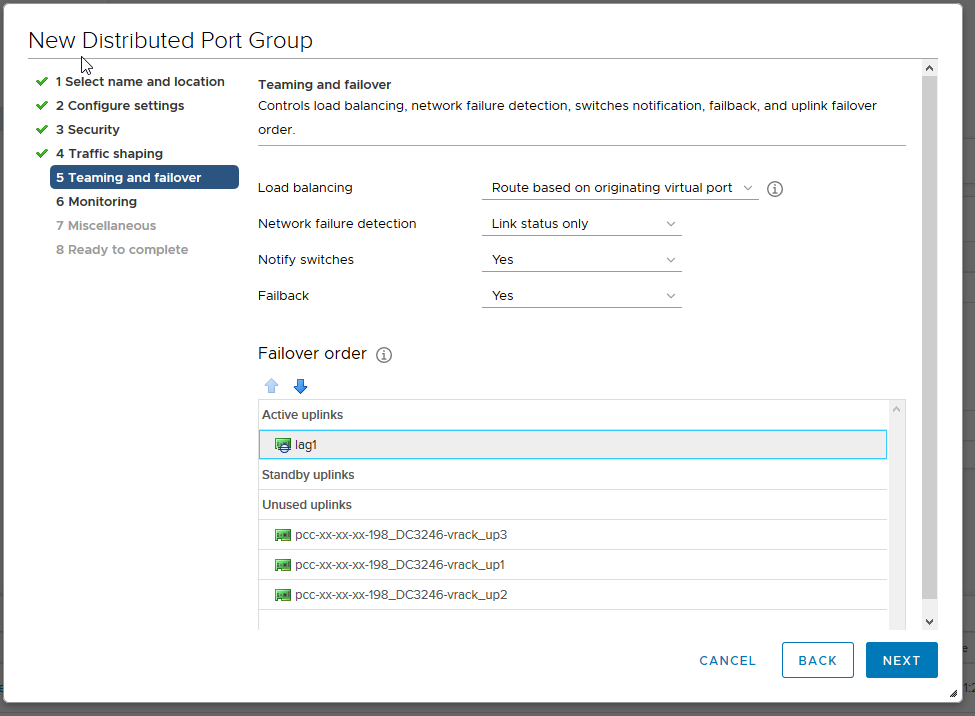
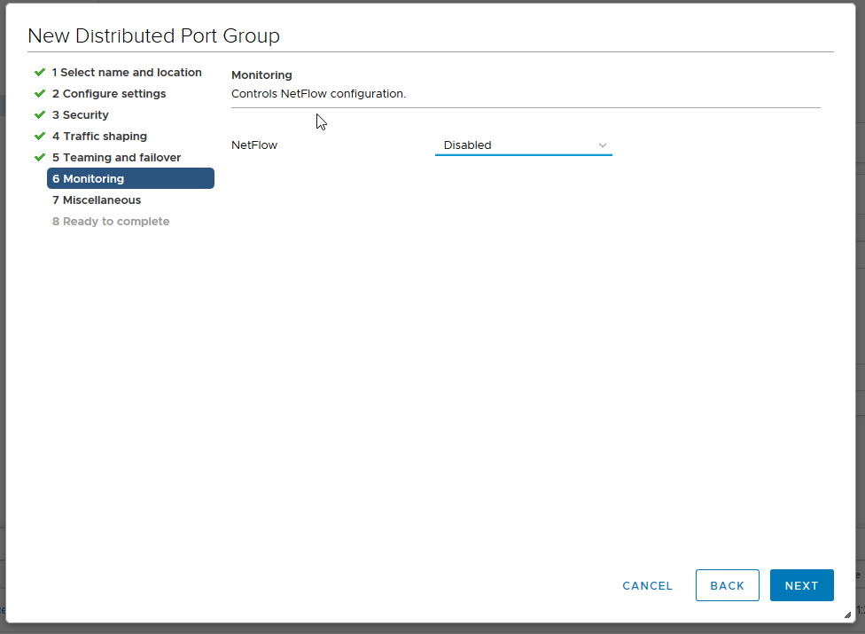

**Dernière mise à jour le 18/11/2020**

## Objectif

Dans une infrastructure Managed Bare Metal, vous disposez de base de 11 VLAN fournis avec le vRack.

**Ce guide montre la création de VLAN supplémentaires**

## Prérequis

- Avoir accès au client vSphere Web (HTML5)

## En pratique

### Créer des VLAN

Dans les offres Managed Bare Metal, vous disposez de deux switchs virtuels distribués (vDS). 

Ces *vDS* comportent plusieurs *portGroup* ayant chacun leur utilité.

Le premier vDS dispose d'un seul type de *portGroup*, le VMnetwork permettant de communiquer vers Internet.

Le second vDS dispose également d'un seul type de *portGroup* , des VLAN permettant d'isoler des communications privées à l'intérieur du Managed Bare Metal et entre les différents services OVHcloud compatibles vRack (Serveur dédié, Public Cloud...). 

Sur ce switch, 11 VLANs sont créés de base (VLAN10 à VLAN20). En donnant le droit `administrateur` sur l'`Accès au VLAN` dans [la gestion des utilisateurs de votre espace client](/pages/bare_metal_cloud/managed_bare_metal/manager-ovhcloud#utilisateurs){.external-link}, vous pourrez créer des VLAN supplémentaires.

En premier lieu, rendez vous dans la vue `mise en réseau` de votre client vSphere. Déployez le dossier **vrack** puis faites un clic droit sur le **dVS** finissant par *-vrack* et enfin cliquez sur `New Distributed Port Group`{.action}.

{.thumbnail}

{.thumbnail}

La prochaine étape est de nommer votre **PortGroup** :

{.thumbnail}

Puis configurez les paramètres recommandés par OVHcloud :

- **Port Binding** : Static (Réservation et assignation du port à une machine virtuelle)
- **Port allocation** : Elastic (Permet d'élargir à chaud le nombre de port)
- **Number of ports** : 24
- **VLAN type** : VLAN (Les autres sont [PVLAN](https://kb.vmware.com/s/article/1010691){.external} et Trunk)
- **VLAN ID** : 21 (Sachant que l'ID peut-être configuré de 1 à 4096)
- Cochez l'option *Customize default policies configuration*.

{.thumbnail}

Vous avez 3 paramètres de sécurité qui peuvent être activés en fonction de votre besoin : 

- *Promiscuous mode* (Elimine tout filtrage de réception que l'adaptateur de machine virtuelle peut effectuer afin que le système d'exploitation invité reçoive tout le trafic observé sur le réseau.)
- *MAC address changes* (Affecte le trafic qu'une machine virtuelle reçoit. Lorsque l'option est définie sur **Accepter**, ESXi accepte les demandes de modification de l'adresse MAC effective en une adresse différente de l'adresse MAC initiale.)
- *Forged transmits* (Affecte le trafic transmis à partir d'une machine virtuelle. Lorsque l'option est définie sur **Accepter**, ESXi ne compare les adresses MAC source et effective).

> [!primary]
>
> L'utilisation la plus fréquente de ces 3 paramètres est le CARP, notamment utilisé sur **pfSense**.
> 

{.thumbnail}

Nous laissons le [lissage de trafic](https://docs.vmware.com/en/VMware-vSphere/6.5/com.vmware.vsphere.networking.doc/GUID-CF01515C-8525-4424-92B5-A982489BACE2.html){.external} désactivé.

{.thumbnail}

Au niveau du Load Balancing, selectionnez *Route Based on IP hash* qui est la meilleure méthode en terme de redondance et répartition.

> [!warning]
>
> Attention au niveau de de la configuration de l'ordre du basculement, il est nécessaire de mettre la liason montante `lag1` en *Active* (connexion entre le réseau virtuel et le réseau physique), sinon aucune communication entre les hôtes ne sera possible.
>

{.thumbnail}

Le `Netflow` est desactivé (rapport d'activité sur les flux de trafic)

{.thumbnail}

Laissez la valeur `Block All Ports` à « No ».

{.thumbnail}

Un résumé des modifications vous est alors présenté. Cliquez sur `Terminer` pour confirmer la création.

{.thumbnail}

Nous constatons ici que le **VLAN21** est bien disponible et fonctionnel.

{.thumbnail}

## Aller plus loin

Échangez avec notre communauté d'utilisateurs sur <https://community.ovh.com>.
