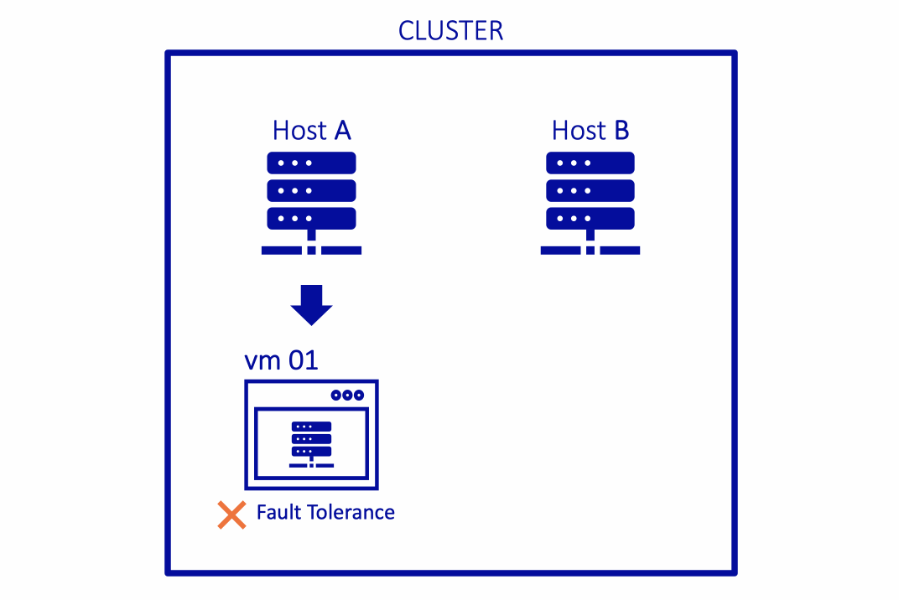
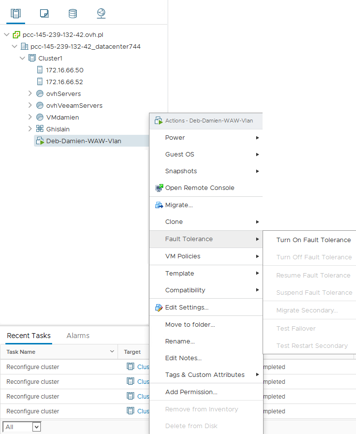

**Última actualización: 18/11/2020**

## Objetivo

La funcionalidad **Fault Tolerance** (FT) de VMware vSphere permite proteger una máquina virtual de posibles fallos de hardware clonando la máquina en dos hosts diferentes.

{.thumbnail}

**Esta guía explica cómo utilizar la funcionalidad Fault Tolerance en su máquina virtual.**

## Requisitos

- Tener activado vSphere HA.
- Disponer de una cantidad reservada de recursos igual al 100% de la memoria.
- Tener instalado VMware Tools.
- Disponer de procesadores de la misma generación.
- Disponer de un máximo de 4 vCPU.

## Procedimiento

Para activar la opción **Fault Tolerance**, haga clic derecho en su máquina virtual y, a continuación, seleccione, `Fault Tolerance` > `Turn On Fault Tolerance`.

{.thumbnail}

Aparecerá una ventana de configuración en la que deberá seleccionar los parámetros de la máquina virtual secundaria.

Selección del datastore:

{.thumbnail}

Selección del host: 

{.thumbnail}

Por último, aparecerá un resumen de la configuración elegida. Confirme la selección para activar la funcionalidad Fault Tolerance en su máquina virtual.

{.thumbnail}

Su máquina virtual ya está protegida por **Fault Tolerance**. El icono mostrado será diferente y junto al nombre de la máquina aparecerá el estado «primary».

{.thumbnail}

A continuación, podrá realizar diversas operaciones en función de sus necesidades.

{.thumbnail}

## Acciones imposibles e incompatibles

En las máquinas virtuales con la funcionalidad **Fault Tolerance** activada, no es posible realizar algunas acciones ni utilizar ciertos periféricos.

Para conocer la lista de acciones que no es posible realizar, consulte esta [página](https://docs.vmware.com/es/VMware-vSphere/6.7/com.vmware.vsphere.avail.doc/GUID-F5264795-11DA-4242-B774-8C3450997033.html){.external}. Para consultar la lista de incompatibilidades, haga clic [aquí](https://docs.vmware.com/es/VMware-vSphere/6.7/com.vmware.vsphere.avail.doc/GUID-C1749AD4-70E2-406C-864C-719F54BF1BC1.html){.external}.

## Más información

Interactúe con nuestra comunidad de usuarios en <https://community.ovh.com/en/>.
