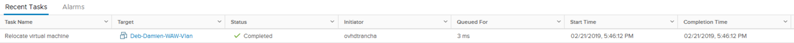

**Ultimo aggiornamento: 18/11/2020**

## Obiettivo

**vMotion** è una funzionalità che consente di migrare **a caldo** una macchina virtuale da un host a un altro host, pool di risorse o Vapp all’interno di uno stesso **cluster**.

**Questa guida ti mostra come effettuare questa operazione.**

## Procedura

### Sposta una macchina virtuale

Per migrare i file di una macchina virtuale verso un’altra risorsa, è sufficiente cliccare con il tasto destro sulla VM in uso e selezionare `Migrate...`{.action}

{.thumbnail}

## Scegli il tipo di vMotion

Il menu propone diverse opzioni di vMotion. Nel nostro esempio, migreremo semplicemente la macchina virtuale su un altro host. Per eseguire questa operazione è necessario selezionare “Change compute resource only”.

L’opzione “Change storage only” permette invece di migrare la VM su un altro datastore. Questa operazione, chiamata **Storage vMotion**, è descritta in [questa guida](/pages/bare_metal_cloud/managed_bare_metal/vmware_storage_vmotion).

{.thumbnail}

### Scegli la risorsa

Per prima cosa è necessario scegliere su quale risorsa migrare la macchina virtuale: host, cluster, pool di risorse o Vapp. 

Nel nostro caso, la trasferiremo sull'host con indirizzo finale .50.

{.thumbnail}

### Scegli la rete

In questo step è possibile scegliere la rete assegnata alla macchina virtuale. Nel nostro esempio, lasceremo la VM sulla VLAN di origine.

{.thumbnail}

### Scegli la priorità

Consigliamo di eseguire la migrazione con priorità elevata, selezionando l’opzione “Schedule vMotion with high priority”.

{.thumbnail}

### Completa il vMotion

Clicca su `FINISH `{.action} per avviare il processo di migrazione.

{.thumbnail}

## Monitora il vMotion

Nella sezione “Recent Tasks” è possibile seguire lo stato di avanzamento della migrazione. Il tempo necessario per completare l’operazione varia in base alla RAM assegnata, al carico della VM e alla banda passante utilizzata.

{.thumbnail}

## Per saperne di più

Contatta la nostra Community di utenti all’indirizzo <https://community.ovh.com/en/>.
