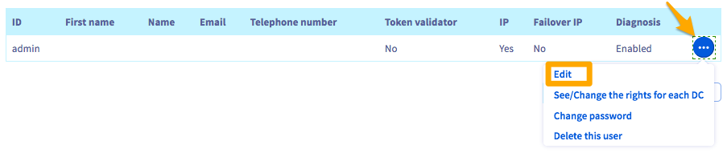
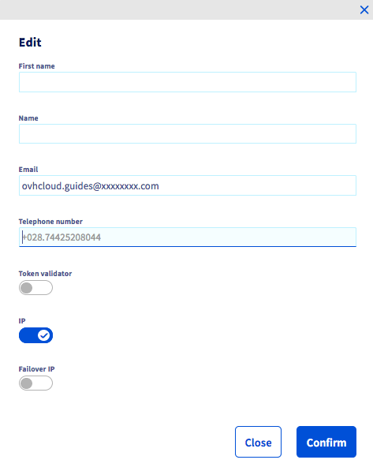

**Letzte Aktualisierung am 18.11.2020**

## Ziel

Ein Name, Vorname, eine Telefonnummer und E-Mail-Adresse können mit dem vSphere-Nutzer Ihrer Managed Bare Metal verbunden werden. Die E-Mail-Adresse ermöglicht insbesondere die Bestätigung per Token.

**Diese Anleitung erklärt, wie Sie eine E-Mail-Adresse mit Ihrem Nutzerprofil bei vSphere verbinden können.**

## Voraussetzungen

- Sie verfügen über eine [Managed Bare Metal](https://www.ovhcloud.com/de/managed-bare-metal/) Infrastruktur.
- Sie haben Zugriff auf Ihr [OVHcloud Kundencenter](https://www.ovh.com/auth/?action=gotomanager&from=https://www.ovh.de/&ovhSubsidiary=de).

## In der praktischen Anwendung

Loggen Sie sich in Ihrem [OVHcloud Kundencenter](https://www.ovh.com/auth/?action=gotomanager&from=https://www.ovh.de/&ovhSubsidiary=de) ein und wählen Sie dann den Bereich `Bare Metal Cloud`. Klicken Sie im linken Menü auf `Managed Bare Metal` und wählen Sie die betreffende Infrastruktur aus.

{.thumbnail}

Gehen Sie auf den Reiter `Benutzer`{.action}, klicken Sie rechts vom jeweiligen Nutzer auf `...` und dann auf `Bearbeiten`{.action}.

{.thumbnail}

Das folgende Fenster wird angezeigt:

{.thumbnail}

Sie können Ihren Namen, Vornamen, Ihre Telefonnummer und E-Mail-Adresse festlegen.

In diesem Fenster können Sie ebenfalls Bearbeitungsrechte hinzufügen: Für **IP** Adressen, **Additional IP**, sowie das Recht **Token Validator**. Es wird verwendet, um bestimmte kritische Aktionen in Infrastrukturen mit aktivierter Option zu **erweiterter Sicherheit** zu genehmigen.

Klicken Sie auf den Button `Bestätigen`{.action}, um Ihre Änderungen zu bestätigen.

## Weiterführende Informationen

Für den Austausch mit unserer User-Community gehen Sie auf [https://community.ovh.com/en/](https://community.ovh.com/en/).
