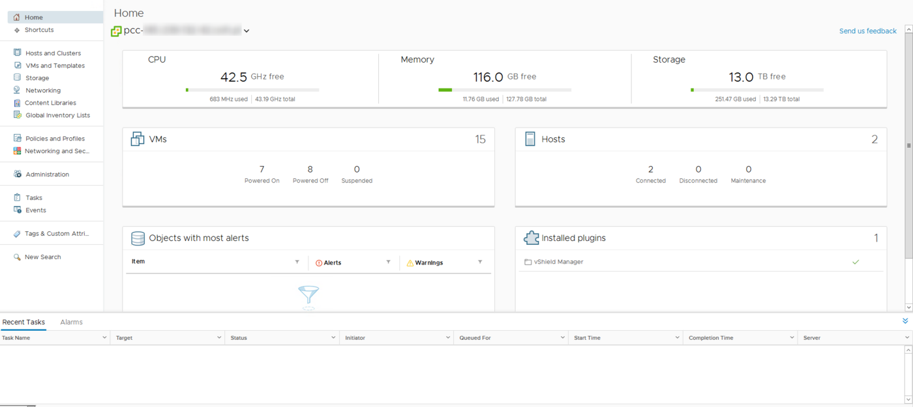

## Obiettivo

**Questa guida ti mostra i diversi modi con cui accedere a vSphere.**

## Prerequisiti

- Essere contatto amministratore per il servizio Managed Bare Metal (per ricevere le credenziali di accesso)
- Disporre di un utente attivo creato nello Spazio Cliente


## Procedura

### Recupera le credenziali

Le credenziali di accesso vengono inviate via email durante la creazione di un servizio Managed Bare Metal, la modifica di una password o la creazione di un utente:

```
Indirizzo IP/Nome: pcc-xxx-xxx-xxx-xxx.ovh.com Nome utente: admin Password: xxxxxx
```

Per assicurarsi di poter effettuare l’accesso, consulta la documentazione VMware in cui sono elencate le diverse porte da aprire nel firewall: [Accesso al terminale](https://kb.vmware.com/kb/1012382){.external-link}

### Utilizza il client Web HTML5

Il client Web HTML5 è disponibile nell’interfaccia Web del servizio Managed Bare Metal, all’indirizzo `https://pcc-xxx-xxx-xxx-xxx.ovh.com/ui` (ricorda di sostituire pcc-xxx-xx-xx-xxx.ovh.com con l’indirizzo del Managed Bare Metal).

{.thumbnail}

Si apre questa interfaccia:

{.thumbnail}

La pagina `Home`{.action} fornisce l’accesso ai menu principali del vCenter, che consentono di eseguire diverse azioni, tra cui:

- eseguire il deploy di una macchina virtuale dal menu `Hosts and Clusters`{.action}
- navigare nei datastore

### Utilizza il client Web Flash

Il client Web Flash è disponibile nell’interfaccia Web del servizio Managed Bare Metal, all’indirizzo `https://pcc-xxx-xxx-xxx-xxx.ovh.com/vsphere-client` (ricorda di sostituire pcc-xxx-xx-xx-xxx.ovh.com con l’indirizzo del Managed Bare Metal).

Per effettuare l’accesso, utilizza le credenziali ricevute:

{.thumbnail}

Si apre questa interfaccia:

{.thumbnail}

La pagina `Home`{.action} fornisce l’accesso ai menu principali del vCenter, che consentono di eseguire diverse azioni, tra cui:

- eseguire il deploy di una macchina virtuale dal menu `Hosts and Clusters`{.action}
- navigare nei datastore


## Per saperne di più

Contatta la nostra Community di utenti all’indirizzo <https://community.ovh.com/en/>.
