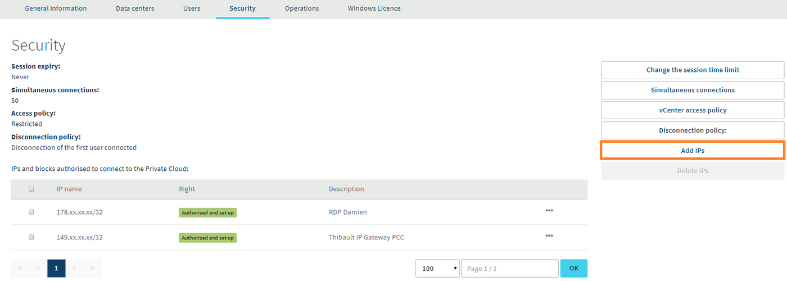
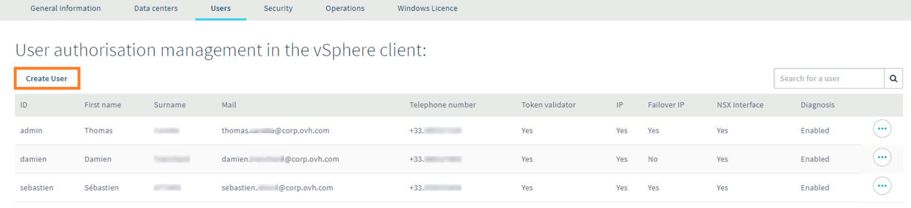
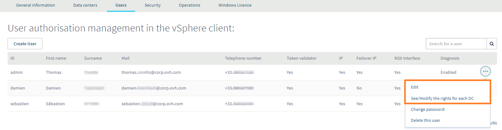
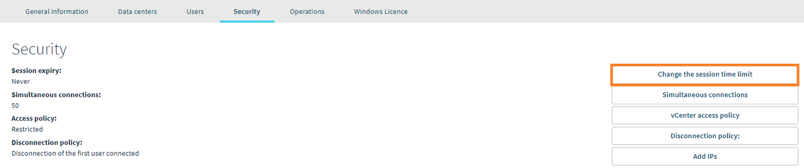

**Última atualização: 18/11/2020**

## Objetivo

Para assegurar a integridade da sua infraestrutura, convém que restrinja o acesso a ela. Para isso, sugerimos-lhe diferentes métodos.

**Aprenda a proteger rápida e facilmente o acesso ao seu vSphere Web Client graças a alguns conselhos.**

## Requisitos

- Ter acesso à [Área de Cliente OVHcloud](https://www.ovh.com/auth/?action=gotomanager&from=https://www.ovh.pt/&ovhSubsidiary=pt){.external}.

## Instruções

### Controlar os acessos por IP

O primeiro conselho está ligado à restrição do acesso por IP. Aconselhamos que trabalhe sempre com um sistema de registo que use whitelisting. Esta técnica assenta sobre a recusa de princípio de todos os endereços IP e sobre o acrescento de endereços que possam dar acesso à sua infraestrutura.

Esta ação pode ser feita diretamente através da [Área de Cliente OVHcloud](https://www.ovh.com/auth/?action=gotomanager&from=https://www.ovh.pt/&ovhSubsidiary=pt){.external}. Quando estiver no espaço Managed Bare Metal, clique em `Segurança`{.action}. Aparecerá um quadro, no qual poderá ver os endereços IP autorizados ou recusados. Para acrescentar novos, clique à direita, em `Adicionar IP`{.action}:

{.thumbnail}

### Criar utilizadores específicos

Recomendamos fortemente que crie um acesso personalizado para cada pessoa que deva ter acesso à sua infraestrutura. Esta operação também pode ser feita na [Área de Cliente OVHcloud](https://www.ovh.com/auth/?action=gotomanager&from=https://www.ovh.pt/&ovhSubsidiary=pt){.external}, mas desta vez no separador `Utilizadores`{.action}. Para adicionar novos, clique no botão situado à direita: `Criar um utilizador`{.action}.

{.thumbnail}

Quando se cria um utilizador, é pedida uma palavra-passe.

> [!primary]
>
> Para proteger ao máximo os seus dados, a palavra-passe deve respeitar algumas recomendações:
>
> - conter pelo menos oito caracteres;
> - conter pelo menos três tipos de caracteres;
> - não existir no dicionário;
> - não conter informações pessoais (nome, sobrenome ou data de nascimento);
> - não ser utilizada por vários utilizadores;
> - estar armazenada num cofre-forte de palavras-passe;
> - ser alterada a cada três meses;
> - ser diferente das palavras-passe anteriores.
>

A seguir, poderá gerir as autorizações de cada utilizador clicando no botão `...`{.action} à direita de cada username:

{.thumbnail}

### Limitar os tempos de sessão

No final da sessão, aconselha-se que os utilizadores a concluam em conformidade. Para limitar o tempo de conexão, é possível adicionar uma duração de expiração da sessão.

Esta pode ser configurada na [Área de Cliente OVHcloud](https://www.ovh.com/auth/?action=gotomanager&from=https://www.ovh.pt/&ovhSubsidiary=pt){.external}. Quando estiver no espaço Managed Bare Metal, escolha `Segurança`{.action}. A seguir, clique em `Alterar o prazo de expiração`{.action}, à direita.

{.thumbnail}

Indique o número de minutos antes que uma sessão expire.

{.thumbnail}

## Quer saber mais?

Fale com a nossa comunidade de utilizadores em <https://community.ovh.com/en/>.
