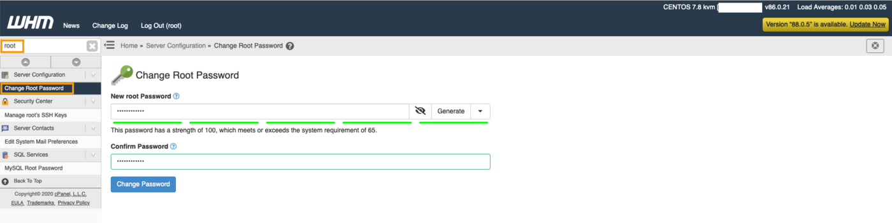

<style>
/* ---FAQ only--- */
details {
    margin: 0.1rem 1;
    border: 1px solid transparent;
    border-radius: 4px;
    background: #ffffffff;
}
details > summary {
    padding: 0.1rem 1rem;
    font-weight: 500;
    color: #268fd4ff;
    cursor: pointer;
    list-style: none;
}
details > summary::before {
    content: '\25B6';
    display: inline-block;
    margin-right: 0.5ch;
    transition: transform 0.2s;
}
details[open] > summary::before {
    content: '\25BC';
}
details:hover {
    border: 1px solid #147DE8;
    border-radius: 4px;
    transition: border-color 0.5s ease;
}
details[open] > summary {
    background: #ffffffff;
}
details > :not(summary) {
    padding: 0.25rem 0.5rem;
    box-sizing: border-box;
    list-style-position: inside;
}
.smallish-gap {
    display: block;
    margin-top: 0.25rem;
    margin-bottom: 0.25rem;
}
</style>

## Objetivo

OVHcloud ofrece a los clientes VPS imágenes de aplicaciones preinstaladas para un despliegue rápido y fácil en pocos clics.

**Esta guía explica cómo desplegar aplicaciones preinstaladas en un VPS.**

## Requisitos

- Tener un [VPS](/links/bare-metal/vps) en su cuenta de OVHcloud.

## Procedimiento

### Instalar la aplicación preinstalada que desee

Instale [la aplicación que desee desde el área de cliente de OVHcloud](/links/manager) o las API de OVHcloud. También puede consultar nuestra guía [Primeros pasos con un VPS](/pages/bare_metal_cloud/virtual_private_servers/starting_with_a_vps).
 
#### cPanel

> [!warning]
> Esta funcionalidad no está disponible actualmente para los servidores virtuales en las [Local Zones](/links/bare-metal/vps-lz).
>

A continuación se indican los primeros pasos para poner en servicio la imagen preinstalada de cPanel. A las etapas marcadas con un "*", seguiremos una FAQ.

1. Abra el mensaje de correo electrónico que haya recibido con las claves de acceso a la aplicación.
2. Haga clic en la URL de cPanel en este email.

> [!primary]
>
> Si el enlace ya ha caducado, conéctese a su VPS vía SSH usando el usuario CentOS y ejecute el comando `sudo whmlogin` para generar un nuevo enlace.
>

<ol start="3">
  <li>Lea y acepte las condiciones particulares de cPanel.</li>
  <li>Introduzca sus servidores de correo y servidores DNS*.</li>
  <li>Establezca la contraseña root que utilizará la próxima vez que se conecte a WHM *.</li>
</ol>

{.thumbnail}

No es necesario realizar ningún otro paso para finalizar la primera configuración de esta aplicación.

/// details | ¿Puedo utilizar mis propios servidores DNS?

Sí, puede. Asegúrese de crear los registros Glue con su agente registrador de dominios. Por ejemplo, si quiere "ns1.mydomain.com" y "ns2.mydomain.com", debe configurar los registros Glue para que ambos apunten a la dirección IP de su servidor. Si tiene su dominio registrado con OVHcloud, puede seguir [esta guía](/pages/web_cloud/domains/glue_registry#1-anadir-los-registros-glue). La creación puede tardar 24 horas.

///

/// details | ¿Por qué establecer la contraseña root?

WHM utiliza por defecto el usuario root para la autenticación. La URL de un solo uso permite acceder a la primera configuración y cambiar la contraseña root. La próxima vez que se conecte a WHM, deberá utilizar el usuario root y la contraseña que haya establecido.

///

/// details | ¿Dónde está mi licencia para cPanel?

Puede contratar su licencia cPanel para su VPS desde el [área de cliente de OVHcloud](https://www.ovh.com/manager/dedicated/#/configuration/license/order).

///

#### Plesk

> [!warning]
> Esta funcionalidad no está disponible actualmente para los servidores virtuales en las [Local Zones](/links/bare-metal/vps-lz).
>

A continuación se indican los primeros pasos para poner en servicio la imagen preinstalada de Plesk. A las etapas marcadas con un "\*", seguiremos una FAQ.

1. Abra el mensaje de correo electrónico que haya recibido con las claves de acceso a la aplicación.
2. Haga clic en la URL de Plesk en este email.
3. Conéctese con el nombre de usuario y la contraseña del mensaje de correo electrónico.
4. Una vez conectado, Plesk le preguntará:
    a) Sus datos.  
    b) Una nueva contraseña para el usuario "admin" que utilizará para conectarse a la interfaz de Plesk.  
    c) Información sobre la licencia.*  
    d) Leer y aceptar los contratos de licencia de usuario.  

No es necesario realizar ningún otro paso para finalizar la primera configuración de esta aplicación.

/// details | ¿Dónde está mi licencia Plesk?

Puede contratar una licencia Plesk para su VPS desde el [área de cliente de OVHcloud](https://www.ovh.com/manager/dedicated/#/configuration/license/order).

///

#### Docker

> [!warning]
> Esta funcionalidad no está disponible actualmente para los servidores virtuales en las [Local Zones](/links/bare-metal/vps-lz).
>

A continuación se indican los primeros pasos para poner en servicio la imagen preinstalada de Docker.

1. Conéctese al servidor por SSH utilizando el nombre de usuario y la contraseña del mensaje de correo electrónico.
2. Compruebe que Docker funciona con el comando `docker run hello-world`.

No es necesario realizar ningún otro paso para finalizar la primera configuración de esta aplicación.

### Let's Encrypt SSL

Esta sección solo se aplica a las instalaciones de WordPress, Drupal, Joomla! y PrestaShop. No se aplicará a las demás instalaciones.

1. Es necesario crear o modificar dos registros `A` en el área de cliente de OVHcloud que apuntan a la dirección IP del servidor. Por ejemplo, si el dominio es "personaldomain.ovh", es necesario crear registros `A` para:  

     personaldomain.ovh <br>
     www.personaldomain.ovh <br>  

Si su dominio está registrado en OVHcloud, puede seguir [esta guía](/pages/web_cloud/domains/dns_zone_edit).
<br>Si su dominio está registrado con otra empresa, deberá contactar con ella para solicitar ayuda sobre la configuración de sus registros `A`.

<ol start="2">
  <li>Tal vez tengan que esperar 24 horas antes de que ambos registros se propaguen por completo. Todavía puede comprobarlo con <a href="https://mxtoolbox.com/DnsLookup.aspx">mxtoolbox</a>. Si la dirección IP de su dominio aparece en mxtoolbox del mismo modo que la de su servidor, puede pasar a la siguiente etapa.</li>

  <li>Conéctese al servidor por SSH con el usuario CentOS y ejecute los siguientes comandos para instalar Certbot:</li>
</ol>

> [!warning]
>
> Sustituya a personaldomain.ovh por su propio dominio en los siguientes comandos.
>

```sh
sudo -i
dnf install -y epel-release
dnf install -y certbot python3-certbot-apache mod_ssl
echo "ServerName personaldomain.ovh;" >> /etc/httpd/conf/httpd.conf
systemctl restart httpd
```

<ol start="4">
  <li> Genere su certificado SSL utilizando Certbot (siga las indicaciones en pantalla).</li>
</ol>

```sh
certbot certonly -d personaldomain.ovh --webroot
```

Al introducir "Input the webroot", debe introducir una variable del tipo "/var/www/wordpress". Si instala Joomla!, debe sustituir "wordpress" por "joomla".

Ahora debe asegurarse de que certbot también sitúe esta variable en el archivo ssl.conf. Para ello, introduzca:

```sh
certbot -d personaldomain.ovh --apache
```

Cuando usted esté invitado, responda a la primera pregunta por "1" y a la segunda también por "1".

Si se ha generado el certificado SSL, obtendrá el siguiente resultado:

```sh
IMPORTANT NOTES:
 - Congratulations! Your certificate and chain have been saved at:
   /etc/letsencrypt/live/personaldomain.ovh/fullchain.pem
   Your key file has been saved at:
   /etc/letsencrypt/live/personaldomain.ovh/privkey.pem
   Your cert will expire on 2020-11-12. To obtain a new or tweaked
   version of this certificate in the future, simply run certbot again
   with the "certonly" option. To non-interactively renew *all* of
   your certificates, run "certbot renew"
```

## Vaya más lejos

Interactúe con nuestra comunidad de usuarios en [https://community.ovh.com/en/](/links/community).