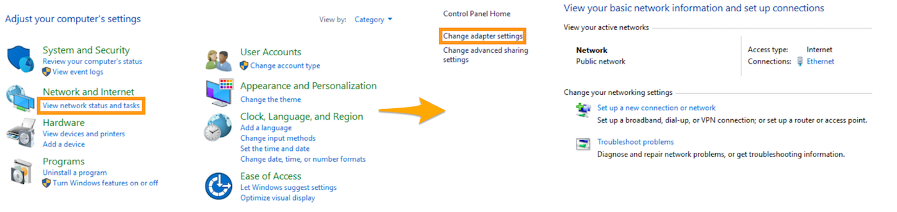
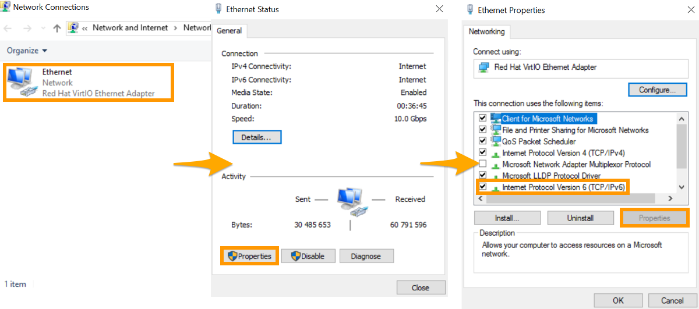
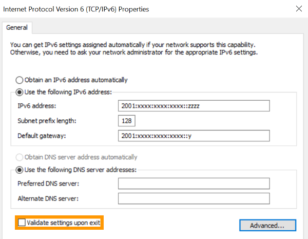

## Objective

IPv6 is the latest version of the *Internet Protocol*. Each OVHcloud VPS server is delivered with an IPv4 address and an IPv6 address. However, only IPv4 is configured by default. If you need to configure IPv6, it has to be set up manually on your system.

**This guide explains how to configure IPv6 on your OVHcloud VPS using various methods.**

> [!warning]
>
> OVHcloud is providing you with services for which you are responsible, with regard to their configuration and security. Since we have no administrative access to your devices, it is your responsibility to manage the software and to ensure they function correctly.
>
> This guide is designed to assist you in common tasks as much as possible. Nevertheless, we recommend contacting a specialised provider and/or the software publisher for the service if you encounter any difficulties. We will not be able to assist you ourselves. You can find more information in the “Go further” section of this guide.
>

## Requirements

- A [Virtual Private Server](https://www.ovhcloud.com/en-sg/vps/) in your OVHcloud account
- Administrative access (sudo) via SSH or remote desktop (Windows) to your server
- A basic understanding of networking
- Access to the [OVHcloud Control Panel](/links/manager) / to the [OVHcloud API](https://ca.api.ovh.com/)

## Instructions

The following sections contain configurations for the distributions we currently offer, as well as the most commonly used distributions/operating systems. The first step is always to log in to your server via SSH or a GUI login session (RDP for a Windows VPS). The examples below presume you are logged in as a user with elevated permissions (Administrator/sudo).

> [!warning]
>
> Please note that on the recent Linux operating systems we offer for VPS, the IPv6 address is configured by default. If this is the case, you don't need to configure it. Please check your operating system's configuration file before making any changes.
>

Please take note of the following terminology that will be used in code examples and instructions of the guide sections below:

|Term|Description|Example|
|---|---|---|
|YOUR_IPV6|The IPv6 address assigned to your service|2001:xxxx:xxxx:xxxx:xxxx:xxxx:xxxx:yyyy|
|IPv6_PREFIX|The prefix (or *netmask*) of your IPv6 block, usually 128|2001:xxxx:xxxx:xxxx::/128|
|IPv6_GATEWAY|The gateway of your IPv6 block|2001:xxxx:xxxx:xxxx:xxxx:xxxx:xxxx:zzzz|

### Step 1: Retrieve the necessary network information

The first step is to identify the IPv6 address and the IPv6 gateway assigned to your server. There are two ways of doing this:

- [retrieving the network information via the OVHcloud Control Panel](#viacontrolpanel)
- [retrieving the network information via the OVHcloud API](#viaapi) 

#### Via the OVHcloud Control Panel <a name="viacontrolpanel"></a>

Log in to the [OVHcloud Control Panel](/links/manager), go to the `Bare Metal Cloud`{.action} section and select your server from `Virtual Private Servers`{.action}.

The IPv6 address and the IPv6 gateway assigned to your server will appear in the `IP` section of the `Home`{.action} tab. Once you have copied them, continue with [applying the IPv6 configuration](#applyipv6).

{.thumbnail}

#### Via the OVHcloud API <a name="viaapi"></a>

On the [OVHcloud API page](https://ca.api.ovh.com/) click on `Login`{.action} in the top-right corner. On the following page, enter the credentials of your OVHcloud account.

Use this call to retrieve the IPv6 address assigned to your server:

> [!api]
>
> @api {v1} /vps GET /vps/{serviceName}/ips
>

The following call allows you to recover the IPv6 gateway assigned to your server:

> [!api]
>
> @api {v1} /vps GET /vps/{serviceName}/ips/{ipAddress}
>

Once you have retrieved these addresses, continue with [applying the IPv6 configuration](#applyipv6).

### Step 2: Apply the IPv6 configuration <a name="applyipv6"></a>

Once you have gathered the necessary information for the IPv6 configuration, log in to your VPS via SSH. If you require assistance, please refer to this guide: [Introduction to SSH](/pages/bare_metal_cloud/dedicated_servers/ssh_introduction){.external}.

There are several ways to apply the IPv6 configuration. Use whichever method best suits your situation and requirements:

- [Non-persistent application](#nonpersistent)
- [Persistent application on Debian and its derivatives](#persistentdebian)
- [Persistent application on Red Hat and its derivatives](#persistentredhat)
- [Persistent application on Fedora](#persistentfedora)
- [Persistent application on Windows Server](#persistentwindows)

#### Non-persistent application <a name="nonpersistent"></a>

> [!warning]
>
> This configuration will be lost after a restart of your VPS (non-persistent configuration).
>

Connect to your server via SSH and enter the following commands. Take care to tailor these with:

- the network information, retrieved in the previous step (*YOUR_IPV6*, *IPV6_PREFIX* and *IPV6_GATEWAY*)
- the network interface (if your server is not using **eth0**)

```bash
ip addr add YOUR_IPV6/IPV6_PREFIX dev eth0
ip -6 route add IPV6_GATEWAY dev eth0
ip -6 route add default via IPV6_GATEWAY dev eth0
```

#### Persistent application on Debian and its derivatives (Ubuntu, Crunchbang, SteamOS, etc) <a name="persistentdebian"></a>

> [!warning]
>
> Before modifying a configuration file, always create a backup of the original.
>

There are two ways to configure your network depending on the operating system installed on your server:

- **For Debian 10 and 11**: use the [method based on the *interfaces* files](#interfaces)

- **For Debian 12, Ubuntu 20.04 and later**: use the [method based on the *Netplan* configuration](#netplan)

In some cases, the appropriate method may not be the one specified above. To make sure, browse your system to check which one is active. Visit <https://netplan.io/> for more information, if necessary.<br>
Moreover, keep in mind that the exact file names may vary.

##### Configuration of *interfaces* files <a name="interfaces"></a>

By default, the configuration files are located in `/etc/network/interfaces.d/`.

The best practice is to create a separate configuration file in the `/etc/network/interfaces.d/` directory to configure the IPv6 address. In our example, our file is called `51-cloud-init-ipv6`:

```bash
sudo nano /etc/network/interfaces.d/51-cloud-init-ipv6
```

Creating a seperate file allows you to easily revert the changes in case of an error.

Add the following lines to the file. Replace the generic elements (i.e. *YOUR_IPV6*, *IPV6_PREFIX* and *IPV6_GATEWAY*) as well as the network interface (if your server is not using **eth0**) with your specific values:

```console
auto eth0
iface eth0 inet6 static
mtu 1500
address YOUR_IPV6
netmask IPV6_PREFIX
post-up /sbin/ip -6 route add IPV6_GATEWAY dev eth0
post-up /sbin/ip -6 route add default via IPV6_GATEWAY dev eth0
pre-down /sbin/ip -6 route del default via IPV6_GATEWAY dev eth0
pre-down /sbin/ip -6 route del IPV6_GATEWAY dev eth0
```

**Configuration example**:

```console
auto eth0
iface eth0 inet6 static
mtu 1500
address 2607:5300:201:abcd::7c5
netmask 128
post-up /sbin/ip -6 route add 2607:5300:201:abcd::1 dev eth0
post-up /sbin/ip -6 route add default via 2607:5300:201:abcd::1 dev eth0
pre-down /sbin/ip -6 route del default via 2607:5300:201:abcd::1 dev eth0
pre-down /sbin/ip -6 route del 2607:5300:201:abcd::1 dev eth0
```

Then restart your network service with one of the following commands:

```bash
sudo service networking restart
```

```bash
sudo systemctl restart networking
```

Alternatively, you can add the configuration above to one of the following files (with *sudo* privileges), depending on the generation of the operating system installed on the server:

- the `/etc/network/interfaces` file
- the `/etc/network/interfaces.d/50-cloud-init.cfg` file

We recommend that you back up the relevant configuration file. For example, use the following command:

```bash
sudo cp /etc/network/interfaces /etc/network/interfaces.bak
```

You will then be able to revert the changes, using the commands below:

```bash
sudo rm -f /etc/network/interfaces
sudo cp /etc/network/interfaces.bak /etc/network/interfaces
```

##### Configuration using Netplan <a name="netplan"></a>

The network configuration files are located in the `/etc/netplan/` directory. By default, the main configuration file is called `50-cloud-init.yaml`. Before continuing, first check this file to see if the IPv6 address has already been configured. If so, you don't need to configure the IPv6 address again as you only have one IPv6 with your VPS server.

If the IPv6 address has not been configured, the best approach is to create a separate configuration file to set up the IPv6 address in the `/etc/netplan/` directory. This way, you can easily revert the changes in case of an error.

In addition, we recommend that you adjust the permissions for the newly created file. For more information about file permissions, consult the [official documentation of ubuntu](https://help.ubuntu.com/community/FilePermissions){.external}.

In our example, our file is named `51-cloud-init-ipv6.yaml`:

```bash
sudo nano /etc/netplan/51-cloud-init-ipv6.yaml
```

Then edit the `51-cloud-init-ipv6.yaml` file, adding the following lines for the IPv6 configuration. Replace the generic elements (i.e. *YOUR_IPV6*, *IPV6_PREFIX* and *IPV6_GATEWAY*) as well as the network interface (if your server is not using **eth0**) with your specific values.

```yaml
network:
    version: 2
    ethernets:
        eth0:
            dhcp6: false
            match:
              name: eth0
            addresses:
              - YOUR_IPV6/IPv6_PREFIX
            routes:
# If IPV6_PREFIX is 128 then add link route to gateway
#              - to: IPv6_GATEWAY
#                scope: link
              - to: ::/0
                via: IPv6_GATEWAY
```

**Configuration example** (with prefix /128):

```yaml
network:
    version: 2
    ethernets:
        eth0:
            dhcp6: false
            match:
              name: eth0
            addresses:
              - 2607:5300:201:abcd::7c5/128
            routes:
              - to: 2607:5300:201:abcd::1
                scope: link
              - to: ::/0
                via: 2607:5300:201:abcd::1
```

> [!warning]
>
> It is important to respect the alignment of each element in this file as represented in the example above. Do not use the tab key to create your spacing. Only the space key is needed.
>

You can test your configuration using this command:

```bash
sudo netplan try
```

If it is correct, apply it using the following command:

```bash
sudo netplan apply
```

#### Persistent application on Red Hat and its derivatives (CentOS, Rocky Linux & Alma Linux, etc.) <a name="persistentredhat"></a>

The network configuration files are located in the `/etc/sysconfig/network-scripts/` directory. We recommend that you start by backing up the relevant configuration file. In our example, our file is called `ifcfg-eth0`, so we copy the `ifcfg-eth0` file using the following commands. Remember to replace **eth0** with your actual interface if necessary. 

```bash
cd /etc/sysconfig/network-scripts/
sudo mkdir backup
sudo cp ifcfg-eth0 backup/ifcfg-eth0
```

You will then be able to revert the changes, using the commands below:

```bash
sudo rm -f /etc/sysconfig/network-scripts/ifcfg-eth0
sudo cp /etc/sysconfig/network-scripts/backup/ifcfg-eth0 /etc/sysconfig/network-scripts/ifcfg-eth0
```

Then we edit the `ifcfg-eth0` file, adding only the lines for the IPv6 configuration of the server. Replace the generic elements (i.e. *YOUR_IPV6*, *IPV6_PREFIX* and *IPV6_GATEWAY*) with your specific values. Also, we have omitted the IPv4 configuration to avoid confusion, but the IPv6 configuration is made in the same configuration file.

```console
IPV6INIT=yes
IPV6ADDR=YOUR_IPV6/IPV6_PREFIX
IPV6_DEFAULTGW=IPV6_GATEWAY
```

**Configuration example**:

```console
IPV6INIT=yes
IPV6ADDR=2607:5300:201:abcd::7c5/128
IPV6_DEFAULTGW=2607:5300:201:abcd::1
```

**On CentOS 7, you have to create a routing file in addition to the steps above:**

- Create a file (with *sudo* privileges), indicating the default IPv6 routes:

```bash
sudo touch /etc/sysconfig/network-scripts/route6-eth0
```

- Edit the file and add the lines below. Replace the generic elements (*IPV6_GATEWAY* and **eth0** interface, if necessary) with your specific values.

```console
IPV6_GATEWAY dev eth0
default via IPV6_GATEWAY
```

**Example:**

```console
2607:5300:201:abcd::1 dev eth0
default via 2607:5300:201:abcd::1
```

Finally, restart your network service to allow the system to apply the new configuration with one of the following commands:

```bash
sudo service networking restart
```

```bash
sudo systemctl restart networking
```

#### Persistent application on Fedora 37 and later <a name="persistentfedora"></a>

The network configuration file is located in the `/etc/NetworkManager/system-connections/`. We recommend that you start by backing up the relevant configuration file. In our example, our file  is called `cloud-init-eth0.nmconnection`, so we copy the `cloud-init-eth0.nmconnection` file using the following commands. Remember to replace **eth0** with your actual interface if necessary. 

```bash
cd /etc/NetworkManager/system-connections/
sudo mkdir backup
sudo cp cloud-init-eth0.nmconnection backup/cloud-init-eth0.nmconnection
```

Then we edit the `cloud-init-eth0.nmconnection` file, adding only the lines for the IPv6 configuration of the server. Replace the generic elements (i.e. *YOUR_IPV6*, *IPV6_PREFIX* and *IPV6_GATEWAY*) with your specific values.

If we assume that your interface is eth0, the configuration should look like this:

```console
[ipv6]
method=auto
may-fail=true
address1=YOUR_IPV6/IPV6_PREFIX
route1=::/0,IPV6_GATEWAY
```

We have omitted the IPv4 configuration to avoid confusion, but the IPv6 configuration is made in the same configuration file.

Here is a concrete example:

```console
[ipv6]
method=auto
may-fail=true
address1=2607:5300:201:abcd::7c5/128
route1=::/0,2607:5300:201:abcd::1
```

#### Persistent application on Windows Server <a name="persistentwindows"></a>

By default, IPv6 is not configured on Windows Servers. To enable it, open the `Control Panel`{.action} and click on `View network status and tasks`{.action}, then on `Change adapter settings`{.action}.

{.thumbnail}

Click on `Ethernet`{.action} to open the settings and click on the `Properties`{.action} button to view the `Ethernet Properties`.

Select `Internet Protocol Version 6 (TCP/IPv6)`{.action}, then click on the `Properties`{.action} button.

{.thumbnail}

In the IPv6 Properties window, select `Use the following IPv6 address`{.action}. Enter the IP addresses which you have retrieved in the first step.

You also have the option of entering the IPv6 DNS resolvers of your choice under `Use the following DNS server addresses`{.action}. This is not mandatory if the DNS resolvers of the IPv4 configuration are already functional.

Finally, tick the `Validate settings upon exit` box and click the `OK`{.action} button to validate your changes. An error message may appear if the specified gateway is not on the same IPv6 subnet (/128 and /64 for example). You can ignore this message and continue to the next step regardless.

{.thumbnail}

### Step 3: Verify the configuration and test the connection

To verify that the configuration is functional, there are several possible commands, depending on the operating system.

- **For a GNU/Linux-based system**, here are two examples for the **eth0** interface (to be adapted if necessary):

```bash
ip -6 addr show eth0
2: eth0: <BROADCAST,MULTICAST,UP,LOWER_UP> mtu 1500 qlen 1000
    inet6 2607:5300:201:abcd::7c5/128 scope global
       valid_lft forever preferred_lft forever
    inet6 fe80::f816:3eff:fec0:c336/64 scope link
       valid_lft forever preferred_lft forever
```

```bash
ifconfig eth0
eth0      Link encap:Ethernet  HWaddr ab:cd:ef:gf:ij:kl
          inet addr:aa.bb.cc.dd  Bcast:aa.bb.cc.ee  Mask:255.255.255.255
          inet6 addr: 2607:5300:201:abcd::7c5/128 Scope:Global
          inet6 addr: fe80::f816:3eff:fec0:c336/64 Scope:Link
          UP BROADCAST RUNNING MULTICAST  MTU:1500  Metric:1
          [...]
```

To test the connection, you can use the following command:

```bash
ping6 proof.ovh.net
```

- **For a Windows-based system**, use the following command:

```powershell
ipconfig

Windows IP Configuration

Ethernet adapter Ethernet:

   Connection-specific DNS Suffix  . : openstacklocal
   IPv6 Address. . . . . . . . . . . : 2607:5300:201:abcd::7c5/128
   Link-local IPv6 Address . . . . . : fe80::d928:7a00:5ba6:951b%3
   IPv4 Address. . . . . . . . . . . : 51.xxx.xxx.xxx
   Subnet Mask . . . . . . . . . . . : 255.255.255.255
   Default Gateway . . . . . . . . . : 2607:5300:201:abcd::1
                                       51.xxx.xxx.y
```

To test the connection, you can use the following command:

```powershell
ping -6 proof.ovh.net
```

You can also test the connection to another remote server. However, IPv6 must be active on the remote server for this operation to work.

> [!primary]
>
> If, despite these changes, IPv6 does not seem work on your server, it is possible (in rare cases) that you will have to carry out additional modifications. In such cases, try the following steps:
>
> - Depending on the operating system, try to change the prefix (or *netmask*) of your IP address from /128 to /64. This will include the IPv6 gateway in your subnet.
>
> - In addition to restarting the network service, it may be necessary to reboot your server to finalise your IPv6 configuration.
> 
> - In Windows, verify that the firewall allows ICMP requests for IPv6.

### Step 4: Disable Cloud-init network management (optional)

> [!primary]
>
> This step does not apply to Windows-based systems.
>

Cloud-init is a package installed by default on a VPS. It functions as a framework to run a script after initially creating your server or rebooting it. The mechanics in place allow the underlying OpenStack infrastructure to inject scripts into the Cloud-init environment and therefore the server configuration.

Depending on the operating system, Cloud-init will manage: the network, the hostname, the resolv.conf file, or the automatic partitioning of the hard disk, in case of an upgrade.

In the case of newer distributions, the default configuration of Cloud-init might sometimes automatically reset the network configuration when the server starts up.

This is relevant for specific use cases in which it is recommended to avoid the reset by disabling automatic network management in Cloud-init. To do this, use the following command to create a file `/etc/cloud/cloud.cfg.d/98-disable-network-config.cfg` with the value `network: {config: disabled}`:

```bash
sudo echo "network: {config: disabled}" > /etc/cloud/cloud.cfg.d/98-disable-network-config.cfg
```

> [!warning]
>
> It might be necessary to reboot the server for the change to take effect.
>

In order to return to automatic management of your network by Cloud-init, delete the newly created file or move it to another directory.


## Go further

Join our [community of users](/links/community).
