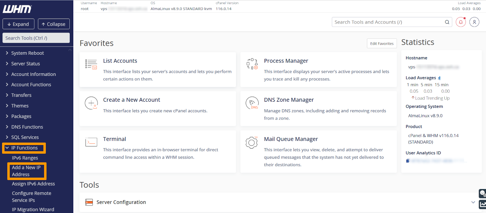
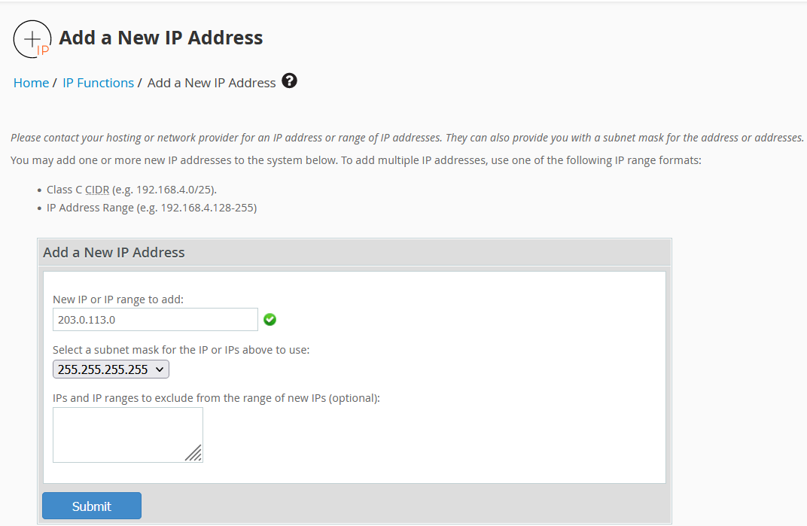
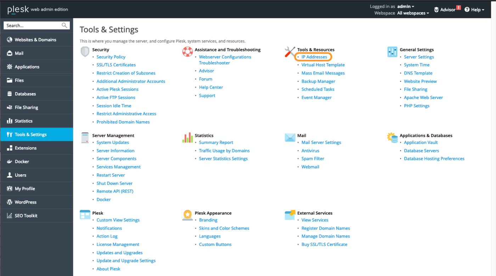
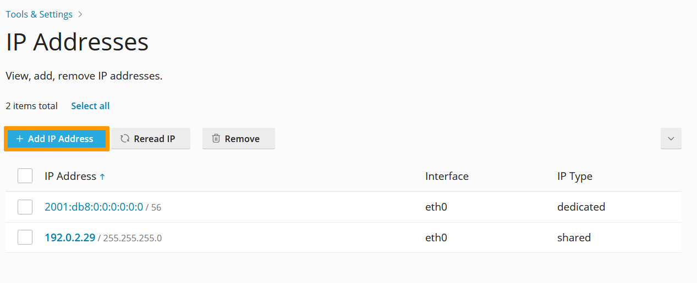
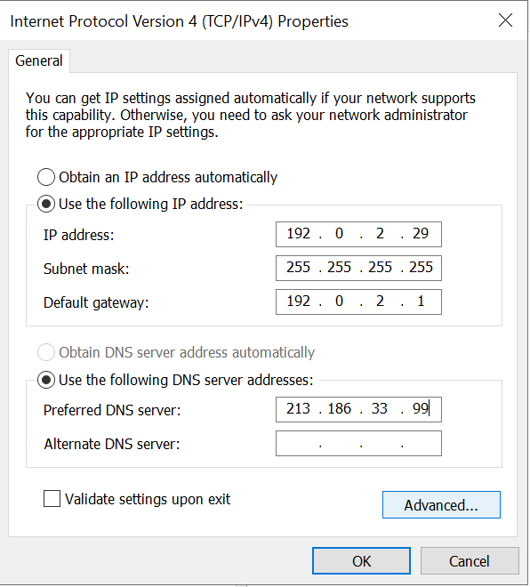

> [!primary]
>
> Since October 6th, 2022 our service "Failover IP" is named [Additional IP](/links/network/additional-ip). This renaming has no effect on its technical features.
>

## Objective

IP aliasing refers to a special network configuration for certain OVHcloud services. Additional IPs allow you to associate multiple IP addresses with a single network interface.

**This guide explains how to add Additional IP addresses to your network configuration.**

> [!warning]
> OVHcloud is providing you with services for which you are responsible, with regard to their configuration and management. You are therefore responsible for ensuring they function correctly.
>
> This guide is designed to assist you in common tasks as much as possible. Nevertheless, we recommend that you contact a [specialist service provider](https://partner.ovhcloud.com/en/directory/) and/or discuss the issue with our community on https://community.ovh.com/en/ if you have difficulties or doubts concerning the administration, usage or implementation of services on a server.
>

## Requirements

- A [Virtual Private Server](https://www.ovhcloud.com/en/vps/) in your OVHcloud account
- An [Additional IP address](https://www.ovhcloud.com/en/bare-metal/ip/)
- Administrative access (sudo) via SSH or GUI to your server
- Basic networking and administration knowledge

## Instructions

The following sections contain the configurations for the most commonly used distributions/operating systems. The first step is always to log in to your server via SSH or a GUI login session (RDP for a Windows VPS). The examples below presume you are logged in as a user with elevated permissions (Administrator/sudo).

> [!primary]
>
Concerning different distribution releases, please note that the proper procedure to configure your network interface as well as the file names may have been subject to change. We recommend to consult the manuals and knowledge resources of the respective OS versions if you experience any issues.
> 

**Please take note of the following terminology that will be used in code examples and instructions of the guide sections below:**

|Term|Description|Examples|
|---|---|---|
|ADDITIONAL_IP|An Additional IP address assigned to your service|203.0.113.0|
|NETWORK_INTERFACE|The name of the network interface|*eth0*, *ens3*|
|ID|ID of the IP alias, starting with *0* (depending on the number of additional IPs there are to configure)|*0*, *1*|

### Debian 10/11

#### Step 1: Disable automatic network configuration

Open the following file path with a text editor, in our example, we are using `nano`.

```bash
sudo nano /etc/cloud/cloud.cfg.d/99-disable-network-config.cfg
```
Enter the following line, then save and exit the editor.

```console
network: {config: disabled}
```
Creating this configuration file will prevent changes to your network configuration from being made automatically.

#### Step 2: Create a backup

By default, the configuration file is located in the path `etc\network\interfaces.d`.

In our example, our file is called `50-cloud-init`, so we make a copy of the `50-cloud-init` file using the following command:

```bash
sudo cp /etc/network/interfaces.d/50-cloud-init /etc/network/interfaces.d/50-cloud-init.bak
```

In case of a mistake, you will be able to revert the changes, using the commands below:

```bash
sudo rm -f /etc/network/interfaces.d/50-cloud-init
sudo cp /etc/network/interfaces.d/50-cloud-init.bak /etc/network/interfaces.d/50-cloud-init
```
#### Step 3: Edit the configuration file

The first step is to verify your network interface name with this command:

```bash
ip a
```

Next, open the network configuration file for editing with the following command:

```bash
sudo nano /etc/network/interfaces.d/50-cloud-init
```

To configure your Additional IP, you need to add a virtual interface or ethernet alias to your network interface. In our example, our interface is called `eth0`, so our first alias is `eth0:0`. Do this for each Additional IP you wish to configure.

Do not modify the existing lines in the configuration file, simply add your Additional IP to the file as follows, replacing `NETWORK_INTERFACE`, `ID` and `ADDITIONAL_IP` wih your own values:


```console
auto NETWORK_INTERFACE:ID
iface NETWORK_INTERFACE:ID inet static
address ADDITIONAL_IP
netmask 255.255.255.255
```

If you are configuring more than one Additional IP, your configuration file should look like this:

```console
auto NETWORK_INTERFACE:ID
iface NETWORK_INTERFACE:ID inet static
address ADDITIONAL_IP1
address ADDITIONAL_IP2
netmask 255.255.255.255
```

**Configuration example:**

```console
auto eth0:0
iface eth0:0 inet static
address 203.0.113.0
netmask 255.255.255.255
```

#### Step 4: Restart the interface

Apply the changes with the following command:

```bash
sudo systemctl restart networking
```

### Debian 12, Ubuntu 20.04 and following

The configuration file for your Additional IP addresses is located in the folder `/etc/netplan/`. In this example it is called `50-cloud-init.yaml`. 

The best practice approach is to create a separate configuration file to set up Additional IP addresses. This way, you can easily revert the changes in case of an error.

#### Step 1: Create the network configuration file

In our example, our file is call `51-cloud-init.yaml`:

```bash
sudo touch /etc/netplan/51-cloud-init.yaml
```

#### Step 2: Edit the configuration file

You can verify your network interface name with this command:

```bash
ip a
```

Next, open the network configuration file for editing with the following command:

```bash
sudo nano /etc/netplan/51-cloud-init.yaml
```

Edit the file with the content below, replacing `INTERFACE_NAME` and `ADDITIONAL_IP` with your own values:

```yaml
network:
   version: 2
   renderer: networkd
   ethernets:
       INTERFACE_NAME:
           dhcp4: true
           addresses:
           - ADDITIONAL_IP/32
```

If you have more Additional IPs to configure, the configuration file should look like this:

```yaml
network:
   version: 2
   renderer: networkd
   ethernets:
       INTERFACE_NAME:
           dhcp4: true
           addresses:
           - ADDITIONAL_IP1/32
           - ADDITIONAL_IP2/32
```

> [!warning]
>
> It is important to respect the alignment of each element in this file as represented in the example above. Do not use the tab key to create your spacing.
>

**Configuration example:**

```yaml
network:
   version: 2
   renderer: networkd
   ethernets:
       eth0:
           dhcp4: true
           addresses:
           - 203.0.113.0/32
```

Save and close the file.

#### Step 3: Apply the new network configuration

You can test your configuration using this command:

```bash
sudo netplan try
```

If it is correct, apply it using the following command:

```bash
sudo netplan apply
```

### CentOS 7, AlmaLinux (8 & 9), Rocky Linux (8 & 9)

The main configuration file is located in `/etc/sysconfig/network-scripts/`. In this example it is called `ifcfg-eth0`. Before making changes, verify the actual file name in this folder.

For each Additional IP to be configured, we create a seperate configuration file with the following parameters: `ifcfg-NETWORK_INTERFACE:ID`. Where `NETWORK_INTERFACE` is the physical interface and `ID` is the virtual network interface or ethernet alias starting with a value of 0. For example, for our interface named `eth0` the first alias is `eth0:0`, the second alias is `eth0:1`, etc...

#### Step 1: Determine the interface

```bash
ip a
```

#### Step 2: Create the configuration file

First, create the configuration file. Replace `NETWORK_INTERFACE:ID` with your own values.

```bash
sudo nano /etc/sysconfig/network-scripts/ifcfg-NETWORK_INTERFACE:ID
```

Next, edit the file with the content below, replacing `NETWORK_INTERFACE:ID`, and `ADDITIONAL_IP` with your own values:

```console
DEVICE=NETWORK_INTERFACE:ID
ONBOOT=yes
BOOTPROTO=none # For CentOS use "static"
IPADDR=ADDITIONAL_IP
NETMASK=255.255.255.255
BROADCAST=ADDITIONAL_IP
```

**Configuration example:**

```console
DEVICE=eth0:0
ONBOOT=yes
BOOTPROTO=none # For CentOS use "static"
IPADDR=203.0.113.0
NETMASK=255.255.255.255
BROADCAST=203.0.113.0
```

#### Step 3: Restart the interface

```bash
sudo systemctl restart network
```

#### For AlmaLinux and Rocky Linux

```bash
sudo systemctl restart NetworkManager
```

### Fedora 37 and following

Fedora now uses keyfiles. NetworkManager previously stored network profiles in ifcfg format in this directory: `/etc/sysconfig/network-scripts/`. However, the ifcfg format is now deprecated. By default, NetworkManager no longer creates new profiles in this format. The configuration file is now found in `/etc/NetworkManager/system-connections/`.

#### Step 1: Create a backup

In our example, our file is called `cloud-init-eno1.nmconnection`, so we make a copy of the `cloud-init-eno1.nmconnection` file using the following command:

```bash
sudo cp -r /etc/NetworkManager/system-connections/cloud-init-eno1.nmconnection /etc/NetworkManager/system-connections/cloud-init-eno1.nmconnection.bak
```

In case of a mistake, you will be able to revert the changes, using the commands below:

```bash
sudo rm -f /etc/NetworkManager/system-connections/cloud-init-eno1.nmconnection
sudo cp /etc/NetworkManager/system-connections/cloud-init-eno1.nmconnection.bak /etc/NetworkManager/system-connections/cloud-init-eno1.nmconnection
```

#### Step 2: Edit the config file

> [!primary]
> Please note that the name of the network file in our example may differ from yours. Please adapt the commands to your file name.
> 

```bash
sudo nano /etc/NetworkManager/system-connections/cloud-init-eno1.nmconnection
```

Do not modify the existing lines in the configuration file, add your Additional IP to the file as follows, replacing `ADDITIONAL_IP/32` wih your own values:

```console
[ipv4]
method=auto
may-fail=false
address1=ADDITIONAL_IP/32
```

If you have two Additional IPs to configure, the configuration should look like this:

```console
[ipv4]
method=auto
may-fail=false
address1=ADDITIONAL_IP1/32
address2=ADDITIONAL_IP2/32
```

**Configuration example:**

```console
[ipv4]
method=auto
may-fail=false
address1=203.0.113.0/32
```

#### Step 3: Restart the interface

You now need to restart your interface:

```bash
sudo systemctl restart NetworkManager
```

### cPanel

#### Step 1: Access the WHM IP management section

In the WHM control panel, click on `IP Functions`{.action} and select `Add a New IP Address`{.action} in the left-hand sidebar.

{.thumbnail}

#### Step 2: Add the Additional IP information

Enter your Additional IP in the form `xxx.xxx.xxx.xxx` into the field “New IP or IP range to add”. 

Select `255.255.255.255` as your subnet mask, then click on `Submit`{.action}.

{.thumbnail}

> [!warning]
>
> Please note that if you have more than one IP to configure on the same block and you add them all at once, the WHM system will force you to use the subnet mask `255.255.255.0`. We do not recommend using this configuration. Instead, you need to add each IP individually in order to use the proper subnet mask `255.255.255.255`.
> 

#### Step 3: Check the current IP configuration

Back in the section `IP Functions`{.action}, click on `Show or Delete Current IP Addresses`{.action} to verify that the Additional IP address was added correctly.

{.thumbnail}

### Plesk

#### Step 1: Access the Plesk IP management section

In the Plesk control panel, choose `Tools & Settings`{.action} from the left-hand sidebar.

{.thumbnail}

Click on `IP Addresses`{.action} under **Tools & Resources**.

#### Step 2: Add the additional IP information

In this section, click on the button `Add IP Address`{.action}.

{.thumbnail}

Enter your Additional IP in the form `xxx.xxx.xxx.xxx/32` into the field "IP address and subnet mask", then click on `OK`{.action}.

{.thumbnail}

#### Step 3: Check the current IP configuration

Back in the section "IP Addresses", verify that the Additional IP address was added correctly.

{.thumbnail}

### Windows Servers

#### Step 1: Verify the network configuration

Right-click on the `Start Menu`{.action} button and open `Run`{.action}.

Type `cmd` and click `OK`{.action} to open the command line application.

{.thumbnail}

In order to retrieve the current IP configuration, enter `ipconfig` at the command prompt.

```powershell
C:\Users\Administrator>ipconfig

Windows IP Configuration


Ethernet adapter Ethernet:

   Connection-specific DNS Suffix  . : openstacklocal
   Link-local IPv6 Address . . . . . : fe90::30gf:258a:84d6:abcf%5
   IPv4 Address. . . . . . . . . . . : 192.0.2.29
   Subnet Mask . . . . . . . . . . . : 255.255.255.255
   Default Gateway . . . . . . . . . : 192.0.2.1
```

#### Step 2: Change the IPv4 Properties

Now you need to change the IP properties to a static configuration.

1. Go to `Start`{.action}> `Control Panel`{.action}>` Network and Internet`{.action}> `Network and Sharing Centre`{.action}> `Change Adapter Settings`{.action}(in the left-hand menu).
2. Right-click on `Ethernet`{.action}.
3. Click on `Properties`{.action}.
4. Select `Internet Protocol Version 4 (TCP/IPv4)`{.action}, then click on `Properties`{.action}.
5. Click on `Use the following IP address`{.action} and type in your server’s primary IP, subnet mask and default gateway information obtained by using the `ipconfig`{.action} command above. In the "Preferred DNS Server" box, type `213.186.33.99`.


{.thumbnail}

> [!warning]
>
> Be careful – the server will no longer be accessible if you enter incorrect information. You will then have to make the corrections in the KVM.
>

Once done, click on `Advanced`{.action}.

#### Step 3: Add the Additional IP in the "Advanced TCP/IP Settings"

In the new window, click on `Add...`{.action} under "IP addresses". Enter your Additional IP address and the subnet mask (255.255.255.255).

{.thumbnail}

Confirm by clicking on `Add`{.action}.

{.thumbnail}

Once done, click on `OK`{.action} to apply the configuration. 

{.thumbnail}

You will lose the connection to the server for a few seconds.

#### Step 4: Check the new network configuration

Open the command prompt (cmd) and enter `ipconfig`. The configuration should now include the new Additional IP address.

```powershell
C:\Users\Administrator>ipconfig

Windows IP Configuration


Ethernet adapter Ethernet:

   Connection-specific DNS Suffix  . :
   Link-local IPv6 Address . . . . . : fe90::30gf:258a:84d6:abcf%5
   IPv4 Address. . . . . . . . . . . : 192.0.2.29
   Subnet Mask . . . . . . . . . . . : 255.255.255.255
   IPv4 Address. . . . . . . . . . . : 203.0.113.0
   Subnet Mask . . . . . . . . . . . : 255.255.255.255
   Default Gateway . . . . . . . . . : 192.0.2.1
```

### Troubleshooting

First, restart your server from the command line or its GUI. If you are still unable to establish a connection from the public network to your alias IP and suspect a network problem, you need to reboot the server in [rescue mode](/pages/bare_metal_cloud/virtual_private_servers/rescue). Then you can set up the Additional IP address directly on the server.

Once you are connected to your server via SSH, enter the following command:

```bash
ifconfig ens3:0 ADDITIONAL_IP netmask 255.255.255.255 broadcast ADDITIONAL_IP up
```

To test the connection, simply ping your Additional IP from the outside. If it responds in rescue mode, that probably means that there is a configuration error. If, however, the IP is still not working, please inform our support teams by creating a [support request](https://help.ovhcloud.com/csm?id=csm_get_help) for further investigations.
 
## Go further <a name="go-further"></a>

[Activating Rescue Mode on VPS](/pages/bare_metal_cloud/virtual_private_servers/rescue)

If you would like assistance using and configuring your OVHcloud solutions, please refer to our [support offers](https://www.ovhcloud.com/en/support-levels/).

Join our [community of users](/links/community).