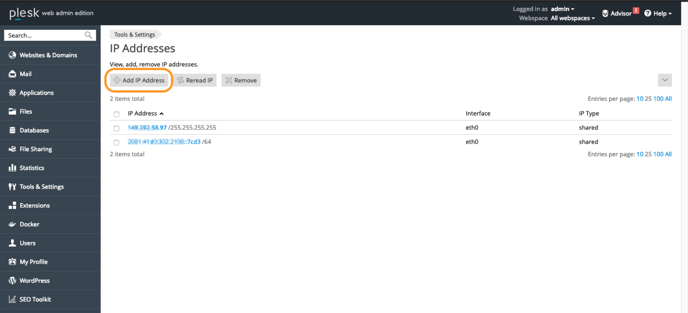
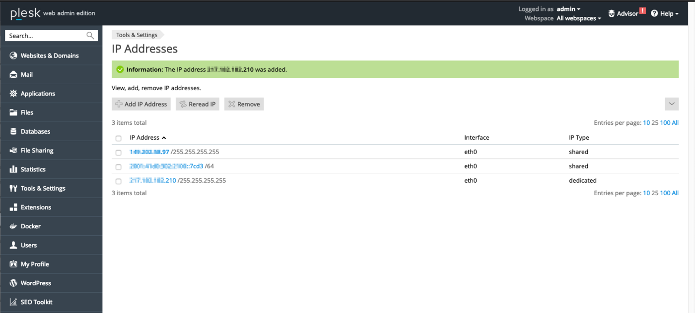

> [!primary]
>
> Depuis le 6 octobre 2022, notre solution "IP Failover" s'appelle désormais [Additional IP](https://www.ovhcloud.com/fr-ca/network/additional-ip/). Cela n'a pas d'impact sur ses fonctionnalités.
>

## Objectif

L'alias d'IP (*IP aliasing* en anglais) est une configuration spéciale du réseau pour vos serveurs OVHcloud, qui vous permet d'associer plusieurs adresses IP sur une seule interface réseau.

**Ce guide explique comment ajouter des adresses Additional IP à votre configuration réseau.**

> [!warning]
>
> OVHcloud met à votre disposition des services dont la responsabilité vous revient. En effet, n’ayant aucun accès à ces machines, nous n’en sommes pas les administrateurs et ne pourrons vous fournir d'assistance. Il vous appartient de ce fait d’en assurer la gestion logicielle et la sécurisation au quotidien.
>
> Nous mettons à votre disposition ce guide afin de vous accompagner au mieux sur des tâches courantes. Néanmoins, nous vous recommandons de faire appel à un [prestataire spécialisé](https://partner.ovhcloud.com/fr-ca/directory/) si vous éprouvez des difficultés ou des doutes concernant l’administration, l’utilisation ou la sécurisation d’un serveur. Plus d’informations dans la section « Aller plus loin » de ce guide.
>

## Prérequis

- un [VPS](https://www.ovhcloud.com/fr-ca/vps/) dans votre compte OVHcloud
- une [adresse Additional IP](https://www.ovhcloud.com/fr-ca/bare-metal/ip/) ou un bloc Additional IP
- un accès administrateur (root) via SSH ou GUI sur votre serveur
- des connaissances de base sur les réseaux et leur administration

## En pratique

Ce guide contient les configurations des distributions/systèmes d’exploitation que nous proposons actuellement, ainsi que pour les distributions/systèmes d'exploitation les plus couramment utilisés. La première étape consiste toujours à se connecter à votre serveur via SSH ou via une session de connexion à l'interface graphique utilisateur (RDP pour un VPS Windows). Les exemples ci-dessous supposent que vous êtes connecté en tant qu'utilisateur avec des autorisations élevées (Administrateur/sudo).

> [!primary]
>
En ce qui concerne les différentes versions de distributions, veuillez noter que la procédure appropriée pour configurer votre interface réseau ainsi que les noms de fichiers peuvent avoir été modifiés. Si vous rencontrez des difficultés, nous vous recommandons de consulter la documentation relative à votre système d’exploitation.
>

**Veuillez prendre note de la terminologie suivante qui sera utilisée dans les exemples de code et les instructions détaillées dans ce guide :**

|Terme|Description|Exemples|
|---|---|---|
|ADDITIONAL_IP|Adresse Additional IP attribuée à votre service|169.254.10.254|
|NETWORK_INTERFACE|Nom de l'interface réseau|*eth0*, *ens3*|
|ID|ID de l'alias IP, commençant par *0* (en fonction du nombre d'adresses IP supplémentaires à configurer)|*0*, *1*|

### Debian 10/11

#### Etape 1 : désactiver la configuration automatique du réseau

Ouvrez le chemin d'accès au fichier suivant avec un éditeur de texte :

```bash
sudo nano /etc/cloud/cloud.cfg.d/99-disable-network-config.cfg
```

Entrez la ligne suivante, puis enregistrez et quittez l'éditeur.

```bash
network: {config: disabled}
```

La création de ce fichier de configuration empêche l'exécution automatique des modifications apportées à la configuration de votre réseau.

#### Etape 2 : modifier le fichier de configuration réseau

Le fichier de configuration principal se trouve dans `/etc/network/interfaces.d/`. Dans cet exemple, il est appelé « ifcfg-eth0 ».

Dans cet environnement, les Additional IP sont configurées en créant des « interfaces virtuelles ou des alias Ethernet » (exemple : eth0:0, eth0:1, etc.).

Vous pouvez vérifier le nom de votre interface réseau à l'aide de la commande suivante :

```bash
ip a
```

Ouvrez le fichier de configuration réseau pour le modifier à l'aide de la commande suivante :

```bash
sudo nano /etc/network/interfaces.d/50-cloud-init
```

Ajoutez ensuite les lignes suivantes, en remplaçant `NETWORK_INTERFACE` par le nom de votre interface et `ID` par le premier alias :

```bash
auto NETWORK_INTERFACE:ID
iface NETWORK_INTERFACE:ID inet static
address ADDITIONAL_IP
netmask 255.255.255.255
```

Exemple de configuration :

```bash
auto eth0:0
iface eth0:0 inet static
address 169.254.10.254
netmask 255.255.255.255
```

#### Etape 3 : redémarrer l'interface

Appliquez les modifications à l'aide de la commande suivante :

```bash
sudo systemctl restart networking
```

### Debian 12, Ubuntu 20.04 et versions ultérieures

Les fichiers de configuration du réseau sont situés dans le répertoire `/etc/netplan/`. Par défaut, le fichier de configuration principal s'appelle « 50-cloud-init.yaml ». Étant donné que netplan ne prend pas en charge les interfaces virtuelles ou les alias ethernet (par exemple ens3:0, ens3:1), toutes les Additional IP sont configurées sur une seule interface réseau.

La meilleure approche consiste à créer un fichier de configuration séparé pour configurer les Additional IP dans le répertoire `/etc/netplan/`. Cela permet de revenir facilement en arrière en cas d'erreur.

#### Etape 1 : désactiver la configuration automatique du réseau

Ouvrez le chemin d'accès au fichier suivant avec un éditeur de texte :

```bash
sudo nano /etc/cloud/cloud.cfg.d/99-disable-network-config.cfg
```

Entrez la ligne suivante, puis enregistrez et quittez l'éditeur.

```bash
network: {config: disabled}
```

La création de ce fichier de configuration empêche l'exécution automatique des modifications apportées à la configuration de votre réseau.

#### Etape 2 : Créer et éditer le fichier de configuration

Vous pouvez vérifier le nom de votre interface réseau à l'aide de la commande suivante :

```bash
ip a
```

Notez le nom de l'interface (celle sur laquelle est configurée l'adresse IP principale de votre serveur) et son adresse MAC.

Ensuite, créez un fichier de configuration avec une extension .yaml pour configurer vos Additional IP. À titre d'exemple, notre fichier s'intitule « 51-cloud-init.yaml ».

```bash
sudo nano /etc/netplan/51-cloud-init.yaml
```

Modifiez le fichier avec le contenu ci-dessous, en remplaçant `INTERFACE_NAME`, `MAC_ADDRESS` et `ADDITIONAL_IP` par vos propres valeurs :

```yaml
network:
    version: 2
    ethernets:
        INTERFACE_NAME:
            dhcp4: true
            match:
                macaddress: MAC_ADDRESS
            set-name: INTERFACE_NAME
            addresses:
            - ADDITIONAL_IP/32
```

Si vous avez deux IP supplémentaires à configurer, le fichier de configuration devrait ressembler à ceci :

```yaml
network:
    version: 2
    ethernets:
        INTERFACE_NAME:
            dhcp4: true
            match:
                macaddress: MAC_ADDRESS
            set-name: INTERFACE_NAME
            addresses:
            - ADDITIONAL_IP1/32
            - ADDITIONAL_IP2/32
```

> [!warning]
>
> Il est important de respecter l'alignement de chaque élément de ce fichier tel que représenté dans l'exemple ci-dessus. N'utilisez pas la touche de tabulation pour créer votre espacement.
>

Enregistrez et fermez le fichier.

#### Etape 3 : appliquer la nouvelle configuration réseau

Vous pouvez tester votre configuration à l'aide de la commande suivante :

```bash
sudo netplan try
```

Si elle est correcte, appliquez-la à l'aide de la commande suivante :

```bash
sudo netplan apply
```

Répétez cette procédure pour chaque adresse Additional IP.

#### Attribuer temporairement une Additional IP

Il est possible d’attribuer temporairement une Additional IP, mais la configuration sera perdue au redémarrage du serveur. Cette configuration vous permet également d'étiqueter l'IP avec une interface virtuelle.

Remplacez simplement `ADDITIONAL_IP`, `NETWORK_INTERFACE` et `NETWORK_INTERFACE:ID` par vos propres valeurs.

```bash
sudo ip address add ADDITIONAL_IP/32 dev NETWORK_INTERFACE label NETWORK_INTERFACE:ID
```

A titre d'exemple, si nous voulons assigner temporairement le bloc IP `169.254.10.254/32` à notre serveur avec interface réseau **ens3** :

```bash
sudo ip address add 169.254.10.254/32 dev ens3 label ens3:0
```

Si nous exécutons `ip a`, nous pouvons voir que l'IP est configurée sur l'interface principale avec une interface virtuelle **ens3:0** :

```bash
1: lo: <LOOPBACK,UP,LOWER_UP> mtu 65536 qdisc noqueue state UNKNOWN group default qlen 1000
    link/loopback 00:00:00:00:00:00 brd 00:00:00:00:00:00
    inet 127.0.0.1/8 scope host lo
       valid_lft forever preferred_lft forever
    inet6 ::1/128 scope host
       valid_lft forever preferred_lft forever
2: ens3: <BROADCAST,MULTICAST,UP,LOWER_UP> mtu 1500 qdisc fq_codel state UP group default qlen 1000
    link/ether fb:17:3a:a8:15:7c brd ff:ff:ff:ff:ff:ff
    inet 123.123.123.123/32 scope global dynamic ens3
       valid_lft 86179sec preferred_lft 86179sec
    inet 169.254.10.254/32 scope global ens3:0
       valid_lft forever preferred_lft forever
```

### Fedora 37 et versions ultérieures

Fedora utilise dorénavant des fichiers clés (*keyfiles*).
Fedora utilisait auparavant des profils réseau stockés par NetworkManager au format ifcfg dans le répertoire `/etc/sysconfig/network-scripts/`.<br>
Le ifcfg étant à présent déprécié, NetworkManager ne crée plus par défaut les nouveaux profils dans ce format. Le fichier de configuration se trouve à présent dans `/etc/NetworkManager/system-connections/`.

#### Étape 2 : Créer une sauvegarde

> [!primary]
> 
> Notez que le nom du fichier réseau dans notre exemple peut être différent du vôtre. Veuillez le remplacer par le nom de votre fichier.
>

Il convient avant tout d'effectuer une copie du fichier source afin de pouvoir revenir en arrière à tout moment :

```sh
cp -r /etc/NetworkManager/system-connections/cloud-init-eno1.nmconnection /etc/NetworkManager/system-connections/cloud-init-eno1.nmconnection.bak
```

#### Étape 2 : éditer le fichier de configuration

Vérifiez le nom de votre interface réseau avec cette commande :

```bash
ip a
```

Ne modifiez pas les lignes existantes dans le fichier de configuration, ajoutez votre Additional IP au fichier de configuration comme suit, en remplaçant `ADDITIONAL_IP/32` par votre IP.

```sh
sudo nano /etc/NetworkManager/system-connections/cloud-init-eno1.nmconnection
```

```sh
[ipv4]
method=auto
may-fail=false
address1=ADDITIONAL_IP/32
```

Si vous avez deux Additional IP à configurer, le fichier de configuration devrait ressembler à ceci :

```sh
[connection]
id=cloud-init eno1
uuid=xxxxxxx-xxxx-xxxe-ba9c-6f62d69da711
type=ethernet

[user]
org.freedesktop.NetworkManager.origin=cloud-init

[ethernet]
mac-address=MAC_ADDRESS

[ipv4]
method=auto
may-fail=false
address1=ADDITIONAL_IP1/32
address2=ADDITIONAL_IP2/32
```

#### Étape 3 : redémarrer l'interface

Appliquez les modifications à l'aide de la commande suivante :

```sh
sudo systemctl restart NetworkManager
```

### cPanel (CentOS 7) / AlmaLinux (8 & 9), Rocky Linux (8 & 9) / dérivés Red Hat

Le fichier de configuration principal est situé dans `/etc/sysconfig/network-scripts/`. Dans cet exemple, il est appelé "ifcfg-eth0". Avant de faire des changements, vérifiez le nom réel du fichier dans ce dossier.

Pour chaque Additional IP à configurer, nous allons créer un fichier de configuration séparé avec une interface virtuelle. Pour créer une interface virtuelle, il suffit d'ajouter un nombre consécutif au nom de l'interface, en commençant par une valeur de 0 pour le premier alias. Par exemple, pour une interface réseau nommée « eth0 », le premier alias est « eth0:0 ».

#### Etape 1 : créer et modifier le fichier de configuration du réseau

Vous pouvez vérifier le nom de votre interface réseau à l'aide de la commande suivante :

```bash
ip a
```

Ensuite, créez le fichier de configuration réseau pour le modifier. Remplacez `NETWORK_INTERFACE` par le nom de votre interface et `ID` par le premier alias :

```bash
sudo nano /etc/sysconfig/network-scripts/ifcfg-NETWORK_INTERFACE:ID
```

Par exemple, avec une interface réseau nommée « eth0 », nous allons créer le fichier de configuration ci-dessous :

```bash
sudo nano /etc/sysconfig/network-scripts/ifcfg-eth0:0
```

Ajoutez ensuite ces lignes, en remplaçant `NETWORK_INTERFACE:ID` et `ADDITIONAL_IP` par vos propres valeurs.

```bash
DEVICE=NETWORK_INTERFACE:ID
BOOTPROTO=static
IPADDR=ADDITIONAL_IP
NETMASK=255.255.255.255
BROADCAST=ADDITIONAL_IP
ONBOOT=yes
```

Exemple de configuration :

```bash
DEVICE=eth0:0
BOOTPROTO=static
IPADDR=169.254.10.254
NETMASK=255.255.255.255
BROADCAST=169.254.10.254
ONBOOT=yes
```
#### Etape 2 : redémarrer l'interface

Appliquez les modifications à l'aide de la commande suivante :

```bash
sudo systemctl restart network.service
```

### Plesk

#### Etape 1 : accéder à la gestion d'IP de Plesk

Dans le panneau de configuration Plesk, choisissez `Tools & Settings`{.action} dans la barre latérale gauche.

{.thumbnail}

Cliquez sur `IP Addresses`{.action} sous **Tools & Settings**.

#### Etape 2 : ajouter les informations IP supplémentaires

Dans cette section, cliquez sur le bouton `Add IP Address`{.action}.

{.thumbnail}

Entrez votre adresse Additional IP sous la forme `xxx.xxx.xxx.xxx/32` dans le champ « IP address and subnet mask », puis cliquez sur `OK`{.action}.

{.thumbnail}

#### Etape 3 : vérifier la configuration IP actuelle

Dans la section « IP Addresses », vérifiez que l'adresse Additional IP a été correctement ajoutée.

{.thumbnail}

### Windows Server 2016 et versions ultérieures

#### Etape 1 : vérifier la configuration réseau

Faites un clic droit sur le bouton `Menu Démarrer`{.action} et ouvrez `Exécuter`{.action}.

Tapez `cmd` et cliquez sur `OK`{.action} pour ouvrir l'application de ligne de commande.

{.thumbnail}

Afin de récupérer la configuration IP actuelle, entrez `ipconfig` dans l'invite de commande.

{.thumbnail}

#### Etape 2 : modifier les propriétés IPv4

Vous devez maintenant modifier les propriétés IP en une configuration statique.

Ouvrez les paramètres de l'adaptateur dans le Panneau de configuration Windows, puis ouvrez les `Propriétés`{.action} de `Internet Protocol Version 4 (TCP/IPv4)`{.action}.

{.thumbnail}

Dans la fenêtre Propriétés IPv4, sélectionnez `Utiliser l'adresse IP suivante`{.action}. Entrez l'adresse IP que vous avez récupérée à la première étape, puis cliquez sur `Avancé`{.action}.

#### Etape 3 : ajouter l'adresse Additional IP dans les Paramètres TCP/IP avancés

Dans la nouvelle fenêtre, cliquez sur `Ajouter...`{.action} sous « Adresses IP ». Entrez votre adresse Additional IP et le masque de sous-réseau (255.255.255.255).

{.thumbnail}

Confirmez en cliquant sur `Ajouter`{.action}.

{.thumbnail}

#### Etape 4 : redémarrer l'interface réseau

De retour dans le panneau de configuration (`Connexions réseau`{.action}), faites un clic droit sur votre interface réseau, puis sélectionnez `Désactiver`{.action}.

{.thumbnail}

Pour la redémarrer, faites un nouveau clic droit dessus, puis sélectionnez `Activer`{.action}.

{.thumbnail}

#### Etape 5 : vérifier la nouvelle configuration réseau

Ouvrez l'invite de commandes (cmd) et entrez `ipconfig`. La configuration doit maintenant inclure la nouvelle adresse Additional IP.

{.thumbnail}

### Diagnostic

Tout d'abord, redémarrez votre serveur via la ligne de commande ou son interface utilisateur. Si vous ne parvenez toujours pas à établir une connexion entre le réseau public et votre adresse IP d'alias et que vous suspectez un problème réseau, vous devez redémarrer le serveur en [mode rescue](/pages/bare_metal_cloud/virtual_private_servers/rescue). Vous pouvez ensuite configurer l'adresse Additional IP directement sur le serveur.

Une fois que vous êtes connecté à votre serveur via SSH, entrez la commande suivante :

```bash
ifconfig ens3:0 ADDITIONAL_IP netmask 255.255.255.255 broadcast ADDITIONAL_IP up
```

Pour tester la connexion, il vous suffit d'envoyer un ping à votre adresse Additional IP depuis l'extérieur. S'il répond en mode rescue, cela signifie probablement qu'il y a une erreur de configuration. Toutefois, si l'IP ne fonctionne toujours pas, veuillez en informer nos équipes du support en créant un ticket d'assistance depuis votre [espace client OVHcloud](https://ca.ovh.com/manager/#/dedicated/support/tickets/new).

## Aller plus loin

[Activer le mode rescue sur un VPS](/pages/bare_metal_cloud/virtual_private_servers/rescue)

Rejoignez notre communauté d'utilisateurs sur <https://community.ovh.com/>.
