> [!primary]
> Tłumaczenie zostało wygenerowane automatycznie przez system naszego partnera SYSTRAN. W niektórych przypadkach mogą wystąpić nieprecyzyjne sformułowania, na przykład w tłumaczeniu nazw przycisków lub szczegółów technicznych. W przypadku jakichkolwiek wątpliwości zalecamy zapoznanie się z angielską/francuską wersją przewodnika. Jeśli chcesz przyczynić się do ulepszenia tłumaczenia, kliknij przycisk "Zgłóś propozycję modyfikacji" na tej stronie.
> 

> [!primary]
>
> Od 6 października 2022 nasze rozwiązanie "Failover IP" nazywa się teraz [Additional IP](https://www.ovhcloud.com/pl/network/additional-ip/). To nie ma wpływu na jego funkcje.
>

## Wprowadzenie

Alias IP (*IP aliasing* w języku angielskim) to specjalna konfiguracja sieci dla serwerów OVHcloud, która pozwala na przypisanie kilku adresów IP do jednego interfejsu sieciowego.

**Niniejszy przewodnik wyjaśnia, jak dodawać adresy Additional IP do Twojej konfiguracji sieci.**

> [!warning]
>
> OVHcloud oddaje do Twojej dyspozycji usługi, za które przejmujesz odpowiedzialność. Firma OVHcloud nie ma dostępu do Twoich serwerów, nie pełni funkcji administratora i w związku z tym nie będzie mogła udzielić Ci wsparcia. Zarządzanie oprogramowaniem i wdrażanie środków bezpieczeństwa należy do klienta.
>
> Oddajemy w Twoje ręce niniejszy przewodnik, którego celem jest pomoc w jak najbardziej optymalnym wykonywaniu bieżących zadań. Jeśli jednak napotkasz jakiekolwiek trudności lub wątpliwości związane z administrowaniem, użytkowaniem lub dbaniem o bezpieczeństwo serwera, zalecamy skontaktowanie się z [wyspecjalizowanym dostawcą](https://partner.ovhcloud.com/pl/directory/). Więcej informacji znajduje się w sekcji "Sprawdź również".
>

## Wymagania początkowe

- Posiadanie usługi [VPS](https://www.ovhcloud.com/pl/vps/) na koncie OVHcloud
- Posiadanie adresu [Additional IP](https://www.ovhcloud.com/pl/bare-metal/ip/)
- Dostęp administratora (sudo) przez SSH lub GUI do serwera
- Posiadanie podstawowej wiedzy na temat sieci i zarządzania nimi

## W praktyce

Niniejszy przewodnik zawiera najpopularniejsze konfiguracje dystrybucji/systemów operacyjnych. Pierwszy etap polega zawsze na logowaniu się do serwera przez SSH lub przez sesję logowania do interfejsu graficznego użytkownika (RDP dla serwera VPS Windows). Poniższe przykłady zakładają, że jesteś zalogowany jako użytkownik z dużymi uprawnieniami (Administrator/sudo).

> [!primary]
>
Jeśli chodzi o różne wersje dystrybucji, należy pamiętać, że można zmodyfikować odpowiednią procedurę konfiguracji Twojego interfejsu sieciowego oraz nazw plików. W przypadku trudności zalecamy zapoznanie się z dokumentacją dotyczącą systemu operacyjnego.
>

**Należy wziąć pod uwagę następującą terminologię, która zostanie użyta w przykładach kodu i instrukcjach zawartych w tym przewodniku:**

|Nazwa|Opis|Przykłady|
|---|---|---|
|ADDITIONAL_IP|Adres Additional IP przypisany do Twojej usługi|203.0.113.0|
|NETWORK_INTERFACE|Nazwa interfejsu sieciowego|*eth0*, *ens3*|
|ID|ID aliasu IP, zaczynające się od *0* (w zależności od liczby dodatkowych adresów IP do skonfigurowania)|*0*, *1*|

### Debian 10/11

#### Etap 1: wyłącz automatyczną konfigurację sieci

Otwórz ścieżkę dostępu do następującego pliku z edytorem tekstu:

```bash
sudo nano /etc/cloud/cloud.cfg.d/99-disable-network-config.cfg
```

Wprowadź następującą linię, następnie zapisz i wyjdź z edytora.

```console
network: {config: disabled}
```

Utworzenie tego pliku konfiguracyjnego zapobiega automatycznemu wprowadzaniu zmian w konfiguracji Twojej sieci.

#### Etap 2: zmień plik konfiguracyjny sieci

Domyślnie plik konfiguracyjny znajduje się w ścieżce `etc\Nnetwork\interfaces.d`.

W naszym przykładzie nasz plik nosi nazwę `50-cloud-init`, dlatego wykonujemy kopię pliku `50-cloud-init`, używając następującego polecenia:

```bash
sudo cp /etc/network/interfaces.d/50-cloud-init /etc/network/interfaces.d/50-cloud-init.bak
```

W przypadku błędu będziesz mógł wrócić do wprowadzonych zmian, używając następujących poleceń:

```bash
sudo rm -f /etc/network/interfaces.d/50-cloud-init
sudo cp /etc/network/interfaces.d/50-cloud-init.bak /etc/network/interfaces.d/50-cloud-init
```

#### Etap 3: zmień plik konfiguracyjny sieci

Nazwy interfejsu sieciowego możesz sprawdzić za pomocą polecenia:

```bash
ip a
```

Otwórz plik konfiguracyjny sieci, aby go zmienić za pomocą następującego polecenia:

```bash
sudo nano /etc/network/interfaces.d/50-cloud-init
```

Aby skonfigurować adres Additional IP, dodaj interfejs wirtualny lub alias Ethernet do interfejsu sieciowego. W naszym przykładzie nasz interfejs nosi nazwę `eth0`, więc nasz pierwszy alias to `eth0:0`. Zrób to dla każdego adresu Additional IP, który chcesz skonfigurować.

Nie zmieniaj istniejących wierszy w pliku konfiguracyjnym, dodaj tylko adres Additional IP do następującego pliku, zastępując `NETWORK_INTERFACE`, `ID` i `ADDITIONAL_IP` własnymi wartościami:

```console
auto NETWORK_INTERFACE:ID
iface NETWORK_INTERFACE:ID inet static
address ADDITIONAL_IP
netmask 255.255.255.255
```

Jeśli konfigurujesz więcej niż jeden adres Additional IP, plik konfiguracyjny powinien wyglądać następująco:

```console
auto NETWORK_INTERFACE:ID
iface NETWORK_INTERFACE:ID inet static
address ADDITIONAL_IP1
address ADDITIONAL_IP2
netmask 255.255.255.255
```

**Przykład**

```console
auto NETWORK_INTERFACE:ID
iface NETWORK_INTERFACE:ID inet static
address 203.0.113.0
netmask 255.255.255.255
```

#### Etap 4: restart interfejsu

Zastosuj zmiany za pomocą polecenia:

```bash
sudo systemctl restart networking
```

### Debian 12, Ubuntu 20.04 i późniejsze wersje

Plik konfiguracyjny adresów Additional IP znajduje się w pliku`/etc/netplan/`. W tym przykładzie nazywa się `50-cloud-init.yaml`.

Najlepszą praktyką jest utworzenie oddzielnego pliku konfiguracyjnego w celu zdefiniowania adresów Additional IP. W przypadku błędu można łatwo przywrócić modyfikacje.

#### Etap 1: wyłącz automatyczną konfigurację sieci

Otwórz ścieżkę dostępu do następującego pliku z edytorem tekstu:Utwórz plik konfiguracyjny sieci

W naszym przykładzie nasz plik nosi nazwę `51-cloud-init.yaml`:

```bash
sudo touch /etc/netplan/51-cloud-init.yaml
```

#### Etap 2: modyfikacja pliku konfiguracyjnego

Nazwy interfejsu sieciowego możesz sprawdzić za pomocą polecenia:

```bash
ip a
```

Otwórz plik konfiguracyjny sieci, aby go zmienić za pomocą następującego polecenia:

```bash
sudo nano /etc/netplan/51-cloud-init.yaml
```

Edytuj plik, zastępując polecenia `INTERFACE_NAME` i `ADDITIONAL_IP` własnymi wartościami:

```yaml
network:
   version: 2
   renderer: networkd
   ethernets:
       INTERFACE_NAME:
           dhcp4: true
           addresses:
           - ADDITIONAL_IP/32
```

Jeśli masz więcej niż jeden adres Additional IP do skonfigurowania, plik konfiguracyjny powinien wyglądać następująco:

```yaml
network:
   version: 2
   renderer: networkd
   ethernets:
       INTERFACE_NAME:
           dhcp4: true
           addresses:
           - ADDITIONAL_IP1/32
           - ADDITIONAL_IP2/32
```

> [!warning]
>
> Ważne jest przestrzeganie wyrównania każdego elementu tego pliku, jak pokazano w powyższym przykładzie. Nie używaj przycisku tabulacji do tworzenia odstępów.
>

**Przykład**

```yaml
network:
   version: 2
   renderer: networkd
   ethernets:
       eth0:
           dhcp4: true
           addresses:
           - 203.0.113.0/32
```

Zapisz i zamknij plik.

#### Etap 3: zastosować nową konfigurację sieci

Możesz przetestować konfigurację za pomocą polecenia:

```bash
sudo netplan try
```

Jeśli jest poprawna, zastosuj ją za pomocą następującego polecenia:

```bash
sudo netplan apply
```

Powtórz tę procedurę dla każdego adresu Additional IP.

### CentOS 7, AlmaLinux (8 & 9), Rocky Linux (8 & 9)

Główny plik konfiguracyjny znajduje się w folderze`/etc/sysconfig/network-scripts/`. W tym przykładzie nazywa się `ifcfg-eth0`. Przed wprowadzeniem zmian sprawdź rzeczywistą nazwę pliku w tym folderze.

Dla każdego adresu Additional IP, który chcesz skonfigurować, utwórz osobny plik konfiguracyjny z następującymi parametrami: `ifcfg-NETWORK_INTERFACE:ID`. Gdzie `NETWORK_INTERFACE` reprezentuje interfejs fizyczny, a `ID` reprezentuje wirtualny interfejs sieciowy lub alias ethernetowy rozpoczynający się od wartości 0. Na przykład w przypadku interfejsu o nazwie `eth0` pierwszy alias to `eth0:0`, drugi alias to `eth0:1`, etc.


#### Etap 1: zmień plik konfiguracyjny sieci

Nazwy interfejsu sieciowego możesz sprawdzić za pomocą polecenia:

```bash
ip a
```

#### Etap 2: tworzenie pliku konfiguracyjnego

Najpierw utwórz plik konfiguracyjny. Zastąp `NETWORK_INTERFACE:ID` własnymi wartościami.

```bash
sudo nano /etc/sysconfig/network-scripts/ifcfg-NETWORK_INTERFACE:ID
```

Następnie edytuj plik z poniższą zawartością, zastępując `NETWORK_INTERFACE:ID` i `ADDITIONAL_IP` własnymi wartościami:

```console
DEVICE=NETWORK_INTERFACE:ID
ONBOOT=yes
BOOTPROTO=static
IPADDR=ADDITIONAL_IP
NETMASK=255.255.255.255
BROADCAST=ADDITIONAL_IP
```

**Przykład**

```console
DEVICE=eth0:0
ONBOOT=yes
BOOTPROTO=static
IPADDR=203.0.113.0
NETMASK=255.255.255.255
BROADCAST=203.0.113.0
```

#### Etap 3: restart interfejsu

Zastosuj zmiany za pomocą polecenia:

```bash
sudo systemctl restart network
```

#### Dla AlmaLinux i Rocky Linux

```bash
sudo systemctl restart Network Manager
```

### Fedora 37 i późniejsze wersje

Fedora używa teraz kluczowych plików. NetworkManager przechowywał wcześniej profile sieciowe w formacie ifcfg w tym katalogu:`/etc/sysconfig/network-scripts/`. Jednak format ifcfg jest teraz przestarzały. Domyślnie program NetworkManager nie tworzy już nowych profilów w tym formacie. Plik konfiguracyjny znajduje się teraz w `/etc/NetworkManager/system-connections/`.

#### Etap 1: tworzenie kopii zapasowej

W naszym przykładzie nasz plik nosi nazwę `cloud-init-eno1.nmconnection`, wykonujemy zatem kopię pliku `cloud-init-eno1.nmconnection` przy użyciu następującego polecenia:

```bash
sudo cp -r /etc/NetworkManager/system-connections/cloud-init-eno1.nmconnection /etc/NetworkManager/system-connections/cloud-init-eno1.nmconnection.bak
```

W przypadku błędu będziesz mógł wrócić do wprowadzonych zmian, używając następujących poleceń:

```bash
sudo rm -f /etc/NetworkManager/system-connections/cloud-init-eno1.nmconnection
sudo cp /etc/NetworkManager/system-connections/cloud-init-eno1.nmconnection.bak /etc/NetworkManager/system-connections/cloud-init-eno1.nmconnection
```

#### Etap 2: modyfikacja pliku konfiguracyjnego

> [!primary]
> Pamiętaj, że nazwa pliku sieciowego w naszym przykładzie może się różnić od Twojej. Dostosuj polecenia do nazwy pliku.
>

```bash
sudo nano /etc/NetworkManager/system-connections/cloud-init-eno1.nmconnection
```


### Windows Server 2016

#### Etap 1: sprawdź konfigurację sieci

Kliknij prawym przyciskiem myszy przycisk `Menu Start`{.action} i otwórz `Uruchom`{.action}.

Wpisz `cmd` i kliknij `OK`{.action}, aby otworzyć aplikację wiersza poleceń.

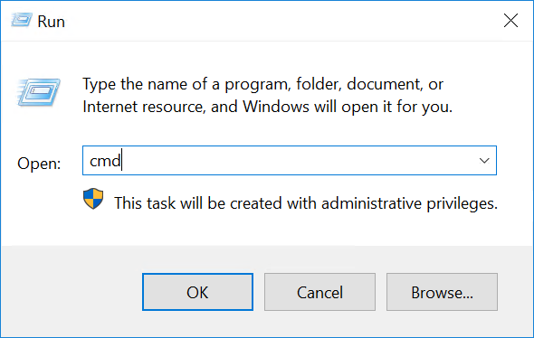{.thumbnail}

Aby pobrać aktualną konfigurację IP, wprowadź `ipconfig` w wierszu poleceń.

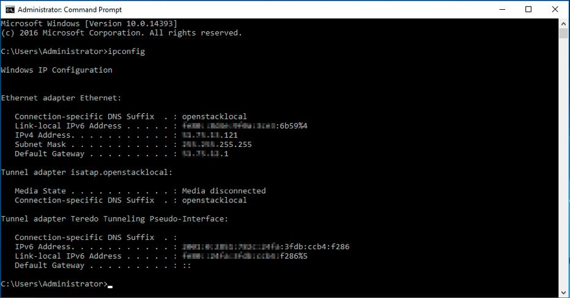{.thumbnail}

#### Etap 2: zmień właściwości IPv4

Teraz zmodyfikuj właściwości IP w konfigurację statyczną.

Otwórz parametry adaptera w Panelu konfiguracyjnym Windows, a następnie otwórz `Właściwości`{.action} protokołu `Internet Protocol Version 4 (TCP/IPv4)`{.action}.

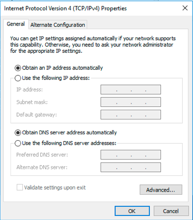{.thumbnail}

W oknie Właściwości IPv4 wybierz `Użyj następującego`{.action} adresu IP. Wpisz adres IP, który otrzymałeś w pierwszym etapie, po czym kliknij `Zaawansowane`{.action}.

#### Etap 3: dodać adres Additional IP do zaawansowanych ustawień TCP/IP

W nowym oknie kliknij `Dodaj...`{.action} pod "Adresy IP". Wpisz adres Additional IP i maskę podsieci (255.255.255.255).

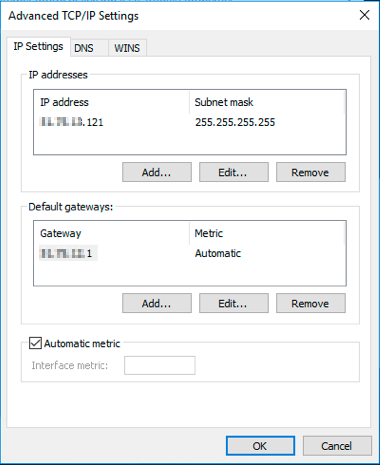{.thumbnail}

Potwierdź klikając `Dodaj`{.action}.

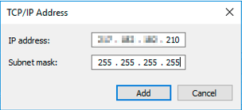{.thumbnail}

#### Etap 4: uruchom ponownie interfejs sieciowy

Wróć do panelu konfiguracyjnego (`Połączenia sieciowe`{.action}), kliknij prawym przyciskiem myszy interfejs sieciowy, a następnie wybierz `Wyłącz`{.action}.

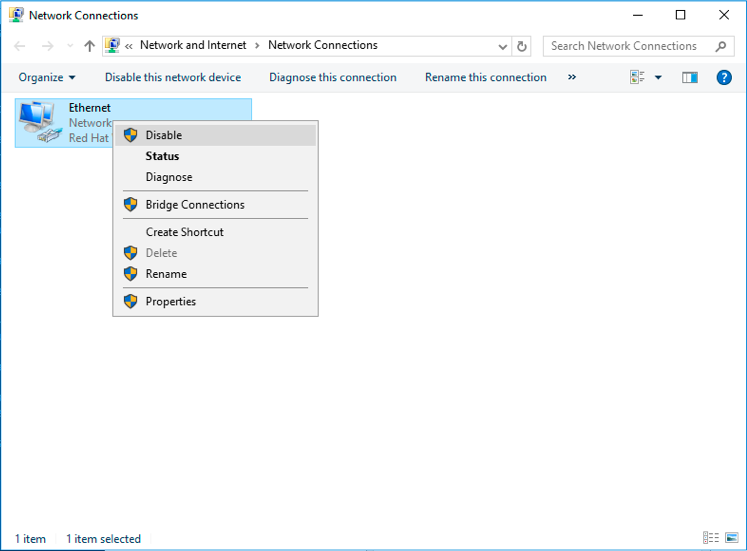{.thumbnail}

Aby go ponownie uruchomić, kliknij prawym przyciskiem myszy, a następnie wybierz `Aktywuj`{.action}.

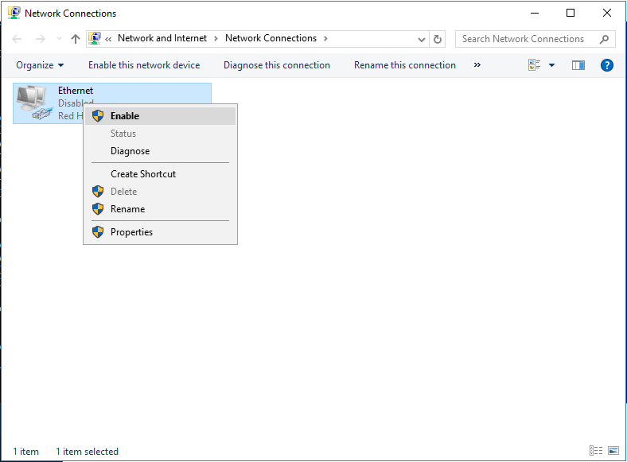{.thumbnail}

#### Etap 5: sprawdź nową konfigurację sieci

Otwórz wiersz poleceń (cmd) i wprowadź `ipconfig`. Konfiguracja musi teraz zawierać nowy adres Additional IP.

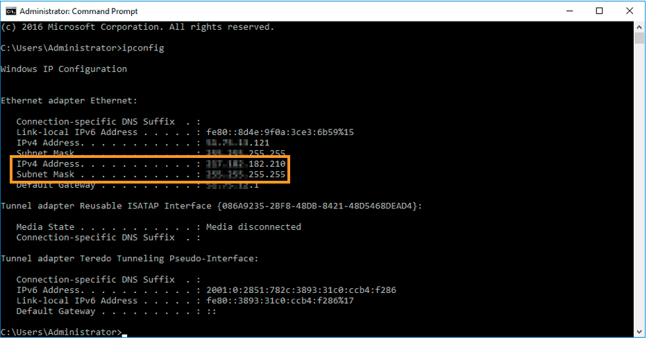{.thumbnail}


### Plesk

#### Etap 1: dostęp do interfejsu zarządzania adresami IP Plesk

W panelu konfiguracyjnym Plesk wybierz `Tools & Settings`{.action} na pasku bocznym po lewej stronie.

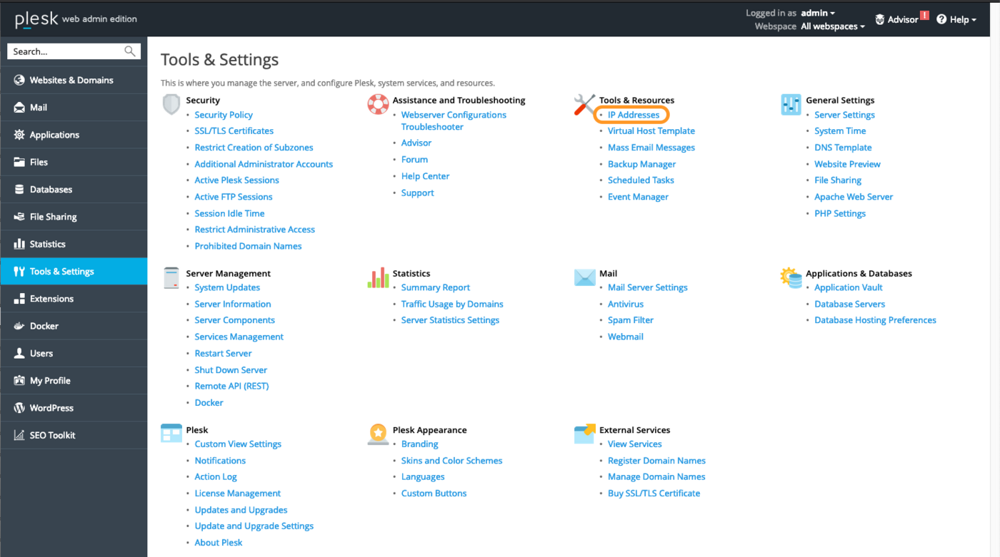{.thumbnail}

Kliknij `IP Addresses`{.action} w **Tools & Settings**.

#### Etap 2: dodaj dodatkowe informacje IP

W tej sekcji kliknij przycisk `Add IP Address`{.action}.

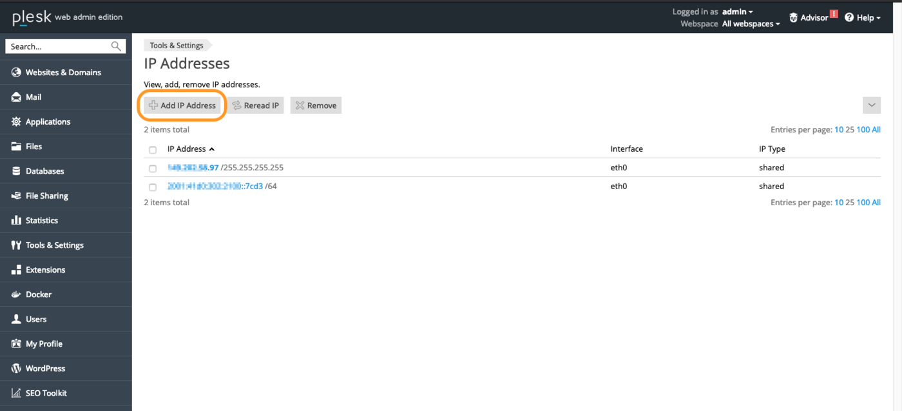{.thumbnail}

Wprowadź adres Additional IP w formie `xxx.xxx.xxx.xxx/32` w polu "IP address and subnet mask", a następnie kliknij `OK`{.action}.

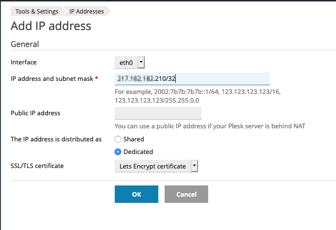{.thumbnail}

#### Etap 3: sprawdź aktualną konfigurację IP

W sekcji "IP Addresses" sprawdź, czy adres Additional IP został poprawnie dodany.

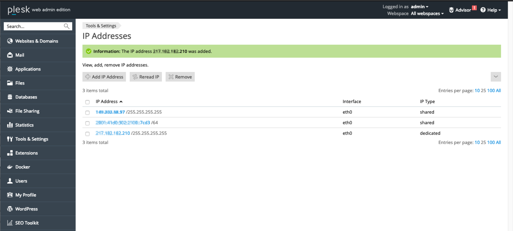{.thumbnail}

### Diagnostyka

Po pierwsze, zrestartuj serwer za pomocą wiersza poleceń lub interfejsu użytkownika. Jeśli nadal nie udaje Ci się nawiązać połączenia między siecią publiczną a adresem IP aliasu i podejrzewasz problem z siecią, zrestartuj serwer w [trybie rescue](/pages/bare_metal_cloud/virtual_private_servers/rescue). Następnie możesz skonfigurować adres Additional IP bezpośrednio na serwerze.

Po zalogowaniu się do serwera przez SSH wprowadź następującą komendę:

```bash
ifconfig ens3:0 ADDITIONAL_IP netmask 255.255.255.255 broadcast ADDITIONAL_IP up
```

Aby przetestować połączenie, wystarczy wysłać ping na adres Additional IP z zewnątrz. Jeśli odpowiada w trybie Rescue, prawdopodobnie oznacza to, że wystąpił błąd w konfiguracji. Jeśli jednak adres IP nadal nie działa, poinformuj o tym zespół pomocy technicznej OVHcloud, [wysyłając zgłoszenie serwisowe](https://help.ovhcloud.com/csm?id=csm_get_help).
 
## Sprawdź również

[Włącz tryb Rescue na serwerze VPS](/pages/bare_metal_cloud/virtual_private_servers/rescue)

Przyłącz się do społeczności naszych użytkowników na stronie <https://community.ovh.com/en/>.
