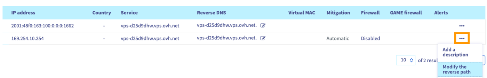

> [!primary]
> Esta tradução foi automaticamente gerada pelo nosso parceiro SYSTRAN. Em certos casos, poderão ocorrer formulações imprecisas, como por exemplo nomes de botões ou detalhes técnicos. Recomendamos que consulte a versão inglesa ou francesa do manual, caso tenha alguma dúvida. Se nos quiser ajudar a melhorar esta tradução, clique em "Contribuir" nesta página.
>

## Objetivo

O **Reverse DNS** (*rDNS*) é o complemento da resolução "clássica" dos DNS que permite converter um nome de domínio num endereço IP (registo do tipo **A**). Graças a um pedido deste tipo, um endereço IP pode ser resolvido em nome de domínio (registo do tipo **PTR**). Isto significa que os pedidos DNS no endereço IP em causa irão devolver um domínio.

Configurar a resolução **Reverse DNS** de um VPS é particularmente útil para o envio de e-mails. O risco de as suas mensagens serem rejeitadas por um sistema de proteção contra spam será diminuído se o endereço IP do seu servidor de envio se resolver corretamente em seu nome de domínio.

**Saiba como configurar a reverse DNS para o(s) endereço(s) de IP do seu VPS.**

## Requisitos

- Dispor de um [VPS](https://www.ovhcloud.com/pt/vps/) na sua conta OVHcloud.
- Um domínio com o seu campo `A` apontando para o VPS.
- Estar ligado à [Área de Cliente OVHcloud](https://www.ovh.com/auth/?action=gotomanager&from=https://www.ovh.pt/&ovhSubsidiary=pt).

## Instruções

Aceda à [Área de Cliente OVHcloud](https://www.ovh.com/auth/?action=gotomanager&from=https://www.ovh.pt/&ovhSubsidiary=pt), aceda à secção `Bare Metal Cloud`{.action} e clique em `IP`{.action} no menu à esquerda.

O quadro desta página apresenta os seus serviços elegíveis. Pode filtrar o nome do seu VPS através do menu pendente do **Serviço**.

{.thumbnail}

Clique em `...`{.action} na linha do endereço IP em causa e selecione `Alterar a reverse`{.action}.

{.thumbnail}

Na nova janela, introduza a sua reverse e clique em `Confirmar`{.action}.

Também pode editar a reverse diretamente através do ícone da coluna **Reverse** da tabela.

> [!primary]
>
Se a alteração não funcionar como previsto, verifique se o campo `A` está corretamente configurado na zona DNS do seu domínio. Atenção, a modificação da [zona DNS](/pages/web_cloud/domains/dns_zone_edit) pode demorar até 24 horas se apenas alterou recentemente o campo `A`.
>

## Quer saber mais? 

[VPS - primeira utilização](/pages/bare_metal_cloud/virtual_private_servers/starting_with_a_vps)

Junte-se à nossa comunidade de utilizadores em <https://community.ovh.com/en/>.