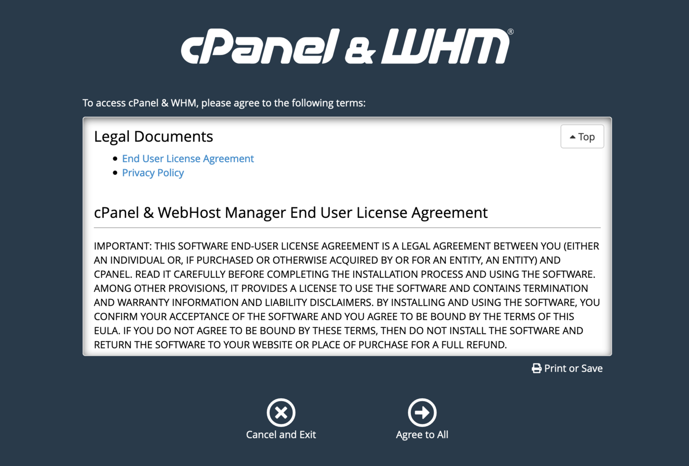
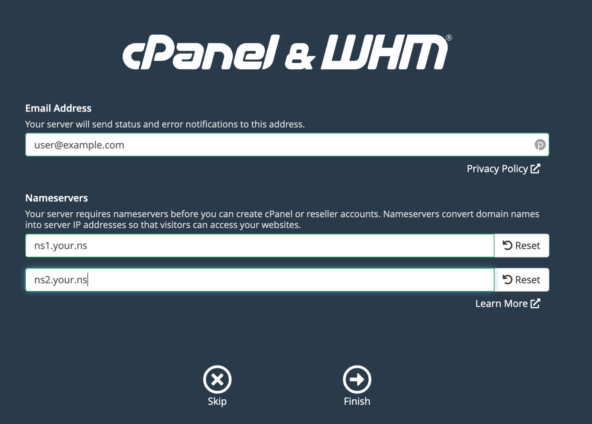
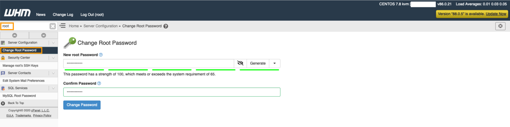

## Ziel

cPanel ist eine Verwaltungsoberfläche für Web Hosting. Es besteht aus einem grafischen Interface, das die Automatisierung von Einstellungen ermöglicht und so Hosting-Management vereinfacht.

**Diese Anleitung erläutert die Installation eines VPS mit dem cPanel-Template.**

## Voraussetzungen

- Sie haben einen [VPS](https://www.ovhcloud.com/de/vps/) der neueren Generation (Reihen Value, Essential, Comfort, Elite) in Ihrem Kunden-Account.
- Sie haben Zugriff auf Ihr [OVHcloud Kundencenter](https://www.ovh.com/auth/?action=gotomanager&from=https://www.ovh.de/&ovhSubsidiary=de).

## In der praktischen Anwendung

Um einen cPanel-Server einzurichten, muss zuerst ein VPS mit cPanel-Distribution bestellt werden.

{.thumbnail}

Wenn Ihr VPS bereit ist, erhalten Sie eine E-Mail mit den Zugangsdaten, um sich mit Ihrem cPanel-Server zu verbinden:

>Ihre Anwendung(en):
>
>Sie können sich mit cPanel verbinden über: https://*hostname*:2087/*session_parameters*

Wenn Sie schon über einen VPS verfügen und cPanel darauf installieren möchten, wählen Sie die Option "VPS reinstallieren" in Ihrem [OVHcloud Kundencenter](https://www.ovh.com/auth/?action=gotomanager&from=https://www.ovh.de/&ovhSubsidiary=de) und dann "CentOS 7 - cPanel" als Template (nur auswählbar bei einem kompatiblen VPS Modell).

> [!warning]
>
> Wenn Sie einen VPS reinstallieren, werden alle Daten darauf überschrieben.
>

### Erste Verbindung mit dem VPS

Klicken Sie auf den personalisierten Link in Ihrer Installationsmail um zur Ersteinrichtung zu gelangen.

Diese eigens generierte URL erlaubt es, sich erstmals ohne Benutzername und Passwort im WHM Manager einzuloggen.

> [!primary]
>
> Wenn der Link bereits abgelaufen ist, verbinden Sie sich mit dem CentOS-Benutzer über SSH mit Ihrem VPS und führen Sie den Befehl « sudo whmlogin » aus, um einen neuen Link zu erzeugen.
>

#### Schritt 1: Lesen und akzeptieren der cPanel-Nutzungsbedingungen

{.thumbnail}

#### Schritt 2: Eingeben Ihrer E-Mail-Adresse sowie der Nameserver, die der VPS verwenden soll

{.thumbnail}

#### Schritt 3: Root-Passwort festlegen

{.thumbnail}

Anschließend sollten Sie sich mit dem Root-Benutzer in WHM oder über SSH einloggen können.

### Den Dienst absichern

Wir empfehlen weitere Schritte, um WHM und den VPS vor unbefugtem Zugriff zu sichern. Sie können dazu den [Empfehlungen von cPanel](https://docs.cpanel.net/knowledge-base/security/tips-to-make-your-server-more-secure/) folgen.

Weiterhin ist empfehlenswert, die [OVHcloud Firewall](/pages/bare_metal_cloud/dedicated_servers/firewall_network) zu konfigurieren und eine [Backup-Lösung](/pages/bare_metal_cloud/virtual_private_servers/secure_your_vps) für den VPS einzurichten.

## Weiterführende Informationen

Für den Austausch mit unserer User Community gehen Sie auf <https://community.ovh.com/en/>.
