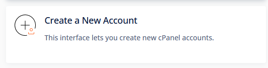
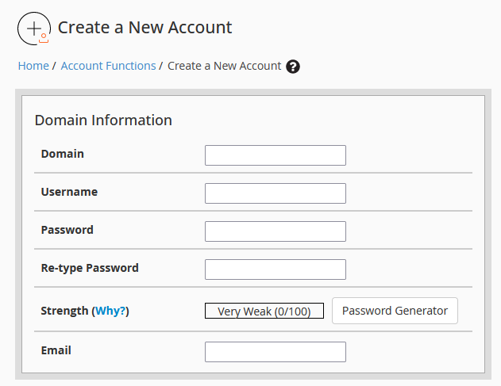
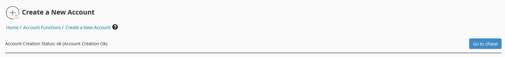
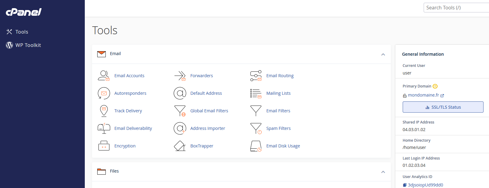

## Objective

cPanel is a control panel that facilitates the management of web hosting. It makes complex tasks more accessible, especially to new users. It offers a wide range of features, such as: 

- Emails
- Domain names
- Databases
- Security
- etc.

This simplifies website hosting, thanks to a graphical interface for automating settings.

**This guide explains how to deploy cPanel with preinstalled applications on a VPS.**

## Requirements

- A [VPS](https://www.ovhcloud.com/en/vps) solution with a [compatible distribution](https://www.ovhcloud.com/en/vps/os/)
- Access to the [OVHcloud Control Panel](https://ca.ovh.com/auth/?action=gotomanager&from=https://www.ovh.com/world/&ovhSubsidiary=we)

## Instructions

If you already have a VPS and want to have cPanel on it, you can reinstall the VPS from your [OVHcloud Control Panel](https://ca.ovh.com/auth/?action=gotomanager&from=https://www.ovh.com/world/&ovhSubsidiary=we) via a [cPanel-compatible OS](https://www.ovhcloud.com/en/vps/os/).

> [!warning]
>
> If you reinstall a VPS, all data stored on the VPS will be lost.
>

To install your cPanel server, order a VPS with the cPanel distribution.

{.thumbnail}

When your VPS is ready, you will receive an email providing the information to connect to your cPanel server:

```
 |    Your application(s):
 |    Application: cpanel
 |    You can connect to cPanel from https://<hostname>:2087/<session_parameters>
```

### First login

Once you have received the email containing the unique link, click on this link to perform the initial configuration. If the link has already expired, connect to the server [via SSH](/pages/bare_metal_cloud/dedicated_servers/ssh_introduction) and run the command `sudo whmlogin` to generate a new link.

The URL generated by the command `sudo whmlogin` allows you to log in to your WHM interface without any credentials (user and password). WHM is a server managemement tool used with cPanel. You will be able to access cPanel after completing the following steps.

#### Step 1: Read and accept the cPanel Terms of Use

Read and accept the cPanel Terms of Use.

{.thumbnail}

#### Step 2: Provide your email and nameservers you wish to set on the VPS

{.thumbnail}

#### Step 3: Set the root password

{.thumbnail}

You can now log in to your server via SSH, using the root user password you have just set.

### Create a cPanel account from the WHM interface

Once you have logged in to your WHM interface, click `Create a New Account`{.action} to create a cPanel account.

{.thumbnail}

Fill in the form, then confirm to create your cPanel account.

{.thumbnail}

On the new screen that pops up, click the `Go to cPanel`{.action} button to the right of the screen.

{.thumbnail}

You are redirected to your cPanel interface.

{.thumbnail}

You can now use cPanel. For more information about cPanel, see the [official documentation](https://docs.cpanel.net/).

> [!primary]
>
> In your browser's navigation bar, enter the following URLs to connect:
>
> - To cPanel: https&#58;//&#60;IP_V4&#62;:2083/ (use the credentials that have just been created in the WHM interface)
> - To WHM: https&#58;//&#60;IP_V4&#62;:2087/ (use the root username and password received in the service purchase email or the SSH password that has been changed in the WHM interface)
>
> Find your IPv4 address in the email you received when ordering your VPS with the cPanel distribution.
>

### Securing your service

We recommend taking all the necessary measures to secure your WHM and VPS by following the [cPanel recommendations](https://docs.cpanel.net/knowledge-base/security/tips-to-make-your-server-more-secure/).

We also recommend reading our guide to [securing a VPS](/pages/bare_metal_cloud/virtual_private_servers/secure_your_vps), using [our backup solutions](/products/bare-metal-cloud-virtual-private-servers) and configuring the [Edge Network Firewall](/pages/bare_metal_cloud/dedicated_servers/firewall_network).

## Go further

Join our community of users on <https://community.ovh.com/en/>.
