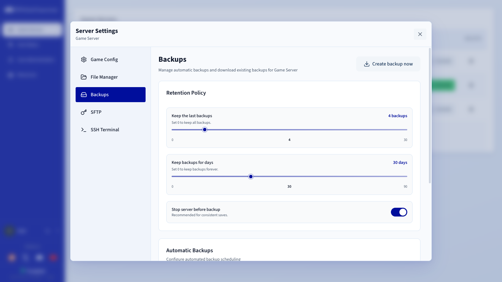
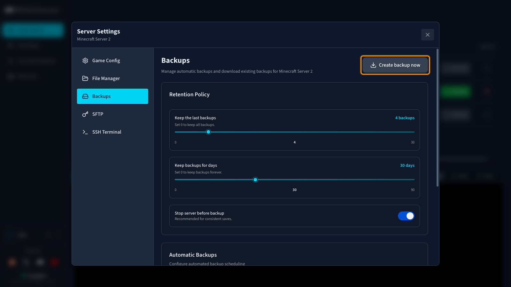

## Objectif

Le Game Panel OVHcloud vous permet de sauvegarder vos instances de serveurs de jeu pour les restaurer dans un état antérieur si nécessaire.

**Ce guide vous explique comment créer une sauvegarde de votre serveur de jeu sur le Game Panel OVHcloud.**

## Prérequis

- Un [VPS](/links/bare-metal/vps) dans votre compte OVHcloud avec la fonctionnalité Game Panel activée.
- Une instance de serveur de jeu déployée sur le Game Panel. Consultez le guide [Premiers pas avec le Game Panel](/pages/bare_metal_cloud/virtual_private_servers/game-panel-getting-started).

## En pratique

### Étape 1 — Se connecter au Game Panel

Connectez-vous à votre Game Panel. Si vous avez besoin d'aide, consultez le guide [Se connecter au Game Panel](/pages/bare_metal_cloud/virtual_private_servers/game-panel-log-in).

### Étape 2 — Accéder aux paramètres de sauvegarde

Une fois connecté :

1. Sélectionnez votre serveur de jeu.
2. Cliquez sur `Settings`{.action}.
3. Rendez-vous dans l'onglet `Backup`{.action}.

{.thumbnail}

### Étape 3 — Créer une sauvegarde

Cliquez sur `Create backup now`{.action}.

> [!primary]
>
> Nous vous recommandons de conserver l'option **Stop server before backup** activée afin de garantir la cohérence des sauvegardes.

{.thumbnail}

Une fois la sauvegarde terminée, le fichier est disponible au téléchargement dans la même section des paramètres.

## Aller plus loin

Pour restaurer une sauvegarde, consultez le guide [Restaurer une sauvegarde sur le Game Panel](/pages/bare_metal_cloud/virtual_private_servers/game-panel-upload-backup).

Échangez avec notre [communauté d'utilisateurs](/links/community).
