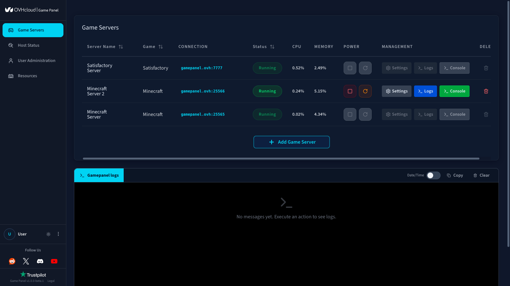
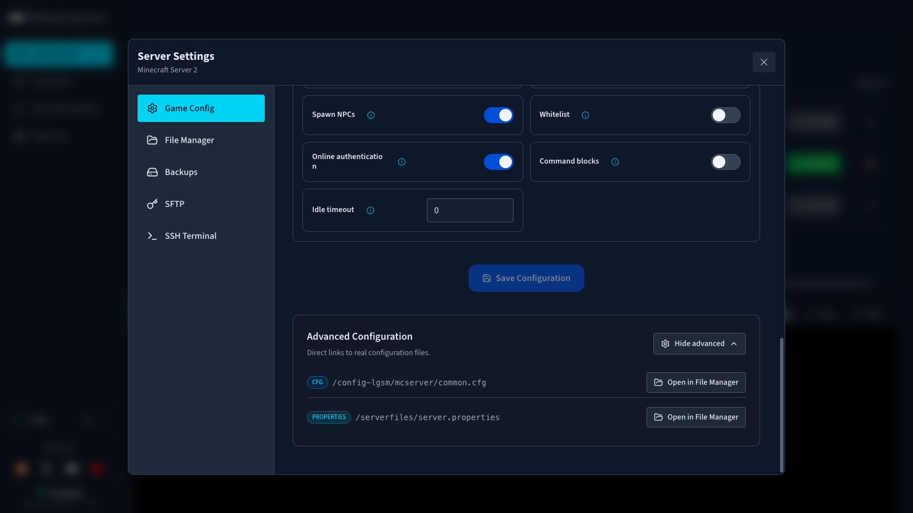

## Objective

The Game Panel exposes the Minecraft server configuration directly in the UI. Basic options such as game mode and difficulty are available through a graphical form, and advanced settings let you edit `server.properties` directly for full control.

**This guide explains how to edit Minecraft server configuration on the Game Panel.**

## Requirements

- A [VPS](/links/bare-metal/vps) in your OVHcloud account with the Game Panel feature enabled.
- A Minecraft server deployed on the Game Panel. Refer to [Deploy a Minecraft server on the Game Panel](/pages/bare_metal_cloud/virtual_private_servers/game-panel-quick-start-minecraft).

## Instructions

### Step 1 — Open the server settings

From the main Game Panel page, locate the Minecraft server you want to configure. In the `Management`{.action} column, click `Settings`{.action}.

{.thumbnail}

### Step 2 — Open the Game Config tab

In the **Server Settings** panel, select `Game Config`{.action} in the left sidebar.

{.thumbnail}

### Step 3 — Configure your game

The **Game Configuration** section lets you:

- Enable or disable **automatic updates**.
- Adjust **game mode**, **difficulty**, and other gameplay options.

### Step 4 — Edit advanced settings

The **Advanced Configuration** section gives you direct access to the `server.properties` file, providing more control than the basic UI options.

{.thumbnail}

> [!primary]
>
> For the full list of `server.properties` keys with descriptions, default values, and accepted ranges, refer to the [official Minecraft Wiki page on server.properties](https://minecraft.wiki/w/Server.properties).

Common keys you may want to adjust:

| Key | Description | Default |
|-----|-------------|---------|
| `gamemode` | Default game mode (`survival`, `creative`, `adventure`, `spectator`) | `survival` |
| `difficulty` | Server difficulty (`peaceful`, `easy`, `normal`, `hard`) | `easy` |
| `max-players` | Maximum number of concurrent players | `20` |
| `motd` | Message displayed in the server list | `A Minecraft Server` |
| `online-mode` | Restricts joining to authenticated Minecraft accounts | `true` |
| `view-distance` | Server-side render distance in chunks (3–32) | `10` |
| `simulation-distance` | Entity update distance in chunks (3–32) | `10` |
| `white-list` | Restricts connections to whitelisted players | `false` |
| `hardcore` | Enables hardcore mode | `false` |
| `pvp` | Enables player-versus-player damage | `true` |

> [!warning]
>
> Some keys (such as `level-seed`, `level-type`, `generator-settings`) only take effect when the world is generated. Changing them on an existing world has no effect.

### Step 5 — Save and restart

After saving your changes, restart the Minecraft server from the Game Panel for the new configuration to take effect.

## Go further

- [Deploy a Minecraft server on the Game Panel](/pages/bare_metal_cloud/virtual_private_servers/game-panel-quick-start-minecraft)
- [Install Fabric or NeoForge on a Minecraft server](/pages/bare_metal_cloud/virtual_private_servers/game-panel-install-fabric-neoforge)
- [Upload a custom world to your Minecraft server](/pages/bare_metal_cloud/virtual_private_servers/game-panel-upload-minecraft-world)

Join our [community of users](/links/community).